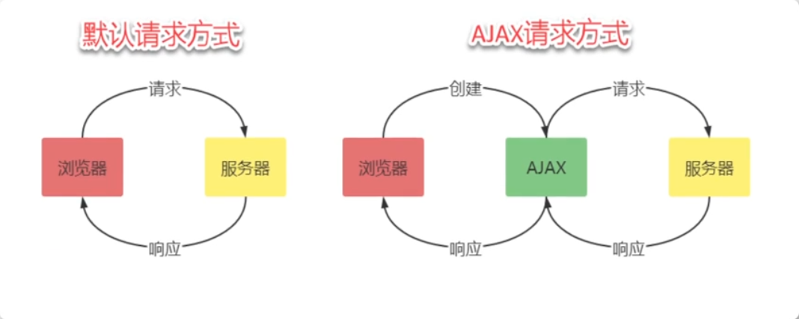
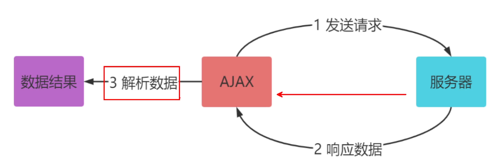
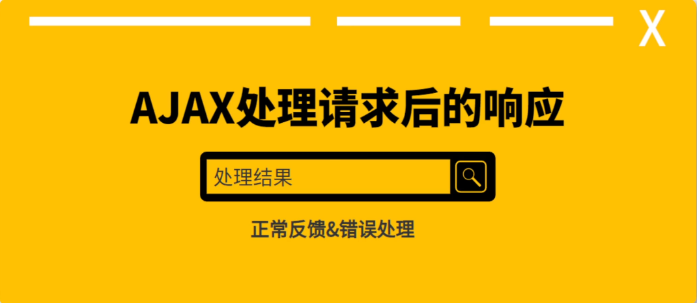

# Ajax

## Ajax介绍

 

### Ajax概述

​	`Ajax`即`Asynchronous Javascript And XML(异步JavaScript和XML)`,是一种创建交互式、快速动态网页应用的网页开发技术,它可以在无需加载整个网页的情况下,更新部分网页.

**传统网站中存在的问题:**

1. 在网络条件差的情况下,页面加载时间长,用户只能等待
2. 表单提交后,如果有任意一项不符合要求,需要重新填写所有的表单内容
3. 页面跳转,重新加载页面,造成资源浪费,增加用户等待时间

**解决方案:**

​	`Ajax`是浏览器提供的一套方法,可以实现页面无刷新更新数据,提高用户浏览网站应用时的体验.


### Ajax的应用场景

- 页面滚动加载数据
- 列表数据无刷新分页
- 表单页失焦自动进行数据验证
- 搜索框提示文字下拉列表
- 级联显示

### Ajax的运行环境

​	`Ajax`技术需要运行在网站环境中


### Ajax的运行原理

​	`Ajax`相当于浏览器发送发送请求与接收响应的代理人

 


## Ajax的基本使用

 

**实现`Ajax`发送请求获取数据,需要以下4步:**

1. 创建`Ajax XMLHttpRequest`对象

    ```javascript
    var xhr = new XMLHttpRequest()
    ```

2. 设置`Ajax`请求地址以及请求方式

    通过`XMLHttpRequest.open()`方法指定HTTP请求的参数

    ```javascript
    void open(
        string method,
        string url,
    	optional boolean async,
    	optional string user,
    	optional string password
    );
    ```

    > - `method:`表示HTTP动词方法,如`GET`、`POST`、`PUT`、`DELETE`、`HEAD`等
    > - `url:`表示请求发送目标URL
    > - `async:`布尔值,表示请求是否为异步,默认为`true`.如果设为`false`,则`send()`方法只有收到服务器返回的结果之后才会进行下一步操作
    > - `user:`表示用于认证的用户名,默认为空字符串
    > - `password:`表示用于认证的密码,默认为空字符串

3. 发送请求

    `XMLHttpResponse.send()`方法用于实际发出HTTP请求,参数可选.如果不带参数,就表示HTTP请求只包含头信息,也就是只有一个URL,典型例子就是GET请求;如果带有参数,就表示除了头信息,还带有包含具体数据的信息体,典型例子就是POST请求

    ```javascript
    xhr.send()
    ```

4. 获取服务器端给客户端的响应数据

    `XMLHttpResponse`对象可以对以下事件指定监听函数


| 监听场景                    | 原生 XMLHttpRequest 监听方式                                 | jQuery AJAX 监听方式                                         | 核心作用                                                     |
| --------------------------- | ------------------------------------------------------------ | ------------------------------------------------------------ | ------------------------------------------------------------ |
| 请求发送前（准备阶段）      | `xhr.onreadystatechange`（readyState=1 时触发）              | `beforeSend: function(xhr) {}`（AJAX 配置项）                | 请求发送前执行预处理，如设置请求头（Token）、显示加载动画、验证参数等。 |
| 响应成功（状态码 2xx）      | `xhr.onload`（readyState=4 且 status≥200&<300 时）           | `success: function(data, status, xhr) {}`（旧版） `done: function(data) {}`（Promise 风格） | 接收服务器返回的 **成功响应数据**，执行渲染页面、更新 DOM 等逻辑。 |
| 响应失败（网络 / 状态码错） | `xhr.onerror`（网络错误，如断网） `xhr.onload`（readyState=4 且 status≥400 时） | `error: function(xhr, status, error) {}`（旧版） `fail: function(xhr) {}`（Promise 风格） | 捕获请求失败（如网络中断、404/500 错误），执行提示用户、重试等容错逻辑。 |
| 请求完成（无论成败）        | `xhr.onloadend`（请求最终结束，成功 / 失败后均触发）         | `complete: function(xhr, status) {}`（旧版） `always: function() {}`（Promise 风格） | 请求结束后统一清理资源，如隐藏加载动画、重置按钮状态等（不受结果影响）。 |
| 响应进度（接收数据中）      | `xhr.onprogress`（接收服务器响应数据时持续触发）             | 无直接配置项，需通过 `xhrFields: { onprogress: fn }` 绑定    | 监听大文件下载 / 上传的进度，如显示进度条（需服务器配合返回 `Content-Length`）。 |
| 请求超时                    | `xhr.ontimeout`（超过 `xhr.timeout` 设定时间未响应）         | `timeout: 5000`（配置超时时间）+ `error`（超时触发 error）   | 处理请求超时场景，如提示 “网络较慢，请重试”。                |


## Ajax的get请求传参

 

在get请求中,参数是拼接在url地址中的

```javascript
<!DOCTYPE html>
<html lang="en">
<head>
    <meta charset="UTF-8">
    <title>Ajax的GET请求传参</title>
</head>
<body>
    <h1>Ajax的GET请求传参</h1>
    <!-- 用户名输入框：用于获取用户输入的用户名 -->
    <input type="text" name="" id="name">
    <!-- 密码输入框：用于获取用户输入的密码 -->
    <input type="password" name="" id="pwd">
    <!-- 提交按钮：点击时触发submitForm()函数 -->
    <input type="button" value="提交数据" onclick="submitForm()">
    
    <script>
        // 定义表单提交处理函数
        function submitForm() {
            // 获取输入框中的值：通过id选择器获取对应的DOM元素，再通过.value获取用户输入
            uname = document.getElementById('name').value
            pwd = document.getElementById('pwd').value

            // 1. 创建XMLHttpRequest对象：这是AJAX的核心对象，用于发送异步请求
            let xhr = new XMLHttpRequest()
            
            // 2. 配置请求地址：使用httpbin.org的get接口作为测试（该接口会返回请求信息）
            url = 'http://httpbin.org/get'
            
            // 3. 拼接GET请求参数：GET请求参数通过URL的查询字符串(?key=value&key2=value2)传递
            // 注意：需要用?开头，多个参数用&分隔
            args = '?uname=' + uname + '&pwd=' + pwd
            
            // 拼接完整的请求URL（基础地址 + 参数）
            url = url + args
            
            // 4. 配置请求方式和地址：open(method, url)
            // method：请求方式（GET/POST等）；url：请求的完整地址
            xhr.open('GET', url)
            
            // 5. 发送请求：GET请求的参数已在URL中，所以send()中无需传参
            xhr.send()
            
            // 6. 监听请求完成事件：当服务器响应完成后触发
            xhr.onload = () => {
                // 打印服务器返回的响应数据（responseText是字符串形式的响应体）
                console.log(xhr.responseText)
            }
        }
    </script>
</body>
</html>
```


## Ajax的post请求传参

 

`Ajax`使用`post`的请求基本一样,但在传参时,参数应该放在`body`中,并通过`XMLHttpRequest.setRequestHeader()`设置请求信息的格式,该方法接收两个参数,第一个参数是字符串,表示头信息的字段名,第二个参数是字段值

> `XMLHttpRequestHeader()`该方法必须在`open()`之后、`send()`之前调用,如果该方法多次调用,设定同一个字段,则每一次调用的值会被合并成一个单一的值发送

```javascript
<!DOCTYPE html>
<html lang="en">
<head>
    <meta charset="UTF-8">
    <title>Ajax的POST请求传参</title>
</head>
<body>
    <h1>Ajax的POST请求传参</h1>
    <!-- 表格布局表单：包含用户名、密码输入框，以及两种参数传递方式的提交按钮 -->
    <table>
        <tr>
            <td>用户名:</td>
            <!-- 用户名输入框，通过id="uname"标识，用于后续获取输入值 -->
            <td><input type="text" name="" id="uname"></td>
        </tr>
        <tr>
            <td>密码:</td>
            <!-- 密码输入框，通过id="pwd"标识，输入内容会被隐藏 -->
            <td><input type="password" name="" id="pwd"></td>
        </tr>
        <tr>
            <!-- 按钮1：点击触发submitForm1()，以表单字符串格式传递参数 -->
            <td><input type="button" value="传递数据-str" onclick="submitForm1()"></td>
            <!-- 按钮2：点击触发submitForm2()，以JSON格式传递参数 -->
            <td><input type="button" value="传递数据-json" onclick="submitForm2()"></td>
        </tr>
    </table>


    <script>
        /**
         * 函数1：submitForm1
         * 功能：以 application/x-www-form-urlencoded 格式（表单默认格式）发送POST请求
         * 参数格式：uname=用户名&pwd=密码（类似URL查询字符串）
         */
        function submitForm1(){
            // 1. 获取用户输入的用户名和密码
            // 通过document.getElementById()根据id获取输入框DOM元素，.value获取输入内容
            uname = document.getElementById('uname').value
            pwd = document.getElementById('pwd').value

            // 2. 拼接表单格式的参数字符串
            // 遵循 key=value 格式，多个参数用 & 分隔
            args = 'uname=' + uname + '&pwd=' + pwd

            // 3. 创建XMLHttpRequest对象
            // XMLHttpRequest是AJAX的核心对象，负责发送异步请求和接收响应
            let xhr = new XMLHttpRequest()

            // 4. 配置请求信息：open(请求方法, 请求地址)
            // 第一个参数：'POST' 表示请求方式为POST；第二个参数：目标接口地址（httpbin.org/post用于测试）
            xhr.open('POST', 'http://httpbin.org/post')

            // 5. 设置请求头：告知服务器请求体的格式
            // Content-Type: application/x-www-form-urlencoded 是表单数据的标准格式
            // 必须设置，否则服务器无法正确解析请求体中的参数
            xhr.setRequestHeader('Content-Type', 'application/x-www-form-urlencoded')

            // 6. 发送请求：POST请求的参数通过send()方法传入（作为请求体内容）
            xhr.send(args)

            // 7. 监听请求完成事件：当服务器响应完全接收后触发
            xhr.onload = () => {
                // xhr.responseText 是服务器返回的响应数据（字符串格式），打印到控制台查看结果
                console.log(xhr.responseText)
            }
        }

        /**
         * 函数2：submitForm2
         * 功能：以 application/json 格式（前后端分离常用格式）发送POST请求
         * 参数格式：JSON字符串（需先将JS对象序列化为字符串）
         */
        function submitForm2() {
            // 1. 获取用户输入的用户名和密码
            uname = document.getElementById('uname').value
            pwd = document.getElementById('pwd').value

            // 2. 构建参数并序列化为JSON字符串
            // 第一步：创建JS对象（键值对结构，对应需要传递的参数）
            args = {'uname': uname, 'pwd': pwd}
            // 第二步：通过JSON.stringify()将JS对象转换为JSON字符串
            // 因为HTTP请求体只能传递字符串，不能直接传递JS对象
            args = JSON.stringify(args)

            // 3. 创建XMLHttpRequest对象
            let xhr = new XMLHttpRequest()

            // 4. 配置请求信息
            xhr.open('POST', 'http://httpbin.org/post')

            // 5. 设置请求头：告知服务器请求体是JSON格式
            xhr.setRequestHeader('Content-Type', 'application/json')

            // 6. 发送请求：将JSON字符串作为请求体传入
            xhr.send(args)

            // 7. 监听请求完成事件，打印响应结果
            xhr.onload = () => {
                console.log(xhr.responseText)
            }
        }
    </script>
</body>
</html>
```


## 获取服务端的响应

 

### Ajax状态码

 

​	在创建`Ajax`对象,配置`Ajax`对象,发送请求、以及接受完服务器端响应数据过程中的每一个步骤都会对应一个数值,这个数据就是`Ajax`状态码

`XMLHttpRequest.readyState`返回一个整数,表示实例对象当前的状态,该属性只读,它的值如下:

| 返回值 | 状态常量（可选）   | 含义说明                                                     |
| ------ | ------------------ | ------------------------------------------------------------ |
| 0      | `UNSENT`           | **未初始化状态**：XMLHttpRequest 对象已创建，但尚未调用 `open()` 方法（请求未开启）。 |
| 1      | `OPENED`           | **请求已开启状态**：`open()` 方法已调用（已指定请求方式、URL 等基础信息），但尚未调用 `send()` 方法（请求未发送）。此时可通过 `setRequestHeader()` 设置请求头。 |
| 2      | `HEADERS_RECEIVED` | **响应头已接收状态**：`send()` 方法已调用，服务器已接收请求并返回 **响应头**（如 Content-Type、Status 等），但响应体（响应内容）尚未开始接收。 |
| 3      | `LOADING`          | **响应体加载中状态**：服务器正在向客户端传输响应体数据，`responseText`（响应文本）属性已包含部分已接收的数据，但数据尚未完全加载完成。 |
| 4      | `DONE`             | **请求完成状态**：服务器响应已完全接收（响应头 + 响应体均加载完成），请求生命周期结束。此时可通过 `responseText` 或 `responseXML` 获取完整响应数据，并判断请求成功 / 失败。 |

- `readyState`的值从0逐步递增到4,每次变化都会触发`onreadystatechange`事件(可通过监听该事件实时判断请求状态)
- 在实际开发中,通常会在`onreadystatechange`事件中判断`readyState === 4`(请求完成),同时结合`status === 200`(HTTP状态码表示请求成功),来确保获取有效且完整的响应数据

### HTTP状态码

`XMLHttpRequest.status`属性返回一个整数,表示服务器发送的`HTTP`状态码.一般来说,如果通信成功,状态码为200;

在实际开发中,通常会在``XMLHttpRequest.onreadystatechange`事件中判断`readyState === 4`(请求完成),同时结合`status === 200`(HTTP状态码表示请求成功),来确保获取有效且完整的响应数据

```js
xhr.onreadystatechange = function() {
  // 当请求完成且HTTP响应成功时，处理响应数据
  if (xhr.readyState === 4 && xhr.status === 200) {
    console.log("完整响应数据：", xhr.responseText);
  }
};
```


### 服务器端响应的数据格式

在真实的项目中,服务器端大多数情况下会以json对象作为响应数据的格式,在http请求与响应的过程中,无论是请求参数还是响应内容,如果是对象类型,一般都会被转换为对象字符串进行传输

```js
<!DOCTYPE html>
<html lang="en">
<head>
    <meta charset="UTF-8">
    <title>Ajax获取响应状态码与数据处理</title>
</head>
<body>
    <h1>Ajax获取响应状态码与数据处理</h1>
    <!-- 点击按钮时触发get_data()函数，发起AJAX请求 -->
    <input type="button" onclick="get_data()" value="获取响应数据">

    <script>
        function get_data() {
            // 1. 创建XMLHttpRequest对象（AJAX核心对象，用于发送异步请求）
            let xhr = new XMLHttpRequest()
            
            // 2. 配置请求：open(请求方式, 请求地址)
            // 这里使用GET方式请求httpbin.org的get接口（该接口会返回请求相关信息）
            xhr.open('get', 'http://httpbin.org/get')
            
            // 3. 发送请求：GET请求无请求体，send()参数为空
            xhr.send()
            
            // 4. 监听请求状态变化事件（readyState改变时触发）
            // 该事件会在请求的整个生命周期中多次触发（readyState从0到4的每个状态变化）
            xhr.onreadystatechange = () => {
                // 5. 判断AJAX请求状态码（readyState）是否为4：表示请求已完成（响应全部接收）
                // 只有当readyState=4时，才能获取完整的响应数据
                if (xhr.readyState == 4) {
                    // 6. 判断HTTP状态码（status）是否为200：表示请求成功
                    // 常见成功状态码：200（成功）、201（创建成功）；错误状态码：404（未找到）、500（服务器错误）
                    if (xhr.status == 200) {
                        // 7. 处理成功响应：服务器返回的数据是字符串，需转换为JSON对象
                        // responseText：获取服务器返回的字符串形式响应数据
                        // JSON.parse()：将JSON格式的字符串转换为JavaScript对象，方便后续操作
                        data = JSON.parse(xhr.responseText)
                        // 打印转换后的JSON对象（可直接通过data.key访问具体字段）
                        console.log("请求成功，响应数据：", data)
                    } else {
                        // 8. 处理请求失败：打印HTTP状态码，便于调试错误原因
                        console.log("请求失败，HTTP状态码：", xhr.status)
                    }
                } else {
                    // 9. 打印未完成状态的readyState值（可选，用于了解请求过程）
                    // 例如：1（已打开）、2（响应头接收）、3（响应体加载中）
                    console.log("当前请求状态（readyState）：", xhr.readyState)
                }
            }
        }
    </script>
</body>
</html>
```


## Ajax错误处理

 

1. **通过 HTTP 状态码判断错误类型**

    - 成功：`xhr.status >= 200 && xhr.status < 300`（主要是 200）
    - 客户端错误：`400 <= xhr.status < 500`（如 404 资源不存在、401 未授权）
    - 服务器错误：`500 <= xhr.status < 600`（如 500 服务器内部错误）
    - 处理时机：在`onreadystatechange`事件中，当`readyState === 4`（请求完成）时判断

2. **网络错误处理**

    - 通过

        ```
        xhr.onerror
        ```

        事件监听，触发场景包括：

        - 网络中断（如断网）
        - 跨域请求未被服务器允许（浏览器拦截）
        - DNS 解析失败（域名不存在）

3. **超时错误处理**（可选但推荐）

    - 设置超时时间：`xhr.timeout = 5000`（单位：毫秒）
    - 通过`xhr.ontimeout`事件处理超时逻辑（如提示用户 "网络较慢"）

```js

<!DOCTYPE html>
<html lang="en">
<head>
    <meta charset="UTF-8">
    <title>Ajax请求失败处理</title>
</head>
<body>
    <h1>Ajax请求失败处理</h1>
    <!-- 点击按钮触发get_data()函数，发起AJAX请求 -->
    <input type="button" value="获取响应数据" onclick="get_data()">

    <script>
        function get_data() {
            // 1. 创建XMLHttpRequest对象（AJAX核心对象）
            let xhr = new XMLHttpRequest()
            
            // 2. 配置请求：GET方式请求测试接口
            xhr.open('get', 'http://httpbin.org/get')
            
            // 3. 发送请求（GET请求无请求体，参数为空）
            xhr.send()
            
            // 4. 监听请求状态变化事件（readyState改变时触发）
            xhr.onreadystatechange = () => {
                // 当请求完成（readyState=4）时处理
                if (xhr.readyState == 4){
                    // 打印HTTP状态码（用于判断请求成功/失败）
                    // 注意：原代码中的print()是多余的，已修正为直接打印
                    console.log("HTTP状态码：", xhr.status)
                    
                    // 可在此处添加状态码判断逻辑：
                    // if (xhr.status >= 200 && xhr.status < 300) {
                    //   // 处理成功响应
                    // } else {
                    //   // 处理错误响应（如404、500等）
                    // }
                }
            }
            
            // 5. 监听网络错误事件（如断网、跨域被拦截等）
            xhr.onerror = () => {
                // 当发生网络层面的错误时触发（此时HTTP状态码可能为0）
                console.log('网络中断或请求被阻止（如跨域限制）')
            }

            // 补充：可添加超时处理（可选）
            // xhr.timeout = 5000; // 设置超时时间（毫秒）
            // xhr.ontimeout = () => {
            //   console.log('请求超时（超过5秒未响应）')
            // }
        }
    </script>
</body>
</html>

```


## Ajax封装

 

> **问题**
>
> 发送一次请求代码过多,多次发送会导致代码冗余重复
>
> ****
>
> **解决方案**
>
> 将请求代码封装到函数中,发送请求时调用函数即可

```js
<!DOCTYPE html>
<html lang="en">
<head>
    <meta charset="UTF-8">
    <title>Ajax简单封装</title>
</head>
<body>
    <h1>Ajax简单封装</h1>
    <input type="button" value="获取响应数据" onclick="get_data()">
    <script>
        // 点击按钮触发的函数：调用封装的Ajax方法发起GET和POST请求
        function get_data() {
            // 1. 发起GET请求：请求httpbin.org的get接口，获取响应数据
            Ajax({
                type: 'get',  // 请求方式：GET
                url: 'http://httpbin.org/get'  // 请求地址
            })
            
            // 2. 发起POST请求：请求httpbin.org的post接口，获取响应数据
            Ajax({
                type: 'post',  // 请求方式：POST
                url: 'http://httpbin.org/post'  // 请求地址
            })
        }

        /**
         * 封装的Ajax工具函数：简化AJAX请求流程，减少重复代码
         * @param {Object} options - 请求配置对象，包含type（请求方式）和url（请求地址）
         */
        function Ajax(options) {
            // 1. 创建XMLHttpRequest对象：AJAX的核心对象，负责发送异步请求
            let xhr = new XMLHttpRequest()

            // 2. 配置请求参数：指定请求方式和请求地址
            // options.type：从配置中获取请求方式（get/post）
            // options.url：从配置中获取请求接口地址
            xhr.open(options.type, options.url)

            // 3. 发送请求：GET请求无需请求体，send()参数为空；POST请求后续可扩展传参
            xhr.send()

            // 4. 监听请求状态变化，处理服务器响应
            xhr.onreadystatechange = () => {
                // 当请求完成（readyState=4）且HTTP响应成功（status=200）时，打印响应数据
                if (xhr.readyState === 4 && xhr.status === 200) {
                    console.log(`【${options.type.toUpperCase()}请求成功】响应数据：`, xhr.responseText)
                }
            }
        }
    </script>
</body>
</html>
```


## Ajax封装-请求参数

 

```js
<!DOCTYPE html>
<html lang="en">
<head>
    <meta charset="UTF-8">
    <title>Ajax封装请求参数</title>
</head>
<body>
    <h1>Ajax封装请求参数</h1>
    <!-- 点击按钮分别触发GET和POST请求的函数 -->
    <input type="button" value="获取响应数据get" onclick="get_data_get()">
    <input type="button" value="获取响应数据post" onclick="get_data_post()">

    <script>
        /**
         * 封装的Ajax函数：支持GET/POST请求，自动处理参数拼接和请求头设置
         * @param {Object} options - 请求配置对象
         * @param {string} options.type - 请求方式（get/post）
         * @param {string} options.url - 请求接口地址
         * @param {Object} options.data - 请求参数（JSON格式，键值对）
         */
        function Ajax(options) {
            // 1. 处理请求参数：将JSON格式的data转换为"key=value&key2=value2"的字符串格式
            let params = '';
            // 遍历options.data的每个键值对，拼接成参数字符串
            for (let key in options.data) {
                // 获取当前键对应的参数值
                let value = options.data[key];
                // 拼接"键=值&"的格式
                params = params + key + '=' + value + '&';
            }
            // 去掉参数字符串末尾多余的"&"（如拼接后是"name=jack&pwd=123&"，处理后变为"name=jack&pwd=123"）
            params = params.substring(0, params.length - 1);

            // 2. 处理GET请求：将参数拼接到URL末尾（GET请求参数通过URL查询字符串传递）
            if (options.type === 'get') {
                options.url = options.url + '?' + params;
            }

            // 3. 创建XMLHttpRequest对象（AJAX核心对象）
            let xhr = new XMLHttpRequest();

            // 4. 配置请求：指定请求方式和处理后的URL
            xhr.open(options.type, options.url);

            // 5. 处理POST请求：设置请求头+发送参数（POST参数通过请求体传递）
            if (options.type === 'post') {
                // 设置请求头：告知服务器请求体是"application/x-www-form-urlencoded"格式（表单默认格式）
                xhr.setRequestHeader('Content-Type', 'application/x-www-form-urlencoded');
                // 发送参数（参数字符串作为请求体内容）
                xhr.send(params);
            } else {
                // GET请求：无请求体，send()空参数
                xhr.send();
            }

            // 6. 监听请求状态变化，处理成功响应
            xhr.onreadystatechange = () => {
                // readyState=4：请求完成；status=200：HTTP响应成功
                if (xhr.readyState === 4 && xhr.status === 200) {
                    // 打印服务器返回的响应数据（字符串格式）
                    console.log(xhr.responseText);
                }
            }
        }

        // 7. GET请求触发函数：调用Ajax封装函数，传递GET请求配置
        function get_data_get() {
            Ajax({
                type: 'get',          // 请求方式：GET
                url: 'http://httpbin.org/get',  // 请求地址（测试接口）
                data: {'name': 'jack', 'pwd': 123}  // GET请求参数（JSON格式）
            })
        }

        // 8. POST请求触发函数：调用Ajax封装函数，传递POST请求配置
        function get_data_post() {
            Ajax({
                type: 'post',         // 请求方式：POST
                url: 'http://httpbin.org/post', // 请求地址（测试接口）
                data: {'name': 'jack', 'pwd': 123}  // POST请求参数（JSON格式）
            })
        }
    </script>
</body>
</html>
```


## Ajax处理响应

 

当`Ajax`发送了请求后,`Ajax`都应该回馈一个内容

### 失败处理

可以通过`onerror`监听函数处理错误情况

```js
xhr.onerror = () => {
                // 当发生网络层面的错误时触发（此时HTTP状态码可能为0）
                console.log('网络中断或请求被阻止（如跨域限制）')
            }
```


### 成功处理

通过`onreadystatechange`监听函数处理,以下是可以使用的属性

- `XMLHttpRequest.response`

    - `XMLHttpRequest.response`属性表示服务器返回的数据体(即HTTP回应的body部分),它可以是任何数据类型,例如字符串、对象、二进制对象等,具体的类型由`XMLHttpRequest.responseType`属性决定,该属性只读

- `XMLHttpRequest.responseType`

    - `XMLHttpRequest.responseType`属性是一个字符串,表示服务器返回数据的类型,该属性是可写的,可以在调用`open()`方法之后、调用`send()`方法之前,设置这个属性的值,告诉服务器返回指定类型的数据,如果`responseType`设为空字符串,就等同于默认值`text`.

        `XMLHttpRequest.responseType`属性可以设置为以下的值:

        > - ''(空字符串):等同于`text`,表示服务器返回文本数据
        > - 'arraybuffer':ArrayBuffer对象,表示服务器返回二进制数组
        > - 'blob':Blob对象,表示服务器返回二进制对象
        > - 'document':Document对象,表示服务器返回一个文档对象
        > - 'json':JSON对象
        > - 'text':字符串

        | 类型                       | 解析结果                  | 典型使用场景                                                 | 特点与注意事项                                               |
        | -------------------------- | ------------------------- | ------------------------------------------------------------ | ------------------------------------------------------------ |
        | `''`（空字符串）或`'text'` | 原始字符串                | 1. 纯文本数据（如日志、简单消息） 2. 未格式化的数据（如自定义格式字符串） 3. 需要手动解析的 JSON/XML 字符串 | 最基础的类型，不自动解析，需手动处理（如`JSON.parse()`转换 JSON 字符串） |
        | `'arraybuffer'`            | ArrayBuffer（二进制数组） | 1. 处理二进制数据（如音频、视频、二进制文件） 2. 低层级二进制操作（如解析协议帧） | 适合需要直接操作二进制字节的场景，需配合`TypedArray`（如`Uint8Array`）使用 |
        | `'blob'`                   | Blob（二进制对象）        | 1. 下载文件（如图片、PDF、压缩包） 2. 二进制数据传递给 URL.createObjectURL () 生成可访问链接 | 封装了二进制数据及 MIME 类型，适合直接用于文件下载或通过``/`<video>`展示 |
        | `'document'`               | Document（XML/HTML 文档） | 1. 加载 XML 格式数据（如 RSS 订阅、传统 API 返回的 XML） 2. 加载 HTML 片段并解析为 DOM 树 | 自动解析为 XML/HTML 文档对象，可直接使用 DOM 方法（如`getElementById`）操作 |
        | `'json'`                   | JSON 对象                 | 1. 现代 API 返回的 JSON 数据（如 RESTful 接口） 2. 结构化数据（对象、数组等） | 自动解析 JSON 字符串为 JavaScript 对象，最常用的类型之一，解析失败会抛出错误 |

- `XMLHttpRequest.responseText`

    - `XMLHttpRequest.responseText`属性返回从服务器接收到的字符串,该属性为只读,只有HTTP请求完成接收后,该属性才会包含完整的数据

- `XMLHttpRequest.responseXML`

    - `XMLHttpRequest.responseXML`属性返回从服务器接收到的HTML或XML对象,该属性为只读,如果本次请求没有成功,或者是收到的数据不能被解析为`XML/HTML`,该属性为`null`
    - 该属性生效的前提是HTTP回应的`Content-Type`头信息等于`text/xml`或者`application/xml`,这要求在发送请求前需要把`XMLHttpRequest.responseType`属性设置为`document`,如果HTTP回应的`Content-Type`头信息不等于`text/xml`和`application/xml`,但是想从`responseXML`拿到数据(即把数据按照DOM格式解析),那么需要手动调用`XMLHttpRequest.overrideMimeType()`方法,强制进行XML解析
    - 该属性得到的数据,是直接解析后的文档DOM树

- `XMLHttpRequest.responseURL`

    - `XMlHttpRequest.responseURL`属性是字符串,表示发送数据的服务器的地址


```js
<!DOCTYPE html>
<html lang="en">
<head>
    <meta charset="UTF-8">
    <title>Ajax响应处理</title>
</head>
<body>
    <h1>Ajax响应处理</h1>
    <!-- 按钮分别触发GET和POST请求 -->
    <input type="button" value="获取响应数据get" onclick="get_data_get()">
    <input type="button" value="获取响应数据post" onclick="get_data_post()">

    <script>
        /**
         * 封装的Ajax函数：支持成功/失败回调，完善响应处理
         * @param {Object} options - 请求配置对象
         * @param {string} options.type - 请求方式（get/post）
         * @param {string} options.url - 请求地址
         * @param {Object} options.data - 请求参数（JSON格式）
         * @param {Function} options.success - 请求成功的回调函数（接收响应数据）
         * @param {Function} options.error - 请求失败的回调函数（接收错误信息）
         */
        function Ajax(options) {
            // 1. 处理请求参数：将JSON参数转为"key=value&key2=value2"格式
            let params = '';
            // 遍历data中的每个键值对，拼接成参数字符串
            for (let key in options.data) {
                let value = options.data[key]; // 获取参数值
                params = params + key + '=' + value + '&'; // 拼接格式：key=value&
            }
            // 去除参数字符串末尾多余的"&"
            params = params.substring(0, params.length - 1);

            // 2. 处理GET请求：参数拼接到URL末尾（?key=value&...）
            if (options.type == 'get') {
                options.url = options.url + '?' + params;
            }

            // 3. 创建XMLHttpRequest对象
            let xhr = new XMLHttpRequest();

            // 4. 配置请求方式和地址
            xhr.open(options.type, options.url);

            // 5. 处理POST请求：设置请求头并发送参数
            if (options.type == 'post') {
                // 设置请求头，告知服务器参数格式为表单格式
                xhr.setRequestHeader('Content-Type', 'application/x-www-form-urlencoded');
                xhr.send(params); // POST参数通过send()发送
            } else {
                xhr.send(); // GET请求无需参数
            }

            // 6. 监听请求状态变化，处理响应
            xhr.onreadystatechange = () => {
                // 当请求完成（readyState=4）时处理
                if (xhr.readyState == 4) {
                    // HTTP状态码为200：请求成功，调用success回调
                    if (xhr.status == 200) {
                        // 将服务器返回的响应文本传给success回调
                        options.success(xhr.responseText);
                    } else {
                        // 非200状态码：请求失败，调用error回调（传递状态码）
                        options.error(xhr.status);
                    }
                }
            }

            // 7. 监听网络错误（如断网、跨域拦截）
            xhr.onerror = () => {
                // 网络错误时调用error回调，传递自定义错误信息
                options.error('1000:网络错误');
            }
        }

        /**
         * GET请求触发函数：调用Ajax发送GET请求
         */
        function get_data_get() {
            Ajax({
                type: 'get', // 请求方式
                url: 'http://httpbin.org/get', // 请求地址
                data: {'name': 'jack', 'pwd': 123456}, // 请求参数
                // 成功回调：服务器返回200时执行
                success: function (data) {
                    console.log('GET请求成功，响应数据：', data);
                },
                // 失败回调：非200状态码或网络错误时执行
                error: function (data) {
                    console.log('GET请求失败，错误信息：', data);
                }
            })
        }

        /**
         * POST请求触发函数：调用Ajax发送POST请求（示例结构，与GET类似）
         */
        function get_data_post() {
            // 此处省略具体实现，结构与get_data_get()一致，仅type改为'post'
        }
    </script>
</body>
</html>
```


## Ajax封装-设置默认值

 

​	在使用Ajax时,往往需要传递多个参数,为了简化使用封装的Ajax方法,因此可以考虑给Ajax方法设置默认参数

```js
<!DOCTYPE html>
<html lang="en">
<head>
    <meta charset="UTF-8">
    <title>Ajax封装设置默认参数</title>
</head>
<body>
    <h1>Ajax封装设置默认参数</h1>
    <!-- 点击按钮触发get_data()函数，发起AJAX请求 -->
    <input type="button" value="获取响应数据get" onclick="get_data()">

    <script>
        /**
         * 封装的Ajax函数：支持默认参数设置，未传递的参数使用默认值
         * @param {Object} options - 请求配置对象（可部分传递，未传递的用默认值）
         * @param {string} [options.type] - 请求方式（默认get）
         * @param {string} options.url - 请求地址（必填）
         * @param {Object} [options.data] - 请求参数（默认空）
         * @param {Function} [options.success] - 成功回调（默认空函数）
         * @param {Function} [options.error] - 失败回调（默认空函数）
         */
        function Ajax(options) {
            // 1. 定义默认参数：设置各配置项的默认值
            let defaults = {
                type: 'get',  // 默认请求方式为GET
                url: '',      // 默认地址为空（实际使用需必填）
                // 默认成功回调（空函数，避免未传递时调用报错）
                success: function () {},
                // 默认失败回调（空函数，避免未传递时调用报错）
                error: function () {}
            };

            // 2. 合并参数：用options中的参数覆盖defaults的默认值
            // Object.assign(target, source)：将source的属性复制到target
            // 此处将用户传递的options合并到defaults，最终使用defaults作为配置
            Object.assign(defaults, options);

            // 3. 处理请求参数：将JSON格式的data转为"key=value&key2=value2"字符串
            let params = '';
            // 只有当存在data参数时才进行拼接（避免无参数时报错）
            if (defaults.data) {
                for (let key in defaults.data) {
                    let value = defaults.data[key];  // 获取参数值
                    params = params + key + '=' + value + '&';  // 拼接参数
                }
                // 去除参数字符串末尾多余的"&"
                params = params.substring(0, params.length - 1);
            }

            // 4. 处理GET请求：参数拼接到URL末尾
            if (defaults.type === 'get' && params) {
                defaults.url = defaults.url + '?' + params;
            }

            // 5. 创建XMLHttpRequest对象
            let xhr = new XMLHttpRequest();

            // 6. 配置请求：使用合并后的参数（请求方式和地址）
            xhr.open(defaults.type, defaults.url);

            // 7. 发送请求：处理POST参数和请求头
            if (defaults.type === 'post' && params) {
                // 设置请求头，告知服务器参数格式为表单格式
                xhr.setRequestHeader('Content-Type', 'application/x-www-form-urlencoded');
                xhr.send(params);  // POST参数通过请求体发送
            } else {
                xhr.send();  // GET请求或无参数时，直接发送空请求体
            }

            // 8. 监听请求状态变化，处理响应
            xhr.onreadystatechange = () => {
                // 当请求完成（readyState=4）时处理
                if (xhr.readyState === 4) {
                    // HTTP状态码200：请求成功，调用success回调
                    if (xhr.status === 200) {
                        // 将响应数据传给success回调（此处原代码未传递，补充完善）
                        defaults.success(xhr.responseText);
                    } else {
                        // 非200状态码：请求失败，调用error回调（传递状态码）
                        defaults.error(xhr.status);
                    }
                }
            };
        }

        /**
         * 触发GET请求的函数：调用Ajax时仅传递必要参数（其他使用默认值）
         */
        function get_data() {
            Ajax({
                // 未传递type，将使用默认值'get'
                url: 'http://httpbin.org/get',  // 必传参数：请求地址
                data: {'name': 'jack', 'pwd': 123},  // 请求参数
                // 覆盖默认的success回调：自定义成功处理逻辑
                success: function (data) {
                    console.log('请求成功，响应数据：', data);
                }
                // 未传递error，将使用默认的空函数
            });
        }
    </script>
</body>
</html>
```


