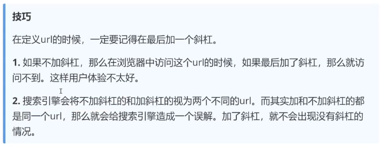

# Flask框架


## Flask简介

**Flask是一款发布于2010年的Python Web框架**

## 特点

1. 微框架、简介，给开发者提供了很强的扩展性
2. 开发效率高，比如使用SQLAlchemy的ORM操作数据库可以节省开发者书写sql所花费的时间


Flask本身相当于一个内核，其它几乎所有的功能都需要用到扩展（邮件扩展`Flash-Mail`，用户认证`Flask-Login`，数据库`Flask-SQLAlchemy`），都需要用第三方的扩展来实现。

Flask没有默认使用的数据库，其WSGI工具箱使用`Werkzeug`（路由模块），模版引擎则使用`Jinja2`。这两个也是Flask框架的核心。


## Flask的第一个应用程序

```python
# 使用Flask对象创建一个Web应用
from flask import Flask

# 创建对象
app = Flask(__name__)

# 路由的地址
@app.route('/index')
def index():
    # return代表将数据返回给浏览器
    return 'Mac'
if __name__ == '__main__':
    # 启动Web应用服务
    # 使用port修改端口号
    app.run(port=5000)

```

## 运行方式


运行程序时，可以指定运行的主机IP地址、端口

```python
app.run(host="0.0.0.0",port=5000)
```

**参数：**

- host：主机IP地址，默认localhost
- port：端口号，默认5000


```python
from flask import Flask

app = Flask(__name__)

@app.route('/')
def index():
    return "Hello"

if __name__ == '__main__':
    app.run(host='0.0.0.0',port=8000)
```


## Debug模式与配置参数加载

**Debug模式的优势**

- 可以实现热加载，更新完代码后，不用手动重新启动服务，系统会自动重启
- 可以直接把错误信息加载到浏览器

debug测试

```python
from flask import Flask

app = Flask(__name__)

@app.route('/')
def index():
    c=1/0
    return 'Hello'

if __name__=='__main__':
    #app.run(debug=True)
    app.debug = True
    app.run()

```


**配置参数加载**

```python
from flask import Flask
from parso.python.tree import Class

app = Flask(__name__)

@app.route('/')
def index():
    return "Hello"

class BaseConfig:
    DEBUG = True

class KConfig(BaseConfig):
    pass

class PConfig(BaseConfig):
    DEBUG = False

if __name__ == '__main__':
    #app.run(debug=True)

    #方式1
    #app.config['DEBUG'] = True
    # app.config.update({'DEBUG':True})
    # app.run()

    #方式2
    # app.config.from_mapping({"DEBUG":True})
    # app.run()

    #方式3
    app.config.from_object(KConfig)
    app.run()

    #方式4
    # import json
    # app.config.from_file('config.json',json.load)
    # app.run()

    #方式5
    # app.config.from_pyfile('setting.py')
    # app.run()

    # 方法6
    # 通过环境变量设置
    #app.config.from_envvar('flask_setting')
    # app.run()
```


## URL与函数的映射(动态路由)


### URL路径参数

有一个请求访问的接口地址为`/user/11011`，其中`11011`实际上为具体的请求参数，表明请求`11011`号用户的信息。

```
from flask import Flask

app = Flask(__name__)
@app.route('/article/<id>')
def index(id):
    print(f'接收到的文章ID是：{id}')
    # 获取到ID后去数据库查询数据

    return f'返回了，{id}的文章'

if __name__ == '__main__':
    app.run(debug = True,host='0.0.0.0',port=8000)
```

### 路径参数类型转换

其中<id>，尖括号是固定写法，语法为<variable>，variable默认的数据类型是字符串。

如果需要指定类型，则要写成==converter:variable==，其中converter就是类型名称，有以下几种：

1. string：默认的类型
2. int
3. float
4. path：与string类似，可以接收任意的字符串，但是path可以接收路径，也就是说可以包含斜杠/。
5. uuid：uuid是一个唯一的字符串，一般可以作为表的主键
6. any：数据类型可以在一个url中指定多个路径

```
from flask import Flask

app = Flask(__name__)

@app.route('/string/<id>')
def index_string(id):
    print(f'接收到的文章ID是：{id}')
    # 获取到ID后去数据库查询数据
    print(type(id))

    return f'返回了，{id}的文章'

@app.route('/int/<int:id>')
def index_int(id):
    print(f'接收到的文章ID是：{id}')
    # 获取到ID后去数据库查询数据
    print(type(id))

    return f'返回了，int类型{id}的文章'
@app.route('/float/<float:id>')
def index_float(id):
    print(f'接收到的文章ID是：{id}')
    # 获取到ID后去数据库查询数据
    print(type(id))
    return f'返回了，float类型{id}的文章'

@app.route('/path/<path:id>')
def index_path(id):
    print(f'接收到的文章ID是：{id}')
    # 获取到ID后去数据库查询数据
    print(type(id))
    return f'返回了，path类型{id}的文章'

@app.route('/uuid/<uuid:id>')
def index_uuid(id):
    print(f'接收到的文章ID是：{id}')
    # 获取到ID后去数据库查询数据
    print(type(id))
    return f'返回了，uuid类型{id}的文章'

@app.route('/<any(user,item):tmp>/<int:id>')
def index_any(tmp,id):
    if tmp == 'user':
        return f"返回了一个编号为{id}的用户信息"
    elif tmp == 'item':
        return f"返回了一个编号为{id}的元素信息"
from werkzeug.routing import BaseConverter
if __name__ == '__main__':
    app.run(debug = True,host='0.0.0.0',port=8000)
```

**路径参数可以直接识别数据类型的原因是：**

==因为继承了BaseConveret，并重写了处理逻辑==

## Flask自定义类型转换器


### 自定义PhoneConverter

```
from flask import Flask
from werkzeug.routing import BaseConverter
app = Flask(__name__)

class PhoneConverter(BaseConverter):
    regex = "1[3-9]\d{9}"

app.url_map.converters['phone'] = PhoneConverter


@app.route('/')
def index():
    return 'Hello'


@app.route('/<phone:param>')
def phone(param):
    print(param)
    return f'您传递的手机号是{param}'


if __name__ == '__main__':
    app.run(debug=True)
```


### to_python方法的使用

```
import typing as t

from flask import Flask
from werkzeug.routing import BaseConverter
app = Flask(__name__)

# 需求：路径参数传递多信息并以一个参数接收
# 例如：获取姓名：zs 年龄：18
#user/zs+18

#自定义转换器
class LiConverter(BaseConverter):
    def to_python(self, value: str) -> t.Any:
        return value.split('+')
        # 将结果返回给user_info的info参数

#注册转换器
app.url_map.converters['li'] = LiConverter

@app.route('/')
def index():
    return 'Hello'

@app.route('/user/<info>')
def user(info):
    args = info.split('+')
    return f'姓名:{args[0]},年龄:{args[1]}'

@app.route('/user_info/<li:info>')
def user_info(info):
    return f"获取到的信息为：{info}"

if __name__ == '__main__':
    app.run(debug=True)


```


## PostMan的使用


PostMan是一款非常流行的API调试工具


## 查询参数的获取

```
from flask import Flask,request

app = Flask(__name__)

@app.route('/')
def index():
    # 获取参数
    # 方式1:
    uname = request.args.get('uname')
    pwd = request.args.get('pwd')

    # 方式2：
    uname = request.values.get('uname') 
    pwd = request.values.get('pwd')


    return f'Hello uname:{uname} pwd:{pwd}'

if __name__ == '__main__':

    app.run(debug=True)


```

- **`request.args.get()` 与 URL 可见性**
    由于它仅处理 URL 中的查询参数，这些参数会直接体现在 URL 中（例如 `http://example.com/login?uname=xxx`）。
    - 优点：搜索引擎可以抓取到 URL 中的参数，若参数是有意义的业务标识（如 `article?id=123`），有助于搜索引擎理解页面内容。
    - 注意：URL 中不应包含敏感信息（如密码 `pwd`），否则会被搜索引擎收录，存在安全风险（你的代码中用它获取 `pwd` 是不合适的，密码应通过 POST 表单提交）。
- **`request.values.get()` 与参数隐蔽性**
    它可以处理表单提交的参数（POST 方式），这些参数不会出现在 URL 中，更适合传递敏感信息（如密码）。
    - 对 SEO 的影响：由于参数不在 URL 中，搜索引擎无法通过 URL 识别这些参数，但若页面本身是动态内容（如根据参数展示不同信息），需确保关键内容可被搜索引擎抓取（通常需要配合服务器端渲染）。


## 请求体获取参数


```
from flask import Flask,request

app = Flask(__name__)

@app.route('/login',methods=['POST','GET'])
def login():

    # 方式1:
    # uname = request.form.get('uname')
    # pwd = request.form.get('pwd')

    #方式2:
    uname = request.values.get('uname')
    pwd = request.values.get('pwd')


    return f'Hello,{uname},{pwd}'

if __name__ == '__main__':

    app.run(debug=True)
```


## 上传文件

```
from flask import Flask,request

app = Flask(__name__)

@app.route('/upload',methods=['POST'])
def upload():

    f = request.files.get('pic')
    fname = f.filename
    with open(f'./imgs/{fname}','wb') as tf:
        tf.write(f.read())

    return f"上传成功"

if __name__ == '__main__':
    app.run(debug=True,port=8000)
```

## Flask接收其它参数

如果想要获取其它地方传递的参数，可以通过Flask提供的request对象来获取

不同位置的参数都存放在request的不同属性中

| 属性    | 说明                           | 类型           |
| ------- | ------------------------------ | -------------- |
| values  | 记录请求的数据，并转换为字符串 | *              |
| form    | 记录请求中的表单数据           | MutilDict      |
| args    | 记录请求中的查询参数           | MutilDict      |
| cookies | 记录请求中的cookie信息         | Dict           |
| headers | 记录请求中的报文头             | EnvironHeaders |
| method  | 记录请求中的HTTP方法           | GET/POST       |
| url     | 记录请求的URL地址              | string         |
| files   | 记录请求上传的文件             | *              |

## url_for函数

​	**通过函数反向获取URL**


## 使用url_for函数的原因


```
from flask import Flask,url_for

app = Flask(__name__)

@app.route('/index/')
def index():
    return f'Hello'


@app.route('/show_url/')
def show_url():
    url = url_for('index',next='/')
    return f'反向查找到的URL地址为:{url}'

if __name__ == '__main__':
    app.run(debug=True)
```




​	==如果手动写死 URL（比如直接返回 `/index?next=/`），当后续修改视图函数的路由路径（比如把 `/index` 改成 `/home`）时，所有手动写死的 URL 都要一一修改，维护成本极高。==

​	==而用 `url_for('index', next='/')` 时，只要视图函数名 `index` 不变，无论路由路径怎么改，`url_for` 都会自动生成最新的 URL，从根本上避免了 “URL 硬编码” 的问题。==


## 响应-重定向

- **永久性重定向：**

    http的状态码是301，多用于旧网址被废弃，需要转到一个新的网址

- **暂时性重定向：**

    http的状态码是302，表示页面的暂时性跳转，例如，当用户访问一个需要权限的网址，如果当前用户没有登录，应该重定向到登录页面。


### flask中的重定向

​	重定向是通过`redirect(location,code=302)`这个函数实现的，location表示需要重定向到的URL，配合url__for()函数使用，code表示使用哪种重定向，默认是302，即暂时重定向。

```
from flask import Flask,redirect,url_for

app = Flask(__name__)

@app.route('/user_login/')
def login():
    return '登录界面'

@app.route('/info/')
def info():
    print('个人信息')
    return redirect(url_for('login')) # 重定向与url_for配合使用


if __name__ == '__main__':
    app.run(debug=True)

```


## 响应-响应内容


### 字符串

```python
# 返回字符串
@app.route('/str1/')
def str1():
    return 'Hello-你好'
# flask将字符串转为html
```

### json

```python
#返回json
@app.route('/json1/')
def json1():
    return  json.dumps({'lang':'python语言'},ensure_ascii=False)
@app.route('/json2/')
def json2():
    return  json.dumps({'lang':'python语言JSON2'},ensure_ascii=False)
```

### 元组

​	元组中必须至少包含一个项目,且项目应当由`(response,status)`、`(response,headers)`或者`(response,status,headers)`组成.`status`的值会重载状态码,`headers`是一个由额外头部值组成的列表或字典,作为额外的消息标头值.

```python
#返回元组
@app.route('/tuple1')
def tuple1():
    return '1'

@app.route('/tuple2')
def tuple2():
    #return '1,2' ,309
    return '2',309

@app.route('/tuple3')
def tuple_response3():
    # 返回JSON格式内容、状态码和响应头
    data = {'status': 'success', 'message': '操作完成'}
    json_data = json.dumps(data, ensure_ascii=False)  # 处理中文
    return json_data, 200, {'Content-Type': 'application/json'}
@app.route('/tuple4')
def tuple_response4():
    # 返回JSON格式内容、状态码和响应头
    data = {'status': 'success', 'message': '操作完成'}
    json_data = json.dumps(data, ensure_ascii=False)  # 处理中文
    return json_data, 200, [('Content-Type', 'application/json'),('lang','py')]
```


## 响应-自定义响应


```python
from flask import Flask,Response,make_response

app = Flask(__name__)

@app.route('/')
def index():
    #return Response('你好',status=500,headers={'lang':'Python'})
    return Response(status=404)

@app.route('/home')
def home():
    resp = make_response('这是创建的response对象')
    resp.headers['lang'] = 'Python_home'
    resp.status = 404
    return resp


if __name__ == '__main__':
    app.run(debug=True)
```


# Flask模版

## 模版介绍

​	在 Flask 中，**模板（Template）** 是用于生成动态 HTML 页面的文件，核心作用是**分离 “业务逻辑（Python 代码）” 和 “页面展示（HTML 代码）”**—— 开发者无需在 Python 里硬写 HTML 字符串，只需在模板中通过特定语法嵌入动态数据，Flask 会自动渲染出最终的 HTML 响应。

 

 

## 模版的使用

 

​	在Flask中,配套的模版是Jinja2,Jinja2的作者也是Flask的作者.

### 使用步骤

- 创建模版
    - 在同级目录下创建模版文件夹`templates`.
    - 在`templates`文件夹下创建应用同名文件夹.例如:`Book`
    - 在应用同名文件夹下创建网页模版文件.例如:`index.html`
- 设置模版查找路径
- 模版处理数据

 

```python
from flask import Flask,render_template

app = Flask(__name__,template_folder='templates1')

# 模版的默认查找目录是templates
# 可以通过template_folder手动指定模版的查找目录


@app.route('/')
def index():
    return render_template('index19.html')

if __name__ == '__main__':
    app.run(debug=True,port=8088)
```

## 模版-传递参数

 

```python
from flask import Flask,render_template

app = Flask(__name__)

@app.route('/')
def index():
    return render_template('index20.html',info='Flask模版',arg='python')
@app.route('/index')
def index2():
    return render_template('index20.html',info='Flask模版2',arg='python2')

@app.route('/home')
def home():
    context={
        'uname':'Jack',
        'pwd':123,
        'age':22,
        'offers':{'shanghai':10000,'beijing':12000,'xian':9000}
    }
    return render_template('index20.html',**context)


if __name__ == '__main__':
    app.run(debug=True,port=8088)
```

> ==**如果参数数量过多,可以将所有参数放到一个字典中,然后在传递字典参数时,使用将字典转换为关键字参数.**==

## 模版使用url_for函数

 

**在模版中使用变量、函数需要使用两个{}包裹**

```python
from flask import Flask,render_template


app = Flask(__name__)

@app.route('/')
def index():
    return render_template('index21.html')

@app.route('/home2/')
def home():
    return 'home'
@app.route('/home1/<int:id>')
def home1(id):
    return 'home'

if __name__ == '__main__':
    app.run(debug=True,port=8088)
```


# 过滤器介绍

 

​	在模版中,过滤器相当于是一个函数,把当前的变量传入到过滤器中,然后过滤器根据自己的功能返回相应的值,之后再将结果渲染在页面中.

```python
from flask import Flask,render_template

app = Flask(__name__)

@app.route('/')
def index():
    return render_template('index22.html',param1=1.1)

if __name__ == '__main__':
    app.run(debug=True,port=8088)
```

```html
<!DOCTYPE html>
<html lang="en">
<head>
    <meta charset="UTF-8">
    <title>过滤器的使用</title>
</head>
<body>

<h1>过滤器的使用</h1>
过滤器前的数据:{{param1}}
<br>
过滤后的数据:{{param1|int|float}}


</body>
</html>
```


## Jinja模版自带过滤器

 

​	过滤器是通过管道符号`|`使用的,例如:`{name|length}`将返回name的长度.过滤器相当于一个函数,把当前的变量传入到过滤器中,然后过滤器根据自己的功能,

 


## 转义字符过滤器

```html
<!DOCTYPE html>
<html lang="en">
<head>
    <meta charset="UTF-8">
    <title>转义字符过滤器</title>
</head>
<body>
  <h1>转义字符过滤器</h1>
<!--<script>alert("Hello")</script>-->
<!--模版中默认对字符进行了转义-->
<!--      转义后的数据是:{{info}}<br>-->
<!--      转义前的数据是:{{info|safe}}-->

<!--flase表示不再转义特殊字符,true表示转义特殊字符,默认为true-->
  
  {{info}}
  

</body>
</html>
```


 


## 其它过滤器

```html
<!DOCTYPE html>
<html lang="en">
<head>
    <meta charset="UTF-8">
    <title>其它过滤器</title>
</head>
<body>

<h1>其它过滤器</h1>
绝对值:{{-6|abs}}<br>
浮点数:{{-6|float}}<br>
字符串:{{-6|string}}<br>

字符串格式化:{{'%s--%s'|format('a','b')}}<br>
字符串长度:{{'aaaa'|length}} <br>
字符串第一个:{{'abcd'|first}} <br>
字符串最后一个:{{'abcd'|last}}<br>
统计字符串中单词数量:{{'abcda,aaa'|wordcount}}
<br>内容替换{{'abcab'|replace('ab','e')}}

</body>
</html>
```


## 自定义过滤器


​	当系统提供的过滤器不满足需求时,就需要自定义过滤器,过滤器本质上就是一个函数,如果在模版中调用这个过滤器,那么就会将这个变量的值作为第一个参数传递给过滤器,然后函数的返回值会作为过滤器的返回值.

​	使用自定义过滤器需要用到装饰器:`@app.template_filter('过滤器名称')`

### 自定义内容过滤器

```python
from flask import Flask, render_template

app = Flask(__name__)

# 自定义修饰器
@app.template_filter('cut')#定义过滤器名称
def cut(value):
    value = value.replace('ab','e')
    return value
@app.route('/')
def index():
    info = 'abcab'
    return render_template('index26.html',info=info)

if __name__ == '__main__':
    app.run(debug=True,port=8088)


```


### 自定义时间过滤器

```python
from flask import Flask, render_template
from datetime import datetime
import math

app = Flask(__name__)


@app.template_filter('timeFilter')
def timeFilter(value):
    value = value.replace('-','/')
    return value
@app.template_filter('handler_time')
def handler_time(time):
    '''
    处理时间
    '''
    # 获取当前时间
    now = datetime.now()
    # 将相差的时间转为秒
    temp_stamp = (now-time).total_seconds()
    if temp_stamp < 60:
        return '1分钟之前'
    elif temp_stamp>=60 and temp_stamp <60*60:
        return '1小时之前'
    elif temp_stamp>=60*60 and temp_stamp<24*60*60:
        return f'{math.floor(temp_stamp/(60*60))}小时之前'
    elif temp_stamp>=24*60*60 and temp_stamp<=30*24*60*60:
        return f'{math.floor(temp_stamp/(24*60*60))}天之前'
    else:
        return '很久以前'

@app.route('/')
def index():
    info = '2025-8-28'
    time = datetime(2025, 8, 28, 0, 0, 0, 0)
    return render_template('index27.html',info=info,time=time)


if __name__ == '__main__':
    app.run(debug=True,port=8088)

```


# Flask模版的流程控制

## 选择结构

 

​	所有的控制语句都是放在``中,并且有一个语句``来结束

**if:**  if语句和python中的类似,可以使用`>,<,<=,>=,==,!=`来判断,也可以通过`and,or,not,()`来进行逻辑合并操作.

```python
from flask import Flask, render_template

app = Flask(__name__)

@app.route('/')
def index():
    uname = 'jack'
    uname1 = 'bob'
    return render_template('index28.html',uname=uname,uname1=uname1)

if __name__ == '__main__':
    app.run(debug=True,port=8088)
```

```html
<!DOCTYPE html>
<html lang="en">
<head>
    <meta charset="UTF-8">
    <title>流程控制</title>
</head>
<body>
    <h1>流程控制</h1>
    <h3>单分支</h3>
    
        <p>Jack</p>
    

    <h3>双分支</h3>
    
        <p>Jack</p>
    
        <p>bob</p>
    
    

</body>
</html>
```

**`if`条件判断语句必须放在中间,并且还必须有结束的标签**

## 选择结构练习

```python
from flask import Flask, render_template,request

app = Flask(__name__)

@app.route('/')
def index():
    return render_template('index29.html')

@app.route('/login2/')
def login():
    user = request.args.get('user')
    return render_template('index29.html',user=user)

if __name__ == '__main__':
    app.run(debug=True,port=8088)
```

```html
<!DOCTYPE html>
<html lang="en">
<head>
    <meta charset="UTF-8">
    <title>首页</title>
</head>
<body>
    <span>中国大陆</span>&nbsp;&nbsp;
    
        <a href="{{url_for('login',user='bob')}}">亲,请登录</a>&nbsp;&nbsp;
        <span>免费注册</span>&nbsp;&nbsp;
    
        <span>{{user}}</span>&nbsp;&nbsp;

    


    <span>手机逛淘宝</span>&nbsp;&nbsp;

</body>
</html>
```


## 循环结构

`for...in...`for循环可以遍历任何一个序列,包括列表、字典、元组.并且可以进行反向遍历

```python
from flask import Flask, render_template

app = Flask(__name__)

@app.route('/')
def index():
    items = ['python','c','c++','java','golang']
    person = {'uname':'Jack','age':22,'gender':'male'}
    return render_template('index30.html',items = items,person = person)

if __name__ == '__main__':
    app.run(debug=True,port=8088)
```


```html
<!DOCTYPE html>
<html lang="en">
<head>
    <meta charset="UTF-8">
    <title>for语句的使用</title>
</head>
<body>
        <h1>for语句的使用</h1>
        
            {{item}}<br>
        
        <hr>
        {{ person }}<br>
        {{ person.uname }}<br>
        
            {{p}}
        
        <br>
        
            {{p}}
        
        <br>
        
            {{p}}
        
        <hr>
        
            {{p}}--{{loop.index}}--{{loop.index0}}--{{loop.first}}--{{loop.last}}--{{loop.length}}<br>
        

        
            {{item}}<br>
        


</body>
</html>
```

**`jinja2`的`for`循环类似于`Python`的`for`循环,但是没有`break`和`continue`语句**

## 循环结构练习

```python
from flask import Flask, render_template

app = Flask(__name__)

@app.route('/')
def index():
    return render_template('index31.html')

if __name__ == '__main__':
    app.run(debug=True,port=8088)
```

```html
<!DOCTYPE html>
<html lang="en">
<head>
    <meta charset="UTF-8">
    <title>循环练习</title>
</head>
<body>
    <h1>循环实现99乘法表</h1>
    <table border="1">

      
        <tr>
        
            <td>{{x}} x {{y}} = {{ x*y }}
        
        </tr>
      

    </table>
</body>
</html>
```


# 模版中宏的使用

## 宏的定义与使用

​	**模版中的宏跟python中的函数类似,可以传递参数,但是不能有返回值**,可以把经常使用的代码片段放到宏中,把不固定的值提取出来当成是一个变量.

```html
<!DOCTYPE html>
<html lang="en">
<head>
    <meta charset="UTF-8">
    <title>宏的使用</title>
</head>

<input type="{{type}}" name="{{name}}" value="{{value}}">


<body>
      <h1>宏的使用</h1>
      <table>
        <tr>
          <td>用户名:</td><td><input type="text" name="" value=""></td>
        </tr>
        <tr>
          <td>密码:</td><td><input type="password" name="" value=""></td>
        </tr>
        <tr>
          <td><input type="submit" value="登录"></td>
        </tr>
      </table>
<hr>
      <table>
        <tr>
          <td>用户名:</td><td>{{inp('text','uname')}}</td>
        </tr>
        <tr>
          <td>密码:</td><td>{{inp('password','pwd')}}</td>
        </tr>
        <tr>
          <td>{{inp('submit',value='登录')}}</td>
        </tr>
      </table>
</body>
</html>
```

## 宏的引入

```python
from flask import Flask, render_template

app = Flask(__name__)

@app.route('/')
def index():
    uname = 'jack'

    return render_template('index33.html',uname=uname)

if __name__ == '__main__':
    app.run(debug=True,port=8088)
```

```html

    <input type="{{type}}" name="{{name}}" value="{{uname}}">

```


```html
<!DOCTYPE html>
<html lang="en">
<head>
    <meta charset="UTF-8">
    <title>宏的引入</title>
</head>



<body>
        <h1>宏的引入</h1>

          <table>
            <tr>
              <td>用户名:</td><td><input type="text" name="" value="{{uname}}"></td>
            </tr>
            <tr>
              <td>密码:</td><td><input type="password" name="" value=""></td>
            </tr>
            <tr>
              <td><input type="submit" value="登录"></td>
            </tr>
          </table>
<hr>


           <table>
            <tr>
              <td>用户名:</td><td>{{mc.inp(name='uname')}}</td>
            </tr>
            <tr>
              <td>密码:</td><td>{{mc.inp('password',name='pwd')}}</td>
            </tr>
            <tr>
              <td>{{mc.inp('submit',value='登录')}}</td>
            </tr>
          </table>
<hr>
          <table>
            <tr>
              <td>用户名:</td><td>{{inp(name='uname')}}</td>
            </tr>
            <tr>
              <td>密码:</td><td>{{inp('password',name='pwd')}}</td>
            </tr>
            <tr>
              <td>{{inp('submit',value='登录')}}</td>
            </tr>
          </table>

</body>
</html>
```


# 导入模版include

 

1. 这个标签相当于是直接将制定模版中的代码复制粘贴到当前位置
2. `include`标签,如果想要使用父模版中的变量,不需要用`with context`
3. `include`的路径,和`import`一样,从`templates`根目录下找

```html
<!DOCTYPE html>
<html lang="en">
<head>
    <meta charset="UTF-8">
    <title>include的使用</title>
</head>
<body>
        <h1>include的使用</h1>
        <hr>


<main>主要内容</main>


</body>
</html>
```


# set与with标签

## set的使用

在模版中,可以使用`set`语句来定义变量

```html
<!--set语句来定义变量-->

<p>用户名:{{uname}}</p>
```

## with语句

`with`语句定义的变量,只能在`with`语句中使用

```html
<!--with语句来定义变量,with语句范围内才能使用这个变量-->

        <p>用户名:{{name}}</p>

```


# 静态资源的引入

 

## 静态文件

**静态文件:**css文件、js文件、图片文件等

加载静态文件使用的是`url_for`函数,第一个参数为`static`,第二个参数为文件路径`filename='路径'`.

**语法:**

```html
{{ url_for('static',filename='xxx') }}
```

==使用static_folder参数修改静态文件的默认文件夹==

```python
app = Flask(__name__,static_folder='static2')
```

==路径查找时,以当前项目的static目录为根目录==

```html
<!DOCTYPE html>
<html lang="en">
<head>
    <meta charset="UTF-8">
    <title>静态文件的引入</title>
    <script src="{{url_for('static',filename='js/test.js')}}"></script>
    <link href="{{url_for('static',filename='css/test.css')}}" type="text/css" rel="stylesheet"></link>

</head>
<body>
<h1>静态文件的引入</h1>

<br>
<br>

</body>
</html>
```

# 模版继承

 

​	模版继承可以把一些公用的代码抽取出来放到父模版中,以供子模版继承使用,可以重复使用代码.

 

**模版继承语法**

​	使用`extends`语句,来指明继承的父模版,父模版的路径也是相当于`templates`文件夹下的绝对路径

```html

```

**block语法**

​	一般在父模版中,定义一些公共的代码,子模版可以根据具体的需求实现不同的代码,**这时父模版需要提供一个借口,让子模版实现**,从而实现具体业务需求的功能.

**父模版**

```html


```

**子模版**

```html

子模版的代码

```

**调用父模版代码block中的代码**

​	子模版如果实现了父模版定义的blcok,那么子模版block中的代码就会覆盖掉父模版的代码,如果想要在子模版中保持父模版的代码,可以使用`{{ super() }}`实现.

**index37.html**

```html



    
    这是子模版的底部信息
    


    
    {{super()}}<br>
    <!--使用super()对父模版内容扩充-->
    这是子模版的内容<br>
    <!--使用self.footer调用当前模版的footer block块-->
    {{self.footer()}}

    

```


# 模版继承练习

 


