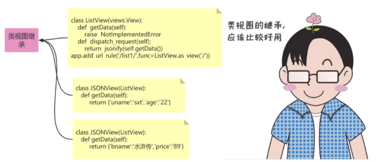
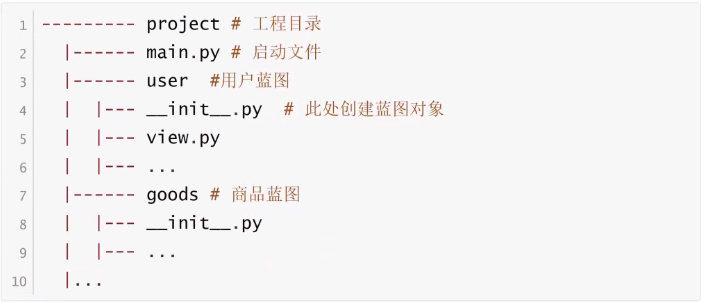
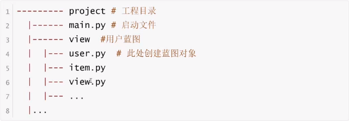
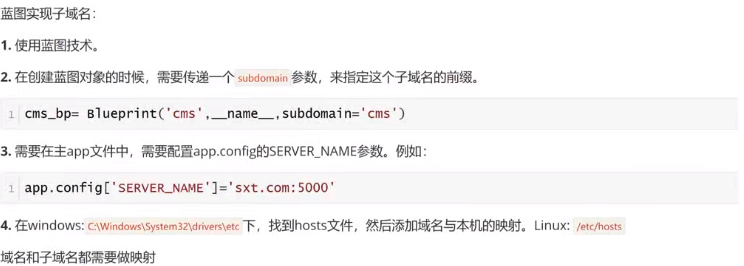

#  Flask视图高级

 

## add_url_rule

`add_url_rule(rule,endpoint=None,view_func=None)`,如果没有填写`endpoint`,那么默认会使用`view_func`的名字作为`endpoint`.

​	在 Flask 中，`@app.route` 装饰器和 `add_url_rule` 都是用于**绑定 URL 路径到视图函数**的方式，它们本质上是等价的，但使用场景和写法不同。

```python
from flask import Flask, url_for

app = Flask(__name__)

#@app.route 是 Flask 提供的语法糖，通过装饰器语法简化了 URL 与视图函数的绑定，是最常用的方式。
@app.route('/',endpoint='index')
def index():

    print(url_for('show'))
    print(url_for('index'))
    return 'Hello'

def show_info():
    return "这是一个介绍信息"
#add_url_rule 是 Flask 提供的底层方法，直接调用该方法也能实现 URL 与视图函数的绑定，功能与 @app.route 完全一致，但写法是 “函数调用式” 而非装饰器。
app.add_url_rule('/index',view_func=show_info,endpoint='show') 
#endpoint 重新指定了show_info函数的名字

if __name__ == '__main__':
    app.run(debug=True,port=8088)
```

## 类视图

 

​	视图也可以基于类实现,类视图的好处是支持继承,类视图还需要通过`app.add_url_rule(url_rele,view_func)`来进行注册.

### 标准类视图使用流程

1. 标准类视图必须继承自`flask.views.View`
2. 必须实现`dispatch_request`方法,接收到请求后,会执行这个方法,这个方法的返回值相当于是之前的视图函数,也必须返回`Response`或者子类的对象、字符串、元组.
3. 必须通过`app.add_url_rule(url_rule,endpoint,view_func)`来做url和视图的映射.`view_func`这个参数需要使用类视图下的`as_view`类方法类转换:`ListView.as_view('')`
4. 如果指定了`endpoint`,在使用`url_for`反转的时候必须使用`endpoint`指定的值,如果没有指定`endpoint`,那么就可以使用`as_view`(视图名字)中指定的视图名字作为反转.

```python
# 导入Flask相关模块
from flask import Flask, typing as ft, url_for  # 导入Flask核心类、类型提示和URL反向解析工具
from flask.views import View  # 导入Flask的基础视图类，用于创建基于类的视图

# 创建Flask应用实例
app = Flask(__name__)  # __name__参数用于确定应用根目录


# 定义函数视图（最常用的视图形式）
@app.route('/')  # 路由装饰器：将根路径'/'与index函数绑定
def index():
    # 使用url_for通过端点名称'mylist'反向生成对应的URL
    # 这里的'mylist'是下面ListView类视图注册时指定的端点名称
    print(url_for('mylist'))  # 会在控制台输出：/list
    return 'Hello'  # 向客户端返回字符串响应


# 定义基于类的视图（继承自Flask的View类）
class ListView(View):
    # 必须实现dispatch_request方法，处理请求并返回响应
    # ft.ResponseReturnValue是类型提示，表示返回值需符合Flask响应格式（字符串、元组、响应对象等）
    def dispatch_request(self) -> ft.ResponseReturnValue:
        return '返回了一个list内容'  # 向客户端返回字符串响应


# 注册类视图到路由
# 通过add_url_rule方法将URL路径'/list'与ListView类视图绑定
# ListView.as_view('mylist')：将类转换为可调用的视图函数，并指定端点名称为'mylist'
# 端点名称'mylist'用于url_for反向生成URL时使用
app.add_url_rule('/list', view_func=ListView.as_view('mylist'))


# 测试环境：创建模拟请求上下文
# 因为url_for等函数依赖请求上下文，在非Web请求环境下需要手动创建
with app.test_request_context():
    # 测试通过端点名称'mylist'反向生成URL
    print(url_for('mylist'))  # 会在控制台输出：/list


# 应用入口
if __name__ == '__main__':
    # 启动Flask开发服务器
    # debug=True：开启调试模式（代码修改后自动重启，报错时显示详细信息）
    # port=8088：指定服务器端口为8088（默认是5000）
    app.run(debug=True, port=8088)

```

### 类视图的好处

 

**可以继承,把一些共性的东西抽取出来放到父视图中,子视图直接拿来使用**

```python
# 导入必要的模块
from logging import raiseExceptions  # 导入日志相关的异常处理
from flask import Flask, typing as ft, url_for, jsonify  # 导入Flask核心组件
from flask.views import View  # 导入Flask的基础视图类

# 创建Flask应用实例
app = Flask(__name__)

# 需求: 所有视图返回的结果都必须是JSON数据

# 定义基础视图类，继承自Flask的View类
class BaseView(View):
    """基础视图类，所有需要返回JSON的视图都应继承此类"""
    
    def get_data(self):
        """
        抽象方法，用于子类实现具体的数据获取逻辑
        子类必须重写此方法，否则调用时会抛出异常
        """
        # 如果子类没有实现该方法，调用时会触发 NotImplementedError
        raise NotImplementedError("子类必须实现get_data方法")

    def dispatch_request(self) -> ft.ResponseReturnValue:
        """
        视图类的核心方法，处理请求并返回响应
        Flask会自动调用该方法来处理请求
        :return: JSON格式的响应数据
        """
        # 调用子类实现的get_data()获取数据，并用jsonify转换为JSON响应
        return jsonify(self.get_data())

# 定义第一个具体视图类，继承自BaseView
class JsonView(BaseView):
    """具体视图类1，返回包含jack信息的JSON数据"""
    
    def get_data(self):
        """实现父类的抽象方法，返回具体数据"""
        return {'uname':'jack','age':20}

# 定义第二个具体视图类，继承自BaseView
class JsonView2(BaseView):
    """具体视图类2，返回包含bob信息的JSON数据"""
    
    def get_data(self):
        """实现父类的抽象方法，返回具体数据"""
        return {'uname':'bob','age':22}

# 注册路由规则，将URL路径与视图类绑定
# 注意：BaseView是抽象基类，实际访问会报错，此处仅作为示例
app.add_url_rule(
    rule='/base/',  # URL路径
    view_func=BaseView.as_view('base')  # 将视图类转换为视图函数，指定端点名称为'base'
)

# 注册JsonView对应的路由
app.add_url_rule(
    rule='/json/', 
    view_func=JsonView.as_view('json')  # 端点名称为'json'，用于url_for反向生成URL
)

# 注册JsonView2对应的路由
app.add_url_rule(
    rule='/json2/',
    view_func=JsonView2.as_view('json2')  # 端点名称为'json2'
)

# 创建测试请求上下文，用于在非请求环境下使用url_for等依赖请求上下文的函数
with app.test_request_context():
    # 通过端点名称反向生成URL
    print(url_for('json'))   # 输出: /json/
    print(url_for('json2'))  # 输出: /json2/

# 应用入口
if __name__ == '__main__':
    # 启动开发服务器，端口8088，开启调试模式
    app.run(debug=True, port=8088)

```


### 类视图使用场景

```python
from flask import Flask, typing as ft, url_for, render_template
from flask.views import View  # 导入Flask的基础视图类，用于创建基于类的视图

# 创建Flask应用实例
app = Flask(__name__)


class BaseView(View):
    """基础视图类，封装公共数据和方法，供子类继承"""
    
    def __init__(self):
        """初始化方法，定义公共消息字典（子类可共享和修改）"""
        self.msg = {
            'login': '这是login页面的信息123',  # 登录页面的默认信息
            'register': '这是register页面的信息'  # 注册页面的默认信息
        }


class LoginView(BaseView):
    """登录视图类，继承BaseView，处理登录页面的请求"""
    
    def dispatch_request(self) -> ft.ResponseReturnValue:
        """
        处理请求的核心方法（必须实现）
        向模板传递数据并渲染登录页面
        """
        # 向公共消息字典中添加登录页面特有的信息
        self.msg['my_msg'] = '这是一个登录功能'
        
        # 使用**self.msg将字典拆分为关键字参数传递给模板
        # 模板中可直接使用msg字典中的键（如{{ login }}、{{ my_msg }}）
        return render_template('login.html', **self.msg)


class RegisterView(BaseView):
    """注册视图类，继承BaseView，处理注册页面的请求"""
    
    def dispatch_request(self) -> ft.ResponseReturnValue:
        """
        处理请求的核心方法（必须实现）
        向模板传递数据并渲染注册页面
        """
        # 向公共消息字典中添加注册页面特有的信息
        self.msg['my_msg'] = '这是一个注册功能'
        
        # 同样使用**self.msg传递数据到模板
        return render_template('register.html', **self.msg)


# 注册路由：将URL路径与视图类绑定
# LoginView.as_view('login')：将类转换为视图函数，指定端点名称为'login'
app.add_url_rule(rule='/login/', view_func=LoginView.as_view('login'))
# 注册注册页面路由，端点名称为'register'
app.add_url_rule(rule='/register/', view_func=RegisterView.as_view('register'))


# 测试：创建模拟请求上下文，用于在非Web环境下测试URL反向生成
with app.test_request_context():
    # 通过端点名称生成对应的URL
    print(url_for('login'))    # 输出：/login/
    print(url_for('register')) # 输出：/register/


# 应用入口
if __name__ == '__main__':
    # 启动开发服务器，端口8088，开启调试模式
    app.run(debug=True, port=8088)
```


### 基于调度方法的类视图

 

1. 基于方法的类视图,是根据请求的`method`来执行不同的方法.如果用户发送的是`get`请求,那么会执行这个累的`get`方法;如果是`post`请求,那么会执行这个类的`post`方法,其它method类似
2. 这种方式可以让代码更加简洁,与`get`相关的代码都存放在`get`方法中,与`post`相关的代码都存放在`post`方法中.

```python
from flask import Flask, typing as ft, url_for, request, render_template
from flask.views import MethodView  # 导入MethodView，支持按HTTP方法拆分视图逻辑

# 创建Flask应用实例
app = Flask(__name__)


# 以下是被注释的函数视图实现方式，作为对比参考
# @app.route('/login/', methods=['GET','POST'])  # 允许GET和POST请求
# def login():
#     if request.method == 'GET':
#         # GET请求：返回登录页面
#         return render_template('login05.html')
#     elif request.method == 'POST':
#         # POST请求：处理表单提交
#         uname = request.form.get('uname')  # 获取表单中的用户名
#         pwd = request.form.get('pwd')      # 获取表单中的密码
#         print(uname)
#         print(pwd)
#         # 验证用户名和密码
#         if uname == 'zs' and pwd =='123':
#             return '登录成功'
#         else:
#             # 验证失败，返回登录页并提示错误
#             return render_template('login05.html')


class LoginView(MethodView):
    """
    基于MethodView的登录视图类
    自动根据HTTP请求方法（GET/POST）调用对应的方法
    比函数视图更清晰地分离不同请求方法的逻辑
    """
    
    def get(self):
        """处理GET请求：返回登录页面"""
        # 当用户通过浏览器直接访问/login/时，触发GET请求
        return render_template('login05.html')  # 渲染登录表单模板
    
    def post(self):
        """处理POST请求：验证表单数据并处理登录逻辑"""
        # 当用户在登录表单中点击提交时，触发POST请求
        # 从表单数据中获取用户名和密码（对应表单中name属性为uname和pwd的字段）
        uname = request.form.get('uname')
        pwd = request.form.get('pwd')
        
        # 在控制台打印获取到的用户名和密码（开发时用于调试）
        print(f"用户名：{uname}，密码：{pwd}")
        
        # 简单的登录验证逻辑（实际项目中会连接数据库验证）
        if uname == 'zs' and pwd == '123':
            # 验证成功，返回登录成功提示
            return '登录成功'
        else:
            # 验证失败，重新渲染登录页并传递错误信息
            # 模板中可以通过{{ msg }}显示错误提示
            return render_template('login05.html', msg='用户名或密码错误')


# 注册路由：将URL路径'/login/'与LoginView视图类绑定
# LoginView.as_view('login')：将类转换为视图函数，指定端点名称为'login'（用于url_for反向生成URL）
# MethodView会自动处理GET和POST方法，无需手动指定methods参数
app.add_url_rule(rule='/login/', view_func=LoginView.as_view('login'))


# 测试：创建模拟请求上下文，用于在非Web请求环境下测试URL反向生成
with app.test_request_context():
    # 通过端点名称'login'生成对应的URL
    print(url_for('login'))  # 输出：/login/


# 应用入口
if __name__ == '__main__':
    # 启动Flask开发服务器
    # debug=True：开启调试模式（代码修改后自动重启，错误信息详细显示）
    # port=8088：指定服务器端口为8088（默认端口是5000）
    app.run(debug=True, port=8088)

```

<font style="background-color:#00ff00">A</font>

<font style="background-color:#ff0000">B</font>

<font style="background-color:#0000ff">C</font>

<font style="background-color:#f0f0f0">D</font>


### 基于调度方法的类视图写法优化

```python
from flask import Flask, typing as ft, url_for, request, render_template
from flask.views import MethodView  # 导入MethodView，支持按HTTP方法拆分视图逻辑

# 创建Flask应用实例
app = Flask(__name__)


'''
# 以下是被注释的早期版本，作为对比参考
class LoginView(MethodView):
    # 处理GET请求，接收可选参数msg（默认None）
    def get(self,msg=None):
        # 直接渲染登录模板并传递msg参数
        return render_template('login06.html',msg=msg)
    
    def post(self):
        # 获取表单提交的用户名和密码
        uname = request.form.get('uname')
        pwd = request.form.get('pwd')
        print(uname)
        print(pwd)
        # 验证成功返回成功信息
        if uname == 'zs' and pwd =='123':
            return '登录成功'
        else:
            # 验证失败调用get方法并传递错误信息
            return self.get(msg='用户名或密码错误')
'''


class LoginView(MethodView):
    """登录视图类，基于MethodView实现，支持GET和POST方法"""
    
    def __jump(self, msg=None):
        """
        私有辅助方法（以双下划线开头），封装页面跳转逻辑
        作用：统一渲染登录模板，避免代码重复
        :param msg: 可选参数，传递给模板的消息（如错误提示）
        :return: 渲染后的登录页面响应
        """
        return render_template('login06.html', msg=msg)
    
    def get(self, msg=None):
        """处理GET请求：返回登录页面"""
        # 调用私有方法__jump()渲染登录页，不传递消息（默认None）
        return self.__jump()
    
    def post(self):
        """处理POST请求：验证表单数据并处理登录逻辑"""
        # 从表单中获取用户名和密码（对应表单中name属性为uname和pwd的字段）
        uname = request.form.get('uname')
        pwd = request.form.get('pwd')
        
        # 控制台打印获取到的用户数据（开发调试用）
        print(f"用户名：{uname}，密码：{pwd}")
        
        # 验证用户名和密码（这里是简单的硬编码验证，实际项目中会连接数据库）
        if uname == 'zs' and pwd == '123':
            # 验证成功，返回登录成功提示
            return '登录成功'
        else:
            # 验证失败，调用私有方法__jump()并传递错误消息
            return self.__jump(msg='用户名或密码错误')


# 注册路由：将URL路径'/login/'与LoginView视图类绑定
# as_view('login')指定端点名称为'login'，用于url_for反向生成URL
app.add_url_rule(rule='/login/', view_func=LoginView.as_view('login'))


# 测试：创建模拟请求上下文，在非Web环境下测试URL反向生成
with app.test_request_context():
    # 通过端点名称'login'生成对应的URL
    print(url_for('login'))  # 输出：/login/


# 应用入口
if __name__ == '__main__':
    # 启动Flask开发服务器，端口8088，开启调试模式
    app.run(debug=True, port=8088)

```


## 视图装饰器

 

​	Python装饰器就是用于拓展原来函数功能的一个函数,这个函数的特殊之处在于,它的返回值也是一个函数,使用装饰器的好处是可以在不修改原函数代码的情况下给函数增加新的功能.

1. **装饰器的作用**：
    - `login_required`：用于验证用户登录状态，只有用户名`zs`且密码`123`的请求才能访问被装饰的视图
    - `logger`：用于在视图执行前记录一条警告日志，演示日志记录功能
2. **装饰器在函数视图中的应用**：
    - 通过`@装饰器名`的语法直接应用（如`@login_required`）
    - 执行顺序：访问`/`时，先执行`login_required`验证，通过后再执行`index()`函数
3. **装饰器在类视图中的应用**：
    - 通过类属性`decorators = [装饰器1, 装饰器2]`指定
    - 执行顺序：列表中的装饰器按**从左到右**的顺序执行（先`login_required`验证，再`logger`记录日志，最后执行`get()`方法）
4. **登录验证的实现**：
    - 从`request.args`获取 GET 请求参数（URL 中的`?uname=zs&pwd=123`）
    - 验证通过则执行原视图函数，失败则返回错误信息并记录日志
5. **日志级别说明**：
    - `logging.INFO`：记录一般信息（如登录成功 / 失败）
    - `logging.WARNING`：记录警告信息（装饰器中的测试日志）
    - 配置`level=logging.INFO`后，INFO 及更高级别的日志（如 WARNING、ERROR）都会被记录

```python
from functools import wraps  # 导入wraps装饰器，用于保留被装饰函数的元信息
import logging  # 导入日志模块，用于记录系统运行信息
from flask import Flask, render_template, request  # 导入Flask核心组件
from flask.views import MethodView  # 导入MethodView，用于创建基于类的视图

# 配置日志模块：设置日志级别为INFO（会记录INFO及以上级别的日志）
logging.basicConfig(level=logging.INFO)

# 创建Flask应用实例
app = Flask(__name__)

# 定义登录验证装饰器
def login_required(func):
    """
    登录验证装饰器：检查请求中的用户名和密码是否正确
    用于保护需要登录才能访问的视图
    """
    @wraps(func)  # 保留被装饰函数的名称和文档字符串等元信息
    def wrapper(*args, **kwargs):
        # 从请求参数中获取用户名和密码（GET请求的查询参数）
        uname = request.args.get('uname')  # 等价于URL中的?uname=xxx
        pwd = request.args.get('pwd')      # 等价于URL中的?pwd=xxx
        
        # 验证用户名和密码（这里是简单的硬编码验证）
        if uname == 'zs' and pwd == '123':
            # 验证成功：记录INFO级别的日志，并执行被装饰的函数
            logging.info(f"{uname}登录成功")
            return func(*args, **kwargs)  # 调用原函数（如index()）
        else:
            # 验证失败：记录INFO级别的日志，并返回错误信息
            logging.info(f"{uname}尝试登录失败")  # 若uname为None，会显示"None尝试登录失败"
            return "用户名或密码错误"
    return wrapper

# 定义日志记录装饰器
def logger(func):
    """日志记录装饰器：在执行被装饰函数前记录一条警告日志"""
    @wraps(func)
    def wrapper(*args, **kwargs):
        # 记录一条WARNING级别的日志
        logging.warning('这是日志测试信息')
        # 执行被装饰的函数并返回结果
        return func(*args, **kwargs)
    return wrapper

# 函数视图：使用@login_required装饰器保护首页
@app.route('/')  # 绑定根路径'/'到index函数
@login_required  # 应用登录验证装饰器：访问/index前必须通过登录验证
def index():
    return 'hello'  # 验证通过后返回的内容


# 类视图：使用decorators列表应用装饰器
class LoginView(MethodView):
    """基于类的视图，演示如何为类视图应用装饰器"""
    
    # 为类视图指定装饰器：列表中的装饰器会按顺序执行（先login_required，后logger）
    decorators = [login_required, logger]

    def get(self):
        """处理GET请求：返回简单的问候信息"""
        return 'Hello'

# 注册类视图的路由：将URL路径'/login/'与LoginView绑定
app.add_url_rule('/login/', view_func=LoginView.as_view('login'))


# 应用入口
if __name__ == '__main__':
    # 启动Flask开发服务器，端口8088，开启调试模式
    app.run(debug=True, port=8088)

```

## 蓝图

 

在Flask中,使用蓝图Blueprint来分模块组织管理

蓝图实际上可以理解为是一组存储视图方法的容器对象,具有以下特点:

- 一个应用可以有多个蓝图
- 可以讲一个蓝图注册到任何一个未使用的URL下,如`/user`,`/goods`
- 蓝图可以有自己单独的模版、静态文件或者其它的通用方法,它并不是必须要实现应用的视图和函数
- 在一个应用初始化时,就应该注册需要使用的蓝图

**蓝图不是一个完整的应用,它不能独立于应用运行,必须注册到某一个应用中**

### 使用方式

1. 创建一个蓝图对象

    ```python
    user_bp = Blueprint('user',__name__)
    ```

2. 管理路由地址

    ```python
    @user_bp.route('/')
    def user_profile():
    	return 'user_profile'
    ```

3. 在应用上注册蓝图对象

    ```python
    app.register_blueprint(user_bp)
    ```

    ```python
    from sys import prefix
    
    from flask import Flask,Blueprint
    
    app = Flask(__name__)
    
    @app.route('/')
    def index():
        return 'Hello'
    
    # 创建蓝图
    user_bp = Blueprint('user',__name__)
    
    # 管理的子功能
    @user_bp.route('/login/')
    def login():
        return '登录模块'
    @user_bp.route('/register/')
    def register():
        return '注册模块'
    
    
    # 创建蓝图
    item_bp = Blueprint('item',__name__)
    
    # 管理的子功能
    @item_bp.route('/item/')
    def login():
        return '产品模块'
    
    
    # 注册蓝图
    app.register_blueprint(user_bp,url_prefix='/user')
    app.register_blueprint(item_bp,url_prefix='/goods')
    
    
    if __name__ == '__main__':
        app.run(debug=True,port=8088)
    
    
    
    ```

    

## 蓝图的目录结构

 

​	为了让项目代码更加清晰,可以将代码放在不同的文件里进行管理

### 根据功能模块分目录

对于一个打算包含多个文件的蓝图,通常把蓝图对象放到Python包的`__init__.py`文件里

 

### 根据技术模块分目录

 

## 蓝图中的模版文件

 

### 寻找规则

1. 蓝图自身的模板目录（优先级高）

如果在创建蓝图时，指定了 `template_folder` 参数（即蓝图专属的模板文件夹），Flask 会优先从该目录查找模板。

2. 应用全局的模板目录（优先级低）

如果蓝图未指定 `template_folder`，或蓝图的模板目录中找不到目标模板，Flask 会去应用全局的 `templates` 目录（即主应用所在目录下的 `templates` 文件夹）查找。

​	==如果蓝图和全局模板目录中存在同名模板，默认情况下，蓝图会优先使用自身目录的模板（蓝图的 `template_folder` 优先级更高）。这种机制确保了不同蓝图的模板不会相互干扰，实现了模板的 “命名空间隔离”==


## 蓝图静态文件

 

### 蓝图内部静态文件

​	蓝图对象创建时不会默认注册静态目录的路由,需要我们在创建时指定`static_folder`参数.

## 蓝图与url_for函数结合

1. 硬编码 URL

    ：

    ```
    src="/user/user_static/Sweater_Girl_Snow.mp4"
    ```

    - 路径解析：`/user` 是蓝图的 URL 前缀，`/user_static` 是蓝图的 `static_url_path`，组合后指向视频文件。

2. 通过 `url_for` 生成 URL

    ：

    ```
    src="{{url_for('user.static', filename='Sweater_Girl_Snow.mp4')}}"
    ```

    - `user.static` 是蓝图静态文件的固定端点（`蓝图名.static`），`filename` 指定静态文件在 `static_folder` 中的相对路径。


## 蓝图实现子域名

 

**蓝图实现子域名**

 


