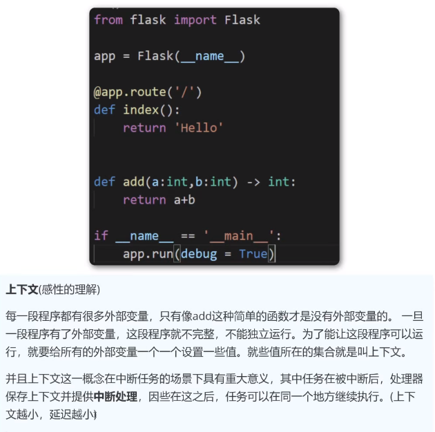

# Flask高级

## Cookie介绍

 

​	**HTTP协议是无状态的协议,一旦数据交换完毕,客户端和服务器端的连接就会关闭,再次交换数据需要建立新的连接,这就意味着服务器无法从连接上跟踪会话.**

 

​	**cookie实际上是一小段的文本信息,客户端请求访问服务器资源,如果服务器需要记录该用户状态,就使用response向客户端浏览器颁发一个cookie,客户端浏览器会吧cookie保存起来**

​	**当浏览器再次访问该网站时,浏览器把请求的网址一同提交给服务器,服务器检查该cookie,以此来识别用户**

## Flask设置Cookie

```python
import requests.cookies
from flask import Flask,make_response,request

app = Flask(__name__)


@app.route('/')
def index():
    return "Hello"
# 设置Cookie
@app.route('/set_cookie/')
def set_cookie():
    resp = make_response('设置了一个cookie信息')
    resp.set_cookie('uname','jack')
    return resp
# 获取Cookie
@app.route('/get_cookie/')
def get_cookie():
    uname = request.cookies.get('uname')
    return f'Cookie里面的内容是:{uname}'
# 删除Cookie

@app.route('/del_cookie/')
def del_cookie():
    resp = make_response('删除cookie')
    resp.delete_cookie('uname')
    return resp


if __name__ == '__main__':
    app.run(debug=True)

```

## Cookie的有效期

 

**默认的过期时间:**如果没有显式的指定过期时间,那么这个cookie会在浏览器关闭后过期.

**max_age**:以秒为单位,距离现在多少秒后cookie会过期

**expires**:为datatime类型,需要设置为**格林尼治时间,北京时间自动+8小时**

**如果max_age和expires都设置,就以max_age为标准**

> **注意**
>
> max_age在IE8以下的浏览器是不支持的
>
> expires在新版的HTTP协议中被废弃了.但目前为止所有的浏览器仍然支持,如果想要兼容IE8以下的浏览器,那么应该使用expires

```python
from flask import Flask,Response

app = Flask(__name__)

@app.route('/')
def index():
    return 'Hello'

@app.route('/create_cookie/default/')
def create_cookie1():
    resp = Response('通过默认值设置cookie有效期')
    # 没有设置有效期时,cookie会在浏览器关闭时过期
    resp.set_cookie('uname','bob')
    return resp
@app.route('/create_cookie/max_age')
def create_cookie2():
    resp = Response('通过max_age设置cookie有效期')
    # 设置有效期为2小时
    age = 2*60*60
    resp.set_cookie('uname','bob',max_age=age)
    return resp

from datetime import datetime,timedelta

@app.route('/create_cookie/expires')
def create_cookie3():
    resp = Response('通过expires设置cookie有效期')
    # 设置某个时间为有效期
    tmp_time = datetime(2025,10,1,00,00,00)
    resp.set_cookie('uname','bob',expires=tmp_time)
    return resp

@app.route('/create_cookie/expires2')
def create_cookie4():
    resp = Response('通过expires设置cookie有效期')
    # 设置某个时间为有效期
    tmp_time = datetime.now()+timedelta(days=2)
    resp.set_cookie('uname','bob',expires=tmp_time)
    return resp
 
if __name__ == '__main__':
    app.run(debug=True,port=8088)


```

## Session介绍

 

​	Session和Cookie的作用类似,都是为了存储用户的信息,不同的是Cookie保存在客户端浏览器中,而Session保存在服务器上.

**Session机制的出现是为了解决Cookie存储数据不安全的问题**

​	**如果说Cookie机制是通过检查客户身上的"通行证"来确定身份的话,那么Session机制就是通过检查服务器上的"客户明细表"来确认客户身份.Session相当于程序在服务器上建立的一份客户档案,客户来访时,只需要查询客户档案即可**

### Session的跟踪机制

​	在Flask框架中,Session的跟踪机制与Cookie有关,这意味Session不能脱离Cookie

### Session的工作过程

 

存储在服务器的数据会更加的安全,不容易被窃取

 

> **问题**
>
> 如果客户端禁用了浏览器的Cookie功能,Session功能想继续使用,该如何解决.
>
> 
>
> ------
>
> **解决方案**
>
> URL地址携带SessionID
>
> 


## Flask中使用Session

 


使用Session之前需要先设置SECRET_KEY

```python
# 设置Session的盐
app.secret_key = 'finalfancty'

# 通过类设置
class DefaultConfig:
    SECRET_KEY = 'finalfancty'

app.config.from_object(DefaultConfig)
```

```python
from flask import Flask,session

app = Flask(__name__)

@app.route('/')
def index():
    return 'Hello'

# 设置Session的盐
app.config.secret_key = 'finalfancty'

# 通过类设置
class DefaultConfig:
    SECRET_KEY = 'finalfancty'

app.config.from_object(DefaultConfig)

@app.route('/set_session/')
def set_session():
    session['uname'] = 'bob'
    session['pwd'] = '123'
    return '设置了一个Session对象'

@app.route('/get_session/')
def get_session():
    uname = session.get('uname')
    pwd = session.get('pwd')
    return f'从Session读取出的数据为:{uname}---{pwd}'

@app.route('/del_session/')
def del_session():
    # pop删除一个key
    #session.pop('uname')
    # clear清空所有的key
    session.clear()
    return '删除session中的uname信息'


if __name__ == '__main__':

    app.run(debug=True,port=8088)

```

## Flask设置Session的有效期

 

如果没有设置Session的有效期,那么默认就是浏览器关闭后过期,如果设置`session.permanent=True`,那么Session就会在31天后过期.

或者可以指定过期时间,操作如下:

1. `session.permanent=True`
2. 可以设置`app.config['PERMANENT_SESSION_LIFETIME'] = timedelta(hour=2)`,Session会在两个小时后过期

```python
from flask import Flask, session
from datetime import timedelta
app = Flask(__name__)
# 设置盐
app.secret_key = 'finalfancty'
# 修改Flask默认的31天session为2天
app.config['PERMANENT_SESSION_LIFETIME'] = timedelta(days=2)

@app.route('/')
def index():
    return 'Hello'

@app.route('/set_session/')
def set_session():
    # session持久化
    # 默认是31天
    session.permanent = True
    session['uname'] = 'bob'
    return '设置了一个Session信息'


@app.route('/get_session/')
# 如果服务器中途关闭,session的有效期仍然生效
# 如果盐(secrte_key)设置为固定值,那么服务器重启不会影响session的有效期
# 如果盐(secrte_key)设置随机值,服务器重启后session全部失效

def get_session():
    return session.get('uname')

if __name__ == '__main__':
    app.run(debug=True,port=8088)


```


## Session实现免登录

```python
from flask import Flask, render_template, request, url_for, session, redirect
from flask import views
app = Flask(__name__)
app.secret_key = 'finalfancty'

@app.route('/')
def home():
    return 'Hello'

class LoginView(views.MethodView):
    def __jump(self,msg=None):
        return render_template('login.html',msg=msg)

    def get(self):
        msg = request.args.get('msg')
        print(msg)
        return self.__jump(msg=msg)

    def post(self):
        uname = request.form.get('uname')
        pwd = request.form.get('pwd')


        if uname =='zs' and pwd == '123':
            # 记录用户信息
            session['uname'] = uname
            return render_template('index.html')

        return self.__jump(msg='用户名或密码错误')

app.add_url_rule('/login/',view_func=LoginView.as_view('login'))
@app.route('/index')
def index():
    #
    uname = session.get('uname')
    if  uname:
        return render_template('index.html')
    else:
        return redirect(url_for('login',msg='请先登录'))


with app.test_request_context():
    print(url_for('login'))

if __name__ == '__main__':
    app.run(debug=True,port=8088)


```


## Local对象

 

**需求**

- 要实现并发登录效果,每有一个登录请求便开启一个进程是不现实的,因此需要使用线程
- 线程中数据不相互隔离,因此存在数据不安全的问题

 

### Local对象

​	在Flask中,类似于`request`对象,其实是绑定到了一个`werkzeug.local.Local`对象上,这样即使是同一个对象,在多个线程中也是隔离的

```python
from threading import Thread
from werkzeug.local import Local
# Flask = werkzeug + sqlalchemy + jinja2
local = Local()
local.request = '这个是请求的数据1'

class MyThread(Thread):
    def run(self):
        local.request = 'final'
        print(f'子线程的内容:{local.request}')

my_thread = MyThread()
my_thread.start()
my_thread.join()

print(f'主线程的内容:{local.request}')
```


### ThreadLocal变量

​	Python提供了ThreadLocal变量,它本身是一个全局变量,但是每个线程却可以利用它来保存属于自己的私有数据,这些数据对其它线程是不可见的.

```python
from threading import Thread,local
```

```python
from threading import Thread,local

local = local()
local.request = '这个是请求的数据1'

class MyThread(Thread):
    def run(self):
        local.request = 'final'
        print(f'子线程的内容:{local.request}')

my_thread = MyThread()
my_thread.start()
my_thread.join()

print(f'主线程的内容:{local.request}')
```


### 总结

​	只要满足绑定到`local`或`Local`对象上的属性,在每个线程中都是隔离的,那么他就叫做`ThreadLocal`对象,也叫做`ThreadLocal`变量.


## Flask_app上下文

 

​	**App上下文,也叫做应用上下文,简单来说,即程序的运行环境**

 

 

 

### 应用上下文

​	应用上下文是存放在一个`LocalStack`的栈中,和应用app相关的操作就必须要用到应用上下文

```python
from flask import Flask,current_app

app = Flask(__name__)

# 方法1
# app_ctx = app.app_context()
# app_ctx.push()
# print(current_app.name)

# 方法2
with app.app_context():
    print(current_app.name)


@app.route('/')
def index():
    return f'Hello,这是一个"{current_app.name}"应用'

if __name__ == '__main__':
    app.run(debug=True,port=8088)

```

 


### 请求上下文

 

​	请求上下文也是存放到一个`LocalStack`的栈中,和请求相关的操作必须用到请求上下文,比如使用`url_for`反转视图函数

```python
from flask import Flask, url_for

app = Flask(__name__)

@app.route('/')
def index():
    url = url_for('test_url')
    return f'Hello-----{url}'

@app.route('/test/')
def test_url():
    return '为了测试请求上下文'

# with app.app_context():
#     url = url_for('test_url')
#     print(url)

with app.test_request_context():
    url = url_for('test_url')
    print(url)


if __name__ == '__main__':
    app.run(debug=True,port=8088)

```

 

 

 


## Flask线程隔离的g对象

 

**保存为全局对象g对象的好处:**

​	g对象是在整个Flask应用运行期间都是可以使用的,并且跟request一样,也是线程隔离的.g对象是专门用来存储开发者自己定义的一些数据,这些数据在整个Flask程序中都可以使用.**将一些常用的数据绑定到g对象,需要使用时可以直接从g对象上获取,而不需要传参**

```python
from flask import Flask,g
from utils_old import *
import utils_new as n
app = Flask(__name__)

@app.route('/')
def index():
    uname = 'jack'
    a = func_a(uname)
    b = func_b(uname)
    c = func_c(uname)
    return f'Hello<br>{a}<br>{b}<br>{c}'

@app.route('/new/')
def new_index():
    uname = 'jack2'
    g.uname = uname
    a = n.func_a()
    b = n.func_b()
    c = n.func_c()
    return f'Hello<br>{a}<br>{b}<br>{c}'


if __name__ == '__main__':
    app.run(debug=True,port=8088)
```


## 钩子函数

 

### **概念**

​	在Flask中,钩子函数是使用特定装饰器装饰的函数,它可以在正常执行的代码中插入一段自己想要执行的代码.

### **常见的钩子函数**

- `before_first_request:`处理项目的第一次请求之前执行

    ```python
    app.before_first_request
    def first_request():
        print('first time request')
    ```

- `before_request:`在每次请求之前执行,通常可以用这个装饰器来给视图函数增加变量.函数会在请求已经到达Flask但是还没有进入到具体的视图函数之前调用

    ```python
    app.before_request
    def before_request():
        if not hasattr(g,'glol'):
            setattr(g,'glol','想要设置的值')
    ```

- `teardown_appcontext:`不管是否有异常,注册的函数都会在每次请求执行之后执行.

    ```python
    app.teardown_appcontext
    def teardown(exc=None):
        if exc is None:
            db.session.commit()
        else:
            db.session.rollback()
            db.session.remove()
    ```

- `template_filter:`在使用jinja2模版时自定义过滤器

- ```python
    app.template_filter('upper')
    def upper_filter(s):
        return s.upper
    ```

- `context_processor:`上下文处理,使用这个函数,必须返回一个字典,这个字典中的值在所有的模版中都可以使用

    ```python
    @app.context_processor
    def context_processor():
        if hasattr(g,'user'):
            return {'current_user':g.user}
        else:
            return {}
    ```

- `errorhandler:`errorhandler接收状态码,可以自定义某种状态码的处理方法

    ```python
    @app.errorhandler(404)
    def page_not_found(error):
    	return 'This page does not exist',404
    ```

    

## 钩子函数before_first_request和before_request详解

 

### **before_first_request**

处理项目的第一次请求之前执行

在 Flask 1.0 及之后的版本中，`before_first_request` 装饰器被**移除**了。这一变化主要是因为该功能存在设计缺陷，尤其是在生产环境的多进程 / 多线程服务器中表现不符合预期。

==为什么 `before_first_request` 被移除？==

`before_first_request` 的原意是 “在处理**第一个请求之前**执行一次初始化操作”（如数据库连接初始化、加载配置等），但存在严重局限性：

1. **多进程环境失效**：
    生产环境中，Flask 通常运行在多进程服务器（如 Gunicorn、uWSGI）中，每个进程都会独立处理请求。此时，`before_first_request` 会在**每个进程处理第一个请求时都执行一次**，而非 “全局只执行一次”，导致重复初始化（如重复创建数据库连接池）。
2. **无法保证执行时机**：
    该函数的执行依赖 “第一个请求到达”，如果应用启动后长时间没有请求，初始化逻辑会一直延迟，不符合 “启动时初始化” 的预期。
3. **替代方案更可靠**：
    Flask 官方推荐使用更明确的初始化方式（如应用工厂模式 + 手动调用初始化函数），避免依赖请求触发。

**工厂模式+初始化函数:**

```python
from flask import Flask

# 初始化函数
def init_app(app):
    print('这是第一次请求需要执行的初始化逻辑...')

# 应用工厂
def create_app():
    app = Flask(__name__)
    # 调用初始化函数
    init_app(app)
    return app

app = create_app()

@app.route('/')
def index():
    print('hello')
    return 'Hello'


if __name__ == '__main__':
    app.run(debug=True, port=8088)
```


### **before_request**

在每次请求之前执行,通常使用这个装饰器给视图函数增加一些变量

```python
from flask import Flask

app = Flask(__name__)

@app.route('/')
def index():
    print('Hello')
    return 'Hello'
@app.before_request
def before_request():
    print('每次请求执行前执行的逻辑')

if __name__ == '__main__':
    app.run(debug=True,port=8088)

```

```python
from flask import Flask, g, session, request

app = Flask(__name__)
app.secret_key = 'final'  # 用于 session 加密，生产环境需使用更复杂的密钥


@app.before_request
def before_request():
    # 每次请求前检查 session 中的登录状态
    uname = session.get('uname')
    if uname:
        g.uname = uname  # 存入 g 对象，供视图函数使用
    print('每次请求执行前执行的逻辑')


@app.route('/home/')
def home():
    # 通过 g.uname 判断登录状态
    if hasattr(g, 'uname'):
        return f'用户已登录,用户名为:{g.uname}'
    else:
        return '用户没有登录'


@app.route('/login/', methods=['GET', 'POST'])  # 支持 GET 显示表单，POST 提交数据
def login():
    if request.method == 'POST':
        # 实际场景中应从表单获取并验证账号密码
        uname = request.form.get('uname', 'bob')  # 简化：默认使用 'bob'
        session['uname'] = uname  # 登录成功，写入 session
        return f'登录成功，用户：{uname}'
    # GET 请求返回登录表单
    return '''
        <form method="post">
            用户名：<input type="text" name="uname">
            <input type="submit" value="登录">
        </form>
    '''


@app.route('/logout/')
def logout():
    # 清除 session 中的登录状态
    session.pop('uname', None)
    return '已登出，请重新登录'


if __name__ == '__main__':
    app.run(debug=True, port=8088)

```


## 钩子函数context_processor详解

 

**context_processor:**上下文处理器,使用这个函数,必须返回一个字典,这个字典中的值在所有的模版中都可以使用;==无论html模版是否会用到字典中的值,该函数都会执行==

**使用场景:**在很多模版中都需要用到的变量,就可以使用这个钩子函数返回,而不需要在每个视图函数的`render_template`中写,可以让代码更简洁和便于维护

```python
from flask import Flask, render_template

app = Flask(__name__)

@app.route('/')
def index():
    print('22222222222')
    return render_template('11_index.html')

@app.route('/home/')
def home():
    print('3333333333')
    return render_template('11_home.html')


@app.context_processor
def context_process():
    print('11111111')
    return {'uname':'bob'}


if __name__ == '__main__':
    app.run(debug=True,port=8088)


```


## 钩子函数errorhandler详解

 

**errorhandler:**在发生一些异常情况时,使用该函数处理异常

**注意:**

- 在`errorhandler`装饰下的钩子函数,可以返回相应的状态码帮助客户端定位错误
- `errorhandler`装饰的钩子函数,必须设置一个来接受错误信息
- 使用`flask.abort`可以手动的抛出相应的错误

```python
from flask import Flask, g, render_template,abort

app = Flask(__name__)


@app.route('/')
def index():
    print(g.uname)
    return 'Hello'

@app.errorhandler(500)
def server_error(error):
    return render_template('12_500.html'),500

@app.errorhandler(404)
def server_error(error):
    return render_template('12_404.html'),404

@app.route('/home/')
def home():
    return abort(500)

if __name__ == '__main__':
    app.run(debug=False,port=8088)

```


## Flask信号机制

  

### 信号机制

​	`flask`中的信号使用的是一个第三方插件`blinker`

### 自定义信号步骤

自定义信号可分为3步完成

- 创建信号
- 监听信号
- 发送信号

```python
from flask import Flask
from blinker import default_namespace
app = Flask(__name__)

@app.route('/')
def index():
    fire_signal.send()
    return 'Hello'

# 1.定义信号
space = default_namespace
fire_signal = space.signal('发送一个信号')
# 2.监听信号
def start_func(sender):
    print('start_func开始执行')
fire_signal.connect(start_func)
# 3.发送信号
#fire_signal.send()


if __name__ == '__main__':
    app.run(debug=True,port=8088)

```

## Flask信号记录用户登录

 

```python
from flask import Flask,request,g
from signals import login_space

app = Flask(__name__)

@app.route('/')
def index():
    return 'Hello'

@app.route('/login/')
def login():
    uname = request.args.get('uname')

    if uname:
        g.name = uname
        login_space.send()
        return '登录成功'
    else:
        return '请登录'


if __name__ == '__main__':
    app.run(debug=True,port=8088)
```

```python
from blinker import default_namespace
from flask import request,g
space = default_namespace
login_space = space.signal('登录')

def login_signal(sender):
    ip = request.remote_addr
    data = f'{ip}:{g.name}'
    with open('login.log','a',encoding='utf-8') as f:
        f.write(data+'\n')

# 监听信号
login_space.connect(login_signal)
```


## Flask内置信号

 

Flask内置的10个常用信号

1. template_rendered:模版渲染完成后的信号
2. before_render_template:模版渲染之前的信号
3. request_started:请求开始前,在到达视图函数之前发送信号
4. request_finished:请求结束时,在响应发送给客户端之前发送信号
5. request_tearing_down:请求对象被销毁时发送的信号,即使在请求过程中发生异常也会发送信号
6. got_request_exception:在请求过程中抛出异常时发送信号,异常本身会通过exception传递到订阅(监听)的函数中,一般可以监听这个信号来记录网站异常信息
7. appcontext_tearing_down:应用上下文被销毁时发送的信号
8. appcontext_pushed:应用上下文被推入到栈上时发送的信号
9. appcontext_popped:应用上下文被推出栈时发送的信号
10. message_flashed:调用了Flask的`flash`方法时发送的信号


## WTForms介绍和基本使用

 


### WTForms介绍

这个插件主要有两个作用:

1. 表单验证:将用户提交上的数据进行验证,判断是否符合系统要求
2. 模版渲染


### WTForms的基本使用

1. 自定义一个表单类,继承自wtforms.Form类
2. 定义好需要验证的字段,字段的名字必须和模版中需要验证的input标签的name属性保持一致
3. 在需要验证的字段上,需要指定好具体的数据类型
4. 在相关的字段上,指定验证器
5. 在视图函数中,使用这个表单类对象,再把需要验证的数据`request.form`传递给这个对象,再调用表单类对象的`validate()`方法进行验证.返回True,则代表数据格式符合要求,False则代表数据格式有问题,可以通过表单类对象的`errors`来获取具体的错误信息


## WTForms常用验证器


**以下是常用的验证器** 

1. `Length:`字符串长度限制

    ```python
    uname = StringField(validators=[Length(min=2,max=10,message='用户名长度需要在2-10之间')])
    ```

2. `EqualTo:`验证两个字段是否相等

    ```python
    pwd2 = StringField(validators=[Length(min=6, max=16, message='密码长度需要在6-16之间'),EqualTo('pwd',message='两次输入的密码不一致,请检查后重新输入')])
    ```

    

3. `Email:`验证上传的数据是否为邮箱格式数据

    ```python
    email = StringField(validators=[Email()])
    ```

4. `InputRequired:`验证该项数据为必填项

    ```python
    username = StringField(validators=[input_required()])
    ```

5. `NumberRange:`限制数据的范围

    ```python
    age = IntegerField(validators=[NumberRange(0,150)])
    ```

6. `Regexp:`定义正则表达式进行验证,例如验证手机号码

    ```python
    phone = StringField(validators=[Regexp(r'1[34578]\d{9})])
    ```

7. `URL:`数据必须是URL

    ```python
    homepage = StringField(validators=[URL()])
    ```

8. `UUID:`数据必须是UUID类型

    ```python
    uuid = StringField(validators=[UUID()])
    ```


## WTForms自定义验证器

​	当WTForms内置的验证器不能满足需求时,可以自定义验证器

**自定义验证器步骤如下:**

1. 定义一个方法,方法的名字规则是:`validate_字段名(self,field)`
2. 在方法中,使用`field.data`可以获取到这个字段具体的值
3. 验证时,如果数据满足条件,可以`pass`,否则应该抛出`wtforms.validators.ValidationError`的异常,并且把验证失败的信息传递到这个异常类中


```python
from flask import session
from wtforms import Form,StringField
from wtforms.validators import Length, ValidationError

class LoginForm(Form):
    code = StringField(validators=[Length(4,4)])

    def validate_code(self,field):

        font_data = field.data
        sever_code = session.get('code')

        print(f'前端的数据:{font_data},类型{type(font_data)}')
        print(f'后端的数据:{sever_code},类型{type(sever_code)}')

        if font_data != sever_code:
            raise ValidationError('验证码错误')
```


## WTForms渲染模版

 

渲染模版是WTForms的第二个功能


## Flask安全上传文件/访问文件

 

**上传文件步骤:**

1. 在html模版中,表单需要指定`encotype = 'multipart/form-data'`才能上传文件
2. 后台使用`request.files.get('文件名')`来获取
3. 保存文件之前,需要使用`werkzeug.utils.secure_filename`对上传文件的文件名进行过滤,确保文件名安全
4. 使用`文件对象.save(路径)`方法来保存文件.路径=完整路径=路径名+文件名

**访问文件:**

​	从服务器上读取文件,应该定义一个url视图函数,来获取指定的文件,使用`send_from_directory(文件的目录,文件名)`来获取

```python
from flask import Flask,render_template,request,send_from_directory
from werkzeug.utils import secure_filename
import os

app = Flask(__name__)

UPLOAD_PATH = os.path.join(os.path.dirname(__file__),'imgs')


@app.route('/')
def index():
    return 'Hello'

@app.route('/upload/',methods = ['GET','POST'])
def upload():
    if request.method == 'GET':
        return render_template('index.html')
    else:
        img_file = request.files.get('pic')
        filename = img_file.filename
        # 文件名的安全转换
        filename = secure_filename(filename)
        # 保存文件
        img_file.save(os.path.join(UPLOAD_PATH,filename))
        return '文件上传成功!!!'


@app.route('/download/<filename>/')
def download(filename):
    return send_from_directory(UPLOAD_PATH,filename)


if __name__ == '__main__':
    app.run(debug=True,port=8088)
```


## 使用Flask-wtf验证上传的文件

 

**步骤:**

1. 定义验证表单类时,对文件类型的字段,需要使用`FileField`类型
2. 验证器从`flask_wtf.file`中导入
3. `flask_wtf.FileRequired`用来验证上传的文件是否为空
4. `flask_wtf.FileAllowed`用来验证上传文件的后缀名
5. 在视图函数中,需要使用`from werkzeug.datastructures import CombinedMultiDict`来把`request.form`和`request.files`来进行合并
6. 最后使用表单`验证对象.validate()`进行验证


# Restful

## Restful介绍

 

### 1.Restful接口规范

​	Rest是一组架构约束条件和原则,满足这些约束条件和原则的程序或设计就是Restful.Restful是一种软件架构风格、设计风格,而不是标准,只是提供了一组设计原则和约束条件,它主要用于客户端和服务器交互类的软件,可以让软件更加简洁、更有层次


### 2.适用场景

PC、IOS、Android

### 3.协议

HTTP或者HTTPS协议

### 4.数据传输协议

应该使用json格式传递数据

### 5.url链接规则

url链接中,不能有动词,只能是名词,对于一些名词,如果出现复数,应该在后面加s,例如:获取新闻列表,应该使用`/news/`,而不应该使用`/get_news/`

### 6.HTTP请求方式

`GET:`从服务器上获取资源

`POST:`从服务器上新增或者修改一个资源

`PUT:`在服务器上更新资源(客户端提供所有改变后的数据)

`PATCH:`在服务器上更新资源(客户端只提供需要改变的资源)

`DELETE:`从服务器上删除资源

### 7.状态码

**HTTP 常用状态码速查表**

​	在网络通信（尤其是 HTTP 协议）中，状态码用于表示服务器对客户端请求的处理结果。不同范围的状态码对应不同类型的响应，以下是最常用的 HTTP 状态码分类整理，包含原因短语、核心描述及典型场景，便于开发与问题排查。

#### 一、1xx 信息性状态码（临时响应）

仅作为 “中间通知”，客户端需等待后续响应，实际开发中较少直接关注。


| 状态码 | 原因短语            | 核心描述                                                     |
| ------ | ------------------- | ------------------------------------------------------------ |
| 100    | Continue            | 服务器已接收请求头，客户端可继续发送请求体（常用于大文件上传场景）。 |
| 101    | Switching Protocols | 服务器同意客户端的协议切换请求（如从 HTTP 协议切换到 WebSocket 协议）。 |

#### 二、2xx 成功状态码（请求已正常处理）

表示客户端请求完全符合预期，服务器已返回数据或完成操作。


| 状态码 | 原因短语        | 核心描述                                                     | 典型场景                                                     |
| ------ | --------------- | ------------------------------------------------------------ | ------------------------------------------------------------ |
| 200    | OK              | 请求完全成功，服务器返回预期的响应数据（最常用的成功状态码）。 | 访问网页、调用 API 获取数据（如查询用户信息、获取商品列表、加载文章内容）。 |
| 201    | Created         | 请求成功，且服务器**新建了资源**（如创建用户、新增订单）。   | 注册账号、提交表单生成新数据，响应头通常包含新资源的 URL（如`Location: /users/123`）。 |
| 204    | No Content      | 请求成功，但服务器**无数据返回**（仅返回响应头，无响应体）。 | 执行删除操作（如删除一条评论、删除一个文件）、更新状态（如标记消息已读）。 |
| 206    | Partial Content | 客户端发起 “范围请求”（仅需资源的部分内容），服务器成功返回指定片段。 | 视频 / 音频点播（拖动进度条加载某段内容）、大文件分块下载（如断点续传）。 |

#### 三、3xx 重定向状态码（需客户端进一步操作）

服务器无法直接返回目标资源，需客户端根据提示跳转或使用缓存。


| 状态码 | 原因短语           | 核心描述                                                     | 典型场景                                                     |
| ------ | ------------------ | ------------------------------------------------------------ | ------------------------------------------------------------ |
| 301    | Moved Permanently  | 资源**永久迁移**到新 URL，后续请求需直接访问新地址（浏览器会缓存该跳转规则）。 | 网站域名更换（如`old-domain.com`迁移到`new-domain.com`）、页面路径永久调整。 |
| 302    | Found              | 资源**临时迁移**到新 URL，下次请求仍需访问原地址（浏览器不缓存跳转）。 | 临时维护页面（访问原地址跳转到 “网站维护中” 页面）、登录后跳回原访问页面。 |
| 304    | Not Modified       | 客户端请求的资源**未修改**（基于缓存验证字段，如`If-Modified-Since`），服务器返回缓存标识。 | 静态资源（图片、CSS、JS）的缓存优化，避免重复下载未更新的文件。 |
| 307    | Temporary Redirect | 与 302 类似，但**严格保持请求方法不变**（302 可能被浏览器默认转为 GET，307 更规范）。 | API 接口临时迁移，确保 POST 请求跳转后仍为 POST（如支付接口临时切换地址）。 |

#### 四、4xx 客户端错误状态码（请求存在问题）

错误根源在客户端（如参数错误、权限不足），需修改请求后重新发送。


| 状态码 | 原因短语           | 核心描述                                                     | 典型场景                                                     |
| ------ | ------------------ | ------------------------------------------------------------ | ------------------------------------------------------------ |
| 400    | Bad Request        | 请求参数格式错误、语法无效（服务器无法解析请求内容）。       | 提交表单时缺少必填字段、JSON 格式错误（如括号不匹配）、参数类型不匹配（如用字符串传 “年龄”）。 |
| 401    | Unauthorized       | 请求**未授权**（需先登录或验证身份，未携带有效凭证）。       | 未登录时访问个人中心、调用需 Token 的 API 但未传 Token 或 Token 过期。 |
| 403    | Forbidden          | 客户端已授权（如已登录），但**无权限访问**目标资源。         | 普通用户尝试访问管理员后台、无权限删除他人发布的内容、IP 被服务器封禁。 |
| 404    | Not Found          | 服务器**找不到请求的资源**（URL 路径错误或资源已删除）。     | 访问不存在的网页（如`xxx.com/unknown-page`）、调用已下线的 API 接口。 |
| 405    | Method Not Allowed | 请求使用的 HTTP 方法（如 POST）不被目标 URL 支持（服务器仅允许特定方法）。 | 用 GET 请求调用 “创建用户” 的 API（该 API 仅支持 POST）、用 DELETE 请求访问静态网页。 |
| 429    | Too Many Requests  | 客户端在短时间内发送**过多请求**，触发服务器的限流 / 频率控制策略。 | 频繁调用 API（如未做节流的前端请求、爬虫高频访问），响应头通常含`Retry-After`提示重试时间。 |

#### 五、5xx 服务器错误状态码（服务器端故障）

请求本身无问题，但服务器处理时出现内部错误，客户端需稍后重试。


| 状态码 | 原因短语              | 核心描述                                                     | 典型场景                                                     |
| ------ | --------------------- | ------------------------------------------------------------ | ------------------------------------------------------------ |
| 500    | Internal Server Error | 服务器**内部未知错误**（最常见的服务器错误，如代码 BUG、未捕获异常）。 | API 接口代码报错（如空指针异常、数据库查询语法错误）、服务器配置错误。 |
| 502    | Bad Gateway           | 服务器作为 “网关 / 代理”，无法从上游服务器（如后端服务、数据库）获取有效响应。 | 负载均衡器无法连接后端服务、API 网关调用下游服务时对方无响应。 |
| 503    | Service Unavailable   | 服务器**暂时不可用**（如维护、资源耗尽），通常是临时状态。   | 网站定期维护期间、服务器 CPU / 内存占满导致无法处理新请求、服务集群扩容中。 |
| 504    | Gateway Timeout       | 服务器作为网关 / 代理时，等待上游服务器响应**超时**。        | 数据库查询耗时过长（如复杂 SQL 执行超网关超时阈值）、下游服务响应缓慢。 |


## Restful的基本使用

 

### 1.介绍

**优势:**

​	Flask-Restful是一个专门用来编写restful api的插件,使用它可以快速的集成restful api结构功能,可以节省很多时间

**缺点:**

​	不能渲染html代码


### 2.基本使用

**定义Restful的类视图:**

1. 从`flask_restful`中导入`Api`,来创建一个`api`对象
2. 写一个类视图,让它继承自`Resourse`类,然后在这里面,定义相应的方法,例如想让这个类视图只能使用`post`请求,那么就需要定义一个`post`方法
3. 使用`api.add_resource`来添加类视图与`url`

```python
from flask import Flask, url_for
from flask_restful import Resource
from flask_restful import Api

app = Flask(__name__)
# 建立Api对象并绑定app
api =Api(app)


class LoginView(Resource):
    def get(self):
        return {'flag':True}

    def post(self):
        return {'flag':False}

# 建立路由映射
api.add_resource(LoginView,'/login/','/login2/',endpoint='login')

with app.test_request_context():
    # 没有写endpoint时,反向url_for函数通过小写函数使用,有多个url时,返回第一个
    print(url_for('login'))


if __name__ == '__main__':
    app.run(debug=True,port=8088)
```

## Flask_Restful参数验证

 

**参数验证**

​	参数验证也叫参数解析,Flask-Restful提供了验证数据格式的包reqparse

**基本用法**

1. 通过`flask_restful.reqparse`中的`RequestParser`建立解析器
2. 使用`RequestParser`中的`add_argument`方法定义字段和解析规则
3. 使用`RequestParser`中的`paese_args`来解析数据
    - 解析正确,返回正确参数
    - 解析错误,返回错误信息给前端


## add_argument方法参数详解

 

**add_argument方法**可以指定该字段的名字、数据类型、验证错误提示信息等,具体参数如下:

1. `default:`默认值,如果这个参数没有值,那么就会使用这个参数指定的默认值
2. `required:`是否必须,默认为False,如果设置为True,那么这个参数就必须提交
3. `type:`参数的数据类型,指定后将使用强制类型转换.可以使用python内置的数据类型,也可以使用`flask_restful.inputs`下的一些特定的数据类型进行强制转换
    - `url:`判断这个参数的值是否为url,不是url则会抛出异常
    - `regex:`正则表达式
    - `data:`将这个字符串转换为`datetime.date`数据类型,转换失败则会抛出异常
4. `choices:`提交的值必须属于这个选项中的值,否则验证不通过
5. `help:`验证失败后将会使用这个参数的值作为错误信息
6. `trim:`是否要去掉前后的空格


## Flask_Restful规范返回值

 

​	对于一个类视图,可以指定一些字段做标准化用于返回,以后使用ORM模型或者自定义模型时,会自动获取模型中相应的字段,生成json格式数据,然后返回给客户端

**使用方法:**

- 导入`flask_restful.marshal_with`装饰器
- 定义一个字典变量来指定需要返回的标准化字段,以及该字段的数据类型

在请求方法中,返回自定义对象时,flask_restful会自动读取对象模型上的所有属性,组成一个符合标准化参数的json格式字符串返回给客户端.

```python
from flask import Flask
from flask_restful import Api, Resource, fields, marshal_with

app = Flask(__name__)
api = Api(app)

class News:
    def __init__(self,code,msg,state,context):
        self.code = code
        self.msg = msg
        self.state = state
        self.context = context

class NewsView(Resource):
    resouce_fields={
        'code':fields.Integer,
        'msg':fields.String,
        'state':fields.String
    }

    @marshal_with(resouce_fields)
    def get(self):
        return {"code":200,"msg":'访问成功'}
    @marshal_with(resouce_fields)
    def post(self):
        return {'msg':'注册成功'}
    @marshal_with(resouce_fields)
    def put(self):
        # 返回对象时,会自动在对象中获取装饰器约定好的返回值,并封装成json格式的数据返回
        news = News(200,'ok',state='mobile',context='aaa')
        return news


api.add_resource(NewsView,'/news/')
if __name__ == '__main__':
    app.run(debug=True,port=8088)


```


## Flask_Restful规范返回值-参数设置

 

**字段重命名和设置默认值**

| 参数名      | 作用                                                         | 示例                                                         |
| ----------- | ------------------------------------------------------------ | ------------------------------------------------------------ |
| `attribute` | 指定 “原始数据中的字段名”，将其映射为 “客户端看到的新字段名”（重命名） | `'content': fields.String(attribute='info')`： 原始数据的 `info` 字段，输出时显示为 `content`。 |
| `default`   | 当原始数据中没有该字段时，设置默认值（避免字段缺失）         | `'code': fields.Integer(default=200)`： 如果原始数据没有 `code`，默认返回 `code=200`。 |


## Flask_restful规范返回值-类型设置

 

返回值的是json/list类型的数据,可以使用字段实现:

- `fields.List`设置列表
- `fields.Nested`设置字典

### 隐藏敏感字段（不返回指定字段）

如果原始数据有敏感信息（如 `user` 实例的 `password`），只需在 `resource_fields` 中**不定义该字段**，`marshal_with` 会自动过滤：

```python
class User:
    def __init__(self, name, password, email):
        self.name = name
        self.password = "123456"  # 敏感字段
        self.email = "test@xxx.com"

# 映射规则：只定义 name 和 email，不定义 password（自动隐藏）
resource_fields = {
    'username': fields.String(attribute='name'),
    'user_email': fields.String(attribute='email')
}

@marshal_with(resource_fields)
def get(self):
    user = User("张三", "123456", "test@xxx.com")
    return user  # 响应中不会出现 password 字段
```

### 嵌套字段（复杂数据结构的重新设置）

如果原始数据有嵌套结构（如 `News` 实例的 `info` 是字典），可用 `fields.Nested` 重新设置嵌套字段：

```python
class News:
    def __init__(self):
        self.code = 200
        self.msg = "成功"
        self.info = {  # 嵌套字典
            "title": " Flask 教程",
            "author": "小明"
        }

# 定义嵌套字段的映射规则
nested_info_fields = {
    "news_title": fields.String(attribute='title'),  # 重命名 title 为 news_title
    "writer": fields.String(attribute='author')     # 重命名 author 为 writer
}

# 主映射规则
resource_fields = {
    'code': fields.Integer,
    'msg': fields.String,
    'content': fields.Nested(nested_info_fields, attribute='info')  # 嵌套映射
}

# 最终响应（嵌套字段被重新设置）：
{
    "code": 200,
    "msg": "成功",
    "content": {
        "news_title": "Flask 教程",
        "writer": "小明"
    }
}
```


## Flask_Restful渲染模版

 


