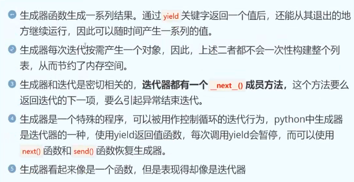
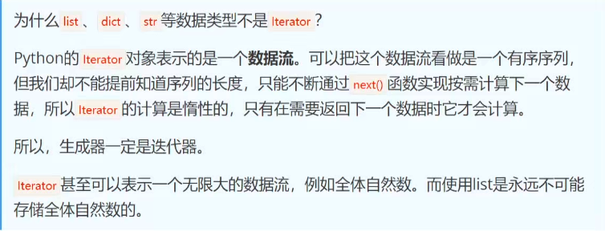

# 函数式编程

 

## 高阶函数和内存分析

### 函数是一等公民

1. 函数式编程最鲜明的特点就是：函数是一等公民(first class)，指的是函数与其它类型数据一样，处于平等地位，可以赋值给其它变量，也可以作为参数传入另一个函数，或者作为其它函数的返回值。
2. 一个函数可以接收另一个函数作为参数，这种函数就称之为高阶函数
3. Python的内建高阶函数有`map`、`reduce`、`filter`、`sorted`

## lambda表达式和匿名函数

```python
lambda arg1,arg2,arg3... : <表达式>
```

​	arg1,arg2,arg3为函数的参数。<表达式>相当于函数体。运算结果是：表达式的运算结果。

## 偏函数(Partial function)

​	偏函数：作用就是把一个函数的某些参数固定住（也就是设置默认值），返回一个新的函数，调用这个新的函数会更简单。

示例：

​	`int()`函数可以把字符串转换为整数，仅传入字符串时，`int()`函数默认按照十进制转换：`print(int("123"))`

​	但是`int()`函数还提供额外的base参数，默认值是10，如果传入base参数，就可以做N进制的转换。

​	假设需要转换大量的二进制字符串，每次都传入`int(x,base=2)`，可以定义一个int2()函数，默认把base=2传进去，代码如下：

```
def int2(x,base=2):
	return int(x,base)
print(int2("1000")) #8
print(int2("111"))  #7
```

`functool.partial`就是帮助我们创建一个偏函数，不需要我们自己定义`int2()`，可以直接使用。

```
int2 = functools.partial(int,base = 2)
print(int2("1010")) #10
print(int2("1011")) #11
print(int2("1010",base = 10)) 
```

## 闭包closure


​	通常，函数作用域是独立、封闭的，外部的执行环境是访问不了的，但是闭包具有这个能力和权限。

​	闭包是一个函数，这个函数可以访问到另一个函数的作用域。

**函数和自由变量的总和，就是一个闭包**

### 闭包的特点

1. 存在内外层函数嵌套的情况
2. 内层函数引用了外层函数的变量或者参数（自由变量）
3. 外层函数把内层这个函数本身作为返回值进行返回，而不是返回内层函数产生的某个值。

```
def outer():
    a = 1
    def inner():
        nonlocal a # 在内层函数中，声明外层使用的局部变量
        print("a:",a)
        a += 1

    return inner
inn = outer()
inn()
inn()

# a: 1
# a: 2
```

### 闭包的作用

1. 隐藏变量，避免全局污染
2. 可以读取函数内部的变量

### 闭包的缺点

1. 变量可能不会被垃圾回收机制回收，造成内存消耗
2. 不恰当的使用闭包可能会造成内存泄漏

## 闭包和自由变量

```
# 通过自由变量实现自增，且不污染全局变量
a = 10
print("---------------")
def add():
    a = 10
    def increment():
        nonlocal a
        a += 1
        print("a:",a)
    return increment

def print_ten():
    if a == 10:
        print("a == 10")
    else:
        print("a != 10")
a1 = add()
a1()
a1()
a1()
a1()
print_ten()

# ---------------
# a: 11
# a: 12
# a: 13
# a: 14
# 10
# a == 10
```

### 结论

- **自由变量的作用**：`add()` 中的 `a` 被内部函数 `increment()` 引用，成为「自由变量」，其状态被闭包保留，实现了自增功能。
- **作用域隔离**：`add()` 内部的 `a` 与全局 `a` 完全独立（同名但不同空间），`increment()` 修改的是 `add()` 中的 `a`，不会影响全局 `a`。
- `nonlocal` 的作用：明确告诉 Python，`increment()` 中的 `a` 来自外层函数 `add()`，而非全局变量或自身局部变量，确保了变量修改的正确性。

## 闭包为函数添加功能

```
# 装饰器基础
# 不修改源代码，给代码添加新的功能

def outfunc(func):

    def infunc():
        print("日志记录,start")
        func()
        print("日志记录,end")

    return infunc

def func1():
    print("使用功能1")
def func2():
    print("使用功能2")
func1 = outfunc(func1)
func1()
func2 = outfunc(func2)
func2()
```

## map函数

​	`map()`函数接收两种参数，一种是函数，一种是序列，map将传入的函数一次作用到序列的每个元素，并把结果最为新的list返回。

```
def f(x):
    return x**2
list1 = [1,2,3,4,5]
L = map(f,list1)
print(list(L))

L = map(lambda n:n**2 ,list1)
print(list(L))

def f2(x,y):
    return x+y
L = map(f2,[1,2,3],[10,20,30,40])
print(list(L))

L = map(lambda x,y : x+y, [1,2,3], [10,20,30,40])
print(list(L))
```

## reduce函数


​	reduce函数位于`functools`模块，作用时把一个函数作用在一个序列[x1,x2,x3...]上，这个函数必须接收两个参数，reduce把结果继续和序列的下一个元素做累积计算，其效果就是：

`reduce(f,[x1,x2,x3,x4]) = f(f(f(x1,x2),x3),x4)`

```
from functools import reduce
import time

# reduce实现累加
def add(x,y):
    return x+y
sum = reduce(add,[1,2,3,4,5])
print(sum)

#---------------------------------------

t1 = time.time()
# reduce实现阶乘


sum = reduce(lambda x,y:x*y,range(1,101))
print(sum)
t2 = time.time()
print(f"reduce阶乘花费时间:",t2-t1)
#reduce阶乘花费时间: 1.2159347534179688e-05
#---------------------------------------

t3 = time.time()
def func1(x):
    if x == 0:
        return 1
    else:
        return x*func1(x-1)
sum = func1(100)
print(sum)
t4 = time.time()

print(f"普通阶乘花费时间:",t4-t3)
#普通阶乘花费时间: 1.7881393432617188e-05
```


## filter函数


​	内置函数`filter()`用于过滤序列。filter()把传入的函数依次作用于每个元素，然后根据返回值是True还是False，决定保留还是丢弃该元素。

```
# 删除list的偶数，保留奇数
def is_odd(n):
    return n % 2 == 1
L = filter(is_odd,[1,2,3,4])
print(list(L)) # [1, 3]

L = filter(lambda n:n%2==1,[1,2,3,4,5])
print(list(L)) # [1, 3, 5]

# 删除空字符串
def not_empty(s):
    return s and s.strip()
L = filter(not_empty,["A",""," ",None,"ABC"])
print(list(L)) # ['A', 'ABC']

L = filter(lambda s:(s and s.strip()) , ["A",""," ",None,"ABC"])
print(list(L)) # ['A', 'ABC']
```

## sorted函数

​	sorted()函数常见用法：

```
# 对list进行升序排序
sorted1 = sorted([1,-2,6,-5,10,5])
print("升序排序",sorted1)

# sorted函数实现自定义排序
sorted2 = sorted([1,3,6,-20,-70],key=abs)
print("按绝对值大小升序排序",sorted2)

sorted3 = sorted([1,3,6,-20,-70],key=abs,reverse=True)
print("按绝对值大小降序排序",sorted3)

# 按照ASCII排序
sorted4 = sorted(["ABC","abc","B","D"])
print("字符串排序",sorted4)

# 按照忽略大小写排序
sorted5 = sorted(["ABC","abc","B","D"],key=str.lower)
print("忽略字符串大小写排序",sorted5)

# 按照忽略大小写反向排序
sorted6 = sorted(["ABC","abc","B","D"],key=str.lower,reverse=True)
print("忽略字符串大小写排序",sorted6)
```

​	`sorted`函数也是一个高阶函数，还可以接收一个`key`函数实现自定义的排序

```
from functools import cmp_to_key


class Student:
    def __init__(self,name,age):
        self.name = name
        self.age = age

# 自定义排序方法
def custom_sorted(stu1,stu2):
    if stu1.age < stu2.age:
        return -1
    if stu1.age > stu2.age:
        return 1
    return 0

stu1 = Student('a',20)
stu2 = Student('b',30)
stu3 = Student('c',40)
stu4 = Student('d',50)

# 匿名函数指定key的排序规则
student_list = sorted([stu4,stu3,stu2,stu1],key=lambda x: x.age)
for stu in student_list:
    print(f"学生姓名:{stu.name},学生年龄:{stu.age}")

print("---------------------------------------------")

student_list = sorted([stu4,stu3,stu2,stu1],key=lambda x: x.age,reverse=True)
for stu in student_list:
    print(f"学生姓名:{stu.name},学生年龄:{stu.age}")

print("---------------------------------------------")
# 自定义排序规则
student_list = sorted([stu4,stu3,stu2,stu1],key=cmp_to_key(custom_sorted))
for stu in student_list:
    print(f"学生姓名:{stu.name},学生年龄:{stu.age}")

```

# 装饰器

## 

## 概念

​	装饰器来自`Decorator`的直译，装饰器本质上就是一个Python函数（其实就是闭包），它可以让其它函数在不需要做任何代码变动的前提下增加额外的功能，装饰器的返回值也是一个函数对象。

​	应用场景如下：插入日志、性能测试、事务处理、缓存、权限校验等

## 装饰器解决日志问题（三个版本）

**v1.0版本**

```python
def fun1():
	print("使用功能1")
	print("日志记录")
def fun2():
	print("使用功能2")
	print("日志记录")
```

**v2.0版本**

```python
def writelog():
	print("日志记录")
def func1():
	print("使用功能1")
	writelog()
def func2():
	print("使用功能2")
	writelog()
```

**v3.0版本**

```python
# 第一个装饰器
def writelog():
    print("日志记录")

def outer_func(function):
    def inner_func(*args,**kwargs):
        function(*args,**kwargs)
        writelog()
    return inner_func

@outer_func  # 等价于 func1 = outer_func(func1)
def func1():
    print("使用功能1")

@outer_func  # 等价于 func2 = outer_func(func2)
def func2(a,b):
    print("使用功能2",a,b)

#func1 = outer_func(func1)
#func2 = outer_func(func2)
func1()
func2(100,200)

```

## 多个装饰器

​	有时需要多个装饰器修饰一个函数，例如：增加日志功能、增加执行效率测试功能

​	装饰器函数的执行顺序分为（被装饰函数）定义阶段和（被装饰函数）执行阶段，装饰器函数在被装饰函数定义好后立即执行。

- 在函数定义阶段：执行顺序是从最靠近函数的装饰器开始，自内而外的执行
- 在函数执行阶段：执行顺序由外而内，一层层执行

```python
@mylog
@cost_time
"""
函数定义阶段:相当于fun2 = cost_time(fun2)
                fun2 = mylog(fun2) 
           也相当于:fun2 = mylog(cost_time(fun2))

执行调用阶段:先执行mylog的内部函数，再执行cost_time的内部函数
"""
def fun2():
    pass
fun2()
```

```python
# @mylog
# @cost_time
# """
# 函数定义阶段:相当于fun2 = cost_time(fun2)
#                 fun2 = mylog(fun2)
#            也相当于:fun2 = mylog(cost_time(fun2))
#
# 执行调用阶段:先执行mylog的内部函数，再执行cost_time的内部函数
# """
# def fun2():
#     pass
# fun2()


import time

def mylog(func):
    print("mylog,start")

    def innerfunc():
        print("日志记录start")
        func()
        print("日志记录end")

    print("mylog,end")

    return innerfunc

def cost_time(func):
    print("cost_time start")
    def innerfunc():
        print("开始计时")
        t1 = time.time()
        func()
        t2 = time.time()
        print("耗费时间:",t2-t1)

    print("cost_time end")
    return innerfunc

@mylog       # fun2~~ = mylog(fun2~)
@cost_time   # fun2~ = cost_time(fun2)
def fun2():
    print("fun2,start")
    time.sleep(3)
    print("fun2,end")
"""
装饰器定义阶段结束后，fun2 = mylog(cost_time(fun2))
执行时，依次执行mylog和cost_time的内部函数(innerfunc,即封装过fun2的函数)
"""


fun2()
# cost_time start
# cost_time end
# mylog,start
# mylog,end
# 日志记录start
# 开始计时
# fun2,start
# fun2,end
# 耗费时间: 3.002222776412964
# 日志记录end
```

## 带参数的装饰器

**当执行 `fun2()` 时，实际执行的是 “被装饰后的内层函数 `infunc`”，步骤如下：**

1. **调用 `@mylog("文件")`**：
    - 先执行外层函数 `mylog("文件")`，传入参数 `type="文件"`，返回中层函数 `decorator`（此时 `decorator` 已 “记住”`type="文件"`）；
    - 再用 `decorator` 装饰 `fun2`：`decorator(fun2)` 执行，返回内层函数 `infunc`（此时 `infunc` 已 “记住”`func=fun2` 和 `type="文件"`）；
    - 最终，`fun2` 被重新赋值为 `infunc`（即：现在调用 `fun2()` 等价于调用 `infunc()`）。
2. **执行 `fun2()`（即 `infunc()`）**：
    - 第一步：执行日志逻辑 —— 判断 `type="文件"`，打印 `“文件中：日志记录”`；
    - 第二步：执行原目标函数 —— 调用 `func(*args, **kwargs)`（即 `fun2()`），打印 `“使用功能2”`；
    - 第三步：返回原函数的结果（这里 `fun2` 无返回值，所以最终无额外返回）。

```python
def mylog(type):
    def decorator(func):
        def infunc(*args,**kwargs):
            if type == "文件":
                print("文件中：日志记录")
            else:
                print("控制台：日志记录")
            return func(*args,**kwargs)
        return infunc
    return decorator


@mylog("文件")
def fun2():
    print("使用功能2")

if __name__ == '__main__':
    fun2()

```

## 内置装饰器

### property装饰器

​	用于类中的函数，可以像访问属性一样获取一个函数的返回值

```python
class User:
	def __init__(self,name,month_salary):
		self.name = name
		self.month_salary = month_salary
	@property
	def year_salary(self):
		return int(month_salary)*12
if __name__ == "__main__":
	u1 = User("Jack",10000)
	print(u1.year_salary)
```


### staticmethod装饰器

​	用于类中的方法，这表示该方法会是一个静态方法，意味着该方法可以直接被调用而无需实例化，它没有self参数，也无法访问实例化后的对象。

```python
class Person:
	@staticmethod
	def say_hello():
		print("hello world")
if __name__ == "__main__":
	Person.say_hello()
```

### classmethod装饰器

​	这是一个类方法，该方法无需实例化，没有self参数。相对于`staticmethod`的区别是**它会接收一个指向类本身的cls参数**

```
class Person:
	@classmethod
	def say_hello(cls):
		print(f"我是{cls.__name__}")
		print("hello world")
if __name__ == "__main__":
	Person.say_hello()
# 我是Person
# hello world
```

## 类装饰器

​	类能实现装饰器的功能，是由于当调用一个对象时，实际上调用的是它的`__call__`方法。

```
class Demo:
    def __call__(self, *args, **kwargs):
        print("我是Demo")
d1 = Demo()
d1() # 直接调用对象，实际上是调用了它的__call__()方法
```

```
# 类装饰器

class MylogDecorator():
    def __init__(self,func):
        # 初始化方法：接收被装饰的函数作为参数
        self.func = func
    def __call__(self, *args, **kwargs):
        # 调用方法：当装饰后的函数被调用时，会执行此方法
        print("日志记录...")
        return self.func(*args,**kwargs) # 调用原始函数，并返回其结果
@MylogDecorator
# fun2 = MylogDecorator(fun2)
# 此时fun2已不再是原始函数，而是MylogDecorator类的一个实例。
# 当执行 fun2() 时，由于 fun2 是 MylogDecorator 的实例，
# 且类定义了 __call__ 方法，因此会触发 __call__ 方法的执行
def fun2():
    print("功能2...")

if __name__ == '__main__':
    fun2()
```

## 缓存装饰器和计时装饰器综合练习

```
import time
def cost_time(func):
    def infunc(*args,**kwargs):
        print("开始计时")
        t1 = time.time()
        result = func(*args,**kwargs)
        t2 = time.time()
        print("耗费时间:",t2-t1)
        return result
    return infunc

class CacheDecorator():
    __cache = {}
    def __init__(self,func):
        self.func = func
    def __call__(self, *args, **kwargs):
        # 如果缓存中有对应的方法名，则直接返回对应的值
        if self.func.__name__ in CacheDecorator.__cache:
            return CacheDecorator.__cache[self.func.__name__]
        # 否则就进行计算，并将结果缓存
        else:
            result = self.func(*args,**kwargs)
            CacheDecorator.__cache[self.func.__name__] = result
            return result
@cost_time           #  func1_long_time~~ = cost_time(func1_long_time~)
@CacheDecorator      #  func1_long_time~ = CacheDecorator(func1_long_time)

# func1_long_time = cost_time(CacheDecorator(func1_long_time))

def func1_long_time():
    """模拟耗时较长，每次执行返回结果都一样的情况"""
    print("start func1")
    time.sleep(1)
    print("end func1")
    return 999
if __name__ == '__main__':
    r1 = func1_long_time()
    r2 = func1_long_time()
    print(r1)
    print(r2)

```

# 生成器

## 生成器定义

​	在Python中，一边循环一遍计算的机制称为**生成器:generator**

生成器特点：



## 为什么要有生成器

​	列表所有数据都在内存中，如果有海量数据的话将会非常耗内存。如果列表元素可以按照某种算法推导出来，那么我们就可以在循环的过程中不断推算出后续的元素，这样就不必创建完整的list，从而节省大量的内存空间。

​	**简单来说就是**

- 时间换空间！想要得到庞大的数据，又想让它占用空间少，就用生成器。
- 延迟计算！需要数据的时候，再去计算

## 创建生成器的方式一(生成器表达式)

​	将列表推导式的`[]`改成`()`，就创建了一个生成器(generator):

```
L = [ x*x for x in range(10)]
print(L)
g = ( x*x for x in range(10))
print(g)
# [0, 1, 4, 9, 16, 25, 36, 49, 64, 81]
# <generator object <genexpr> at 0x1057ab6f0>
```

​	创建`L`和`g`的区别仅在于最外层的`[]`和`()`，`L`是一个`list`，而`g`是一个`generator`。

## 创建生成器的方式二(生成器函数)

- 如果一个函数中包含`yield`关键字，那么这个函数就不再是一个普通函数，调用函数就是创建了一个生成器(generator)对象。
- 生成器函数其实就是利用关键字`yield`一次性返回一个结果

```
'''
1.函数有了yield之后，调用它就会生成一个生成器
2.yield作用：程序挂起，返回相应的值，下次从下一个语句开始执行。
'''
def test():
    print("start")
    i = 0
    while i<3:
        print(f"i:{i}")
        yield i
        #print(f"i:{i}")
        i += 1
    print("end")
    return "done"

if __name__ == '__main__':
    a = test()
    print(a)
    a.__next__()
    a.__next__()
    a.__next__()
    #a.__next__()
```

# 迭代器

## 概念

1. 迭代是Python访问集合元素的一种方式 
2. 迭代器是一个可以记住遍历位置的对象
3. 跌打器对象从集合的第一个元素开始访问，直到所有的元素被访问完结束
4. 迭代器只能往前不能后退
5. 迭代器有两个基本的方法：`iter()`和`next()`

## 可迭代对象和迭代器的区别

1. 一个实现了`iter`方法的对象，称为可迭代对象Iterable
2. 一个实现了`next`方法并且是可迭代的对象，称为迭代器Iterator

​	**即：实现了`iter`方法和`next`方法的对象就是迭代器**

**生成器都是`Iterator`对象，但`list`、`dict`、`str`虽然是`Iterable(可迭代对象)`，但不是`Iterator(迭代器)`**

```
# Python3.6之前不加.abc
from collections.abc import Iterator
from collections.abc import Iterable
# 判断list类型
a = isinstance([],Iterable)
print(a)

b = isinstance([],Iterator)
print(b)
```

​	使用`iter()`函数，可以讲`list`、`dict`、`str`等`Iterable`变成`Iterator`

```
c = isinstance(iter([]),Iterator)
print(c)
# True
d = isinstance(iter([]),Iterator)
print(d)
# True
```




## for循环的本质

​	Python3的`for`循环本质上就是通过不断调用`next()`函数实现的

```python
for x in [1,2,3,4,5]:
	pass
# 本质上是迭代器
# 首先获得Iterator对象
it = iter([1,2,3,4,5])
while True:
	try:
		# 获得下一个值
		x = next(it)
	except StopIteration:
		# 遇到StopIteration就退出循环
		break
```

## 创建一个迭代器

​	一个类作为一个迭代器使用需要在类中实现两个方法`__iter__()`与`__next__()`

1. `__iter__()`方法返回一个特殊的迭代器对象，这个迭代器对象实现了`__next__()`方法并通过StopIteration异常标识迭代的完成。
2. `__next__()`方法会返回下一个迭代器对象。

```python
# 创建一个依次返回10,20,30,...这样数字的迭代器

class MyNumbers:
    def __iter__(self):
        self.name = 10
        return self

    def __next__(self):
        while True:
            x = self.name
            self.name += 10
            return x
        else:
            raise StopIteration
myclass = MyNumbers()
myiter = iter(myclass)
print(next(myiter))
print(next(myiter))
print(next(myiter))
print(next(myiter))

```

# 动态添加属性和方法

​	动态编程语言是高级程序设计语言的一个类别，它指的是在运行时可以改变其结构的语言：例如新的函数、对象、甚至引进新的代码。已有的函数可以发生结构上的改变或者删除。

## 给对象添加属性和方法

```
import types


class Person():
    def __init__(self,name,age):
        self.name = name
        self.age = age

p1 = Person("A",20)
p2 = Person("B",30)

# 动态的给对象添加属性和方法
p1.score = 100
print(p1.score)

def run(self):
    print(f"{self.name},running")

# 将p1和run函数进行绑定
p1.run = types.MethodType(run,p1)
p1.run()

```

## 给类添加属性和方法

```
class Person:
    pass
@staticmethod
def staticfunc():
    print("this is a static method")
Person.staticmethod = staticfunc
Person.staticmethod()

@classmethod
def classfunc(cls):
    print("this is a class method ")
    print(f"i am {cls.__name__}")
Person.classmethod = classfunc
Person.classmethod()


# 添加属性
Person.score = 100
print(Person.score)
```

## slots限制成员属性和方法

1. `__slots__`对动态添加成员变量、成员方法有限制。对于动态添加类属性、类方法没有限制。
2. `__slots__`只对本类有限制，不限制子类
3. `__slots__` 的其他特性
    - **节省内存**：默认情况下，Python 类实例会用字典（`__dict__`）存储属性，而 `__slots__` 会用固定大小的数组替代字典，减少内存占用（尤其适合创建大量实例的场景）。
    - **继承影响**：如果子类未定义 `__slots__`，则子类实例可以拥有 `__dict__`，从而添加任意属性；如果子类也定义了 `__slots__`，则子类实例的允许属性是自身 `__slots__` 与父类 `__slots__` 的并集。
    - **方法不受影响**：`__slots__` 只限制属性，不影响类的方法（如 `eat()` 可以正常调用）。

```
class Person:
    __slots__={"name","age"} # 限制实例只能有 name 和 age 属性
    def __init__(self,name,age):
        self.name = name
        self.age = age
    def eat(self):
        print("吃饭")
if __name__ == '__main__':
    p1 = Person("Jack",18)
    # p1.gender = "man"
    p1.eat()
```


