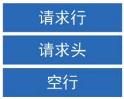
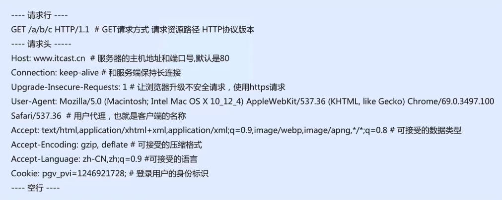
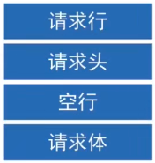
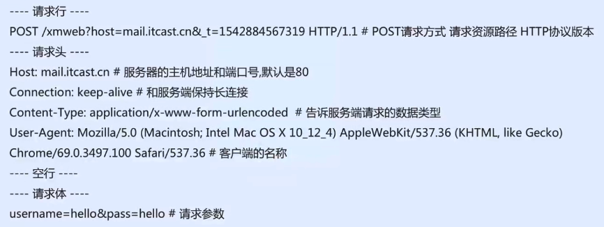
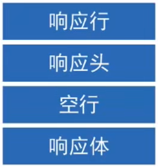
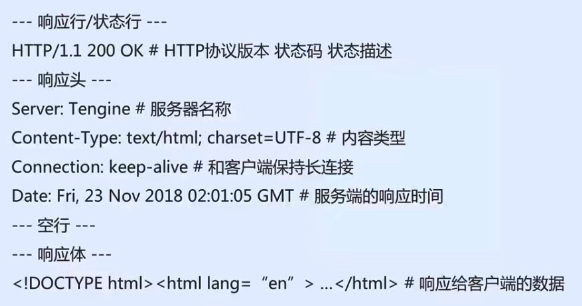
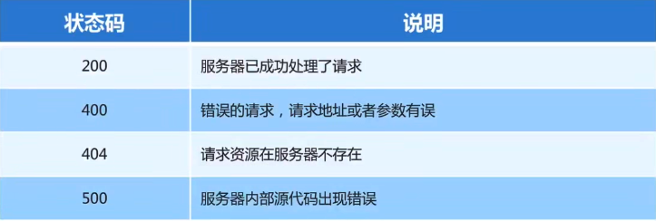
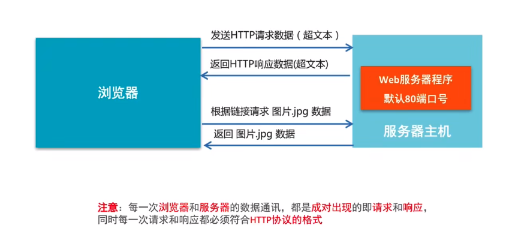

# HTTP协议

## 1.网址

### 1.1 网址的概念

网址又称为URL（Uniform Resource Locator），即统一资源定位符，通俗理解就是网络资源地址

### 1.2 URL的组成

https://baike.baidu.com/item/Python/407313

**协议部分：http://、https://、ftp://**

**域名：IP地址的别名，它是用点进行分割使用英文字母和数字组成的名字，使用域名的目的是方便记住某台主机的IP地址。**

**资源路径部分：/item/Python/407313**

**查询参数部分：?page=1&count=10**

## 2.HTTP协议

### 2.1 HTTP协议介绍

​	==通过HTTP协议规定浏览器和Web服务器之间通讯数据的格式。==

​	HTTP协议的全称是（HyperText Transfer Protocol），即超文本传输协议。超文本是指**在文本的基础上还包括非文本数据，例如图片、音乐、视频等**，这些非文本数据会使用链接进行加载显示。

​	传输HTTP协议格式的数据是基于**TCP传输协议**的，在发送数据之前需要先建立连接。TCP协议传输是用来保证网络中传输的数据的安全性，HTTP协议是用来规定这些数据的具体格式。

**注意：**

==HTTP协议规定的数据格式是浏览器和Web服务器通信数据的格式，也就是说浏览器和Web服务器通信需要使用HTTP协议。==

### 2.2 浏览器访问Web服务器的流程

1. **通过DNS将域名解析成IP地址**
2. **浏览器获取到IP地址**
3. **浏览器通过IP地址与服务器主机中的Web服务器程序建立连接**
4. **发送HTTP请求数据到Web服务器**
5. **Web服务器根据请求获取资源**
6. **服务器主机将查找到的数据发送到Web服务器程序**
7. **Web服务器程序将数据以HTTP格式返回给浏览器**

## 3.HTTP请求报文

### 3.1 HTTP最常见的请求报文

- GET方式的请求报文：**获取Web服务器数据**
- POST方式的请求报文：**向Web服务器提交数据**

### 3.2 HTTP GET请求报文分析

GET报文由三部分组成：

### 3.3 HTTP POST请求报文分析

POST报文由四部分组成：

## 4.HTTP响应报文

### 4.1 HTTP响应报文分析

### 4.2 HTTP状态码

​	状态码适用于表示服务器响应状态的3位数字码

## 5.HTTP协议的通信过程

