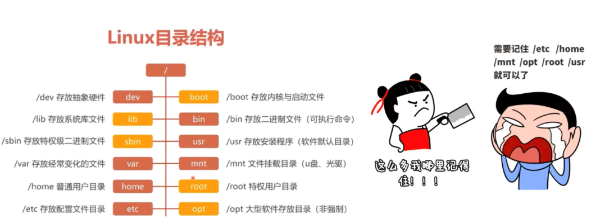
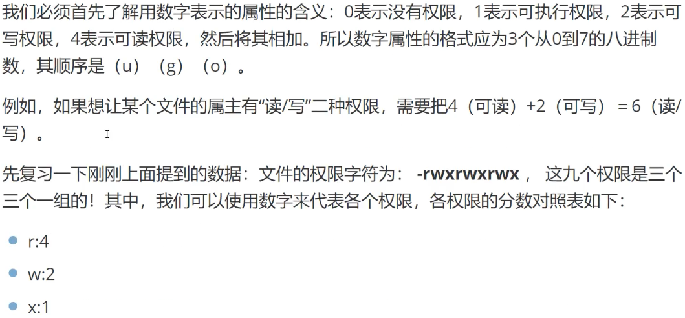

# Linux的三种网络配置


**背景**

A是本机，A1、A2是虚拟机，B是外部联网的设备

## 桥接模式


**==bridge（桥接模式）：A可以与A1、A2互通，A1、A2可以与B互通，B也可以与A1、A2互通==**

## NAT模式


> VMware NetWork Adapter VMnet8的作用是为了实现虚拟机和主机之间的通信

**==Nat（网络地址转换）：A可以与A1、A2互通，A1、A2->B互通，B->A1、A2不互通==**

## Host-only模式


> 虚拟机不能与外部设备连通

**==host-only（主机模式）：A可以与A1、A2互通，A1、A2->B不互通，B->A1、A2不互通==**


# Linux系统目录结构



# Linux用户和用户组

## 用户管理概述

Linux是一个多用户、多任务的操作系统，支持同一时间不同用户的访问


## 用户账号和用户组

**用户概念**

> Linux是真正意义上的多用户操作系统，我们可以在Linux系统中创建若干用户（user）

**用户组概念**

> 用户组（group）就是具有相同特征的用户（user）的集合体；有时需要让多个用户具有相同的权限，可以把用户都定义在同一用户组，通过修改文件或目录的权限，可以让用户组具有一定的操作权限，这样用户组下的用户对该文件或目录都具有相同的权限。

## Linux用户和组的关系


# Linux用户管理


## 添加用户 *useradd*

**语法：**

```shell
useradd (选项) (参数)
```


**参数**

==用户名：要创建的用户名==

示例：


## 修改用户*usermod*

**语法：**

```she
usermod (选项) (参数)
```


## 用户账号口令管理*passwd*

passwd命令用于修改用户密码、过期时间、认证信息等

**语法：**

```shell
passwd (选项) (参数)
```


## 删除用户 *userdel*

**语法：**

```shell
userdel [选项] 用户名
```


# Linux用户组管理


## 添加新组*groupadd*

**语法：**

```shell
groupadd (选项) (参数)
```


## 修改群组*groupmod*

**语法：**

```shell
groupmod (选项) (组名)
```


## 删除群组*groupdel*

**语法：**

```shell
groupdel groupname
```


# Linux超级用户和伪用户


## 用户身份切换

为了完成系统管理任务，必须使用超级权限。

**su**

> su命令就是切换用户的工具

**语法**

```shell
su [-fmp] [-c command] [-s shell] [--help] [--version] [-]
[user [ARG]]
```


------

**sudo**

sudo的全称为：`super user do`，将超级用户的权限授予普通用户

**语法：**

```shell
sudo [参数] 命令名称
```

------

**编辑配置文件命令：visudo**来配置用户权限


# Linux文件基本属性

> Linux系统中，一切都是文件

## 显示文件属性


### **ls命令**

ls(ist files)命令用于显示指定工作目录下的内容，包括当前工作目录下的文件以及子目录。

**语法：**

```shell
ls [参数]
```


## 文件与目录操作

Linux可以支持长达256个字符的文件名称，且文件名是区分大小写的

### Linux文件类型


## 文件权限

**文件权限是指对文件的访问权限，包括对文件的读、写、删除、执行操作。**Linux是一个多用户操作系统，它支持多个用户同时登陆和工作，因此Linux将一个文件或者目录与一个用户和组联系起来。


# Linux权限字和权限操作


> 1. chgrp：改变文件所属群组；
> 2. chown：改变文件所有人；
> 3. chmod：改变文件的属性；

## 改变所属群组chgrp

**语法：**

```shell
chgrp [-R] 属组名 文件名
```


## 改变文件属性chmod

Linux文件属性有两种设置方式，一种是数字，一种是符号。

Linux文件的基本权限有九个，分别是**owner/group/others(拥有者/组/其他)**三种身份各自拥有自己的**read/write/execute**权限。

### 文字设定法

- user：用户
- group：组
- others：其他

使用**u,g,o**来代表三种身份的权限，**a**代表**all**，即全部的身份，读、写、执行的权限可以写成**r,w,x**。


**语法：**

```shell
chmod [who] [+|-|=] [mode]
```


### 数字设定法




 

## 改变文件拥有者chown

改变文件拥有者，也可以同时改变文件拥有组

**语法：**

```shell
chown [-R] 文件所有者 文件名
chown [-R] 文件所有者:文件拥有组 文件名
```

> *-R*选项用于递归地更改目录及其子目录和文件的所有者和所属组。


# Linux路径

Linux的路径是从/开始的

## 绝对路径

从/开始的路径，/表示根目录

## 相对路径

以.或者..开始的路径，.表示用户操作所处的位置，..表示上级目录

～表示当前用户的home目录


# Linux处理文件目录的常用命令


## pwd(显示目前所在的目录)

pwd是**Print Working Directory **的缩写，也就是显示目前所在目录的命令。

## mkdir(创建新目录)

**参数：**

-p：可以递归创建多层目录

## rmdir(删除目录)

**参数：**

-p：可以递归删除多层目录

## cp(复制文件或目录)

**语法：**

```shell
cp  文件 目标目录
```

**参数：**

-r：递归复制

## rm(删除文件或者目录)

**语法：**

```shell
rm 文件或目录
```

**参数：**

- -f：强制删除(force)，忽略不存在的文件，不会出现警告信息
- -r：递归删除


## mv(移动文件与目录，或者修改名称)

```shell
mv [options] source dest
mv [options] source... directory
```


# Linux文件编辑工具vi/vim

## vim的使用


# Linux文件内容查看命令

## cat(显示文件内容)

从第一行开始显示文件内容

## tac(反向显示文件内容)

从最后一行开始显示文件内容

## nl(查看文件并显示行号)

## more(逐页显示文件内容)


## less(往前翻页)


## head(查看前几行)

取出文件的前几行

**语法：**

```shell
head [-n number] 文件
```

- -n：后面接数字，代表要查看前面几行的文件


## tail(查看后几行)

取出文件的后面几行

**语法：**

```shell
tail [-n number] 文件
```

- -n：后面接数字，代表要查看后面几行的文件

# Linux打包压缩与搜索命令

## tar命令

**语法：**

```shell
tar [选项][文件]
```

 

1. 压缩：

    ```shell
    tar -zcvf test.tar.gz a.info
    ```

2. 解压：

    ```shell
    tar -zxvf test.tar.gz
    ```

    

## gzip/gunzip压缩

**语法：**

```shell
gzip+文件 (功能描述：压缩文件，只能将文件压缩为*.gz文件)
gunzip+文件.gz (功能描述：解压缩文件命令)
```


# Linux搜索命令

## grep命令

grep命令用于在文本中执行关键词搜索，并显示匹配的结果

**语法：**

```shell
grep [参数 查找内容 源文件]
```


## find命令

find命令用于按照指定条件来查找文件

**语法：**

```shell
find [查找路径] 寻找条件 操作
```


# Linux常用系统工作命令

## reboot命令

reboot用于重启系统，默认只能由root管理员使用


## poweroff命令

poweroff命令用于关闭系统，默认只能由root管理员使用


## wget命令

wget用于在终端中下载网络文件

**语法：**

```shell
wget [参数] 下载地址
```


# Linux管道符、重定向和环境变量


## 输入输出重定向


### 输入重定向作用表

| 符号              | 作用                                               |
| ----------------- | -------------------------------------------------- |
| 命令 < 文件       | 将文件作为命令的标准输入                           |
| 命令 <<分界符     | 从标准输入中读入，直到遇见分界符才停止             |
| 命令 <文件1>文件2 | 将文件1以作为命令的标准输入并将标准输出输出到文件2 |

### 输出重定向作用表

| 符号          | 作用                               |
| ------------- | ---------------------------------- |
| 命令 > 文件   | 将标准输出重定向到一个文件中(覆盖) |
| 命令2 > 文件  | 将错误输出重定向到一个文件中(覆盖) |
| 命令 >> 文件  | 将标准输出重定向到一个文件中(追加) |
| 命令2 >> 文件 | 将错误输出重定向到一个文件中(追加) |

| 命令格式              | 作用                                 | 适用场景                           |
| --------------------- | ------------------------------------ | ---------------------------------- |
| `命令 >> 文件 2>&1`   | 前台运行，所有输出追加到文件         | 需要捕获完整输出，且等待命令执行完 |
| `命令 >> 文件 &`      | 后台运行，仅标准输出追加到文件       | 无需等待执行完，只需记录正常输出   |
| `命令 >> 文件 2>&1 &` | 后台运行，所有输出追加到文件（推荐） | 后台执行，需完整记录输出和错误     |

## 管道命令符


管道命令符执行格式为`命令A ｜ 命令B`，作用是**将前一个命令原本要输出到屏幕的数据当作是后一个命令的输入**

**示例1：**

```shell
grep "/sbin/nologin" /etc/passwd # 找出被限制登录的用户
wc -l # 统计文本行数
```

**示例2:**

```shell
ls -l /etc | more #以翻页模式查看/etc目录下的文件信息
```


## 命令行通配符

假设目标路径为 `/data/docs/report`（可代表任何文件 / 目录前缀），三种命令的含义如下：

### 基本命令格式

| 命令格式                    | 通配符规则                   | 功能与示例（以 `/data/docs/report` 为例）                    |
| --------------------------- | ---------------------------- | ------------------------------------------------------------ |
| `ll /data/docs/report*`     | `*` 匹配任意长度字符（含空） | 匹配所有以 `report` 开头的文件 / 目录，无论后续字符多少： 如 `report.txt`、`report_v1.pdf`、`report_2023/`、`report`（无后缀）。 |
| `ll /data/docs/report?`     | `?` 匹配恰好 1 个任意字符    | 匹配以 `report` 开头且后续仅 1 个字符的文件 / 目录： 如 `report1`、`reportA`、`report.`（后缀为 1 个点）。 不匹配：`report`（无后续字符）、`report12`（后续 2 个字符）。 |
| `ll /data/docs/report[0-9]` | `[]` 匹配指定范围的 1 个字符 | 需在 `[]` 中指定字符范围（如 `[0-9]` 数字、`[a-z]` 小写字母），仅匹配范围内的单字符后缀： 如 `report[0-9]` 匹配 `report3`、`report9`； `report[a-c]` 匹配 `reporta`、`reportb`。 |

### 核心规律（适用于任何路径）

1. **`\*` 是 “模糊匹配”**：尽可能多地匹配以指定前缀开头的所有内容，适合批量查看某类文件。
    例：`ll /etc/conf*` 可列出 `/etc` 下所有以 `conf` 开头的配置文件（`conf.d/`、`conflict.conf` 等）。
2. **`?` 是 “精确单字符匹配”**：严格限制后续只有 1 个字符，适合匹配固定格式的短命名文件。
    例：`ll /var/log/log?` 可匹配 `log1`、`logA`，但不匹配 `log` 或 `log10`。
3. **`[]` 是 “定向范围匹配”**：只匹配指定范围内的字符，适合精准筛选特定规则的文件。
    例：`ll ~/photo/img_[0-5].jpg` 仅匹配 `img_0.jpg` 到 `img_5.jpg`。

### 总结

这三种通配符的核心作用是**按模式筛选文件**，与具体路径无关：


- `*` 用于 “所有相关文件”，
- `?` 用于 “单字符后缀文件”，
- `[]` 用于 “指定范围内的单字符后缀文件”。


## 环境变量

在Linux系统中，环境变量按照其作用范围的不同可以分为系统级环境变量和用户级环境变量

- 系统级环境变量：每一个登陆到系统的用户都能读取到系统级的环境变量
- 用户级环境变量：只能由当前登陆的用户读取的环境变量


### 系统级

**/etc/profile**

系统启动后第一个用户登录时运行，并从/etc/profile.d目录的配置文件中搜集shell的配置，使用该文件配置的环境变量将应用于登陆到系统的每一个用户。

### 用户级

**~/.profile**

当用户登录时，每个用户都可以使用该文件来配置专属于自己使用的shell信息。


# Linux磁盘管理

## fdisk

创建和维护分区表

**语法：**

```shell
fdisk [必要参数][选择参数]
```

**必要参数：**

- -l 列出素所有分区表
- -u 与 **-l** 搭配使用，显示分区数目

**选择参数：**

- -s<分区编号> 指定分区
- -v 版本信息

**菜单操作说明**

- m ：显示菜单和帮助信息
- a ：活动分区标记/引导分区
- d ：删除分区
- l ：显示分区类型
- n ：新建分区
- p ：显示分区信息
- q ：退出不保存
- t ：设置分区号
- v ：进行分区检查
- w ：保存修改
- x ：扩展应用，高级功能


## df

显示Linux系统中各文件系统的硬盘使用情况

**语法：**

```shell
df [选项][目录或文件名]
```

**参数：**

| 参数                          | 说明                                                     |
| :---------------------------- | :------------------------------------------------------- |
| **`-a`**, `--all`             | 显示所有文件系统，包括虚拟文件系统（如 `proc`, `sysfs`） |
| **`-B`**, `--block-size=SIZE` | 指定显示单位（如 `-BK`=KB，`-BM`=MB，`-BG`=GB）          |
| **`-h`**, `--human-readable`  | 以易读格式显示（自动转换单位：K, M, G, T，基于 1024）    |
| **`-H`**, `--si`              | 类似 `-h`，但以 1000 为换算单位（符合 SI 标准）          |
| **`-i`**, `--inodes`          | 显示 inode 使用情况（而非磁盘空间）                      |
| **`-k`**                      | 以 1KB 为单位显示（默认单位）                            |
| **`-m`**                      | 以 1MB 为单位显示（部分系统支持）                        |
| **`-l`**, `--local`           | 仅显示本地文件系统（排除网络文件系统如 NFS）             |
| **`--no-sync`**               | 获取信息前不调用 `sync`（默认行为）                      |
| **`--sync`**                  | 获取信息前调用 `sync`（确保数据最新）                    |
| **`--total`**                 | 显示总计信息                                             |


## 软硬链接

即Linux系统中的快捷方式

- **硬链接：**可以将它理解为一个指向原始文件inode的指针，系统不为它分配独立的inode和文件，所以硬链接和原始文件其实就是同一个文件，仅仅是名字不同，每添加一个硬链接，该文件的inode连接数就会增加1，只有当inode连接数为0时，才会将文件删除。硬链接不能跨越分区
- **软链接：**仅仅包含所链接文件的路径名，因此能链接目录文件，也可以跨越文件系统，但是当原始文件被删除后，链接文件也会失效，类似于Windows中的快捷方式

## ln命令

ln命令用于创建链接文件

**语法：**

```shell
ln [选项] 目标
```

**参数：**

- -s ：创建软链接

# Linux系统状态检测命令

## ip addr命令

查看网卡配置和网络状态等信息

## uname命令

查看系统内核和系统版本等信息

**参数说明**：

- -a 或--all 　显示全部的信息，包括内核名称、主机名、操作系统版本、处理器类型和硬件架构等。。
- -m 或--machine 　显示处理器类型。
- -n 或--nodename 　显示主机名。
- -r 或--release 　显示内核版本号。
- -s 或--sysname 　显示操作系统名称。
- -v 　显示操作系统的版本。
- --help 　显示帮助。
- --version 　显示版本信息。
- -p 显示处理器类型（与 -m 选项相同）。

## free命令

用于显示当前系统中内存的使用情况

```shell
free -h
```


## last命令

查看系统的登陆记录


## history命令

用于显示历史执行过的命令

**语法：**

```shell
history [-c] # -c 参数会清空所有的命令历史记录
```


## uptime命令

用于查看系统的负载信息


# Linux下的软件安装命令


## 源码安装

## RPM软件包安装


**RPM安装软件的默认路径：**


**常用的RPM软件包命令**


参数说明

- -i：install
- -v：查看更详细的安装信息
- -h：显示安装进度

## Yum

​	Yum可以看作是CS架构的软件，Yum很好的解决了RPM的属性依赖问题。Yum依赖RPM软件包管理器，实现了rpm软件包管理器在功能上的扩展，因此Yum不能脱离RPM而独立运行。


## Apt

apt（Advanced Packaging Tool）是一个在 Debian 和 Ubuntu 中的 Shell 前端软件包管理器。apt 命令提供了查找、安装、升级、删除某一个、一组甚至全部软件包的命令，而且命令简洁而又好记。apt 命令执行需要超级管理员权限(root)。

### apt 语法

```shell
apt [options] [command] [package ...]
```

- **options：**可选，选项包括 -h（帮助），-y（当安装过程提示选择全部为"yes"），-q（不显示安装的过程）等等。
- **command：**要进行的操作。
- **package**：安装的包名。

## apt 常用命令

- 列出所有可更新的软件清单命令：**sudo apt update**

- 升级软件包：**sudo apt upgrade**

    列出可更新的软件包及版本信息：**apt list --upgradable**

    升级软件包，升级前先删除需要更新软件包：**sudo apt full-upgrade**

- 安装指定的软件命令：**sudo apt install <package_name>**

    安装多个软件包：**sudo apt install <package_1> <package_2> <package_3>**

- 更新指定的软件命令：**sudo apt update <package_name>**

- 显示软件包具体信息,例如：版本号，安装大小，依赖关系等等：**sudo apt show <package_name>**

- 删除软件包命令：**sudo apt remove <package_name>**

- 清理不再使用的依赖和库文件: **sudo apt autoremove**

- 移除软件包及配置文件: **sudo apt purge <package_name>**

- 查找软件包命令： **sudo apt search <keyword>**

- 列出所有已安装的包：**apt list --installed**

- 列出所有已安装的包的版本信息：**apt list --all-versions**


# Linux进程管理

## ps

查看系统中所有进程

**语法：**

```shell
ps [options] [--help]
```

**参数：**

- -a：显示所有进程
- -u：用户以及其它详细信息
- -x：显示没有控制终端的进程

## top

查看系统健康状态，加强版的windows任务管理器

**语法：**

```shell
top [-d] | top [-bnp]
```


## htop

互动的进程查看器

## Kill

终止进程，结合ps、pgrep使用

**语法：**

```shell
kill [信号量] 进程ID
```

**信号代码可以省略，常用的信号代码是-9，表示强制终止**


## netstat

监控TCP/IP网络的工具，它可以显示路由表、实际的网络连接以及每一个网络设备接口的状态信息

**语法：**

```shell
netstat -tunlp | grep 端口号
```

- -a 显示所有端口
- -t (tcp) 仅显示tcp相关选项
- -u (udp)仅显示udp相关选项
- -n 拒绝显示别名，能显示数字的全部转化为数字
- -l 仅列出在Listen(监听)的服务状态
- -p 显示建立相关链接的程序名


# Linux系统服务


## Service命令

服务的本质就是进程，但运行在后台且监听某个端口，等待其它程序的请求，因此又称为守护进程。

**语法：**

```shell
service 服务名 [ start | stop | restart | reload | status ]
```

==service命令其实是去/etc/init.d目录下执行相关程序==


## Systemd命令

Linux的启动采用init进程


### **systemctl**

`systemctl`是Systemd的主命令，用户管理系统


### **systemd-analyze**

`systemd-analyze`命令查看启动耗时


### **hostnamectl**

`hostnamectl`命令用于查看当前主机的信息

### **timedatectl**

`timedatectl`命令用于查看当前时区设置


### **Chkconfig**


# Linux系统定时任务

**计划任务主要分为以下两种：**

1. 系统级别的定时任务

    临时文件清理、系统信息采集、日志文件保存

2. 用户级别的定时任务

    定时向互联网同步时间、定时备份系统配置文件、定时备份数据库

## 📋 Cron 时间格式

```shell
* * * * * 命令

分 时 日 月 周 要执行的命令
```

### 分钟 (0-59)

每小时的第几分钟执行

### 小时 (0-23)

每天的第几小时执行

### 日期 (1-31)

每月的第几天执行

### 月份 (1-12)

每年的第几月执行

### 星期 (0-7)

每周的第几天执行
(0和7都表示周日)

### 🎯 特殊字符说明

- \* 表示任意值，匹配所有可能的值
- , 表示列表，如 1,3,5 表示1点、3点、5点
- \- 表示范围，如 1-5 表示1到5
- / 表示间隔，如 */5 表示每5个单位
- ? 用于日期和星期字段，表示不指定值


# Linux网络防火墙


https://www.cnblogs.com/Thenext/p/18801599


# Linux内核机制


https://zhuanlan.zhihu.com/p/26379813


