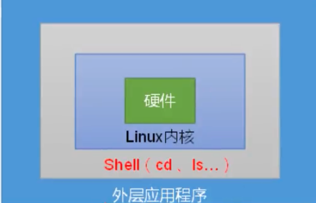
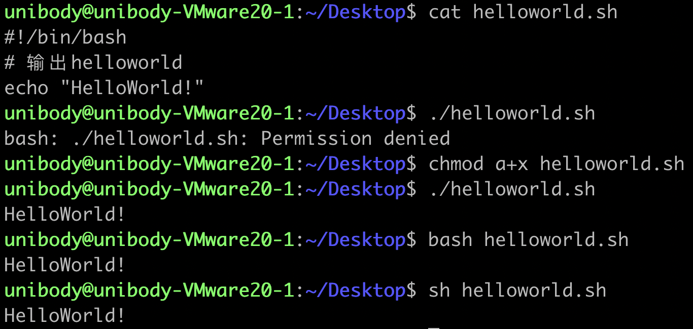

# Shell编程

## Shell介绍

​	Shell的英文是"壳"，Shell是一块包裹着系统核心的壳，处于操作系统的最外层。Shell使用C语言编写，它是用户使用Linux的桥梁，用户可以编写Shell命令发送给Linux内核去执行，操作计算机硬件。



## Shell的运行过程

​	用户下达指令给Linux时，实际上是把指令告诉shell，指令经过shell解释后传递给内核，内核做出相应的动作，内核返回的信息也由shell处理，然后显示在用户屏幕上。

## Shell解释器

**查看支持的shell解释器**

```shell
cat /etc/shells
```

**输出当前的默认解释器**

```shell
echo $SHELL
```


## Shell编写方式与执行方式

### 脚本格式

1. 脚本文件后缀名

    后缀名为.sh

2. 首行格式

    #!/bin/bash

3. 注释格式

    - 单行注释

        ```shell
        # 注释内容
        ```

    - 多行注释

        ```shell
        :<<!
        
        # 注释内容1
        
        # 注释内容2
        !
        ```

## 第一个Shell脚本文件

### 脚本执行的三种方式

| 方式             | 本质                            | 解释器选择                       | 功能支持                      |
| ---------------- | ------------------------------- | -------------------------------- | ----------------------------- |
| `sh script.sh`   | 显式指定用 `sh` 解释器执行      | 强制使用系统的 `sh` 解释器       | 仅支持 `sh` 兼容的基础功能    |
| `bash script.sh` | 显式指定用 `bash` 解释器执行    | 强制使用 `bash` 解释器           | 支持 `bash` 的扩展功能        |
| `./script.sh`    | 依赖脚本首行 `shebang` 声明执行 | 由脚本首行 `#!` 指定的解释器决定 | 取决于 `shebang` 指定的解释器 |




## 解释执行多个命令

执行test.sh脚本，在～/Desktop/notebook目录下创建一个test1.txt，在test1.txt文件中增加内容"this is test1.txt"

```shell
#!/bin/bash
# 创建notebook目录
mkdir notebook
#进入notebook目录
cd notebook
# 在notebook内创建test1.txt
touch test1.txt
# 向test1.txt文件内追加写入"this is test1.txt"
echo "this is test1.txt" >test1.txt
```

## Shell的配置文件分类

### 全局配置文件

```shell
/etc/profile
/etc/profile.d/*.sh
/etc/bashrc
```

### 个人配置文件

```shell
当前用户/.bash_profile
当前用户/.bashrc
```

# Shell变量

## **系统环境变量**

​	系统提供的共享变量，Linux系统加载Shell的配置文件中定义的变量共享给所有的Shell程序使用

**查看当前Shell系统环境变量**

```shell
env
```

**查看所有变量**

```shell
set
```

| 环境变量       | 含义与作用                                            | 常见示例                                         | 查看方式                    |
| -------------- | ----------------------------------------------------- | ------------------------------------------------ | --------------------------- |
| PATH           | 指定系统查找可执行程序的路径列表，用冒号分隔          | /usr/local/bin:/usr/bin:/bin                     | echo $PATH                  |
| HOME           | 当前用户的主目录路径                                  | /home/username 或 /root                          | echo $HOME                  |
| USER / LOGNAME | 当前登录用户的用户名                                  | username 或 root                                 | echo $USER 或 echo $LOGNAME |
| SHELL          | 当前用户默认使用的 Shell 解释器路径                   | /bin/bash 或 /bin/zsh                            | echo $SHELL                 |
| LANG / LC_ALL  | 控制系统语言、字符编码及本地化设置，LC_ALL 优先级更高 | zh_CN.UTF-8 或 en_US.UTF-8                       | echo $LANG                  |
| PWD            | 当前工作目录的绝对路径                                | /home/username/documents                         | echo $PWD                   |
| OLDPWD         | 上一次工作目录的绝对路径，使用 cd - 可切换回去        | /home/username/downloads                         | echo $OLDPWD                |
| TERM           | 指定终端类型，控制终端显示格式和功能                  | xterm-256color 或 linux                          | echo $TERM                  |
| UID / GID      | 当前用户的用户 ID 和所属用户组 ID                     | 0（root）或 1000（普通用户）                     | echo $UID 或 echo $GID      |
| HOSTNAME       | 当前系统的主机名                                      | ubuntu-server 或 [localhost](https://localhost/) | echo $HOSTNAME              |
| PS1            | 定义 Bash 命令行提示符的格式                          | \u@\h:\w$（显示用户名 @主机名：当前目录 $）      | echo $PS1                   |

------

## **用户环境变量**

​	Shell环境加载个人配置文件中的共享变量以供当前用户使用


## 自定义变量

## ==变量定义规则==

- 命名只能使用字母数字下划线，首个字符不能以数字开头
- 变量中间不能有空格，但可以使用下划线(_)
- 不能使用Shell中的关键字作为变量名称
- 在bash环境中，变量的默认类型都是字符串类型，无法直接进行数值运算

### 自定义局部变量

​	在脚本或者命令中定义，仅在当前Shell中生效，其它的Shell程序不能访问

**有效的 Shell 变量名示例如下：**

```python
RUNOOB="www.runoob.com"
LD_LIBRARY_PATH="/bin/"
_var="123"
var2="abc"
```

### **使用变量**

使用一个定义过的变量，只要在变量名前面加美元符号即可，如：

**实例**

```shell
your_name="qinjx"
echo $your_name
echo ${your_name}
```


### 删除变量

使用 unset 命令可以删除变量。语法：

```
unset variable_name
```

变量被删除后不能再次使用。unset 命令不能删除只读变量。


## 自定义常量

使用 readonly 命令可以将变量定义为常量，常量的值不能被改变。

下面的例子尝试更改只读变量，结果报错：

**实例**

```shell
#!/bin/bash*

myUrl="https://www.google.com"
readonly myUrl
myUrl="https://www.runoob.com"
```


## 自定义全局变量

**父子Shell环境**

​	如果a.sh脚本中执行了b.sh脚本，那么a.sh就是父Shell环境，b.sh就是子Shell环境。

**语法**

```shell
export var_name1 var_name2
```

**test1.sh**

```shell
#!/bin/bash
#执行全局变量
export a='this is a.sh'
#执行test2.sh脚本文件
bash test2.sh
```

**test2.sh**

```shell
#!/bin/bash
echo "this is b.sh"

echo ${a}
```

**输出**

> this is b.sh
> this is a.sh


## 特殊符号变量

| 参数 | 说明                                                         |
| ---- | ------------------------------------------------------------ |
| $n   | 用于接收脚本文件执行时传入的参数，${0}为脚本名               |
| $#   | 传递到脚本的参数个数                                         |
| $*   | 获取所有传递给脚本的参数，将所有参数看作一份数据             |
| $@   | 获取所有传递给脚本的参数，将每个参数看作是独立的数据         |
| $$   | 获取当前Shell环境的进程ID号                                  |
| $?   | 获取上一个Shell命令的退出码，或者是函数的返回值。一般来说，返回0表示执行成功 |


## 字符串变量

### **单引号字符串**

```shell
str = 'this is a string'
```

**单引号字符串的限制**

- 单引号里的任何字符都会原样暑促好，单引号字符串中的变量是无效的
- 单引号字符串中不能出现单独的单引号

### 双引号字符串

```shell
name='bob'
str="hello,my name is \"$name\""
echo $str
```

**双引号字符串的优点：**

- 双引号内可以有变量
- 双引号内可以出现转义字符


## 字符串拼接

```shell
name='bob'
#使用双引号拼接
g1="hello,"$name""
g2="hello,${name}"
echo $g1 $g2

g3='hello,'$name''
g4='hello,${name}'
echo $g3 $g4
```

## 获取字符串长度

```shell
string="abccd"
echo ${#string}
#变量为字符串时，两种方法等价
echo ${#string[0]}
```

## 提取子字符串

```shell
str="string"
echo ${str:1:4} #输出trin
```

## 查找子字符串

查找字符t的位置

```shell
str="string"
echo `expr index "$str" t`
```

## Shell数组

### 定义数组

```shell
array_name=(value0 value1 value2 value3)

array_name=(
value0
value1
value2
value3
)

array_name[0]=value0
array_name[1]=value1
array_name[n]=valuen
```

**可以不使用连续的下标，而且下标的范围没有限制。**

### 读取数组

```shell
value=${array_name[n]}
# 使用@获取数组中的所有元素
echo ${array_name[@]}
```

### 获取数组的长度

```shell
# 获取数组元素的个数
length=${#array_name[@]}
length=${#array_name[*]}
# 获取数组单个元素的长度
length=${array_name[n]}
```


### 数组拼接

```shell
new_array=(${array1[@]} ${array2[@]})
# 或者
new_array=(${array1[*]} ${array2[*]})
```


### 数组删除

```shell
# 删除指定元素
unset array_name[index]
# 删除整个数组
unset array_name
```


# Shell内置命令

​	Shell内置命令，就是由Bash Shell自身提供的命令，而不是文件系统的可执行脚本文件。使用type来确定一个命令是否为内置命令：

```shell
type 命令
```

​	通常来说，内置命令会比外部命令执行得更快，执行外部命令时不但会触发磁盘IO，还需要开启一个单独的进程来执行，执行完成后再退出，而执行内置命令相当于调用当前Shell进程的一个函数，减少了上下文切换。

**Bash Shell中常用的内建命令**

| 命令    | 说明                                  |
| ------- | ------------------------------------- |
| alias   | 为指定命令定义一个别名                |
| echo    | 将指定字符串输出到STDOUT              |
| read    | 从STDIN读取一行数据并将其赋给一个变量 |
| exit    | 强制Shell以指定的退出状态码退出       |
| declare | 声明一个变量或变量类型                |

## alias

​	用来给命令创建一个别名，若直接输入该命令且不带任何参数，则列出当前Shell进程中使用了哪些别名。

语法：

```shell
alias 别名="命令"
# 删除别名
unalias 别名
```

## echo

​	用于在终端上输出字符串，默认加换行符

| 参数 | 作用                      |
| ---- | ------------------------- |
| -n   | 取消换行                  |
| -e   | 解析反斜杠\开头的转义字符 |

## read

​	用于从标准输入中读取数据并赋值给变量

语法：

```shell
read [options] [variables]
```

**不指定变量名时，读取到的数据会存放到环境变量REPLY中**

| 参数      | 作用                                                         |
| --------- | ------------------------------------------------------------ |
| -p prompt | 显示提示信息，提示内容为prompt                               |
| -s        | 不在屏幕上显示输入的字符                                     |
| -n num    | 读取num个字符                                                |
| -t        | 设置超时时间，如果用户没有在指定时间内输入完成，read会返回一个非0的退出状态，标识读取失败 |

## exit

​	用于退出当前Shell进程，并返回一个退出状态码。使用$?可以接收这个退出状态码，退出码是一个整数（0-255），用于表示进程的执行状态（成功、失败或特定错误），默认为0。

**常见退出码及其含义**

| 退出码 | 含义（约定）                                | 常见场景                                                     |
| ------ | ------------------------------------------- | ------------------------------------------------------------ |
| 0      | 成功（Success）                             | 命令 / 脚本正常执行完成                                      |
| 1      | 通用错误（General Error）                   | 语法错误、未知错误（如脚本中`exit 1`表示自定义失败）         |
| 2      | 误用 shell 命令（Misuse of Shell Builtins） | 如`cd`到不存在的目录、传递无效参数给内置命令                 |
| 126    | 命令不可执行（Permission denied）           | 目标文件无执行权限（`chmod +x`可解决）                       |
| 127    | 命令未找到（Command not found）             | 输入的命令不在`PATH`路径中或拼写错误                         |
| 128    | 无效的退出参数（Invalid exit argument）     | 如`exit 300`（超过 255 的范围）                              |
| 128+n  | 信号终止（Terminated by signal n）          | 如`130`表示进程被`Ctrl+C`（SIGINT 信号，n=2）终止            |
| 255    | 退出码越界（Exit status out of range）      | 超过 0-255 范围的退出码会被取模（如`exit 300`实际返回`300%256=44`） |

## declare

语法：

```shell
declare [选项] 变量名[=值]
```

### 常用选项及功能

| 选项 | 作用                                         | 示例                                              |
| ---- | -------------------------------------------- | ------------------------------------------------- |
| `-a` | 声明为数组变量                               | `declare -a fruits=("apple" "banana")`            |
| `-i` | 声明为整数变量（自动进行算术运算）           | `declare -i num=10; num+=5`（结果为 15）          |
| `-r` | 声明为只读变量（不可修改或删除）             | `declare -r pi=3.14; pi=3`（报错）                |
| `-x` | 声明为环境变量（同`export`，子进程可见）     | `declare -x PATH="$PATH:/new/path"`               |
| `-f` | 显示所有函数定义                             | `declare -f`（列出当前 Shell 中的函数）           |
| `-F` | 仅显示函数名（不显示内容）                   | `declare -F`（简洁列出函数名）                    |
| `-g` | 在函数内声明全局变量（默认函数内为局部变量） | 函数中用 `declare -g global_var=10`               |
| `-l` | 将变量值自动转为小写                         | `declare -l str="HELLO"; echo $str`（输出 hello） |
| `-u` | 将变量值自动转为大写                         | `declare -u str="hello"; echo $str`（输出 HELLO） |


### 创建索引数组（普通数组）

**语法**

```bash
declare -a 数组名=("值1" "值2" "值3" ...)
```

### 创建关联数组（键值对数组）

**语法**

```bash
declare -A 数组名=([键1]="值1" [键2]="值2" ...)
```

```shell
# 1. 声明并初始化关联数组
declare -A user=([name]="Alice" [age]="30" [city]="Beijing")

# 2. 访问元素（通过字符串键）
echo ${user[name]}  # 输出：Alice
echo ${user[age]}   # 输出：30

# 3. 访问所有键或值
echo "所有键：${!user[@]}"  # 输出：所有键（如 name age city）
echo "所有值：${user[@]}"   # 输出：所有值（如 Alice 30 Beijing）

# 4. 添加/修改元素
user[email]="alice@example.com"  # 新增键值对
user[age]="31"                   # 修改已有键的值
echo ${user[email]}              # 输出：alice@example.com
```


# Shell运算符

​	Shell支持多种运算符，包括：

- 算术运算符
- 关系运算符
- 布尔运算符
- 字符串运算符
- 文件测试运算符

## 算术运算符

​	expr是一个表达式计算工具，能完成表达式的求值操作。

- 表达式与运算符之间要有空格
- 完整的表达式要被` `` `包含

```shell
# 两数相加
sum=`expr 1 + 1`
echo $sum
```

常用的算术运算符，假定变量 a 为 10，变量 b 为 20：

| 运算符 | 说明                                          | 举例                          |
| :----- | :-------------------------------------------- | :---------------------------- |
| +      | 加法                                          | `expr $a + $b` 结果为 30。    |
| -      | 减法                                          | `expr $a - $b` 结果为 -10。   |
| *      | 乘法                                          | `expr $a \* $b` 结果为  200。 |
| /      | 除法                                          | `expr $b / $a` 结果为 2。     |
| %      | 取余                                          | `expr $b % $a` 结果为 0。     |
| =      | 赋值                                          | a=$b 把变量 b 的值赋给 a。    |
| ==     | 相等。用于比较两个数字，相同则返回 true。     | [ $a == $b ] 返回 false。     |
| !=     | 不相等。用于比较两个数字，不相同则返回 true。 | [ $a != $b ] 返回 true。      |

**注意：**

- 条件表达式要放在方括号之间，并且要有空格，例如: **[$a==$b]** 是错误的，必须写成 **[ $a == $b ]**
- 乘号(*)前边必须加反斜杠(\)才能实现乘法运算


## 关系运算符

​	关系运算符只支持数字，不支持字符串，除非字符串的值是数字。

假定变量 a 为 10，变量 b 为 20：

| 运算符 | 说明                                                  | 举例                       |
| :----- | :---------------------------------------------------- | :------------------------- |
| -eq    | 检测两个数是否相等，相等返回 true。                   | [ $a -eq $b ] 返回 false。 |
| -ne    | 检测两个数是否不相等，不相等返回 true。               | [ $a -ne $b ] 返回 true。  |
| -gt    | 检测左边的数是否大于右边的，如果是，则返回 true。     | [ $a -gt $b ] 返回 false。 |
| -lt    | 检测左边的数是否小于右边的，如果是，则返回 true。     | [ $a -lt $b ] 返回 true。  |
| -ge    | 检测左边的数是否大于等于右边的，如果是，则返回 true。 | [ $a -ge $b ] 返回 false。 |
| -le    | 检测左边的数是否小于等于右边的，如果是，则返回 true。 | [ $a -le $b ] 返回 true。  |


## 布尔运算符

假定变量 a 为 10，变量 b 为 20

| 运算符 | 说明                                                | 举例                                     |
| :----- | :-------------------------------------------------- | :--------------------------------------- |
| !      | 非运算，表达式为 true 则返回 false，否则返回 true。 | [ ! false ] 返回 true。                  |
| -o     | 或运算，有一个表达式为 true 则返回 true。           | [ $a -lt 20 -o $b -gt 100 ] 返回 true。  |
| -a     | 与运算，两个表达式都为 true 才返回 true。           | [ $a -lt 20 -a $b -gt 100 ] 返回 false。 |


## 逻辑运算符

假定变量 a 为 10，变量 b 为 20

| 运算符 | 说明       | 举例                                       |
| :----- | :--------- | :----------------------------------------- |
| &&     | 逻辑的 AND | [[ $a -lt 100 && $b -gt 100 ]] 返回 false  |
| \|\|   | 逻辑的 OR  | [[ $a -lt 100 \|\| $b -gt 100 ]] 返回 true |


## 字符串运算符

假定变量 a 为 "abc"，变量 b 为 "efg"：

| 运算符 | 说明                                         | 举例                     |
| :----- | :------------------------------------------- | :----------------------- |
| =      | 检测两个字符串是否相等，相等返回 true。      | [ $a = $b ] 返回 false。 |
| !=     | 检测两个字符串是否不相等，不相等返回 true。  | [ $a != $b ] 返回 true。 |
| -z     | 检测字符串长度是否为0，为0返回 true。        | [ -z $a ] 返回 false。   |
| -n     | 检测字符串长度是否不为 0，不为 0 返回 true。 | [ -n "$a" ] 返回 true。  |
| $      | 检测字符串是否不为空，不为空返回 true。      | [ $a ] 返回 true。       |


## 文件测试运算符

文件测试运算符用于检测 Unix 文件的各种属性，如检查文件是否存在、是否可读、可执行、可写、为空、为目录、为普通文件。

属性检测描述如下

| 操作符  | 说明                                                         | 举例                      |
| :------ | :----------------------------------------------------------- | :------------------------ |
| -b file | 检测文件是否是块设备文件，如果是，则返回 true。              | [ -b $file ] 返回 false。 |
| -c file | 检测文件是否是字符设备文件，如果是，则返回 true。            | [ -c $file ] 返回 false。 |
| -d file | 检测文件是否是目录，如果是，则返回 true。                    | [ -d $file ] 返回 false。 |
| -f file | 检测文件是否是普通文件（既不是目录，也不是设备文件），如果是，则返回 true。 | [ -f $file ] 返回 true。  |
| -g file | 检测文件是否设置了 SGID 位，如果是，则返回 true。            | [ -g $file ] 返回 false。 |
| -k file | 检测文件是否设置了粘着位(Sticky Bit)，如果是，则返回 true。  | [ -k $file ] 返回 false。 |
| -p file | 检测文件是否是有名管道，如果是，则返回 true。                | [ -p $file ] 返回 false。 |
| -u file | 检测文件是否设置了 SUID 位，如果是，则返回 true。            | [ -u $file ] 返回 false。 |
| -r file | 检测文件是否可读，如果是，则返回 true。                      | [ -r $file ] 返回 true。  |
| -w file | 检测文件是否可写，如果是，则返回 true。                      | [ -w $file ] 返回 true。  |
| -x file | 检测文件是否可执行，如果是，则返回 true。                    | [ -x $file ] 返回 true。  |
| -s file | 检测文件是否为空（文件大小是否大于0），不为空返回 true。     | [ -s $file ] 返回 true。  |
| -e file | 检测文件（包括目录）是否存在，如果是，则返回 true。          | [ -e $file ] 返回 true。  |


# Shell中的计算命令


## 自增和自减运算符

​	Shell没有像C、C++、JAVA那样的++或--运算符，但可以通过其他方式实现自增、自减。

### 使用let命令

```shell
# 初始化变量
num=5
# 自增
let num++
# 自减
let num--
```

### 使用$(())进行算术运算

```shell
# 初始化变量
num=5
# 自增
num=$((num + 1))
# 自减
num=$((num - 1))
```

### 使用expr命令

```shell
# 初始化变量
num=5
# 自增
num=$(expr $num + 1)
# 自减
num=$(expr $num - 1)
```

### 使用(())进行算术运算

```shell
# 初始化变量
num=5
# 自增
((num++))
# 自减
((num--))
```


## expr命令

#### 1. 算术运算

支持 `+`（加）、`-`（减）、`*`（乘）、`/`（除，取整数商）、`%`（取余）等运算。
**注意**：`*` 需用反斜杠 `\` 转义（避免被 Shell 解释为通配符）

```bash
# 加法
expr 5 + 3   # 输出：8

# 减法
expr 10 - 4  # 输出：6

# 乘法（*需转义）
expr 6 \* 7  # 输出：42

# 除法（取整数商）
expr 20 / 3  # 输出：6

# 取余
expr 20 % 3  # 输出：2
```

#### 2. 字符串长度计算

使用 `length` 关键字计算字符串的长度（字符数）。

```bash
expr length "hello"       # 输出：5（"hello"有5个字符）
expr length "hello world" # 输出：11（包含空格）
```

#### 3. 字符串匹配与提取

- `expr string : regex`：判断字符串是否匹配正则表达式，返回匹配的字符数（不匹配返回 0）。
- 结合正则分组 `\(...\)` 可提取匹配的子串（仅支持第一个分组）

```bash
# 匹配字符串前缀（返回匹配的长度）
expr "hello world" : "hello"   # 输出：5（"hello"匹配成功，长度为5）
expr "hello world" : "hi"      # 输出：0（不匹配）

# 提取数字（正则 \([0-9]\+\) 匹配连续数字）
expr "age=25" : "age=\([0-9]\+\)"  # 输出：25（提取=后的数字）

# 提取路径中的文件名（假设路径不含/结尾）
expr "/home/user/file.txt" : '.*/\(.*\)'  # 输出：file.txt
```

#### 4. 整数比较

判断两个整数的大小关系，返回 1（真）或 0（假）。
支持的比较符：`=`（等于）、`!=`（不等于）、`>`（大于）、`>=`（大于等于）、`<`（小于）、`<=`（小于等于）。
**注意**：`>` 和 `<` 需用反斜杠转义（避免被 Shell 解释为重定向）

```bash
# 等于
expr 5 = 5   # 输出：1（真）
expr 5 = 3   # 输出：0（假）

# 大于（>需转义）
expr 10 \> 7 # 输出：1（真）

# 小于等于（<=需转义）
expr 3 \< 5  # 输出：1（真）
```

## (())计算命令

#### 1. 执行算术运算

支持 `+`（加）、`-`（减）、`*`（乘）、`/`（除，取整数商）、`%`（取余）、`**`（幂运算）等

```bash
# 直接计算并输出结果（需用 $ 提取值）
echo $(( 3 + 5 ))   # 输出：8
echo $(( 10 - 4 ))  # 输出：6
echo $(( 6 * 7 ))   # 输出：42（无需转义*）
echo $(( 20 / 3 ))  # 输出：6（整数除法）
echo $(( 20 % 3 ))  # 输出：2（取余）
echo $(( 2 **3 ))  # 输出：8（2的3次方）

# 结合变量运算
a=10
b=3
echo $(( a + b ))   # 输出：13
echo $(( a * 2 ))   # 输出：20
echo $(( (a + b) / 3 ))  # 输出：4（先算括号内）
```

#### 2. 变量自增 / 自减

支持 `++`（自增）、`--`（自减），可作为前缀（先运算后使用）或后缀（先使用后运算）

```bash
num=5

# 后缀自增（先使用后+1）
echo $(( num++ ))  # 输出：5（此时num变为6）
echo $num          # 输出：6

# 前缀自增（先+1后使用）
echo $(( ++num ))  # 输出：7（num先变为7，再输出）
echo $num          # 输出：7

# 自减类似
echo $(( num-- ))  # 输出：7（num变为6）
echo $(( --num ))  # 输出：5（num变为5）
```

#### 3. 数值比较与逻辑判断

可在条件语句（如 `if`）中使用，判断表达式的真假（0 为假，非 0 为真）。
支持的比较符：`==`（等于）、`!=`（不等于）、`>`（大于）、`>=`（大于等于）、`<`（小于）、`<=`（小于等于）。
逻辑运算符：`&&`（与）、`||`（或）、`!`（非）

```bash
x=10
y=5

# 比较运算（在if中判断）
if (( x > y )); then
  echo "x大于y"  # 输出：x大于y
fi

if (( x == 10 && y == 5 )); then
  echo "条件成立"  # 输出：条件成立
fi

# 直接返回比较结果（1为真，0为假）
echo $(( x > y ))   # 输出：1（真）
echo $(( x == y ))  # 输出：0（假）
```

#### 4. 赋值运算

支持复合赋值（如 `+=`、`-=`、`*=` 等）

```bash
n=3
(( n += 2 ))  # 等价于 n = n + 2 → n=5
echo $n       # 输出：5

(( n *= 3 ))  # 等价于 n = n * 3 → n=15
echo $n       # 输出：15

(( n %= 4 ))  # 等价于 n = n % 4 → n=3
echo $n       # 输出：3
```

## let命令

**语法**

```shell
let 表达式
```

#### 1. 基本算术运算

支持 `+`（加）、`-`（减）、`*`（乘）、`/`（除，取整数商）、`%`（取余）、`**`（幂运算）等

```bash
# 直接运算并赋值给变量
a=5
b=3

let c=a+b   # c = 5+3 = 8
echo $c     # 输出：8

let d=a*b   # d = 5*3 = 15（无需转义*）
echo $d     # 输出：15

let e=a**2  # e = 5² = 25（幂运算）
echo $e     # 输出：25
```

#### 2. 变量自增 / 自减与复合赋值

支持 `++`（自增）、`--`（自减），以及 `+=`、`-=`、`*=` 等复合赋值运算符

```bash
num=10

# 自增/自减
let num++   # num = 10 + 1 = 11
echo $num   # 输出：11

let --num   # num = 11 - 1 = 10
echo $num   # 输出：10

# 复合赋值
let num+=5  # num = 10 + 5 = 15
echo $num   # 输出：15

let num*=2  # num = 15 * 2 = 30
echo $num   # 输出：30
```

#### 3. 多表达式执行

用逗号 `,` 分隔多个表达式，按顺序执行

```bash
x=2
y=3

let "x+=1, y*=2"  # 先执行 x=x+1（x=3），再执行 y=y*2（y=6）
echo "x=$x, y=$y"  # 输出：x=3, y=6
```

#### 4. 条件判断中的使用

`let` 执行表达式后会返回退出码（0 表示成功 / 真，非 0 表示失败 / 假），可在 `if` 等条件语句中判断数值关系

```bash
m=8
n=4

# 判断 m 是否大于 n
if let "m > n"; then
  echo "m大于n"  # 输出：m大于n
fi

# 判断 m 是否等于 n*2
if let "m == n*2"; then
  echo "m等于n的2倍"  # 输出：m等于n的2倍
fi
```

## bc命令

​	bc命令可以实现浮点运算，进行进制转换与计算

### 一、基本用法

直接在终端输入 `bc` 进入交互式计算环境，输入表达式后按回车即可得到结果，输入 `quit` 退出：

```bash
$ bc
bc 1.07.1
Copyright 1991-1994, 1997, 1998, 2000, 2004, 2006, 2008, 2012-2017 Free Software Foundation, Inc.
This is free software with ABSOLUTELY NO WARRANTY.
For details type `warranty'.
5 + 3
8
10 / 3
3
scale=2  # 设置小数位数为2
10 / 3
3.33
quit
```

### 二、核心功能及示例

#### 1. 基本运算（支持浮点数）

`bc` 支持 `+`（加）、`-`（减）、`*`（乘）、`/`（除）、`%`（取余）、`^`（幂运算）等，默认整数运算，通过 `scale` 变量控制小数位数

```bash
# 非交互式使用（通过管道 | 传递表达式）
echo "5 + 3" | bc  # 输出：8
echo "10 - 4.5" | bc  # 输出：5.5
echo "2.5 * 4" | bc  # 输出：10.0

# 设置小数位数（scale=数值）
echo "scale=2; 10 / 3" | bc  # 输出：3.33（保留2位小数）
echo "scale=4; 7 / 3" | bc  # 输出：2.3333（保留4位小数）

# 幂运算（^）
echo "2^10" | bc  # 输出：1024（2的10次方）
echo "3^3" | bc   # 输出：27
```

#### 2. 数学函数（需启用 `-l` 选项）

`bc -l` 加载数学库，支持三角函数（`sin`、`cos`）、对数（`log`、`l(n)`）、平方根（`sqrt`）等。

```bash
# 平方根（sqrt）
echo "sqrt(25)" | bc  # 输出：5
echo "sqrt(2)" | bc -l  # 输出：1.41421356237（更精确）

# 对数（自然对数用l(n)，常用对数需计算）
echo "l(10)" | bc -l  # 输出：2.30258509300（自然对数ln(10)）
echo "l(100)/l(10)" | bc -l  # 输出：2.0000000000（计算log10(100)）

# 三角函数（弧度制）
echo "s(3.14159/2)" | bc -l  # 输出：1.0000000000（sin(π/2)）
```

#### 3. 变量与表达式

支持自定义变量和复杂表达式，适合在脚本中封装计算逻辑。

```bash
# 定义变量并计算
echo "a=5; b=3; a*b + 2" | bc  # 输出：17（5*3+2）

# 结合Shell变量使用
x=10
y=3
echo "scale=2; $x / $y" | bc  # 输出：3.33
```

#### 4. 条件判断与循环

`bc` 支持类似 C 语言的条件语句（`if-else`）和循环（`for`、`while`），适合复杂逻辑计算。

```bash
# 条件判断示例（求绝对值）
echo '
a=-8;
if (a < 0) a = -a;
a
' | bc  # 输出：8

# 循环示例（计算1到10的和）
echo '
sum=0;
for (i=1; i<=10; i++) sum += i;
sum
' | bc  # 输出：55
```

### 三、常用选项

| 选项 | 作用                                                         |
| ---- | ------------------------------------------------------------ |
| `-l` | 加载数学库，支持更多函数（如 `sqrt`、`sin`），默认 `scale=20` |
| `-q` | 安静模式，不显示版本信息和版权声明                           |
| `-i` | 交互式模式（默认，可省略）                                   |


## 条件语句

#### 1. 单分支（if）

```bash
if [ 条件表达式 ]; then
  # 条件为真时执行的命令
fi
```

#### 2. 双分支（if-else）

```bash
if [ 条件表达式 ]; then
  # 条件为真时执行
else
  # 条件为假时执行
fi
```

#### 3. 多分支（if-elif-else）

```bash
if [ 条件1 ]; then
  # 条件1为真时执行
elif [ 条件2 ]; then
  # 条件2为真时执行
else
  # 所有条件都为假时执行
fi
```

**注意：**

- `[ ]` 与条件表达式之间必须有空格（如 `[ $a -gt 5 ]` 不能写成 `[$a -gt5]`）
- `then` 可单独成行，或用 `;` 跟在条件表达式后（如上）

### `((...))` 和 `[[...]]`的区别

在 Bash 脚本的 `if` 条件判断中，`((...))` 和 `[[...]]` 是两种常用的扩展语法，虽然都用于条件判断，但适用场景和功能有明显区别：

#### 一、核心区别对比

| 特性             | `((...))`                | `[[...]]`                      |
| ---------------- | ------------------------ | ------------------------------ |
| **主要用途**     | 整数运算与数值比较       | 字符串处理、模式匹配、复合条件 |
| **支持的表达式** | 仅整数相关（算术、比较） | 字符串、文件测试、逻辑组合等   |
| **语法特点**     | 类似编程语言的算术表达式 | 增强的条件表达式，支持通配符   |
| **兼容性**       | Bash 2.0+ 支持           | Bash 2.02+ 支持                |

#### 二、详细区别及示例

##### 1. `((...))`：专注于整数运算与数值比较

`((...))` 是**算术扩展语法**，仅用于整数相关的判断，不支持字符串或文件测试。

**特点**：

- 支持直接使用 `>、<、>=、<=、==、!=` 等数值比较符（无需 `-gt、-lt` 等老式语法）。
- 变量引用可省略 `$`（如 `a` 等价于 `$a`）。
- 支持算术运算（`+、-、*、/` 等）和逻辑运算（`&&、||、!`）。

**示例**：

```bash
a=10
b=5

# 数值比较（>、< 直接使用）
if (( a > b )); then
  echo "a 大于 b"  # 成立，输出
fi

# 算术运算与比较结合
if (( a + b >= 15 )); then
  echo "a + b 大于等于 15"  # 10+5=15，成立
fi

# 逻辑组合（&& 表示“且”）
if (( a != 0 && b % 2 == 1 )); then
  echo "a 非0且 b 是奇数"  # 成立，输出
fi
```

**局限性**：

- 只能处理整数，不支持字符串比较（如 `(( "a" == "b" ))` 会报错）。
- 不支持文件测试（如 `-f、-d` 等选项）。

##### 2. `[[...]]`：增强的条件判断，支持多类型场景

`[[...]]` 是 Bash 扩展的**条件表达式**，功能更全面，支持字符串处理、模式匹配、文件测试等。

**特点**：

- 支持字符串比较（`==、!=`），且 `==` 右侧可使用通配符（`*、?、[]`）进行模式匹配。
- 支持文件测试（如 `-f、-d、-r` 等选项）。
- 逻辑组合用 `&&`（且）、`||`（或），比 `[ ]` 中的 `-a、-o` 更直观。
- 变量引用时，即使包含空格也无需强制加双引号（但建议保持习惯）。

**示例**：

```bash
str="hello world"
file="test.sh"

# 字符串模式匹配（* 通配符）
if [[ $str == *"world"* ]]; then
  echo "字符串包含 'world'"  # 成立，输出
fi

# 文件测试（-f 判断是否为普通文件）
if [[ -f "$file" ]]; then
  echo "$file 是普通文件"
fi

# 逻辑组合（&& 且，|| 或）
if [[ -n "$str" && $str != "test" ]]; then
  echo "字符串非空且不等于 'test'"  # 成立，输出
fi

# 数值比较（也支持，但不如 ((...)) 直观）
a=10
b=5
if [[ $a -gt $b ]]; then  # 仍需用 -gt 等符号
  echo "a 大于 b"
fi
```

**优势**：

- 功能全面，可替代传统 `[ ]` 的大部分场景。
- 模式匹配能力强大，适合处理字符串相关判断。

##### 三、如何选择？

- 若判断**数值相关**（大小比较、算术运算），优先用 `((...))`，语法更简洁。
- 若涉及**字符串处理**（模式匹配、非空判断）或**文件测试**，优先用 `[[...]]`。
- 两者均为 Bash 扩展语法，若脚本需兼容 `sh`（如 `#!/bin/sh`），则应使用传统 `[ ]`。

示例对比：

```bash
# 数值判断：((...)) 更简洁
if (( num > 10 )); then ...  # 推荐

# 字符串匹配：[[...]] 更强大
if [[ $name == "Alice"* ]]; then ...  # 推荐
```


## test命令

在 Shell 中，`test` 命令用于**条件判断**，功能与 `[ ]`（方括号）完全等价，可检查文件属性、比较字符串或数值，返回布尔值（0 表示真，非 0 表示假），常配合 `if` 语句使用。

### 一、基本语法

```bash
test 条件表达式
# 等价于：
[ 条件表达式 ]  # 注意：[ 后和 ] 前必须有空格
```

`test` 命令的执行结果通过退出码体现：

- 条件为真 → 退出码 0
- 条件为假 → 退出码非 0（通常为 1）

### 二、常用功能及示例

#### 1. 文件测试（检查文件 / 目录属性）

`test` 可判断文件是否存在、类型、权限等，常用选项如下：

| 选项      | 含义                     | 示例                  |
| --------- | ------------------------ | --------------------- |
| `-e 文件` | 文件 / 目录是否存在      | `test -e /etc/passwd` |
| `-f 文件` | 是否为普通文件（非目录） | `test -f ~/script.sh` |
| `-d 目录` | 是否为目录               | `test -d ~/Documents` |
| `-r 文件` | 是否有读权限             | `test -r ~/file.txt`  |
| `-w 文件` | 是否有写权限             | `test -w ~/file.txt`  |
| `-x 文件` | 是否有执行权限           | `test -x ~/script.sh` |
| `-s 文件` | 文件是否非空（大小 > 0） | `test -s ~/log.txt`   |

**示例**：

```bash
file="test.txt"
if test -f "$file"; then  # 等价于 if [ -f "$file" ]
  echo "$file 是普通文件"
else
  echo "$file 不存在或不是普通文件"
fi
```

#### 2. 字符串比较

用于判断字符串是否相等、为空等：

| 表达式                  | 含义                           |
| ----------------------- | ------------------------------ |
| `test "str1" = "str2"`  | 字符串相等（`=` 两边需有空格） |
| `test "str1" != "str2"` | 字符串不相等                   |
| `test -z "str"`         | 字符串为空（长度为 0）         |
| `test -n "str"`         | 字符串非空（长度 > 0）         |

**示例**：

```bash
name="Bob"
if test "$name" = "Alice"; then
  echo "姓名是 Alice"
else
  echo "姓名不是 Alice"  # 执行此分支
fi

# 判断字符串是否为空
input=""
if test -z "$input"; then
  echo "输入为空"  # 执行此分支
fi
```

**注意**：字符串变量建议用双引号包裹，避免空值导致语法错误（如 `test $str = "a"` 中，若 `str` 为空会报错）。

#### 3. 数值比较

用于整数之间的大小比较，需使用特定运算符：

| 运算符 | 含义                         | 示例（比较 a 和 b） |
| ------ | ---------------------------- | ------------------- |
| `-eq`  | 等于（equal）                | `test $a -eq $b`    |
| `-ne`  | 不等于（not equal）          | `test $a -ne $b`    |
| `-gt`  | 大于（greater than）         | `test $a -gt $b`    |
| `-ge`  | 大于等于（greater or equal） | `test $a -ge $b`    |
| `-lt`  | 小于（less than）            | `test $a -lt $b`    |
| `-le`  | 小于等于（less or equal）    | `test $a -le $b`    |

**示例**：

```bash
age=20
if test $age -ge 18; then
  echo "已成年"  # 执行此分支
else
  echo "未成年"
fi
```

#### 4. 逻辑组合

多个条件可通过逻辑运算符组合：

| 运算符 | 含义                                | 示例                              |
| ------ | ----------------------------------- | --------------------------------- |
| `-a`   | 逻辑与（and）：两个条件都为真才成立 | `test $a -gt 5 -a $b -lt 10`      |
| `-o`   | 逻辑或（or）：至少一个条件为真      | `test $a -eq 0 -o $b -eq 0`       |
| `!`    | 逻辑非（not）：取反                 | `test ! -f "$file"`（文件不存在） |

**示例**：

```bash
a=6
b=8
if test $a -gt 5 -a $b -lt 10; then
  echo "a>5 且 b<10"  # 条件成立，执行
fi
```

**更推荐的写法**：用多个 `test` 命令配合 `&&`（与）、`||`（或），可读性更好：

```bash
if test $a -gt 5 && test $b -lt 10; then  # 等价于 -a
  echo "条件成立"
fi
```

### 三、与 `[ ]`、`[[...]]` 的关系

- `test 条件` 完全等价于 `[ 条件 ]`（`[` 本质是 `test` 命令的符号链接）。
- `[[...]]` 是 Bash 扩展的条件表达式，功能更强大（支持模式匹配、`&&`/`||` 逻辑符等），但兼容性不如 `test`/`[ ]`。 

**对比示例**：

```bash
# 三种等价写法（判断文件是否存在）
test -f "file.txt"
[ -f "file.txt" ]
[[ -f "file.txt" ]]  # Bash 扩展
```

四、注意事项

1. **空格要求**：`test` 与条件表达式之间、表达式内部的运算符两边必须有空格（如 `test -f file.txt` 不能写成 `test-f file.txt`）。
2. **兼容性**：`test` 是 POSIX 标准命令，兼容所有 Shell（包括 `sh`），而 `[[...]]` 仅在 Bash、Zsh 等高级 Shell 中支持。
3. **数值与字符串区分**：`test` 不区分数值和字符串，需通过运算符明确比较类型（如 `-eq` 用于数值，`=` 用于字符串）。


## case语句

在 Shell 脚本中，`case` 语句用于**多值匹配判断**，当需要根据一个变量的不同取值执行不同操作时，比 `if-elif-else` 结构更简洁、易读。其核心是将变量值与多个模式进行匹配，执行第一个匹配成功的分支。

### 一、基本语法

```bash
case 变量 in
  模式1)
    # 变量匹配模式1时执行的命令
    ;;
  模式2)
    # 变量匹配模式2时执行的命令
    ;;
  模式3|模式4)  # 多个模式用 | 分隔（逻辑或）
    # 变量匹配模式3或模式4时执行的命令
    ;;
  *)  # 通配符，匹配所有未被前面模式匹配的情况（默认分支）
    # 默认执行的命令
    ;;
esac
```

**关键规则**：

- 每个模式以 `)` 结束，分支命令以 `;;` 结尾（表示该分支结束）。
- 模式支持通配符（`*` 匹配任意字符，`?` 匹配单个字符，`[ ]` 匹配范围内字符）。
- 匹配顺序为从上到下，找到第一个匹配的模式后执行对应分支，不再继续匹配。

### 二、常用示例

#### 1. 简单值匹配

根据变量的固定值执行不同操作：

```bash
read -p "请输入数字（1-3）：" num

case $num in
  1)
    echo "你选择了 1"
    ;;
  2)
    echo "你选择了 2"
    ;;
  3)
    echo "你选择了 3"
    ;;
  *)
    echo "输入错误，只能输入 1-3"
    ;;
esac
```

#### 2. 多模式合并（`|` 分隔）

多个模式对应同一操作：

```bash
read -p "请输入yes/no：" answer

case $answer in
  yes|YES|Y|y)  # 匹配 yes、YES、Y、y 中的任意一个
    echo "你同意了"
    ;;
  no|NO|N|n)    # 匹配 no、NO、N、n 中的任意一个
    echo "你拒绝了"
    ;;
  *)
    echo "输入无效，请输入 yes 或 no"
    ;;
esac
```

#### 3. 通配符匹配

使用 `*`、`?`、`[ ]` 等通配符匹配模式：

```bash
read -p "请输入一个文件名：" filename

case $filename in
  *.txt)  # 匹配以 .txt 结尾的文件
    echo "$filename 是文本文件"
    ;;
  *.sh)   # 匹配以 .sh 结尾的文件
    echo "$filename 是 Shell 脚本"
    ;;
  [a-z]*) # 匹配以小写字母开头的文件
    echo "$filename 以小写字母开头"
    ;;
  *)
    echo "无法识别的文件类型"
    ;;
esac
```

#### 4. 结合命令执行结果

变量可以是命令的输出结果：

```bash
# 获取当前操作系统名称（简化示例）
os=$(uname -s)

case $os in
  Linux)
    echo "当前系统是 Linux"
    ;;
  Darwin)
    echo "当前系统是 macOS"
    ;;
  CYGWIN*|MINGW*)
    echo "当前系统是 Windows（Cygwin/MinGW 环境）"
    ;;
  *)
    echo "未知系统：$os"
    ;;
esac
```

### 三、与 `if-elif-else` 的对比

| 场景     | `case` 语句                        | `if-elif-else` 语句                |
| -------- | ---------------------------------- | ---------------------------------- |
| 适用情况 | 单变量的多值匹配（尤其是模式匹配） | 复杂条件判断（多变量、逻辑组合等） |
| 可读性   | 模式清晰，适合值较多的场景         | 条件复杂时可能冗长                 |
| 灵活性   | 仅针对单个变量                     | 可组合多个变量和条件               |

**示例对比**：判断数字范围

```bash
# case 实现（需用通配符）
num=5
case $num in
  [1-3]) echo "1-3" ;;
  [4-6]) echo "4-6" ;;  # 匹配成功
  [7-9]) echo "7-9" ;;
esac

# if-elif-else 实现
if (( num >=1 && num <=3 )); then
  echo "1-3"
elif (( num >=4 && num <=6 )); then
  echo "4-6"  # 执行
else
  echo "7-9"
fi
```

### 四、注意事项

1. 模式匹配区分大小写（如 `yes` 和 `YES` 是不同模式，需显式用 `|` 合并）。
2. `*` 作为默认分支需放在最后，否则会优先匹配前面的模式。
3. 每个分支必须以 `;;` 结束，否则会继续执行下一分支（类似 `case` 穿透）。
4. 变量和模式中的特殊字符（如空格）需正确处理（通常用双引号包裹变量）。


## while循环

在 Shell 脚本中，`while` 语句是一种**循环控制结构**，用于反复执行一段代码块，直到循环条件变为假（非 0 退出码）。它适合在条件满足时持续执行操作，如处理文件内容、等待某个条件达成等。

### 一、基本语法

```bash
while [ 条件表达式 ]; do
  # 循环体：条件为真时执行的命令
done
```

- 每次循环开始前会判断`条件表达式`，若为真（退出码 0），则执行`do`和`done`之间的命令；若为假（退出码非 0），则退出循环。
- 条件表达式支持`test`命令、`[ ]`、`((...))`（数值判断）、`[[...]]`（字符串 / 文件判断）等。

### 二、常用示例

#### 1. 基本条件循环

当条件满足时持续执行，直到条件不成立：

```bash
count=1
# 当 count 小于等于 5 时循环
while [ $count -le 5 ]; do
  echo "第 $count 次循环"
  count=$((count + 1))  # 变量自增（避免死循环）
done
```

**输出**：

```plaintext
第 1 次循环
第 2 次循环
第 3 次循环
第 4 次循环
第 5 次循环
```

#### 2. 无限循环（配合 `break` 退出）

通过`true`（恒为真）创建无限循环，用`break`在特定条件下退出：

```bash
num=0
while true; do  # true 恒为真，循环永不终止
  num=$((num + 1))
  echo "当前数值：$num"
  if [ $num -eq 3 ]; then
    echo "达到目标，退出循环"
    break  # 退出循环
  fi
done
```

**输出**：

```plaintext
当前数值：1
当前数值：2
当前数值：3
达到目标，退出循环
```

#### 3. 读取文件内容（逐行循环）

结合`read`命令读取文件的每一行，直到文件结束（`read` 遇到 EOF 时返回非 0）：

```bash
# 假设文件 test.txt 内容为：
# line1
# line2
# line3

while read line; do  # 每次读取一行，存入变量 line
  echo "读取到：$line"
done < test.txt  # 通过重定向输入文件
```

**输出**：

```plaintext
读取到：line1
读取到：line2
读取到：line3
```

#### 4. 数值运算循环（`((...))` 条件）

用`((...))`处理数值条件，语法更简洁：

```bash
i=3
while (( i > 0 )); do  # 数值比较，i > 0 时循环
  echo "倒计时：$i"
  ((i--))  # i 自减
  sleep 1  # 暂停 1 秒
done
echo "倒计时结束！"
```

#### 5. 跳过某次循环（`continue`）

用`continue`跳过当前循环的剩余部分，直接进入下一次循环：

```bash
n=0
while (( n < 5 )); do
  ((n++))
  if (( n == 3 )); then
    echo "跳过第 3 次循环"
    continue  # 跳过本次循环的后续命令
  fi
  echo "第 $n 次循环"
done
```

**输出**：

```plaintext
第 1 次循环
第 2 次循环
跳过第 3 次循环
第 4 次循环
第 5 次循环
```

### 三、注意事项

1. **避免死循环**：循环体内必须有改变条件的操作（如变量自增、文件读取等），否则会无限循环（可按`Ctrl+C`强制终止）。
2. **条件表达式**：根据场景选择合适的条件语法（数值用`((...))`，字符串 / 文件用`[[...]]`或`[ ]`）。
3. **变量作用域**：循环体内修改的变量在循环外仍有效（Shell 中无块级作用域）。
4. **性能考量**：频繁的循环操作（如百万级迭代）可能效率较低，复杂计算建议用其他语言（如 Python）。


## until语句

until 循环执行一系列命令直至条件为 true 时停止。

until 循环与 while 循环在处理方式上刚好相反。

一般 while 循环优于 until 循环，但在某些时候—也只是极少数情况下，until 循环更加有用。

until 语法格式:

```
until condition
do
    command
done
```

condition 一般为条件表达式，如果返回值为 false，则继续执行循环体内的语句，否则跳出循环。

以下实例我们使用 until 命令来输出 0 ~ 9 的数字：

## 实例

```shell
#!/bin/bash

a=0

until [ ! $a -lt 10 ]
do
   echo $a
   a=`expr $a + 1`
done
```


## for循环

在 Shell 脚本中，`for` 语句是常用的循环结构，主要用于**遍历列表中的元素**（如数值范围、文件列表、字符串等），执行指定的操作。它的语法灵活，能适应多种场景。

### 一、基本语法

#### 1. 遍历列表（最常用）

```bash
for 变量 in 列表; do
  # 循环体：对每个元素执行的命令
done
```

- `变量`：每次循环从列表中取一个元素赋值给该变量。
- `列表`：可以是直接写的元素（用空格分隔）、变量、命令输出等。

#### 2. C 语言风格（数值循环）

Bash 支持类 C 语言的 `for` 循环，适合固定次数的迭代：

```bash
for (( 初始值; 条件; 步长 )); do
  # 循环体
done
```

### 二、常用示例

#### 1. 遍历显式列表

直接指定需要遍历的元素：

```bash
# 遍历字符串列表
for fruit in apple banana cherry; do
  echo "水果：$fruit"
done
```

**输出**：

```plaintext
水果：apple
水果：banana
水果：cherry
```

#### 2. 遍历变量或命令输出

遍历变量中的元素，或命令执行后的结果（如文件列表）：

```bash
# 遍历变量
colors="red green blue"
for color in $colors; do
  echo "颜色：$color"
done

# 遍历当前目录的 .sh 文件（用通配符 *）
echo -e "\nShell 脚本文件："
for file in *.sh; do
  echo "$file"
done

# 遍历命令输出（如 ls 的结果）
echo -e "\n当前目录下的目录："
for dir in $(ls -d */); do  # ls -d */ 列出所有目录
  echo "$dir"
done
```

#### 3. C 语言风格循环（数值范围）

适合按固定步长遍历数值：

```bash
# 从 1 循环到 5（步长为 1）
for (( i=1; i<=5; i++ )); do
  echo "计数：$i"
done

# 从 10 倒序到 1（步长为 -2）
echo -e "\n倒序计数："
for (( j=10; j>=1; j-=2 )); do
  echo "$j"
done
```

**输出**：

```plaintext
计数：1
计数：2
计数：3
计数：4
计数：5

倒序计数：
10
8
6
4
2
```

#### 4. 遍历数组元素

结合数组使用，遍历数组中的每个值：

```bash
# 定义数组
declare -a animals=("cat" "dog" "bird")

# 遍历数组所有元素
for animal in "${animals[@]}"; do
  echo "动物：$animal"
done
```

**输出**：

```plaintext
动物：cat
动物：dog
动物：bird
```

#### 5. 无限循环（配合 `break`）

通过特殊列表实现无限循环，用 `break` 退出：

```bash
# 遍历无限列表（: 是恒真命令，返回 0）
for (( ; ; )); do  # 等价于 for true; do
  read -p "输入 'q' 退出：" input
  if [ "$input" = "q" ]; then
    break  # 输入 q 时退出循环
  fi
  echo "你输入了：$input"
done
```


## select语句

在 Shell 脚本中，`select` 语句是一种**交互式循环结构**，专门用于创建简单的菜单选择功能。它会自动将列表中的元素生成为编号选项，等待用户输入编号选择，然后执行对应操作，适合快速构建交互式脚本。

### 一、基本语法

```bash
select 变量 in 列表; do
  # 用户选择后执行的命令（变量会被赋值为选中的元素）
  break  # 可选：选择后退出循环，否则会重复显示菜单
done
```

**工作流程**：

1. `select` 会将 `列表` 中的元素按顺序编号（从 1 开始），并显示为菜单。
2. 自动显示提示符 `#? `，等待用户输入编号（如 `1`、`2`）。
3. 用户输入后，`变量` 会被赋值为对应编号的元素，执行 `do` 和 `done` 之间的命令。
4. 若未加 `break`，会重复显示菜单，允许用户多次选择。

### 二、常用示例

#### 1. 基础菜单选择

创建简单的选项菜单，用户选择后退出：

```bash
echo "请选择一种水果："
select fruit in apple banana cherry exit; do
  case $fruit in
    apple)
      echo "你选择了苹果"
      break  # 选择后退出循环
      ;;
    banana)
      echo "你选择了香蕉"
      break
      ;;
    cherry)
      echo "你选择了樱桃"
      break
      ;;
    exit)
      echo "退出程序"
      break
      ;;
    *)  # 输入无效编号时
      echo "无效选择，请输入 1-4"
      ;;
  esac
done
```

**执行效果**：

```plaintext
请选择一种水果：
1) apple
2) banana
3) cherry
4) exit
#? 2  ← 用户输入编号 2
你选择了香蕉
```

#### 2. 多轮选择（不加 `break`）

允许用户多次选择，直到选择退出选项：

```bash
echo "简易计算器（输入 4 退出）"
select op in "加" "减" "乘" "退出"; do
  case $op in
    "加")
      read -p "输入两个数：" a b
      echo "$a + $b = $((a + b))"
      ;;
    "减")
      read -p "输入两个数：" a b
      echo "$a - $b = $((a - b))"
      ;;
    "乘")
      read -p "输入两个数：" a b
      echo "$a * $b = $((a * b))"
      ;;
    "退出")
      echo "再见！"
      break  # 退出循环
      ;;
    *)
      echo "无效选择，请输入 1-4"
      ;;
  esac
done
```

**执行效果**：

```plaintext
简易计算器（输入 4 退出）
1) 加
2) 减
3) 乘
4) 退出
#? 1  ← 选择"加"
输入两个数：5 3
5 + 3 = 8
#? 3  ← 继续选择"乘"
输入两个数：4 6
4 * 6 = 24
#? 4  ← 选择退出
再见！
```

#### 3. 结合数组使用

遍历数组元素生成菜单：

```bash
# 定义数组
declare -a cities=("北京" "上海" "广州" "深圳" "退出")

echo "请选择城市："
select city in "${cities[@]}"; do
  if [ "$city" = "退出" ]; then
    echo "退出"
    break
  elif [ -n "$city" ]; then  # 若选择有效（非空）
    echo "你选择了：$city"
    break
  else
    echo "无效选择，请输入 1-5"
  fi
done
```

### 三、自定义提示符（`PS3`）

默认提示符是 `#? `，可通过环境变量 `PS3` 自定义：

```bash
PS3="请输入选项编号（1-3）："  # 设置自定义提示符
echo "请选择操作："
select action in "备份" "恢复" "退出"; do
  case $action in
    "备份") echo "执行备份..."; break ;;
    "恢复") echo "执行恢复..."; break ;;
    "退出") echo "退出"; break ;;
    *) echo "无效选项" ;;
  esac
done
```

**执行效果**：

```plaintext
请选择操作：
1) 备份
2) 恢复
3) 退出
请输入选项编号（1-3）：1  ← 自定义提示符
执行备份...
```


### 四、注意事项

1. **适用场景**：仅适合简单的交互式菜单，复杂界面需用其他工具（如 `dialog`）。
2. **输入处理**：用户输入非数字或超出范围的数字时，`变量` 会被赋值为空，需在 `case` 中处理无效输入。
3. **兼容性**：`select` 是 Bash 扩展语法，在 `sh` 中可能不支持，脚本首行需用 `#!/bin/bash`。
4. **循环控制**：不加 `break` 会无限循环显示菜单，适合需要多次选择的场景。


# Shell函数

Shell函数和其它编程语言一样，函数是由Shell命令组成的语句块，以实现Shell脚本代码重用和模块化编程。

## 系统函数

### basename

在 Shell 脚本中，`basename` 是一个用于**提取路径中的文件名或目录名**的命令（不是函数），它能从给定的文件路径中剥离目录部分，只返回最后的文件名或目录名，常用于处理文件路径相关的操作。

#### 一、基本语法

```bash
basename 路径 [后缀]
```

- **路径**：可以是绝对路径（如 `/home/user/file.txt`）或相对路径（如 `docs/report.pdf`）。
- **后缀**（可选）：如果文件名以该后缀结尾，会将后缀从结果中移除。

#### 二、常用示例

##### 1. 提取文件名（不含路径）

从完整路径中获取最后的文件名：

```bash
basename /home/user/documents/report.txt
# 输出：report.txt

basename ./scripts/backup.sh
# 输出：backup.sh

basename /usr/local/bin/
# 输出：bin（注意：路径以 / 结尾时，提取最后一个目录名）
```

##### 2. 移除指定后缀

通过第二个参数指定后缀，提取文件名时会自动去掉该后缀（仅当文件名确实以该后缀结尾时有效）：

```bash
# 移除 .txt 后缀
basename /home/user/note.txt .txt
# 输出：note

# 移除 .sh 后缀
basename script.sh .sh
# 输出：script

# 后缀不匹配时，原样返回文件名
basename image.jpg .png
# 输出：image.jpg（因 .jpg 与 .png 不匹配）
```

##### 3. 处理目录路径

提取路径中最后一个目录名：

```bash
basename /var/log/syslog/
# 输出：syslog（路径以 / 结尾，识别为目录）

basename /usr/local/share
# 输出：share（最后一部分是目录名）
```

##### 4. 在脚本中使用

常用于处理脚本接收的文件路径参数，提取文件名进行操作：

```bash
#!/bin/bash
# 脚本接收一个文件路径作为参数
file_path="$1"

# 提取文件名（含后缀）
filename=$(basename "$file_path")
echo "文件名：$filename"

# 提取文件名（不含 .txt 后缀）
name_without_ext=$(basename "$file_path" .txt)
echo "去除 .txt 后缀后：$name_without_ext"
```

**执行脚本**：

```bash
bash script.sh /data/reports/2023_summary.txt
```

**输出**：

```plaintext
文件名：2023_summary.txt
去除 .txt 后缀后：2023_summary
```

#### 三、与 `dirname` 的对比

`basename` 与 `dirname` 是一对互补的命令：

- `basename`：提取路径中的最后一部分（文件名或目录名）。
- `dirname`：提取路径中除最后一部分外的目录部分。

```bash
path="/home/user/file.txt"

basename "$path"  # 输出：file.txt
dirname "$path"   # 输出：/home/user
```

#### 四、注意事项

1. **路径中的空格**：如果路径包含空格，必须用双引号包裹路径（如 `basename "/path/with space/file.txt"`），否则会被解析为多个参数。
2. **多个斜杠**：连续的斜杠（如 `/home//user/file.txt`）会被视为单个斜杠处理，不影响结果。
3. **无路径的文件名**：如果输入的是不含路径的文件名（如 `test.sh`），则直接返回该文件名。


## 自定义函数

### **语法：**

```shell
# 定义函数
函数名() {
  # 函数体（执行的命令）
  [return 退出码]  # 可选：返回退出码（0-255，默认最后一条命令的退出码）
}

# 或者（Bash 风格，加 function 关键字）
function 函数名 {
  # 函数体
}
```

### **示例：**

#### 1.基础函数

```shell
#!/bin/bash
# 定义函数：打印欢迎信息
welcome(){
echo "==========="
echo "欢迎使用本脚本"
echo "==========="
}
# 调用函数
welcome
```

#### 2.带参数的函数

**函数通过`$1、$2、...、$n`接收参数，（$0是脚本名），`$#`表示参数个数，`$@`表示所有的参数**

```shell
# 定义函数：计算两个数的和
add(){
# 检查参数个数
if [ $# -ne 2] then
	echo "参数数量错误，需要两个参数"
	return 1
fi
a=$1
b=$2
echo " $a + $b = $((a+b)) "

}

# 调用函数
add 5 3 
add 10
```

#### 3.函数返回值

**函数有两种返回方式：**

- 退出码：用return n返回（0成功，非0失败），通过$?获取
- 输出值：用echo输出，使用$(函数名)捕获

```shell
# 方式1:使用return返回退出码
check_file(){
if [ -f "$1" ];then
	return 0
else 
	return 1
fi
}

# 调用并检查退出码
if check_file "test.sh";then
	echo "文件存在"
else 
	echo "文件不存在"
fi
```

```shell
# 方式二：用echo输出计算结果，并用$()捕获输出
get_sum(){
echo $(($1+$2)) #输出计算结果
}

# 捕获输出值
sum = $(get_sum 10 20 )
echo "两数之和为：$sum"

```

#### 4.函数内的局部变量

用 `local` 关键字定义函数内的局部变量（仅在函数内有效，不影响外部变量）

```shell
global_var="全局变量"

test_local() {
  local local_var="局部变量"  # 局部变量
  global_var="修改后的全局变量"  # 修改全局变量
  echo "函数内：local_var = $local_var"
  echo "函数内：global_var = $global_var"
}

test_local

echo "函数外：local_var = $local_var"  # 局部变量在外部不可见（空值）
echo "函数外：global_var = $global_var"
```

#### 5.递归函数

函数可以调用自身，适合处理阶乘、目录遍历等场景。

```shell
# 计算阶乘（n! = n × (n-1) × ... × 1）
factorial() {
  local n=$1
  if [ $n -eq 1 ]; then
    echo 1  # 基线条件：1! = 1
  else
    # 递归调用：n! = n × (n-1)!
    echo $(( n * $(factorial $((n - 1))) ))
  fi
}

echo "5 的阶乘：$(factorial 5)"  # 输出：5 的阶乘：120
```


# Shell输入输出重定向

## 标准输入

在 Shell 中，**标准输入**（Standard Input，简称 `stdin`）是程序默认的输入来源，通常对应终端的键盘输入，其文件描述符为 `0`。Shell 脚本和命令通过标准输入接收数据，常见的处理方式包括直接读取用户输入、接收管道传递的数据或文件重定向的内容。

## 标准输出

在 Shell 中，**标准输出**（Standard Output，简称 `stdout`）是程序默认的输出目标，通常通常对应终端的屏幕显示，其文件描述符为 `1`。命令或脚本的正常输出（如计算结果、状态信息）都会发送到标准输出，便于用户查看或进一步处理。

## 输入输出重定向

在 Shell 中，**输入输出重定向**是指改变命令默认的输入来源（标准输入）或输出目标（标准输出、标准错误），将其重定向到文件、设备或其他命令，是脚本中处理数据流转的核心技术。

## 文件描述符

Shell 中默认存在三个数据流，每个流对应一个**文件描述符**（用于标识流的数字）：

- **标准输入（stdin）**：默认从键盘输入，文件描述符为 `0`。
- **标准输出（stdout）**：默认输出到屏幕，文件描述符为 `1`。
- **标准错误（stderr）**：默认输出到屏幕（错误信息），文件描述符为 `2`。

==重定向的本质是改变这三个流的来源或去向。==


# 文本处理工具

## grep文本搜索工具

`grep` 是 Linux 中用于**文本搜索**的强大工具，通过匹配指定模式（正则表达式）从文件或输入中提取符合条件的行

**grep语法格式：**

```shell
grep [选项] '关键字' 文件名
```

### 一、基础匹配选项

| 选项 | 作用                                             | 示例                                                         |
| ---- | ------------------------------------------------ | ------------------------------------------------------------ |
| `-i` | 忽略大小写（不区分大小写匹配）                   | `grep -i "hello" file.txt` （匹配 "hello"、"HELLO"、"Hello" 等） |
| `-v` | 反向匹配（输出不包含模式的行）                   | `grep -v "error" log.txt` （输出所有不含 "error" 的行）      |
| `-w` | 精确匹配单词（整个单词完全匹配，避免部分匹配）   | `grep -w "cat" text.txt` （匹配 "cat"，但不匹配 "category" 或 "scat"） |
| `-x` | 精确匹配整行（只有当整行与模式完全相同时才匹配） | `grep -x "hello world" file.txt` （仅匹配内容为 "hello world" 的整行） |

### 二、输出控制选项

| 选项 | 作用                                                         | 示例                                                         |
| ---- | ------------------------------------------------------------ | ------------------------------------------------------------ |
| `-n` | 显示匹配行的行号                                             | `grep -n "warning" log.txt` （输出格式：`3: line with warning`） |
| `-H` | 显示匹配行所在的文件名（多文件时默认显示，单文件时强制显示） | `grep -H "config" *.ini` （输出格式：`app.ini: line with config`） |
| `-h` | 不显示文件名（多文件时隐藏文件名）                           | `grep -h "test" file1.txt file2.txt` （只输出匹配内容，不显示来自哪个文件） |
| `-o` | 只输出匹配的部分（而非整行）                                 | `grep -o " [0-9]\+ " data.txt` （只提取行中的数字部分）      |
| `-c` | 统计匹配的行数（而非显示行内容）                             | `grep -c "error" log.txt` （输出包含 "error" 的行数）        |

### 三、递归与文件筛选选项

| 选项               | 作用                                       | 示例                                                         |
| ------------------ | ------------------------------------------ | ------------------------------------------------------------ |
| `-r` / `-R`        | 递归搜索目录下的所有文件                   | `grep -r "function" ./src` （搜索 `src` 目录及子目录中含 "function" 的文件） |
| `-l`               | 只显示包含匹配内容的文件名（不显示具体行） | `grep -l "import" *.py` （列出所有含 "import" 的 Python 文件） |
| `-L`               | 只显示**不包含**匹配内容的文件名           | `grep -L "main" *.sh` （列出所有不含 "main" 的 Shell 脚本）  |
| `-include=PATTERN` | 递归搜索时，只包含符合 PATTERN 的文件      | `grep -r --include="*.html" "title" ./` （只搜索 HTML 文件中的 "title"） |
| `-exclude=PATTERN` | 递归搜索时，排除符合 PATTERN 的文件        | `grep -r --exclude="*.log" "error" ./` （搜索时排除日志文件） |

### 四、正则表达式选项

| 选项 | 作用                                                         | 示例                                                         |                 |                                                        |
| ---- | ------------------------------------------------------------ | ------------------------------------------------------------ | --------------- | ------------------------------------------------------ |
| `-E` | 使用扩展正则表达式（支持 `+、?、                             | 、()` 等）                                                   | `grep -E "error | warning" log.txt` （匹配含 "error" 或 "warning" 的行） |
| `-F` | 固定字符串匹配（不解析正则表达式，按纯文本匹配）             | `grep -F "a.b" file.txt` （匹配字面量 "a.b"，而非 "a 任意字符 b"） |                 |                                                        |
| `-P` | 使用 Perl 兼容正则表达式（支持更复杂的语法，如 `\d` 匹配数字） | `grep -P "\d{3}-\d{4}" phone.txt` （匹配类似 "123-4567" 的格式） |                 |                                                        |

### 五、其他实用选项

| 选项     | 作用                                 | 示例                                                         |
| -------- | ------------------------------------ | ------------------------------------------------------------ |
| `-m NUM` | 最多匹配 NUM 行后停止搜索            | `grep -m 3 "error" log.txt` （只输出前 3 个含 "error" 的行） |
| `-A NUM` | 显示匹配行及后续 NUM 行（After）     | `grep -A 2 "error" log.txt` （显示匹配行 + 后面 2 行）       |
| `-B NUM` | 显示匹配行及前面 NUM 行（Before）    | `grep -B 2 "error" log.txt` （显示匹配行 + 前面 2 行）       |
| `-C NUM` | 显示匹配行及前后各 NUM 行（Context） | `grep -C 1 "error" log.txt` （显示匹配行 + 前后各 1 行）     |


## cut文本切分工具

在 Linux 中，`cut` 是一个用于**从文本行中提取指定列或字段**的命令，适用于处理结构化文本（如以分隔符分隔的日志、CSV 文件等）。它通过列号、字节位置或字符位置来提取内容，是文本处理的常用工具。

### 一、基本语法

```bash
cut [选项] [文件]
```

- 若不指定文件，`cut` 会从标准输入（如管道传递的数据）读取内容。
- 核心功能：通过选项指定提取方式（列、字节、字符），并输出提取结果。

### 二、常用选项及示例

`cut` 的选项主要分为三类：按字段（列）提取、按字节提取、按字符提取。

#### 1. 按字段（列）提取（最常用）

适用于用分隔符（如逗号、空格、冒号）分隔的结构化文本，核心选项：

- `-f`：指定要提取的字段（列）编号（从 1 开始）。
- `-d`：指定字段分隔符（默认是制表符 `\t`）。
- `--complement`：反向提取（除指定字段外的所有字段）。

**示例**：
假设有文件 `data.txt` 内容如下（冒号分隔）：

```plaintext
name:age:city
Alice:25:NewYork
Bob:30:London
Charlie:35:Paris
```

```bash
# 提取第 1 个字段（姓名）
cut -d ":" -f 1 data.txt
# 输出：
# name
# Alice
# Bob
# Charlie

# 提取第 1 和第 3 个字段（姓名和城市）
cut -d ":" -f 1,3 data.txt
# 输出：
# name:city
# Alice:NewYork
# Bob:London
# Charlie:Paris

# 提取从第 2 个字段开始的所有字段
cut -d ":" -f 2- data.txt
# 输出：
# age:city
# 25:NewYork
# 30:London
# 35:Paris

# 反向提取（排除第 2 个字段）
cut -d ":" -f 2 --complement data.txt
# 输出：
# name:city
# Alice:NewYork
# Bob:London
# Charlie:Paris
```

#### 2. 按字节提取

适用于需要按字节位置提取的场景（如固定长度的二进制或文本文件），选项：

- `-b`：指定要提取的字节位置（从 1 开始）。

**示例**：

```bash
# 提取每行的第 1-3 个字节
echo "Hello World" | cut -b 1-3  # 输出：Hel

# 提取第 1、3、5 个字节
echo "abcdef" | cut -b 1,3,5     # 输出：ace

# 提取从第 4 个字节开始到结尾
echo "abcdef" | cut -b 4-        # 输出：def
```

#### 3. 按字符提取

与按字节提取类似，但针对多字节字符（如中文、日文等 Unicode 字符），选项：

- `-c`：指定要提取的字符位置（从 1 开始）。

**示例**：

```bash
# 提取中文字符的第 2 个字符
echo "你好世界" | cut -c 2      # 输出：好

# 提取第 1 和第 3 个字符
echo "你好世界" | cut -c 1,3    # 输出：你世
```

### 三、注意事项

1. **分隔符限制**：`-d` 选项仅支持**单个字符**作为分隔符，无法使用多字符分隔符（如 `--`）。若需多字符分隔，可先用 `tr` 或 `sed` 转换为单字符。

    示例（将双横线 `--` 转换为单横线 `-` 后提取）：

    ```bash
    echo "a--b--c" | tr "--" "-" | cut -d "-" -f 2  # 输出：b
    ```

2. **连续分隔符处理**：`cut` 会将连续的分隔符视为一个（如多个空格会被当作一个分隔符），但默认不忽略前导分隔符（可能导致空字段）。

3. **与 `awk` 的对比**：`cut` 适合简单的列提取，而 `awk` 功能更强大（支持条件判断、更复杂的分隔符处理等）。例如，用 `awk` 提取第 2 列：

    ```bash
    awk -F ":" '{print $2}' data.txt  # 效果等同于 cut -d ":" -f 2 data.txt
    ```

### 总结

`cut` 是处理结构化文本的轻量工具，通过 `-f`（字段）、`-d`（分隔符）选项可快速提取列数据，适合处理 CSV、日志等格式的文本。对于简单的列提取场景，`cut` 比 `awk` 更简洁；但遇到复杂需求（如多字符分隔符、条件筛选）时，建议使用 `awk`。


## sed文本编辑工具

`sed`（Stream Editor，流编辑器）是 Linux 中处理文本的强大工具，它通过**模式匹配**对文本进行批量修改（替换、删除、插入等），无需打开文件即可直接处理，适合在脚本中自动化文本操作。

### 一、基本语法

```bash
sed [选项] '命令' 文件名
```

- 若不指定文件名，`sed` 从标准输入（如管道）读取内容。
- 核心：用单引号包裹的 `命令` 定义处理规则，按行处理文本。

### 二、常用选项

| 选项 | 作用                                                   |            |
| ---- | ------------------------------------------------------ | ---------- |
| `-i` | 直接修改原文件（默认仅输出修改结果，不改变原文件）     |            |
| `-n` | 静默模式，只输出被 `sed` 处理的行（抑制默认输出）      |            |
| `-e` | 允许执行多个命令（可简写为多个 `-e` 或用分号分隔命令） |            |
| `-r` | 支持扩展正则表达式（无需转义 `+、?、                   | 、()` 等） |

### 三、核心命令（常用操作）

#### 1. 替换文本（`s` 命令）

最常用功能，格式：`s/原字符串/新字符串/[选项]`

- 选项：`g`（全局替换，默认只替换每行第一个匹配）、`i`（忽略大小写）。

**示例**：
假设有文件 `test.txt` 内容：

```plaintext
hello world
Hello shell
test line
```

```bash
# 替换每行第一个 "hello" 为 "hi"（区分大小写）
sed 's/hello/hi/' test.txt
# 输出：
# hi world
# Hello shell
# test line

# 全局替换所有 "l" 为 "L"
sed 's/l/L/g' test.txt
# 输出：
# heLLo worLd
# HeLLo sheLL
# test Line

# 忽略大小写替换 "hello" 为 "hi"
sed 's/hello/hi/i' test.txt
# 输出：
# hi world
# hi shell
# test line

# 直接修改原文件（添加 -i）
sed -i 's/test/demo/' test.txt  # 原文件中 "test" 被改为 "demo"
```

#### 2. 删除行（`d` 命令）

格式：`[行范围]d`（不指定范围则删除所有行）

**示例**：

```bash
# 删除第 2 行
sed '2d' test.txt

# 删除第 1 到 3 行
sed '1,3d' test.txt

# 删除包含 "hello" 的行
sed '/hello/d' test.txt

# 删除空行
sed '/^$/d' test.txt  # ^$ 匹配空行
```

#### 3. 打印行（`p` 命令）

通常与 `-n` 配合，只输出匹配的行，格式：`[行范围]p`

**示例**：

```bash
# 打印第 3 行（-n 确保只输出匹配行）
sed -n '3p' test.txt

# 打印包含 "shell" 的行
sed -n '/shell/p' test.txt

# 打印从第 2 行到最后一行
sed -n '2,$p' test.txt  # $ 表示最后一行
```

#### 4. 插入 / 追加文本（`i`/`a` 命令）

- `i`：在指定行**前面**插入文本
- `a`：在指定行**后面**追加文本

格式：`[行范围]i/追加文本` 或 `[行范围]a/追加文本`

**示例**：

```bash
# 在第 1 行前插入 "start"
sed '1i start' test.txt

# 在包含 "world" 的行后追加 "end"
sed '/world/a end' test.txt

# 在所有行后追加空行
sed '$a ' test.txt  # $ 表示最后一行，此处追加空行
```

#### 5. 行范围与正则匹配

`sed` 支持通过行号或正则表达式指定处理范围：

- 行号：`5`（第 5 行）、`2,5`（2-5 行）、`2,$`（2 到最后一行）
- 正则：`/pattern/`（匹配 pattern 的行）

**示例**：

```bash
# 替换第 2-4 行中的 "old" 为 "new"
sed '2,4s/old/new/' test.txt

# 替换包含 "error" 的行中的 "log" 为 "record"
sed '/error/s/log/record/' test.txt
```

### 四、高级用法示例

#### 1. 多个命令组合（`-e` 或分号）

```bash
# 同时删除空行并替换 "hello" 为 "hi"
sed -e '/^$/d' -e 's/hello/hi/' test.txt
# 等价于：
sed '/^$/d; s/hello/hi/' test.txt
```

#### 2. 引用变量（双引号包裹命令）

在脚本中使用变量时，用双引号代替单引号：

```bash
name="Alice"
sed "s/guest/$name/" test.txt  # 将 "guest" 替换为变量 $name 的值
```

#### 3. 备份原文件后修改（`-i.bak`）

使用 `-i` 时添加后缀（如 `.bak`），会自动备份原文件：

```shell
sed -i.bak 's/old/new/' test.txt  # 修改 test.txt 并生成 test.txt.bak 备份
```

### 五、与 `awk` 的对比

- `sed`：擅长简单的文本替换、删除、行处理，适合按行批量修改。
- `awk`：更擅长处理结构化文本（按列提取、条件判断、计算等）。

例如，提取第 2 列用 `awk` 更方便，而批量替换文本用 `sed` 更简洁。


## awk文本分析工具

## awk格式化输出

## awk中begin和end

## awk中条件语句

## awk中循环语句

## sort对文本排序

## tee命令

## 批量修改文件名

## 创建用户

## 删除用户

## 统计所有进程内存之和

## 统计系统中Shell的类型并按数量降序


