# 网络编程

​	网络编程就是如何在程序中实现两台计算机的通信。

## IP地址

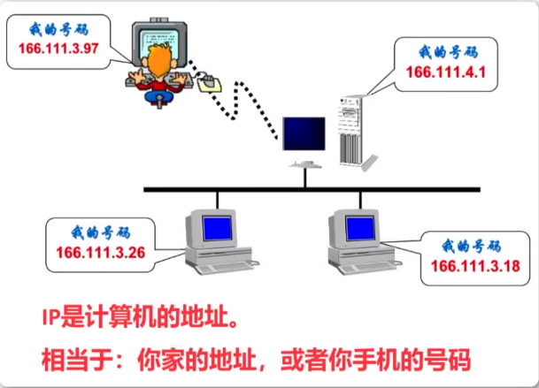

​	IP是Internet Protocol Address，即"互联网协议地址"，IP地址用来标识网络中的一个通信实体(计算机、路由器等)的地址。互联网的每个服务器都要有自己的IP地址，每个局域网的计算机通信也要配置IP地址。路由器是连接两个或多个网络的网络设备。

## 端口

​	端口号用来识别计算机中进行通信的应用程序，因此它也被称为程序地址。计算机上可以同时运行多个程序，传输层协议正是利用这些端口号识别本机中正在进行通信的应用程序，并准确地进行数据传输。

### 端口分配

​	端口的标识是一个16位的二进制整数，对应十进制的0-65535。操作系统中提供了0-65535的可用端口范围

按照端口号分类：

**公认端口(Well Known Ports):**从0到1023，他们紧密绑定与一些服务，通常这些端口的通讯明确表明了某种服务的协议。例如：80端口实际上总是HTTP通讯。

**注册端口(Registered Ports):**从1024到65535，他们松散地绑定与一些服务，许多系统动态处理端口从1024左右开始。

## 网络协议

七层协议了解即可

## TCP和UDP协议的区别

​	**TCP用于在传输层有必要实现可靠传输的情况。**

​	**UDP主要用于那些对高速传输和实时性有较高要求的通信或广播通信。**

### TCP(Transmission Control Protocol,传输控制协议)

​	TCP方式就类似于拨打电话，使用该方式进行网络通讯时，需要建立专门的虚拟连接，然后进行可靠的数据传输，如果数据发送失败，则客户端会自动重发该数据。

### UDP(User Data Protocol,用户数据报协议)

​	UDP是一个非连接的协议，传输数据之前源端和终端不建立连接，当它想传送时就简单地去抓取来自应用程序的数据，并尽可能快的把它扔到网络上。在发送端，UDP传送数据的速度仅仅是受应用程序生成数据的速度、计算机的能力和传输带宽的限制；在接收端，UDP把每个消息放在队列中，应用程序每次从队列中读取一个信息段。

​	UDP方式类似于发送短信，使用这种方式进行网络通信时，不需要建立专门的虚拟连接，传输也不是很可靠，如果发送失败则客户端无法获得数据。

​	UDP没有拥塞控制，一直会以恒定的速度发送数据，网络条件不好也不会对发送速率进行调整，在网络条件不好的情况下可能会导致丢包。

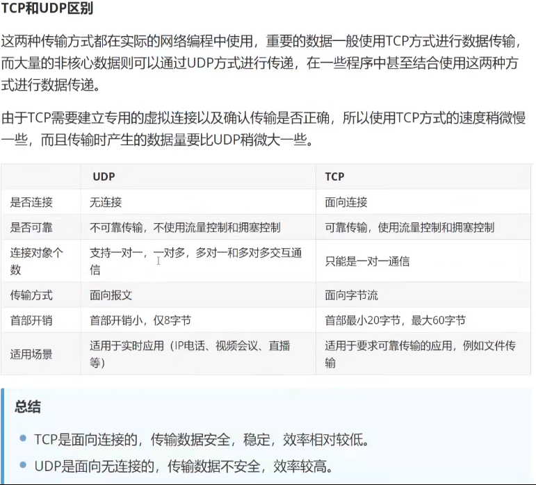

## TCP建立连接的三次握手

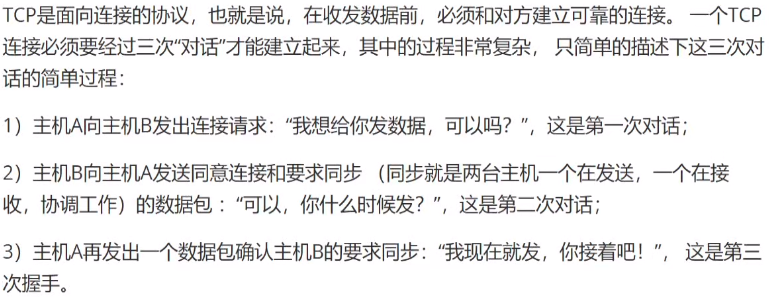

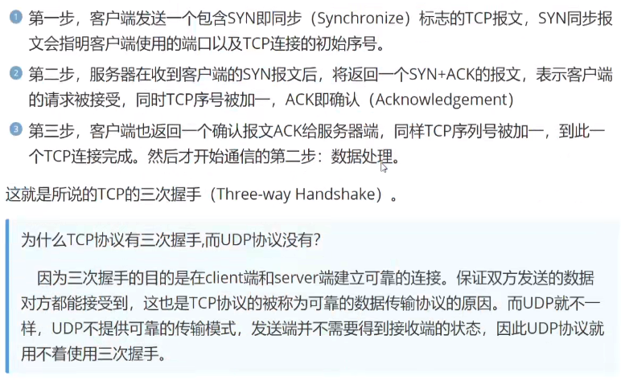

## TCP断开连接的四次挥手

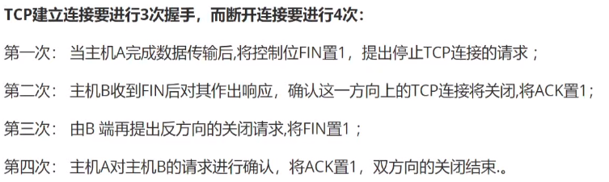

## 数据包

**什么是数据包**

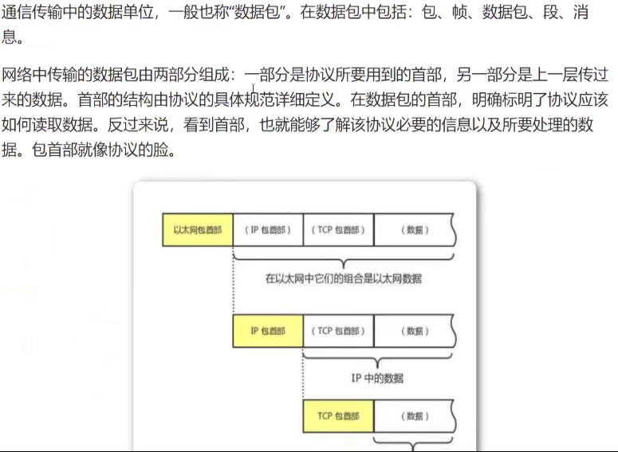

## 套接字编程

### Socket编程介绍

​	TCP协议和UDP协议是传输层的两种协议。Socket是传输层提供给应用层的编程接口，所有Socket编程分为TCP编程和UDP编程。

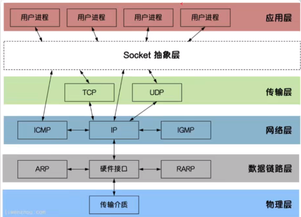

 Socket编程封装了常见的TCP、UDP操作，可以实现非常方便的网络编程

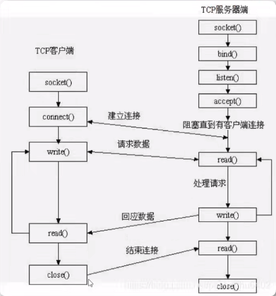

### socket()函数介绍

​	在Python语言标准库中，通过使用socket模块提供的socket对象，可以在计算机网络中建立可以互相通信的服务器和客户端。在服务器端需要建立一个socket对象，并等待客户端的连接。客户端使用socket对象与服务器端进行连接，一旦连接成功，客户端和服务器端就可以通信。

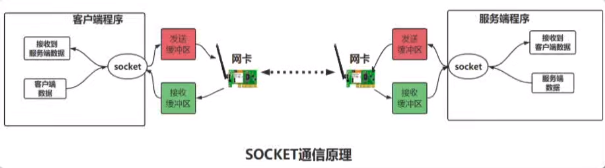

​	**socket通讯中，发送和接收数据都是通过操作系统控制网卡进行，因此在使用之后，必须关闭socket**

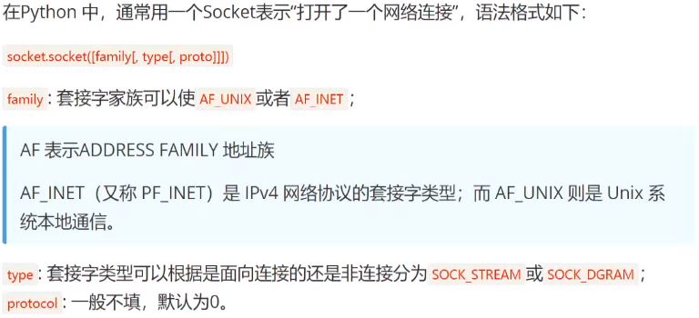

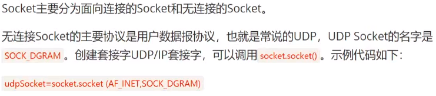

### socket对象的内置函数和属性

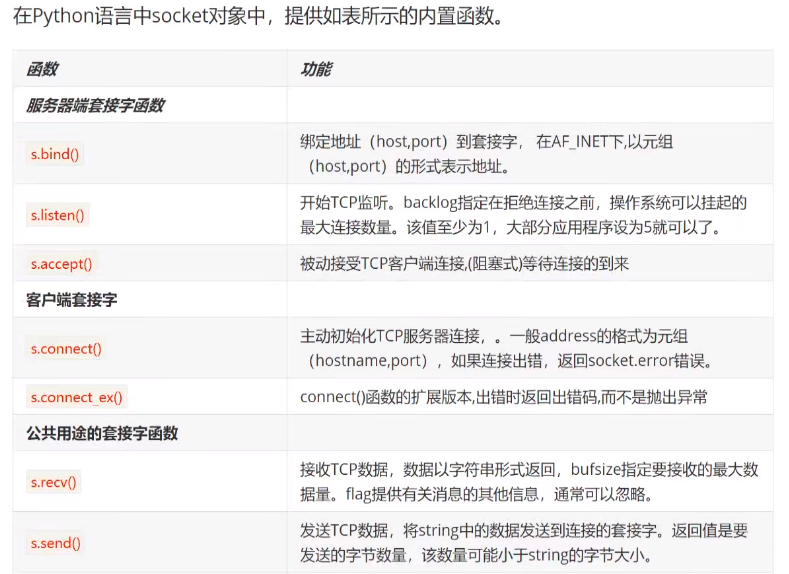

## UDP编程介绍

​	UDP协议不需要建立连接，只需要知道对方的IP地址和端口号，就可以直接发送数据包。虽然用UDP传输数据不可靠，但它的优点是和TCP比，速度快，对于不要求可靠到达的数据，就可以使用UDP协议。

​	创建Socket时，`SOCK_DGRAM`指定了这个Socket的类型是UDP。绑定端口和TCP一样，但不需要调用`listen()`方法，而是直接接收来自客户端的数据。`recvfrom()`方法返回数据和客户端的地址和端口，这样，服务器端收到数据后，直接调用`sendto()`就可以把数据用UDP发给客户端。

## UDP服务端

```
from socket import *

s = socket(AF_INET,SOCK_DGRAM) # 创建UDP类型的套接字
s.bind(("127.0.0.1",8888)) # IP不写则绑定到所有网络接口8888端口
# 如果想限制为「仅本地可访问」，则需要明确写 '127.0.0.1'；
# 如果想允许所有网络接口访问，用 '' 或 '0.0.0.0' 即可（无需写具体 IP）
print("等待接收数据！")
recv_data = s.recvfrom(1024) # 1024表示本次接收的最大字节数
print(f"收到远程信息{recv_data[0]},来自")

s.close()
```

## UDP客户端

```
from socket import *

s = socket(AF_INET,SOCK_DGRAM) # 创建UDP类型的套接字
addr = ("127.0.0.1",8888)

data = input("请输入: ")
# 发送数据
s.sendto(data.encode('utf-8'),addr)
s.close()
```

## UDP持续通信

服务端

```
from socket import *

s = socket(AF_INET,SOCK_DGRAM)
# 绑定IP和端口
s.bind(("127.0.0.1",8888))
while True:
    print("等待接收数据")
    recv_data = s.recvfrom(1024) # 1024表示本次接收的最大字节数
    recv_content = recv_data[0].decode('utf-8')
    print(f"收到远程信息:{recv_content},来自{recv_data[1]}")
    if recv_content == "88":
        print("结束接收信息")
        break
s.close()
```

客户端

```
from socket import *

s = socket(AF_INET,SOCK_DGRAM)
addr = ("127.0.0.1",8888)
while True:
    data = input("请输入信息:")
    s.sendto(data.encode("utf-8"),addr)
    if data == "88":
        print("停止发送数据")
        break

s.close()
```

## 结合多线程实现UDP双向传送

​	UDP不同于TCP，不存在请求连接和受理过程，因此无法明确区分服务端和客户端，只是因为其提供服务而称为服务器端。

```
from socket import *
from threading import Thread


def recv_data():
    while True:
        recv_data = s.recvfrom(1024) # 指定本次接收的最大字节数
        recv_content = recv_data[0].decode("utf-8")
        print(f"收到远程信息:{recv_content},来自{recv_data[1]}")
        if recv_content == "88":
            print("结束聊天")
            break

def send_data():
    addr = ("127.0.0.1",8889)
    while True:
        data = input("请输入:")
        s.sendto(data.encode("utf-8"),addr)
        if data == "88":
            print("结束聊天")
            break

if __name__ == '__main__':
    s = socket(AF_INET,SOCK_DGRAM)
    s.bind(("127.0.0.1",8888))
    # 创建两个线程
    t1 = Thread(target=recv_data)
    t2 = Thread(target=send_data)

    t1.start()
    t2.start()
    t1.join()
    t2.join()

    s.close()
```

## TCP编程介绍

​	面向连接的Socket使用的协议是TCP协议，实例代码如下：

```python
tcpSocket = socket.socket(AF_INET,SOCK_STREAM)
```

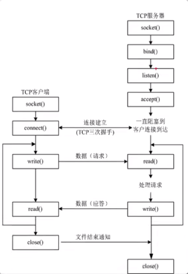


