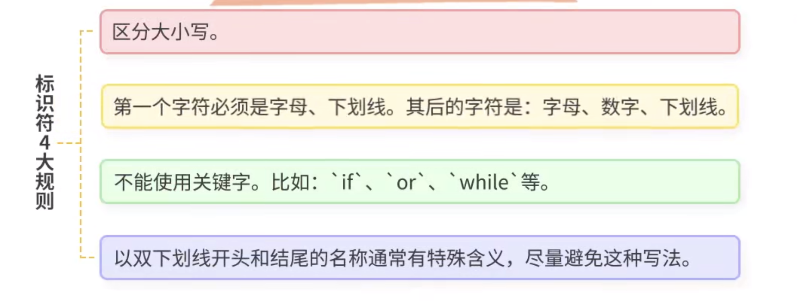
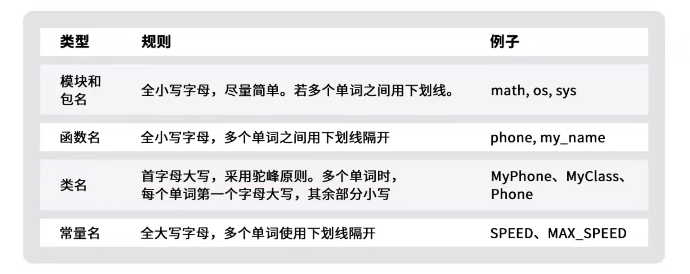

# Python

## 对象

​	Python中一切都是对象。
​	每个对象由：标识（identity）、类型（type）、值（value）组成。


​	对象的本质就是：一个内存块，拥有特定的值，支持特定类型的相关操作。

## 引用

​	在Python中，变量也称为对象的引用（reference）。变量存储的就是对象的地址。变量通过地址引用（指向）了对象。
​	变量位于：栈内存。
​	对象位于：堆内存。
​	Python是动态类型的语言：变量不需要显式声明类型。根据变量引用的对象，Python解释器自动确定数据类型。

## 标识符





## 删除变量和垃圾回收机制

​	可以通过del语句删除不再使用的变量。
​	如果对象没有被变量引用，就会被垃圾回收器回收清空内存空间。

## 常量

​	Python实际上不支持常量，即没有语法规则限制修改一个常量的值。通常只能常量的命名规则，以及在程序的逻辑上不对常量的值作出修改。

## 链式赋值

​	链式赋值用于同一个对象赋值给多个变量。

```python
x = y = 100
```

## 序列解包赋值

```python
a,b,c = 1,2,3
```

## 同一运算符

​	同一运算符用于比较两个对象的存储单元，实际比较的是对象的地址。
​	is 用于判断两个标识符是不是引用同一个对象。
​	is not 是判断两个标识符是不是引用不同对象。

### is与==的区别

- is 用于比较两个变量引用对象是否为同一个，即比较对象的地址。
- == 用于判断引用变量引用对象的值是否相等，默认调用对象的`_eq()_`方法。

## 整数缓存问题

- 命令行模式下，Python仅仅会对较小的整数对象进行缓存（范围为[-5,256]），用数组实现，分配连续空间，便于查找，而非所有整数对象。
- 文件模式下，所有数字都会被缓存，范围是：[-∞,+∞]。[-5,256]仍然使用数组实现，不在[-5,256]出现的数，缓存在链表中，不分配连续空间。

## 字符串

Python的**字符串是不可变的**，无法对原字符做任何修改。但是可以将字符串的一部分复制到新创建的字符串，达到看起来修改的效果。

## 转义字符


## 字符串拼接


## 从控制台读取字符串

​	可以使用`input()`从控制台读取键盘输入的内容。

## Replace()实现字符串替换

​	字符串不可改变。需要替换某些字符时，只能通过创建新的字符串实现。

```python
a = 'abcd'
# 将字符b换成字符a
b = a.replace('b','a')
print(b)
```

## 使用[]提取字符

- 字符串的本质就是字符序列，可以通过在字符串后面添加[]，在[]里面指定偏移量，可以提取该位置的单个字符。

  - 正向搜索

    最左侧第一个字符，偏移量是0，第二个偏移量是1，直到`len(str)-1`为止。

  - 反向搜索

    最右侧第一个字符，偏移量是-1，第二个偏移量是-2，直到`-len(str)`为止。

## 字符串切片slice操作


##  split()分割和join()合并

- split()可以基于指定分割符将字符串分割成多个子字符串并存储到列表中。如果不指定分割符，则默认使用**空白字符**（换行符/空格/制表符）
- join()用于将一系列字符串连接起来。


```python
import time 
time1 = time.time()
a = ''
for i in range(1000000):
    a += 'stx'
time2 = time.time()

li = []
for i in range(1000000):
    li.append('stx')
time3 = time.time()
b = ''.join(li)
time4 = time.time()

print('+操作耗费时间：'+str(time2-time1))
print('join操作耗费时间：'+str(time4-time3))
```

## 字符串驻留机制

- 字符串驻留：常量字符串只保留一份

```python
c = 'dd#@'
d = 'dd#@'
print(c is d) #True
```

##  字符串格式化

```python
# 字符串格式化
a = '姓名:{0},年龄:{1}'
b = a.format('joe','22')
print(b)

c = '姓名:{name},年龄:{age}'
d = c.format(name='Jack',age='11')
print(d)
```

## 数字格式化

- 浮点数通过f，整数通过d进行需要的格式化

```python
# 数字格式化
a = '{:.2f}'
print(a.format(3.1415))
```

## 可变字符串

```python
import io 
s = 'abcdefg' # s仍然不可变
sio = io.StringIO(s) # sio就是可变字符串
print(sio)
print(sio.getvalue())
sio.seek(3) #指针到索引3这个位置
sio.write("@@")
print(sio.getvalue())

```

## 列表

- 用于存储任意数量、任意类型的数据集合
- 列表是内置可变序列，是包含多个元素的有序连续的内存空间。
- 列表中的元素类型可以各不相同，大小可变，可以根据需要随时增加或者删除。

##  元组

- 元组属于不可变序列，不能修改元组中的元素。
- 元组的访问和处理速度比列表快。
- 与整数和字符串一样，元组可以作为字典的键，而列表不能作为字典的键。

## 生成器推导式创建元组

```python
a = (i for i in range(10)) # 生成器对象
b = tuple(a)
print(b) # (0, 1, 2, 3, 4, 5, 6, 7, 8, 9)
```

- 生成器对象只能使用一次，如果需要重新访问其中的元素，必须重新创建该生成器对象。

```python
c = (i for i in range(3))
print(c.__next__()) # 1
print(c.__next__()) # 2
print(c.__next__()) # 3
```

- `__next__()`方法实现对生成器对象的遍历。

## 字典

- 字典是“键值对”的无序可变序列，字典中的每一个元素都是一个“键值对”，包含“键对象”和“值对象”。可以通过“键对象”实现快速获取、删除、更新对应的“值对象”。
- “键”是任意的不可变数据，可变对象不能作为“键”。
- “键不可重复”，“值”可以是任意数据且可以重复。 

### 创建字典

1. 通过`{}`和`dict{}`创建字典对象。

   ```python
   # 字典
   a = {'name':'Jack','age':18}
   b = dict(name='Jack',age=18)
   c = dict([('name','Jack'),('age',18)])
   d = {}
   e = dict()
   ```

2. 通过zip()创建字典对象。

   ```python
   k = ['name','age','job']
   v = ['Jack',18,'programmer']
   d = dict(zip(k,v))
   print(d)
   ```

3. 通过formkeys创建值为空的字典。

```python
f = dict.fromkeys(['name','age','job'])
print(f)
```

##  字典用法总结

1. 字典在内存中的开销巨大，典型的空间换时间。
2. 键查询速度很快。
3. 往字典里添加新键可能导致扩容，导致散列表中的次序变化。因此不要在遍历字典的同时进行字典的修改。
4. 键必须可散列
   - 数字、字符串、元组都是可散列的
   - 自定义对象需要支持如下三点：
     - 支持`hash()`函数
     - 支持通过`__eq__()`方法检测相等性
     - 若`a==b`为真，则`hash(a)==hash(b)`也为真。

## 集合

​	集合无序可变，元素不能重复。集合底层使用字典实现，集合的所有元素都是字典的键对象，因此不能重复且唯一。


## 循环代码优化

1. 尽量减少循环内部不必要的计算。
2. 嵌套循环中，尽量减少内部循环的计算，尽可能向外提。
3. 局部变量查询较快，尽量使用局部变量。

其它优化手段：

1. 连接多个字符串，使用`join()`而不使用+。
2. 列表进行插入和删除，尽量在列表尾部操作。

```python
# 循环代码优化测试
start = time.time()
for i in range(1000):
    result = []
    for m in range(10000):
        c = i * 1000
        result = result + [c+m*100]    
end = time.time()
print("耗时：{0}".format(end-start))

print('代码优化后------')
start2 = time.time()
for i in range(10000):
    result = []
    c = i * 1000
    for m in range(1000):
        result.append(c+m*100)
end2 = time.time()
print("耗时：{0}".format(end2-start2))  
```

## 推导式创建序列

​	推导式是从一个或者多个迭代器快速创建序列的一种方法。它可以将循环和条件判断结合从而避免冗长的代码。

 语法：

```python
[表达式 for item in 可迭代对象]
或者：[表达式 for item in 可迭代对象 if 条件判断]
```

## 函数

1. 函数是可重用的代码块。
2. 函数不仅可以实现代码的复用，更能实现代码的一致性，即只要修改函数的代码，则所有调用该函数的地方都能得到体现。


1. 变量c和print_star都指向了同一个函数对象。因此执行c()和print_star()的效果完全一致。
2. Python中圆括号意味着调用函数，在没有圆括号的情况下，Python会把函数当作普通对象。

## 变量

### 全局变量：

1. 在函数和类定义之外的变量。作用域为定义的模块，从定义位置开始直到模块结束。
2. 全局变量降低了函数的通用性和可读性。应尽量避免全局变量的使用。
3. 要在函数内改变全局变量的值，使用`global`声明一下。

### 局部变量：

1. 在函数体中声明的变量（包含形参）。
2. 局部变量的引用比全局变量快，优先考虑使用。
3. 如果局部变量和全局变零同名，则在函数内隐藏全局变量，只使用同名的局部变量。

## 参数传递

1. 函数的参数传递本质上就是：从形参到实参的赋值操作。
2. Python中一切都是对象，赋值操作都是引用的赋值。

**具体操作时分为两类**

1. 对可变对象进行写操作，直接作用于原对象本身，包括字典、列表、集合、自定义的对象等。
2. 对不可变对象进行写操作，会产生一个新的对象空间，并用新的值填充这块空间，包括数字、字符串、元组、function等。

## 浅拷贝和深拷贝

​	**浅拷贝**：拷贝对象，但不拷贝子对象的内容，只是拷贝子对象的引用。

​	**深拷贝**：拷贝对象，并且会将子对象的内容拷贝一份，对拷贝对象的修改不会影响源对象。


**浅拷贝**

- Python中拷贝一般都是浅拷贝。拷贝时，对象包含的子对象内容不拷贝。因此，源对象和拷贝对象都会引用同一个子对象。

**深拷贝**

- 使用copy模块的deepcopy函数，递归拷贝对象中包含的子对象。源对象和拷贝对象所有的子对象也不同。

```python
#拷贝测试
import copy
class MobilePhone():
    def __init__(self,CPU):
        self.CPU = CPU
    
class CPU:
    pass

c = CPU()
m = MobilePhone(c)
print("浅拷贝")
m2 = copy.copy(m)
print("m:",id(m))
print("m2:",id(m2))
print("m中的CPU：",id(m.CPU))
print("m2中的CPU：",id(m2.CPU))

print('----------------------')
print("深拷贝")
m2 = copy.deepcopy(m)
print("m:",id(m))
print("m2:",id(m2))
print("m中的CPU：",id(m.CPU))
print("m2中的CPU：",id(m2.CPU))
```

## 参数传递：不可变对象包含可变对象

​	传递不可变对象时，不可变对象里面包含的子对象是可变的，对子对象进行修改，源对象也会发生变化。

## 可变参数

1. *param，将多个参数收集到一个元组中。
2. **param，将多个参数收集到一个字典中。（必须使用强制命名参数）

## Lambda函数

​	lambda表达式可以用来声明匿名函数，实际上生成了一个函数对象。

```python
lambda arg1,arg2,arg3...:  <表达式>
```

​	arg1 arg2 arg3 为函数的参数。<表达式>相当于函数体。运算结果是表达式的运算结果。

## eval()函数

​	将字符串`str`当作有效的表达式求值并返回计算结果。

​	eval(source, globals,locals)

​	**参数：**

1. source:一个Python表达式或者函数compile()返回的代码对象。
2. globals:可选，必须是字典。
3. Locals:可选，任意映射对象。

​	**eval()函数会将字符串当作语句执行，因此会有安全隐患。**

## 递归函数

 	递归函数指的是：自己调用自己的函数，在函数体内部直接或者间接的自己调用自己。每个递归函数必须包括两个部分：

1. **终止条件：**

   表示递归什么时候结束，一般用于返回值，不再调用自己。

2. **递归步骤：**

​		把第n步的值和第n-1步相关联。

​	**递归函数会创建大量的函数对象，会消耗大量的内存和计算能力，在处理大量数据时，谨慎使用**

## 嵌套函数

​	嵌套函数就是在函数内部定义的函数

```python
#嵌套函数
def outer():
    print('outer running')
    def inner():
        print('inner running')
    inner()

outer()
```

## nonlocal

​	nonlocal：用来在内部函数中，声明外层使用的局部变量。

​	global：函数内声明全局变量，然后才使用全局变量

## LEGB规则


## 面向对象编程

- Python完全采用了面向对象的思想，是真正面向对象的编程语言，完全支持面向对象的基本功能，例如：继承、多态、封装等。

- 面向对象(Object oriented Programming,OOP)编程的主要思想是针对大型软件设计而来的。

- 面向对象编程使程序的扩展性更强、可读性更好

- 面向对象编程将**数据和操作数据相关的方法封装到对象中**，组织代码和数据的方式更加接近人的思维，从而大大提高了编程的效率。

  

## 类的定义

- 把饼干比作一个“饼干”，类就是制造这个饼干的“模具”。
- 通过类定义数据类型的属性（数据）和方法（行为），也就是说，类将行为和状态打包在一起。

## 属性和方法

- 定义类的语法格式：


1. 类名必须符合标识符的规则；一般规定首字母大写，多个单词使用驼峰原则。
2. 类体中定义属性和方法
3. 属性用来描述数据，方法用来描述这些数据相关的操作。

## ______init__()构造方法

- 初始化对象，需要定义构造函数`__init__()`方法，构造方法用于执行“实例对象的初始化方法”，即对象创建之后，初始化当前对象的相关属性，无返回值。

- 要点如下：

1. 名称固定，必须为`__init__()`

2. 第一个参数固定，必须为：self。self是指刚刚创建好的对象。

3. 构造函数通常用于初始化实例对象的实例属性，如下代码就是初始化实例属性：name和score

   ```python
   def __init__(self,name,score)
   		self.name = name
   		self.score = score
   ```

4. 通过“类名（参数列表）”来调用构造函数。调用后，将创建好的对象返回给相应的变量。比如：s1 = Student(“张三”，80)

5. `__init__()`方法：初始化创建好的对象，初始化指的是：“给实例属性赋值”

6. `__new__()`方法：用于创建对象，一般无需重定义

7. 如果不定义`__init__()`方法，系统一般会提供一个默认的无参数`__init__()`方法

   如果定义了带参数的`__init__()`方法，则系统不会创建默认的`__init__()`方法

​	**Python中的self相当于C++中的self指针，JAVA和C#中的this关键字。**

​	**Python中self必须为构造函数的第一个参数，名字可以任意修改。但一般都叫做self**

## 实例属性和实例方法

### 实例方法

- 实例方法是从属于实例对象的方法。实例方法的定义如下：

```python
def 方法名（self,[形参列表]）：
		函数体
```

- 调用格式：

​		对象.方法名（[实参列表]）

- 要点：	

1. 定义实例方法时，第一个参数必须为self，self指当前的实例对象。
2. 调用实例方法时，不需要也不能给self传参。self由解释器自动传参。

```python
class Student:
    def say_hello(self):
        print(self,'----','hello')
        
s1 = Student()
s1.say_hello()
Student.say_hello(s1)
```

## 类属性

- 类属性是从属于“类对象”的属性，也称为类变量。由于，类属性从属于类对象，可以被所有实例对象共享。
- 类属性的定义方式：

```python
class 类名：
		类变量名 = 初始值
```

- 在类中或者类的外面，可以通过：类名.类变量来读写。


## 类方法

​	类方法从属于“类对象”，通过装饰器@classmethod来定义，格式如下：

```python
@classmethod 
def 类方法名（cls，[形参列表]）：
		方法名
```

​	要点如下：

1. @classmethod必须位于方法上面一行
2. 第一个cls必须要有；cls指的就是“类对象本身”
3. 调用类方法格式：类名.类方法名(参数列表)。参数列表中，不需要也不能给cls传值。
4. 类方法中访问实例属性和实例方法会导致错误。
5. 子类继承父类时，传入cls是子类对象，而非父类对象。

```python
class Student:
    company = "Aniplex"
    
    @classmethod
    def printCompany(cls):
        print(cls.company)
        
Student.printCompany()
```

## 静态方法

**Python中允许定义与“类对象”无关的方法，成为“静态方法”。**

“静态方法”和在模块中定义的普通函数没有区别，只不过“静态方法”放到了类的名字命名空间里面。需要通过类调用。

静态方法通过装饰器@staticmethod定义，格式如下：

```python
@staticmethod
def 静态方法名（[形参列表]）：
		方法体
```

要点如下：

1. @statcimethod必须位于方面上面一行
2. 调用静态方法格式：类名.静态方法名（参数列表）
3. 静态方法中调用实例方法会导致错误。

```python
--------------------------- 
class Student:
    company = "Aniplex"
    
    @classmethod
    def printCompany(cls):
        print(cls.company)
    @staticmethod
    def add(a,b):
        print("{0}+{1}={2}".format(a,b,(a+b)))
        return a+b
        
Student.printCompany()
Student.add(30,40)
```

## `__del__（）`方法（析构函数）和垃圾回收机制

​	Python实现自动的垃圾回收，当对象没有引用时（引用计数为0），由垃圾回收器调用`__del__()`。

​	`__del__()`称为“析构方法”，用于实现对象被销毁时所需的操作。比如：释放对象占用的资源，例如：打开的文件资源、网络连接等。

​	系统会自动提供`__del__（）方法`，一般不需要自定义析构方法。

## `__call__方法`和可调用对象

​	可调用对象：可以将（）直接应用到自身并执行，即定义了`__call__()`的对象，对于无法调用的对象，可以自定义`__call__()`使它可以被调用。

## 方法没有重载

​	如果在类中定义了多个同名的方法，只有最后一个方法有效。

## 方法的动态性

​	Python可以动态的为类添加新的方法、可以动态的修改类已有的方法。 

```python
#测试方法的动态性
class Person:
    def work(self):
        print("努力上班")

def play_game(self):
    print("玩游戏")
def work2(self):
    print("好好工作，努力上班")
Person.work = work2
Person.play = play_game
p = Person()
p.work()
p.play()
```

## 私有属性和私有方法（封装）

​	**Python中对于类的成员没有严格的访问控制限制**

​	要点如下：

- 通常约定，两个下划线开头的属性是私有的（private）。其它为公共的（public）。
- 类内部可以访问私有属性（方法）
- 类外部不能直接访问私有属性（方法）
- 类外部可以通过`_类名__私有属性（方法）`名访问私有属性（方法）

```python
#测试私有属性、私有方法

class Employee:
    __company = "Aniplex" #解释器运行时，把__company转成了_Employee__company
    
print(dir(Employee))
print(Employee._Employee__company)
```


## @property装饰器

​	**@property**可以将一个方法的调用方式变成"属性调用"，一般用于处理属性的读操作、写操作。

```python
class Employee:
    def __init__(self,name,salary):
        self.name = name
        self.__salary = salary
    @property
    def salary(self):
        print('薪资是：',self.__salary)
        return self.__salary
    @salary.setter
    def salary(self,salary):
        self.__salary = salary

emp1 = Employee('Jack',10000)
emp1.salary 
emp1.salary=20000
emp1.salary

```

## 属性和类的命名规则总结

- `_xxx`：保护成员，不能用from module import *倒入，只有类对象和子类对象能访问这些成员。
- `__xxx__`：系统定义的特殊成员
- `__xxx`：类中的私有成员，**只有类对象自己能访问，子类对象也不能访问。**（但是在类外部可以通过对象名._类名__xxx这种特殊方式访问，Python不存在严格意义上的私有成员）

## None对象的特殊性

- None是一个特殊的常量，表示变量没有指向任何对象。
- None本身也是对象，有自己的类型NoneType。
- 可以将None赋值给任何变量，但是不能创建NoneType类型的对象。
- None不是False，不是0，不是空字符串，None和任何其他的数据类型比较永远返回False。
- if语句判断时，空列表、空字典、空元组、0等一系列代表空和无的对象会被转换成False。
- ==和is判断时，空列表、空字符串不会自动转换成False。

## 面向对象的三大特征说明（封装、继承、多态）

### 	封装：

​			隐藏对象的属性和实现细节，只对外提供必要的方法。

### 	继承：

​			继承可以让子类具有父类的特征，提高了代码的重用性。

### 	多态：

​			多态是指同一个方法调用由于对象不同会产生不同的行为。

## 继承详解

​	继承可以让我们更加容易实现类的扩展，实现代码的复用。

​	语法格式：

```python
class 子类类名（父类1[,父类2，...]）:
		类体
```

​	如果在类定义中没有指定父类，则默认父类是object类。也就是说，object是所有类的父类，里面定义了一些所有类共有的默认实现，比如：`__new__()`

​	关于构造函数：

- 子类不重写`__init__()`时，实例化子类，会自动调用父类定义的`__init__()`。
- 子类重写`__init__()`，实例化子类，就不会调用父类的`__init__()`。
- 如果重写了`__init__()`，要继承父类的构造方法，可以使用`super`关键字，也可以使用`父类名.init(self,参数列表)调用。`

 

```python
class Person:
    def __init__(self,name,age):
        print("创建Person")
        self.name = name
        self.age = age
        
    def print_age(self):
        print("{0}的年龄是{1}".format(self.name,self.age))
     
     
class Student(Person):
      def __init__(self, name, age, score):
          #调用父类的构造方法
          #Person.__init__(self,name,age)
          super(Student,self).__init__(name,age)         
          print("创建Student")
          self.score = score
        
s1 = Student('Jack',20,100)
s1.print_age()

 
```

## 成员继承和方法的重写

​	成员继承：子类继承了父类除构造方法之外的所有成员。**（私有属性、私有方法也被继承）**

​	方法重写：子类可以重新定义父类中的方法，这样就会覆盖父类的方法，也称为“重写”。

​	可以通过`mro()`或者类的属性`_mro_`可以输出这个类的继承层次结构。

## object根类

​	object类是所有类的父类

## 重写str方法

- object有一个`_str_()`方法，用于返回一个对于“对象的描述”。内置函数`str（对象）`，调用的就是`_str_()`。
- `_str_()`经常用于`print（）`方法，帮助我们查看对象的信息。`_str_()`可以重写。

```python
#重写str方法 
class Person:
    def __init__(self,name,age):
        self.name = name
        self.age = age
    def __str__(self):
        '''将对象转化为一个字符串描述，一般用于print方法'''
        print("重写__str__方法")
        return "名字是{0},年龄是{1}".format(self.name,self.age)
    
p = Person("jack",20)
print(p)

s = str(p)
print(s)
```

## 多重继承

​	Python支持多重继承，一个子类可以有多个“直接父类”。

## MRO方法解析顺序

​	Python支持多继承，如果父类中有相同名字的方法，在子类没有指定父类名时，解释器将“从左到右”按顺序搜索。

## super()获得父类方法的定义

```python
class A:
    def __init__(self):
        print("A的构造方法")
        
    def say(self):
        print("A:",self)     
        print("AAA")
        
    
class B(A):
    def __init__(self):
        A.__init__(self)    # 调用父类的构造方法
        #super(B,self).__init__()
        print("B的构造方法")
    def say(self):          #调用父类的say()方法
        A.say(self)     
        #super().say()
        print("B:",self)
        print("BBB")

b = B()        
b.say()
```

## 多态

​	多态：同一个方法调用，不同的对象行为完全不同。

-    多态是方法的多态，属性没有多态
-    多态存在有两个必要条件：继承、方法重写

## 特殊方法和运算重载符

Python的运算符实际上是通过调用对象的特殊方法实现的。

```python
#测试运算符的重载
class Person:
    def __init__(self,name):
        self.name = name
    def __add__(self,other):
        if isinstance(other,Person):
            return "{0}--{1}".format(self.name,other.name)
        else:
            return "不是同类对象，不能相加"

    def __mul__(self,other):
        if isinstance(other,int):
            return self.name*other
        else:
            return "不是同类对象，不能相乘"
    
p1 = Person('Jack')
p2 = Person('Ben')

print(p1+p2)
print(p1*3)
```

## 特殊属性

Python对象中包含了很多双下划线开始和结束的属性，这些都是特殊属性。


## 继承和组合

- 除了继承，“组合”也能实现代码的复用！“组合”的**核心是将对象作为类的属性**。

1. `is-a`关系，我们可以使用继承。从而实现子类拥有父类的方法和属性。`is-a`关系指的是类似这样的组合：狗是动物，dog is animal 。狗类就应该继承动物类。
2. `has-a`关系，我们可以使用”组合“，也能实现一个类拥有另一个类的方法和属性。`has-a`关系指的是这样的关系：手机拥有CPU。MobliePhone has a CPU

```python
#组合
class CPU:
    def calculate(self):
        print("正在计算")
        
class Screen:
    def show(self):
        print("正在显示")

class MobilePhone:
    def __init__(self,cpu,screen):
        self.cpu = cpu
        self.screen = screen
c = CPU()
s = Screen()
m = MobilePhone(c,s)
m.cpu.calculate()
m.screen.show()
```

## 设计模式-工厂模式

- 工厂模式实现了**创建者和调用者的分离**，使用专门的工厂类将选择实现类、创建对象进行统一的管理和控制

```python
#工厂模式
class Benz:
    pass
class BMW:
    def __init__(self):
        print('BMW')
class BYD:
    pass

class CarFactory:
    def createCar(self,brand):
        if brand == '奔驰':
            return Benz()
        elif brand == '宝马':
            return BMW()
        elif brand == "比亚迪":
            return BYD()
        else:
            return "未知品牌"

fac = CarFactory()
car1 = fac.createCar('宝马')
```

## 设计模式-单例模式

- **单例模式**的核心作用是确保一个类只有一个实例，并且提供一个访问该实例的全局访问点。
- 单例模式只生成一个实例对象，减少了对系统资源的开销。当一个对象的产生需要比较多的资源，如读取配置文件、产生其它依赖对象时，可以产生一个“单例对象”，然后永久驻留在内存中，从而降低系统资源开销。

 

```python
#单例模式
class MySingleton:
    __obj = None
    __init_flag = True
    
    def __new__(cls,*args,**kwargs):
        if cls.__obj == None:
            cls.__obj = object.__new__(cls)
        return cls.__obj
        
    def __init__(self,name):
        if MySingleton.__init_flag:
            print('初始化第一个对象......')
            self.name = name
            MySingleton.__init_flag = False
            
a = MySingleton('aa')
print(a)
b = MySingleton('bb')
print(a)   


```

## 设计模式-工厂和单例模式结合

```python
#工厂模式和单例模式结合
class Benz:
    pass
class BWM:
    pass
class BYD:
    pass
class Factory:
    __obj = None
    __init_flag = True
    
    def __new__(cls,*args,**kwargs):
        if cls.__obj == None:
            cls.__obj = object.__new__(cls)
        return cls.__obj
        
    def __init__(self):
        if Factory.__init_flag:
            Factory.__init_flag = False
    
    def createCar(self,brand):
        if brand == "奔驰":
            return Benz()
        elif brand == "宝马":
            return BWM()
        elif brand == "比亚迪":
            return BYD()
        else:
            print('未知品牌')
            
factory = Factory()
c1 = factory.createCar('奔驰')
c2 = factory.createCar('宝马')

print(c1)   
print(c2)   

factory2 = Factory()      

print(factory)
print(factory2)
            
```

 