# Python提高

## 异常机制

​	异常机制的本质：当程序出现异常时，能使程序安全的退出、处理完后继续执行的机制。

​	Python中引进了很多用来描述和处理异常的类，称为异常类。异常类定义中包含了该类异常的信息和对异常进行处理的方法。

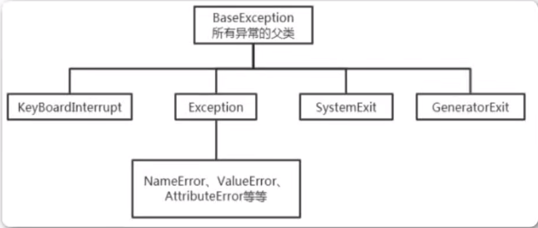

**Python中一切都是对象，异常也采用对象的方式来处理**。处理过程：

1. **抛出异常：**在执行一个方法时，如果发生异常，则这个方法生成代表该异常的一个对象，停止当前执行路径，并把异常对象提交给解释器。
2. **捕获异常：**解释器得到该异常后，寻找相应的代码来处理该异常。

## try...except基本结构

​	结构如下：

```python
try:
		可能引发异常的语句
except BaseException [as e]:
		异常处理模块
```

1. `try`块包含着可能引发异常的代码，`except`块则用来捕捉和处理发生的异常。
2. 执行的时候，如果`try`块中没有引发异常，则跳过`except`块继续执行后续代码。
3. 执行的时候，如果`try`块中发生了异常，则跳过`try`块中的后续代码，跳转到相应的`excpet`块中处理异常；异常处理完之后，继续执行后续代码。

```python
while True:
    try:
        x = int(input("请输入一个数字："))
        print("您输入的数字是:",x)
        if x == 88:
            print('退出程序')
            break
    except BaseException as e:
        print(e)
```

## try...多个except结构

​	基本结构：

```python
try:
		可能引发异常的代码块
except Exception1:
		处理Exception1的语句块
except Exception2:
		处理Exception2的语句块
[...]
except BaseException:
		处理可能遗漏的异常的语句块
```

```python
try:
    a = input("请输入被除数:")
    b = input("请输入除数:")
    c = float(a)/float(b)
    print(c)
except ZeroDivisionError:
    print("除数不能为零")
except ValueError:
    print("除数和被除数都应该是数值类型")
except BaseException as e:
    print(e)
```

## try...except...else结构

`try...except...else`结构增加了 `else块`。如果`try`块中没有抛出异常，则执行`else`块。如果`try`块中抛出异常，则执行`except`块，不执行`else块`。

​	代码结构如下：

```python
try:
		a = input("请输入被除数：")
		b = input("请输入除数：")
    c = float(a)/float(b)
except BaseException as e:
		print(e)
else:
		print("除的结果是："，c)
```

## try...except...finally结构

​	`try...except..finally`结构中，`finally`块无论是否发生异常都会被执行；通常用来释放`try`块中申请的资源。

```python
try:
    a = input("请输入被除数:")
    b = input("请输入除数:")
    c = float(a)/float(b)
except BaseException as e:
    print(e)
else:
    print("除法结果为:",c)
finally:
    print('无论是否发生异常，我都会被执行。') 
```

```python
try:
    f = open('/Users/guopengpeng/Python/Python_Advanced/a.txt',"r")
    content = f.readlines()
    print(content)
except BaseException as e:
    print(e)
finally:
    print('关闭文件')
    f.close()
print('继续执行其他代码') 
print('程序结束')
```

## return语句和异常处理问题

​	由于`return`有两种作用：结束方法运行、返回值。一般不会把`return`放在异常处理中，而是放到方法最后。

## 常见的异常

​	Python中所有的异常都派生自`BaseException`

1. `SyntaxError`：语法错误
2. `NameError`：尝试访问一个没有声明的变量
3. `ZeroDivisionError`：除数为0错误
4. `ValueError`：数值错误
5. `TypeError`：类型错误
6. `AttributeError`：访问对象的属性不存在
7. `IndexError`：索引越界异常
8. `KeyError`：字典的关键字不存在

## with上下文管理

​	无论有无异常，总能保证系统资源正常释放。`with`上下文管理可以自动管理资源，在`with`代码块执行完毕之后自动还原进入该代码之前的现场或上下文。

```python
with context_expr [as var]:
		语句块
```

## traceback模块和生成异常日志

```python
#traceback模块
import traceback
try: 
    print('step1')
    num = 1/0
except:
    with open('/Users/guopengpeng/Python/Python_Advance/log.txt','a') as f:
        traceback.print_exc(file=f)
```

## 自定义异常类

​	自定义异常类一般都是运行时异常，通常继承`Exception`或其子类即可。命名一般以`Error`、`Exception`为后缀。自定义异常由`raise`主动抛出。

```python
#自定义异常类
class AgeError(Exception):
    def __init__(self,errorInfo):
        Exception.__init__(self)
        self.errorInfo = errorInfo
    def __str__(self):
        return str(self.errorInfo)+"，年龄错误！应该在1-150之间"
    
if __name__ == '__main__':#如果是True，则模块是作为独立文件执行，这下面可以写测试代码
    age = int(input('输入一个年龄：'))
    if(age<1 or age>150):
        raise AgeError(age)
    else:
        print('年龄正常：',age)
```

## 文件操作

### **文本文件和二进制文件**

1. 文本文件

   文本文件存储的是普通字符文本，Python默认为unicode字符集。（两个字节表示一个字符，最多可以标识：65536个）

2. 二进制文件

   二进制文件把数据内容用字节进行存储，无法用记事本打开。必须使用专用的软件解码。常见的有：MP4视频文件、MP3音频文件、JPG文件、doc文档等

###  创建文件对象open()

open()函数用于创建文件对象，基本语法格式如下：

​		open(文件名[,打开方式])

如果只是文件名，则代表在当前目录下的文件。文件名可以录入全路径，为了减少`\`的输入，可以使用原始字符串:`r"原始字符串"`。


## 常用编码

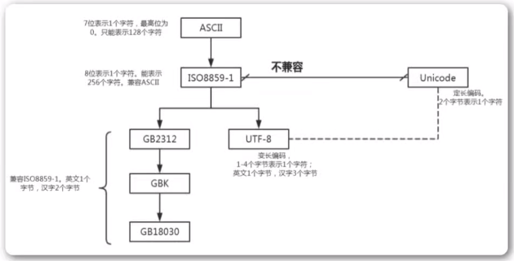

## 中文乱码问题

​	`windows`操作系统默认的编码是`GBK`，`Linux`操作系统默认的是`UTF-8`.当我们用`open()`时，调用的是操作系统打开的文件，默认的编码是`GBK`。

```python
with open(r"a.txt","w",encoding="utf-8") as f:
		f.write("你好")
```

## write()/writelines()写入数据

`write(a):`把字符串a写入到文件中

`writelines(b):`把字符串列表写入文件中，不添加换行符

## close()关闭文件流

​	由于文件系统底层是由操作系统控制，所以我们打开的文件对象必须显式调用`close()`方法关闭文件对象。当调用`close()`方法时，首先会把缓冲区数据写入文件(也可以直接调用`flush()`方法)，再关闭文件，释放文件对象。

​	为了确保打开的文件对象正常关闭，一般结合异常机制的`finally`或者`with`关键字实现无论如何情况都能关闭打开的文件对象。

```python
try:
    f = open(r'log.txt','r')
    for i in f.readlines():
        print(i,end='\t')
except BaseException as e:
    print(e)
finally:
    f.close()
```

## with语句(上下文管理器)

​	上下文管理器可以自动管理上下文资源，不论什么原因跳出`with块`，都能确保文件正确的关闭，并且可以在代码块执行完毕后自动还原进入该代码块时的现场。

## 文本文件的读取

​	文件的读取一般使用如下三个方法：

1. `read(size)`:从文件中读取size个字符，并作为结果返回。如果没有size参数，则读取整个文件。如果已经读取到文件末尾，再次调用会返回空字符串。
2. `readline()`:读取一行内容作为结果返回。读取到文件末尾，会返回空字符串。
3. `readlines()`：文本文件中，每一行作为一个字符串存入列表中，返回该列表。

```python
#逐行读取文件
with open("a.txt","r",encoding="gbk") as f:
		for line in f:    #文件对象本身就是一个迭代
				print(line)
        
with open("a.txt","r",encoding="gbk") as f:
  	while True：
    		line = f.readline()
      	if not line:
          break
        else:
          print(line,end='')
```

## 二进制文件的读取和写入

​	二进制文件的处理流程和文本文件流程一致。首先还是要创建文件对象，需要指定二进制模式从而创建出二进制文件对象。

`f = open(r'a.txt','wb'):可写的、重写模式的二进制文件对象`

`f = open(r'a.txt','ab')：可写的、追加模式的二进制文件对象`

`f = open(r'a.txt','rb')：可读的二进制文件对象`

## 文件对象的常用属性和方法

​	文件对象封装了文件相关的操作

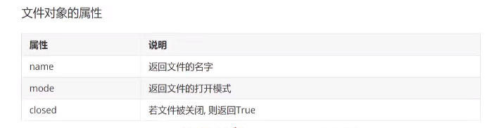

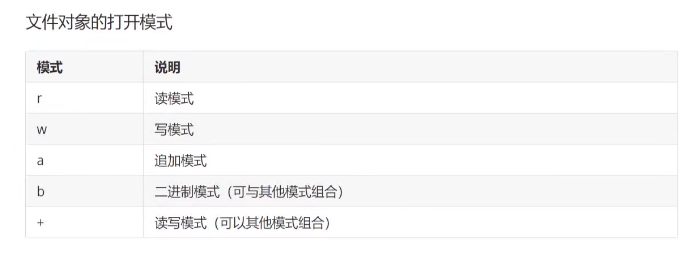

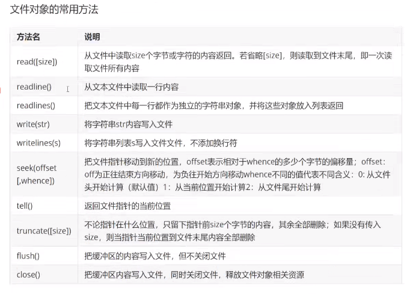

## 使用pickle序列化

​	序列化指的是：将对象转化成"串行化"的数据形式，存储到硬盘或者通过网络传输到其它地方。

​	反序列化是指相反的过程，将读取到的"串行化数据"转化成对象。

​	`pickle.dump(obj,file)` `obj` 就是要被序列化的对象，`file`指的是存储的文件

​	`pickle.load(file)`  从`file`读取数据，反序列化成对象

 

```python
#使用pickle实现序列化和反序列化
import pickle
with open('data.dat','wb') as f:
    score = [1,2,3]
    pickle.dump(score,f)

with open('data.dat','rb') as f:
    score2 = pickle.load(f)
    print(score2)
```

## CSV文件的操作

​	CSV是逗号分隔符文本格式，常用于数据交换、Excel文件和数据库数据的导入和导出。


```python
#读取CSV文件
import csv
with open('a.csv') as f:
    a_csv = csv.reader(f) #创建csv对象，它是一个包含所有数据的列表，每一行为一个元素
    headers = next(a_csv) #获得列表对象，包含标题行的信息
    print(headers)
    print('----------')
    for row in a_csv: #循环打印各行内容
        print(row)


#写入csv文件
headers = ['name','age','salary']
rows = [('Anna',22,12000),('David',24,10000)]
with open('b.csv','w') as f:
    b_csv = csv.writer(f)  #创建csv对象
    b_csv.writerow(headers)#写入一行(标题)
    b_csv.writerows(rows)  #写入多行(内容)
```

## os和os.path模块

​	os模块可以直接对操作系统进行操作，调用操作系统的可执行文件、命令，直接操作文件、目录。

```python
import os
# windows计算器
# os.system('Calc.exe')
# mac计算器
# os.system('open /System/Applications/Calculator.app')
# ping 百度
# os.system("ping www.baidu.com")
```

## os模块-文件和目录操作

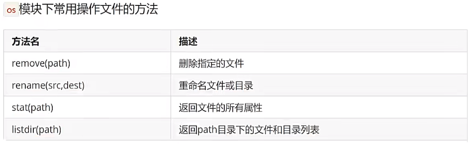

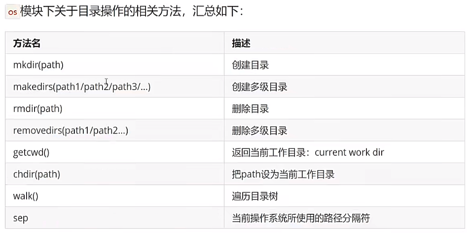

```python
import os
# windows计算器
# os.system('Calc.exe')
# mac计算器
# os.system('open /System/Applications/Calculator.app')
# ping 百度
# os.system("ping www.baidu.com")

print(os.name)
print(os.sep)
print(repr(os.linesep)) #repr可以显示数据信息

a = '3'
print(a)
print(repr(a))
#获取文件和文件夹的相关信息
print(os.stat('pycode1.py'))
#关于工作目录的操作
print(os.getcwd()) #获得当前的工作目录

#改变当前的工作目录
os.chdir('/Users/guopengpeng/Python/Python_Advance')

#创建、删除目录
os.mkdir('1')
os.rmdir('1')

#创建多级目录
if not os.path.exists('电影/港台/周星驰'):
    os.makedirs('电影/港台/周星驰')
    
#修改目录名
os.rename('电影','movie')
#列出子目录
print(os.listdir('movie'))
#删除多级目录
os.removedirs('movie/港台/周星驰')


```

## os.path模块

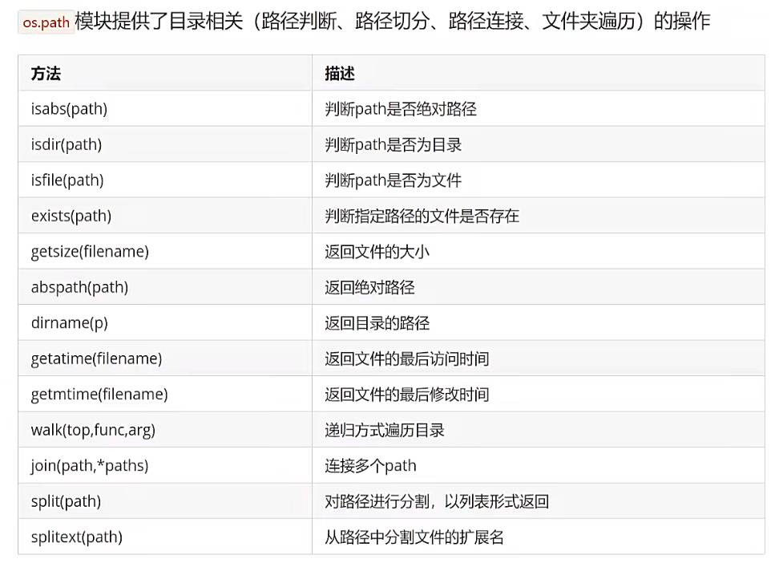

```python
# 测试os.path常用方法

import os
import os.path
# 获得当前目录
path = os.getcwd()
file_list = os.listdir(path) # 列出子目录和子文件
print(file_list)
# 取出.py文件
for file_name in file_list:
    if os.path.splitext(file_name)[1] == '.py':
        print(file_name)

# 推导式列出目录下的所有.py文件    
file_list2 = [file_name for file_name in os.listdir(path) if file_name.endswith('.py')]
print(file_list2)


```

## walk()递归遍历所有文件和目录

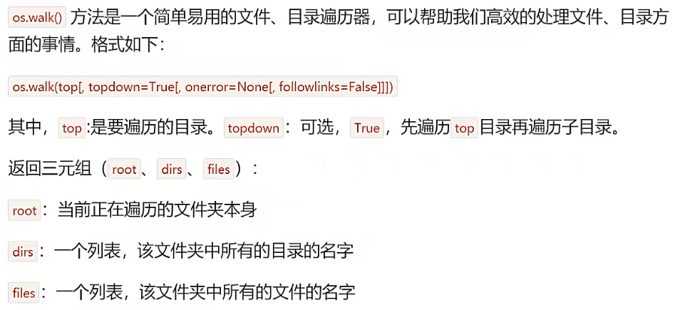

```python
# walk()递归遍历所有文件和目录
import os
path = os.getcwd()
list_files = os.walk(path,topdown=False) #False表示先遍历子目录

for root,dirs,files in list_files: #root表示当前遍历的目录,dirs表示root目录下的子目录,files表示root目录下的文件
    for file_name in files:
        print(os.path.join(root,file_name)) #打印文件
    for dir_name in dirs: 
        print(os.path.join(root,dir_name))  #打印目录
```

## shutil模块(拷贝和压缩)

​	`shutil`模块是python标准库中提供的，主要用来做文件和文件夹的拷贝、移动、删除等；还可以做文件和文件夹的压缩、解压缩操作。

​	`os`模块提供了对目录或文件的一般操作。`shutil`模块作为补充，提供移动、复制、压缩、解压等操作。

```python
# 实现文件的拷贝
import shutil
shutil.copyfile('a.txt','a_copy.txt')
```

```python
# 实现递归的拷贝文件夹内容
# 将文件夹'电影/学习'下面的内容拷贝到文件夹'音乐'下。拷贝时忽略所有的html和htm文件
import shutil
# 音乐文件夹不存在才能使用
shutil.copytree("电影/学习","音乐",ignore=shutil.ignore_patterns('*.html','*htm'))
```

```python
#压缩与解压缩
import shutil
shutil.make_archive('d:/test,'zip','d:/aaa') #将windows D盘下的aaa文件夹压缩成test，格式为zip

#将指定的多个文件压缩到一个zip文件中
import zipfile
z = zipfile.ZipFile('a.zip','w')
z.write('a.txt')
z.write('b.txt')
z.write('c.txt')
z.close()

                    
#解压缩                   
z2 = zipfile.ZipFile('a.zip','r') 
z2.extractall('d:/')                    
```

## 递归遍历目录下所有的文件

```python
# 递归遍历目录树
import os

def my_print_file(path,level):
    child_files = os.listdir(path) #先获取path路径下的所有文件和目录列表
    # 遍历获取到的文件和目录列表
    for file in child_files:
        # 将获取到的文件或目录与根目录拼接并打印
        file_path = os.path.join(path,file)
        print("\t"*level+file_path[file_path.rfind(os.sep)+1:])
        # 再次判断已经打印出的变量是否为目录
        if os.path.isdir(file_path):
            # 如果是目录，则继续查看子目录
            my_print_file(file_path,level+1)

my_print_file('电影',1)
        
```

## 模块化(module)程序设计理念

### 模块和包概念的进化史

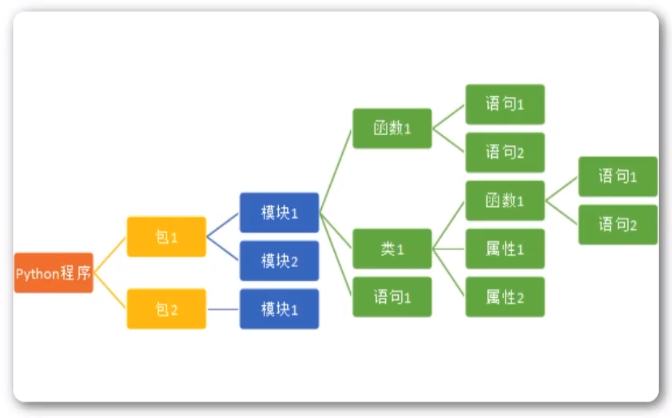

1. Python程序由模块组成。一个模块对应Python源文件，一般后缀名为.py。
2. 模块由语句组成。运行Python程序时，按照模块中语句的顺序依次执行。
3. 语句是Python程序的构造单元，用于创建对象、变量赋值、调用函数、控制语句等。

###  标准库模块(standard library)

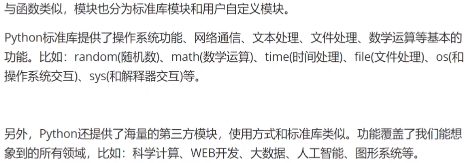

### 为何需要模块化编程

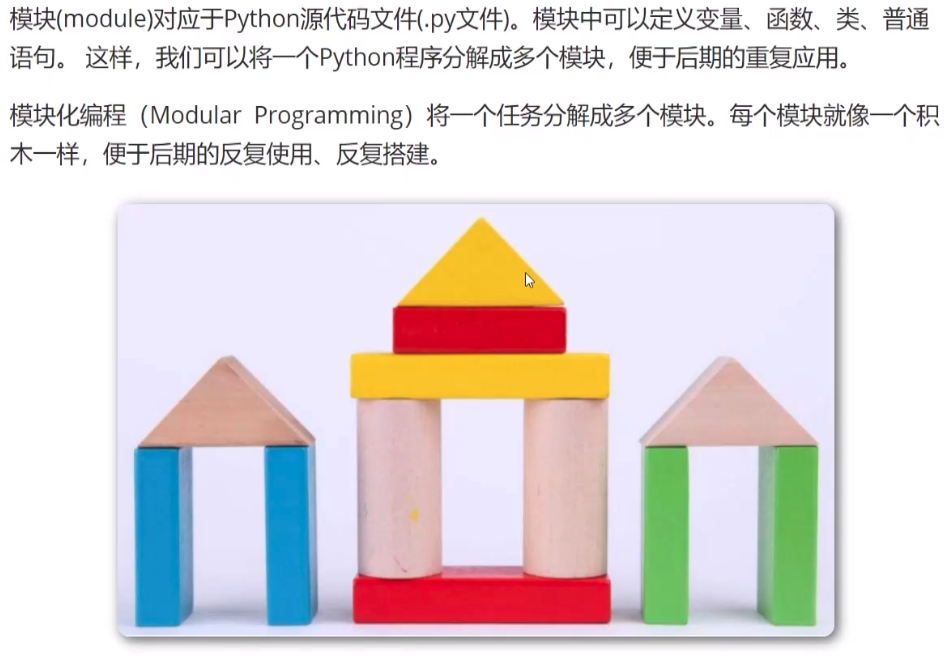

模块化编程的优势：

1. 便于将一个任务分解成多个模块，实现团队协同开发，完成大规模程序。
2. 实现代码复用，一个模块实现后，可以被反复调用。
3. 增强代码的可维护性。

### 模块化编程的流程

​	模块化编程的一般流程：

1. 设计API，进行功能描述。
2. 编码实现API中描述的功能
3. 在模块中编写测试代码，并消除全局代码
4. 使用私有函数实现不被外部客户端调用的模块函数。

### 模块的API和功能描述要点

​	API(Application Programming Interface 应用程序编程接口)是用于描述模块中提供的函数和类的功能描述和使用方法描述。

​	模块化编程中，首先设计的就是模块的API（即要实现的功能描述），然后编码实现API中描述的功能。最后，在其他模块中导入本模块进行调用。

## 模块的导入

​	模块化设计的好处之一就是“代码复用性高”。写好的模块可以被反复调用，重复使用。模块的导入就是在本模块中使用其他模块。

### import语句导入

```python
import 模块名
import 模块一,模块二
import 模块名 as 模块别名 
```

`import`加载的模块分为四种类型：

1. 使用Python编写的代码`.py`文件
2. 已经被编译为共享库或者DDL的C或C++扩展
3. 一组模块的包
4. 使用C编写并链接到Python解释器的内置模块

使用import导入一个模块时，本质上是使用了内置函数`__import__()`。Python解释器会生成一个对象，这个对象就代表了被加载的模块。

### from...import导入

Python可以使用from...import导入模块中的成员

`from 模块名 import 成员1,成员2...`

如果希望导入一个模块中所有的成员，则可以使用：

`from 模块名 import *`

### `__import__()`动态导入

`import`语句本质上是调用内置函数`__import__()`，可以通过它实现动态导入，给`__import__()`动态传入不同的参数值，就能导入不同的模块

```python
# 使用__import__()动态导入指定的模块
s = 'math'
m = __import__(s) #导入后生成的模块对象的引用给变量m
print(m.pi)
```

动态导入一般使用importlib模块

```python
import importlib
a = importlib.import_module('math')
print(a.pi)
```

### 模块的加载问题

当导入一个模块时，模块中的代码都会被执行。如果再次导入该模块，则不会再次执行。

**一个模块无论导入多少次，这个模块在解释器进程内有且仅有一个实例对象。**

### 模块的重新加载

```python
import importlib
importlib.reload('模块名')
```

## 包(package)的使用

包就是一个必须有`__init__.py`的文件夹。结构如下：


包下面可以包含模块(module)，也可以再包含子包(subpackage)。

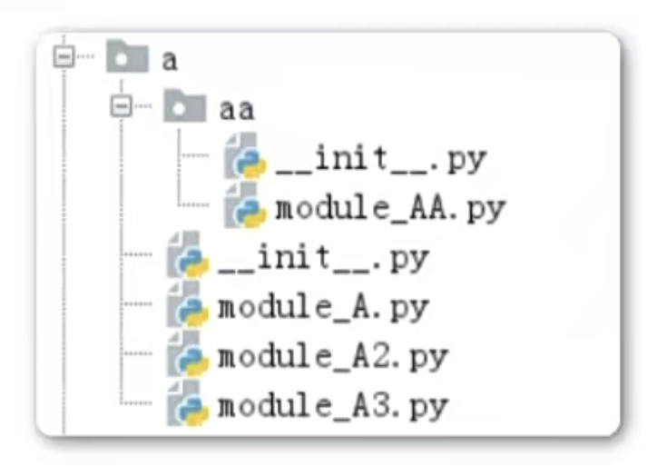

导入包的本质是**导入了包的`__init__.py`文件**，也就是说，`import package`意味着执行了包`package`下面的`__init__.py`文件。

`__init__.py`的三个核心作用：

1. 作为包的标识，不能删除。
2. 导入包实质上是执行`__init__.py`文件，可以在`__init__.py`文件中做这个包的初始化。

## 包的模糊导入

​	`import *`这样的语句是希望文件系统找出包中所有的子模块，然后导入他们，会耗费很长时间，解决方案是提供一个明确的包索引。

​	这个索引由`__init__.py`定义`__all__`变量，该变量是一个列表，例如：`__all__=['module1','module2']`

导入包时，只会导入`__all__`指定的模块。

## 库(Library)

通常将某个功能的"模块的集合"称为库

### 标准库(Standard Library)

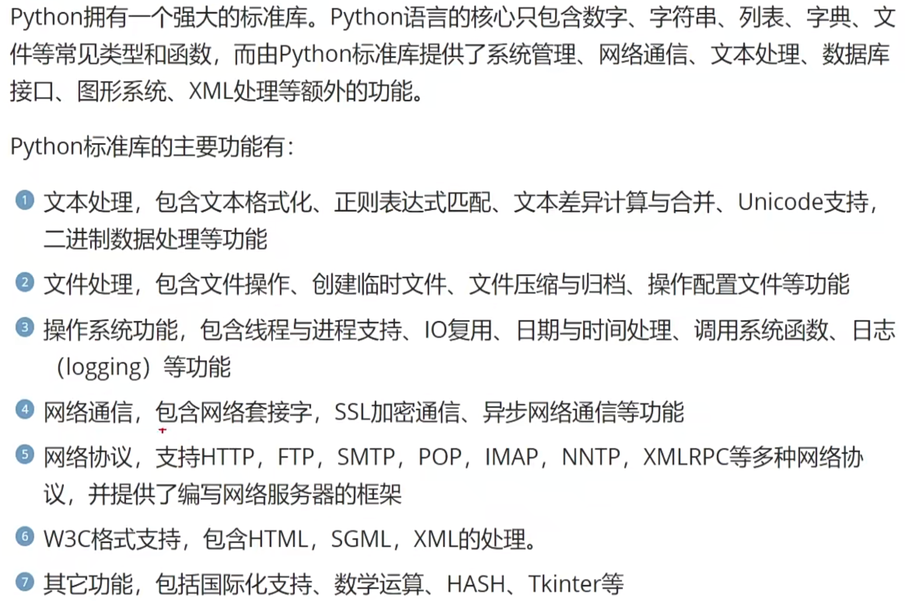


