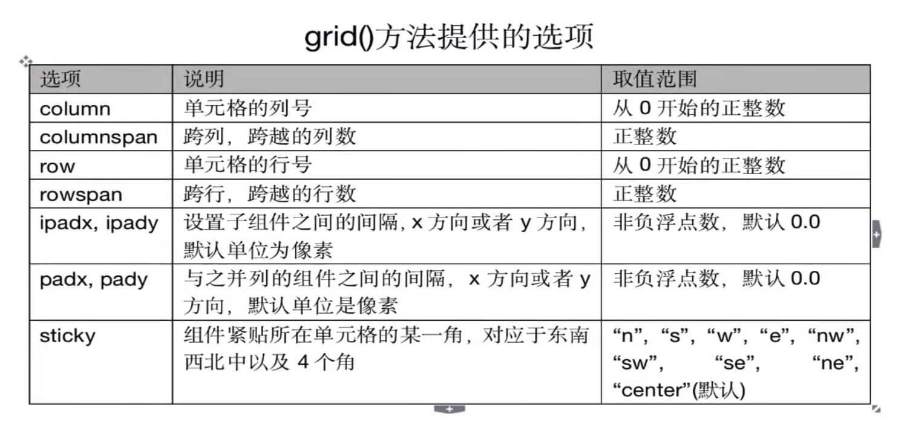
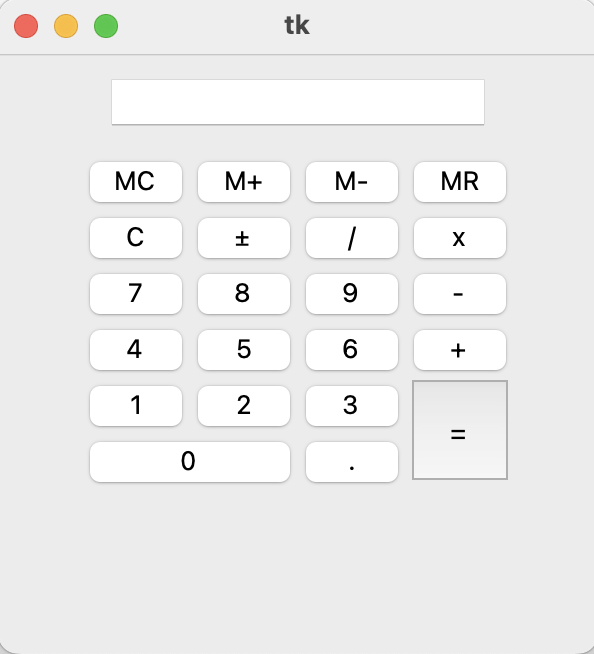
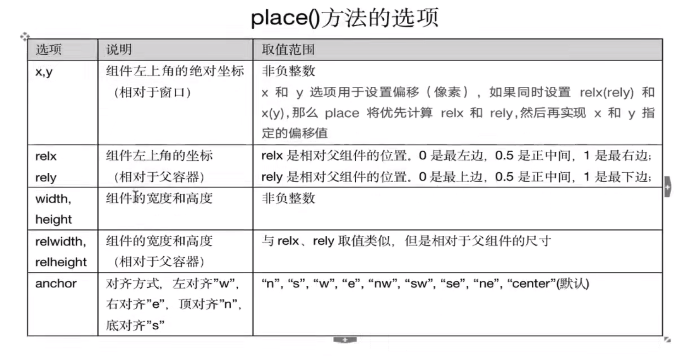
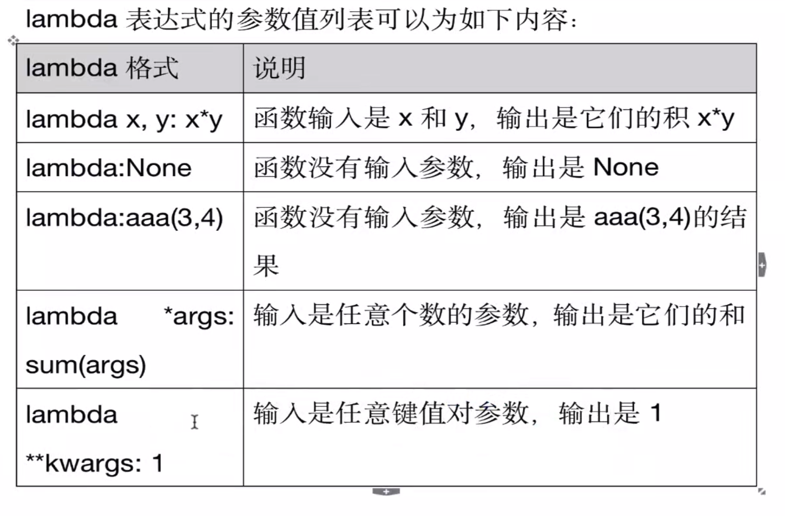
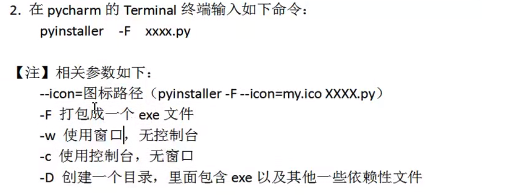

# GUI(Graphics User Interface )图形用户界面编程

**https://docs.python.org/zh-cn/3.13/library/tk.html**

## 常用的GUI库

1. Tkinter：tkinter(TK interface)是Python的标准GUI库，支持跨平台的GUI程序开发，适合小型的GUI程序编写。
2. wxPython：适合大型应用程序开发，整体设计框架类似于MFC(Microsoft Foundation Classes微软基础类库)
3. PyQT：Qt是一个开源的GUI库，适合大型GUI程序开发，PyQT是Qt工具包标准的Python实现，可以使用Qt Designer界面设计器快速开发GUI应用程序。

## 第一个GUI程序

```python
from tkinter import *
from tkinter import messagebox
root = Tk() # 创建窗口对象

btn01 = Button(root) # 创建一个Button对象，放入到窗口对象
btn01['text'] = '这是一个按钮'
btn01.pack()

def func1(e):  # e就是事件对象
    messagebox.showinfo('Message','这是一个函数')
    print('打印信息')

btn01.bind('<Button-1>',func1)

root.mainloop() # 调用组件的mainloop()方法，进入事件循环

```

## PEP8编码规范

**https://pep8.org/**

## 主窗口位置和大小

​	通过geometry('W x H ± x ± y')进行设置。W为宽度，H为高度，+ x 表示距屏幕左边的距离；+ y 表示距离屏幕上边的距离。

```
from tkinter import *
from tkinter import messagebox
root = Tk() # 创建窗口对象
root.title('我的第一个GUI程序') # 设置标题
root.geometry('1000x800+400+150') # 设置主窗口的大小和位置

btn01 = Button(root) # 创建一个Button对象，放入到窗口对象
btn01['text'] = '这是一个按钮'
btn01.pack()

def func1(e):  # e就是事件对象
    messagebox.showinfo('Message','这是一个函数')
    print('打印信息')

btn01.bind('<Button-1>',func1)

root.mainloop() # 调用组件的mainloop()方法，进入事件循环
```

## GUI编程整体描述


## 常用组件列表


## GUI应用程序的经典写法

​	通过类Application组织整个GUI程序，类Application继承了Frame及通过继承拥有了父类的特性。通过构造函数`__init__()`初始化窗口中的对象，通过createWidgets()方法创建窗口中的对象。

​	Frame框架是一个tkinter组件，表示一个矩形的区域。Frame一般作为容器使用，可以放置其他组件，从而实现复杂的布局。

## Label标签

Label(标签)主要用于显示文本信息，也可以显示图像。

​	常见属性如下：

1. width，height：用于指定区域大小，如果显示是文本，则以单个英文字符大小为单位(一个汉字宽度占两个字符位置，高度和英文字符一样)；如果显示为图像，则以像素为单位。默认值是根据具体显示的内容动态调整。
2. font：指定字体和字体大小，如：font=（font_name，size）
3. image：显示在Label上的图像，目前tkinter只支持gif格式。
4. fg和bg：fg（foreground）：前景色、bg（background）：背景色
5. justify（对齐方式）

##  Options选项详解

​		可以使用三种方式设置Options选项，从而控制组件的各种状态

1. 创建对象时，使用命名参数（关键字参数）

   ```python
   fred = Button(self,fg="red",bg="blue")
   ```

2. 创建对象后，使用字典索引方式

   ```python
   fred["fg"]="red"
   fred["bg"]="blue"
   ```

3. 创建对象后，使用config()方法

   ```python
   fred.config(fg="red",bg="blue")
   ```

## Button

​	Button(按钮)用来执行用户的单机操作。Button可以包含文本，也可以包含图像。按钮被单击后会自动调用对应事件绑定的方法。

## Entry单行文本框

​	Entry是用来接收一行字符串的控件。如果用户输入的文字长度长于Entry组件的宽度，文字便会自动向后滚动。

## Text多行文本框

​	Text主要用于显示多行文本，还可以显示网页链接，图片，HTML页面，甚至CSS样式表，添加组件等。可以被当作简单的文本编辑器使用。 

## Radiobutton单选按钮

​	Radiobutton控件用于选择同一组单选按钮中的同一个。Radiobutton可以显示文本，也可以显示图像。

## Checkbutton复选按钮

​	Checkbutton用于选择多个按钮的情况。Checkbutton可以显示文本，也可以显示图像。

```python
"""测试Checkbutton按钮"""
from tkinter import *
from tkinter import messagebox

class Application(Frame):
    def __init__(self,master=None):
        super().__init__(master) # super()代表的是父类的定义，而不是父类对象
        self.master = master
        self.pack()
        self.createWidget()


    def createWidget(self):
        self.codeHobby = IntVar()
        self.videoHobby = IntVar()
        print(self.codeHobby.get()) # 默认是0

        self.c1 = Checkbutton(self,text="敲代码",variable=self.codeHobby,onvalue=1,offvalue=0)
        self.c2 = Checkbutton(self,text="看视频",variable=self.videoHobby,onvalue=1,offvalue=0)

        self.c1.pack(side="left")
        self.c2.pack(side="left")

        Button(self,text="确定",command=self.confirm).pack(side="bottom")


    def confirm(self):
        if self.codeHobby.get() == 1:
            messagebox.showinfo(message="我是程序猿")
        if self.videoHobby.get() ==1:
            messagebox.showinfo(message="我喜欢刷短视频")


if __name__ =='__main__':
    root = Tk()
    root.geometry("800x600+300+300")
    app = Application(master=root)
    #root.wm_attributes("-topmost",True)
    root.mainloop()
```


##  Canvas画布

​	canvas是一个矩形区域，可以放置图形、图像、组件等

```python
"""测试canvas组件的基本用法"""
import random
from tkinter import *
from tkinter import messagebox

class Application(Frame):
    def __init__(self,master=None):
        super().__init__(master)
        self.master = master
        self.pack()
        self.createWidget()


    def createWidget(self):
        self.canvas = Canvas(self,width=600,height=400,bg="green")
        self.canvas.pack()
        # 画一条直线(折线，每一对坐标是一个点，左手系，左上角坐标为（0，0）)
        line = self.canvas.create_line(0,10,20,20,30,50)

        # 画一个矩形
        rect = self.canvas.create_rectangle(50,50,100,100)

        # 画一个椭圆，两个坐标为椭圆边界矩形的左上角和右下角
        oval = self.canvas.create_oval(50,50,100,100)

        global photo
        photo = PhotoImage(file="./image/doro.gif")
        self.canvas.create_image(220,220,image=photo)

        # 绘制矩形
        Button(self,text="画10个矩形",command=self.draw50Recg).pack(side="left")

        # 退出按钮
        Button(self,text="退出",command=root.destroy).pack(side="left")


    def draw50Recg(self):
        for i in range(10):
            x1 = random.randrange(int(self.canvas['width'])/2)
            y1 = random.randrange(int(self.canvas['height'])/2)
            x2 = x1 + random.randrange(int(self.canvas['width'])/2)
            y2 = y1 + random.randrange(int(self.canvas['height']) / 2)

            self.canvas.create_rectangle(x1,y1,x2,y2)
        messagebox.showinfo(message="绘制成功")

if __name__ == "__main__":
    root = Tk()
    root.geometry("800x600+300+300")
    app = Application(master=root)
    root.mainloop()
```

## 布局管理器

​	布局管理器负责排列GUI程序的各个组件

### gird布局管理器

​	grid表格布局，采用表格结构组织组件。子组件的位置由行和列的单元格确定，并且可以跨行或者夸列，从而实现复杂的布局。



 

```python
"""测试grid布局管理器"""
from tkinter import *

class Application(Frame):
    def __init__(self,master=None):
        super().__init__(master)
        self.master = master
        self.pack()
        self.createWidget()


    def createWidget(self):
        """通过布局管理器实现登陆界面"""
        self.label01 = Label(self,text="用户名")
        self.label01.grid(row=0,column=0)
        self.entry01 = Entry(self)
        self.entry01.grid(row=0,column=1)
        Label(self,text="用户名为手机号").grid(row=0,column=2)

        Label(self,text="密码").grid(row=1,column=0)
        Entry(self,show="*").grid(row=1,column=1)

        Button(self,text="登陆").grid(row=2,column=1,sticky=EW)
        Button(self,text="取消",command=root.destroy).grid(row=2,column=2,sticky=W)


if __name__ == "__main__":
    root = Tk()
    root.geometry("800x600+300+300")
    app = Application(master=root)
    root.mainloop()
```

### 使用grid布局设计计算器界面



```python
"""使用grid布局设计计算器的界面"""
from tkinter import *

class Application(Frame):
    def __init__(self,master=None):
        super().__init__(master)
        self.master = master
        self.pack()
        self.createWidget()

    def createWidget(self):
        """通过grid布局实现计算器的界面，7行4列"""
        btnText = (("MC","M+","M-","MR"),
                   ("C","±","/","x"),
                   ("7","8","9","-"),
                   ("4","5","6","+"),
                   ("1","2","3","="),
                   ("0","."))
        Entry(self).grid(row=0,column=0,columnspan=4,pady=10)

        for rindex,r in enumerate(btnText):
            for cindex,c in enumerate(r):
                if c == "=":
                    Button(self,text=c,width=2).grid(row=rindex+1,rowspan=2,column=cindex,sticky=NSEW)
                elif c == "0":
                    Button(self,text=c,width=2).grid(row=rindex+1,column=cindex,columnspan=2,sticky=NSEW)
                elif c == ".":
                    Button(self,text=c,width=2).grid(row=rindex+1,column=cindex+1,sticky=NSEW)

                else:
                    Button(self,text=c,width=2).grid(row=rindex+1,column=cindex,sticky=NSEW)


if __name__ == "__main__":
    root = Tk()
    root.geometry("300x300+800+300")
    app = Application(master=root)
    root.mainloop()
```

### pack布局管理器

​	pack按照组件的创建顺序将子组件添加到父组件中，按照垂直或者水平的方向自然排布。如果不指定任何选项，默认在父组件中自顶向下垂直添加组件

### place布局管理器

​	place布局管理器可以通过坐标精确控制组件的位置，适用于一些布局更加灵活的场景。



## 事件处理

​	一个GUI应用的整个生命周期都处在一个消息循环中（event loop）中，它等待事件的发生，并作出相应的处理。Tkinter提供了用以处理相关事件的机制，处理函数可以被绑定给各个组件的各种事件。widget.bind(event,handler)：如果相关事件发生，handler函数会被触发，事件对象event会传递给handler函数。

## Lambda表达式实现参数传递

​	lambda表达式定义的是一个匿名函数，只适合简单输入参数，简单计算返回结果，不适合功能复杂的情况

格式：`lambda 参数值列表：表达式`

```python
add3args = lambda x,y,z:x+y+z
# print(add3args(10,20,30))
#上面的lambda表达式相当于如下函数定义
def add3args(x,y,z):
		return x+y+z
```



## 多种事件绑定机制

- 组件对象的绑定

  1.   通过command属性绑定（适合不需要获取event对象的情况）

     `Button(root,text="登陆",command=login)`	

  2. 通过bind()方法绑定（适合需要获取event对象）

     `C1 = Canvas();`

     `C1.bind("<Button-1>",drawLine)`

- 组件类的绑定

  调用对象的bind_class函数，将该组件类所有的组件绑定事件：

  `w.bind_class("Widget","event",eventhanler)`

  例如：

  `btn01.bind_class("Button","<Button-1>",func)`

## OptionMenu选择项

```python
"""OptionMenu的使用测试"""
from tkinter import *

root = Tk()
root.geometry("200x100")
v = StringVar(root)
v.set("鸡")
om = OptionMenu(root,v,"狗","猫","鸭","牛")
om['width'] = 10
om.pack()


def test1():
    print("最喜欢的动物：",v.get())

Button(root,text="确定",command=test1).pack()

root.mainloop()

```

## Scale移动滑块

​	scale用于在指定的数值区间，通过滑块的滑动来选择值。

```python
"""Scale滑块的使用测试"""
from tkinter import *

root = Tk()
root.geometry("400x300")

def test1(value):
    print("滑块的值为：",value)
    newFont = ("宋体",value)

    # 调整字体大小
    a.config(font=newFont)


s1 = Scale(root,from_=5,to=25,length=250,tickinterval=2,orient="horizontal",command=test1)
s1.pack()
a = Label(root,text="Hello World!",width=15,height=2,bg="grey",fg="blue")
a.pack()

root.mainloop()
```

## 颜色选择框

​	颜色选择框可以帮助我们设置背景色、前景色、画笔颜色、字体颜色等。

```python
"""askcolor颜色选择框的测试"""
from tkinter import *
from tkinter.colorchooser import *

root = Tk()
root.geometry("400x200")

def test1():
    s1 = askcolor(color="white",title="选择背景色")
    print(s1)
    root.config(bg=s1[1])

Button(root,text="选择背景色",command=test1).pack()
root.mainloop()
```


## 文件对话框

```python
"""文件对话框选择文件"""
from tkinter import *
from tkinter.filedialog import *

root = Tk()
root.geometry("400x150")

def test1():
    f = askopenfilename(title="上传文件",
                        initialdir='/',filetypes=[("文本文件",".txt")])
    show['text'] = f
Button(root,text="选择Python文件",command=test1).pack()

show = Label(root,width=40,height=3,bg="yellow")
show.pack()

root.mainloop()

```

```python

from tkinter import *
from tkinter.filedialog import *

root = Tk()
root.geometry("400x150")

def test1():
    with askopenfile(title="上传文件",initialdir='/',filetypes=[("文本文件",".txt")]) as f:
        show['text'] = f.read()
Button(root,text="选择需要读取的文本文件",command=test1).pack()

show = Label(root,width=40,height=3,bg="yellow")
show.pack()

root.mainloop()
```

## 简单输入对话框

```python
"""简单对话框"""
from tkinter import  *
from tkinter.simpledialog import *

root = Tk()
root.geometry("400x200")
def test1():
    a = askinteger(title="输入年龄",prompt="请输入年龄",initialvalue=18,minvalue=1,maxvalue=128)
    show['text'] = a
Button(root,text="你的年龄是？请输入",command=test1).pack()

show = Label(root,width=40,height=3,bg="yellow")
show.pack()

root.mainloop()

```

## 通用消息框

​	messagebox(通用消息框)用于和用户的简单交互，需要用户点击确定、取消。

## ttk子模块控件

​	为弥补tkinter组件的不足，ttk组件新增了LabelScale（带标签的Scale）、NoteBook（多文档窗口）、

Progressbar（进度条）、Treeview（树）等组件。

**文档：https://docs.python.org/zh-cn/3.10/library/tkinter.ttk.html#module-tkinter.ttk**

## 将Python程序打包成exe文件

可以使用pyinstaller模块实现将python项目打包成exe文件



