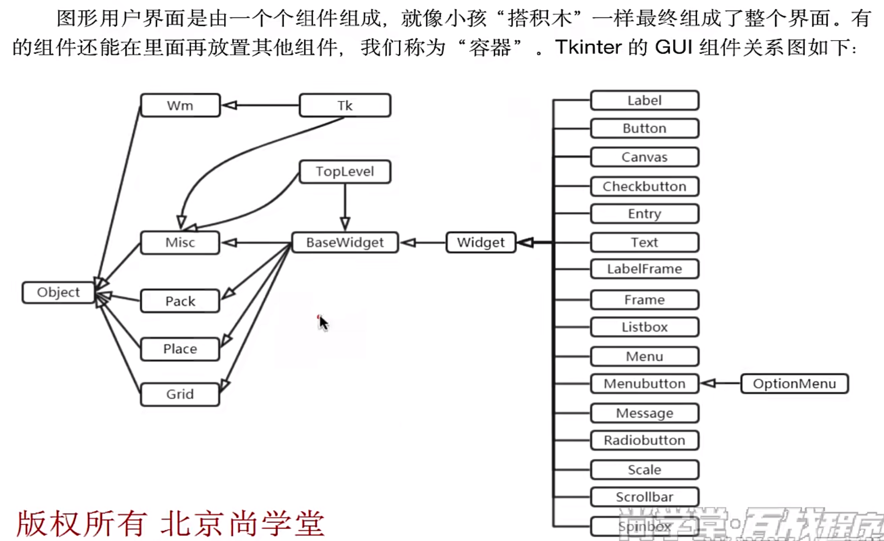
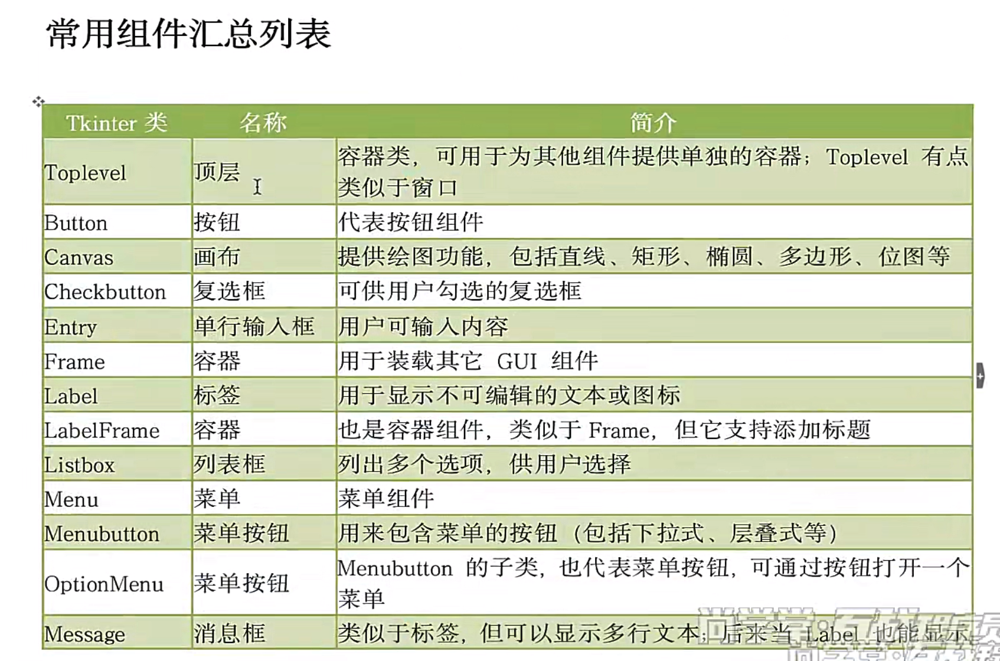
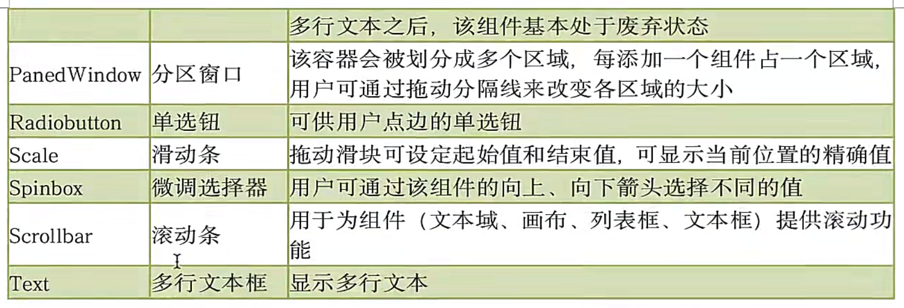

# GUI(Graphics User Interface )图形用户界面编程

**https://docs.python.org/zh-cn/3.13/library/tk.html**

## 常用的GUI库

1. Tkinter：tkinter(TK interface)是Python的标准GUI库，支持跨平台的GUI程序开发，适合小型的GUI程序编写。
2. wxPython：适合大型应用程序开发，整体设计框架类似于MFC(Microsoft Foundation Classes微软基础类库)
3. PyQT：Qt是一个开源的GUI库，适合大型GUI程序开发，PyQT是Qt工具包标准的Python实现，可以使用Qt Designer界面设计器快速开发GUI应用程序。

## 第一个GUI程序

```python
from tkinter import *
from tkinter import messagebox
root = Tk() # 创建窗口对象

btn01 = Button(root) # 创建一个Button对象，放入到窗口对象
btn01['text'] = '这是一个按钮'
btn01.pack()

def func1(e):  # e就是事件对象
    messagebox.showinfo('Message','这是一个函数')
    print('打印信息')

btn01.bind('<Button-1>',func1)

root.mainloop() # 调用组件的mainloop()方法，进入事件循环

```

## PEP8编码规范

**https://pep8.org/**

## 主窗口位置和大小

​	通过geometry('W x H ± x ± y')进行设置。W为宽度，H为高度，+ x 表示距屏幕左边的距离；+ y 表示距离屏幕上边的距离。

```
from tkinter import *
from tkinter import messagebox
root = Tk() # 创建窗口对象
root.title('我的第一个GUI程序') # 设置标题
root.geometry('1000x800+400+150') # 设置主窗口的大小和位置

btn01 = Button(root) # 创建一个Button对象，放入到窗口对象
btn01['text'] = '这是一个按钮'
btn01.pack()

def func1(e):  # e就是事件对象
    messagebox.showinfo('Message','这是一个函数')
    print('打印信息')

btn01.bind('<Button-1>',func1)

root.mainloop() # 调用组件的mainloop()方法，进入事件循环
```

## GUI编程整体描述



## 常用组件列表





## GUI应用程序的经典写法

​	通过类Application组织整个GUI程序，类Application继承了Frame及通过继承拥有了父类的特性。通过构造函数`__init__()`初始化窗口中的对象，通过createWidgets()方法创建窗口中的对象。

​	Frame框架是一个tkinter组件，表示一个矩形的区域。Frame一般作为容器使用，可以放置其他组件，从而实现复杂的布局。

## Label标签

Label(标签)主要用于显示文本信息，也可以显示图像。

​	常见属性如下：

1. width，height：用于指定区域大小，如果显示是文本，则以单个英文字符大小为单位(一个汉字宽度占两个字符位置，高度和英文字符一样)；如果显示为图像，则以像素为单位。默认值是根据具体显示的内容动态调整。
2. font：指定字体和字体大小，如：font=（font_name，size）
3. image：显示在Label上的图像，目前tkinter只支持gif格式。
4. fg和bg：fg（foreground）：前景色、bg（background）：背景色
5. justify（对齐方式）


