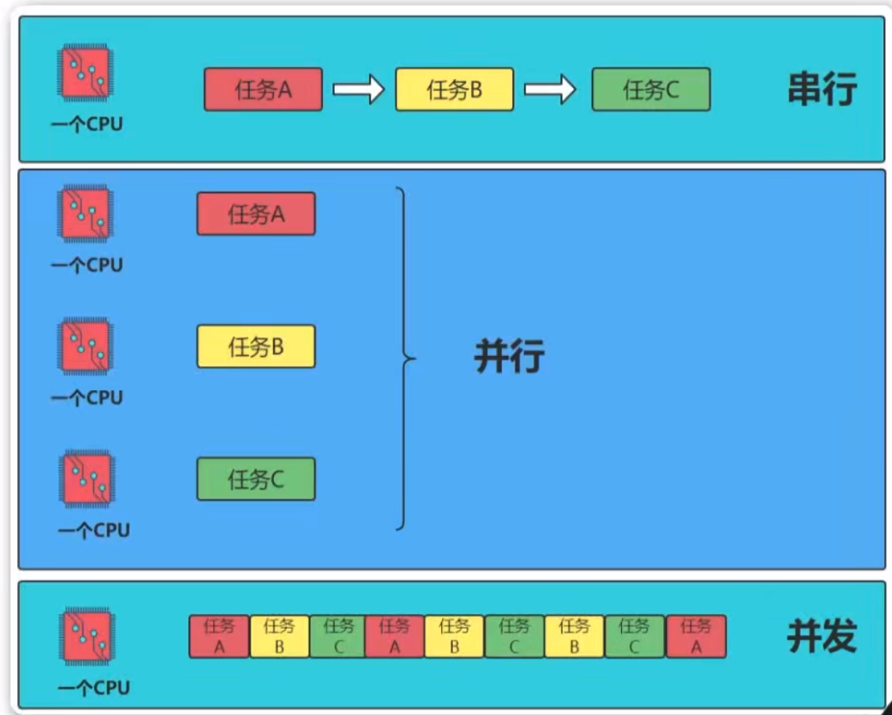
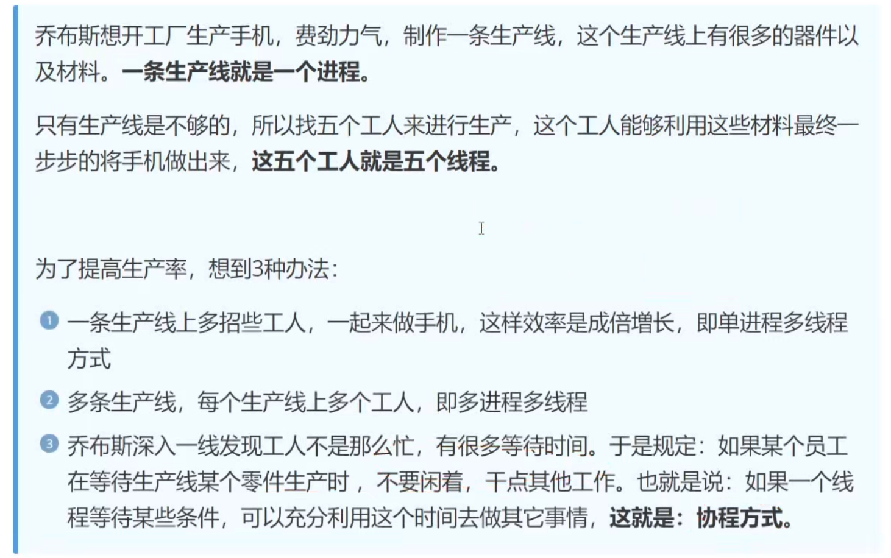
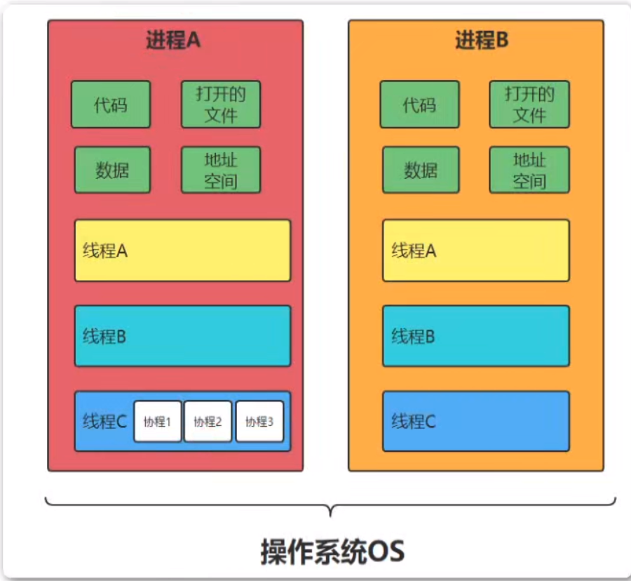
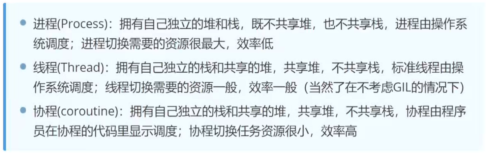
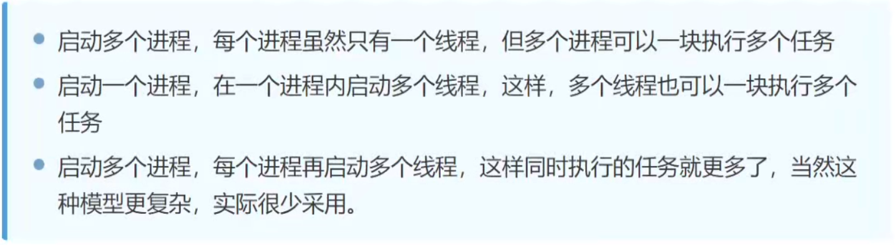
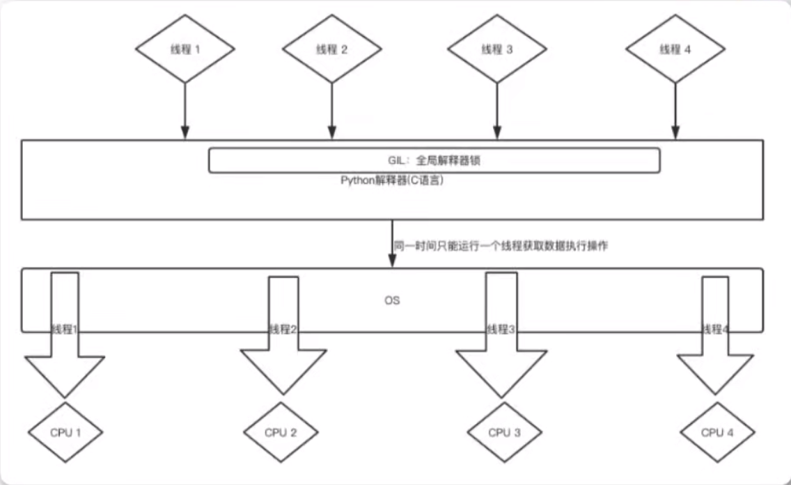
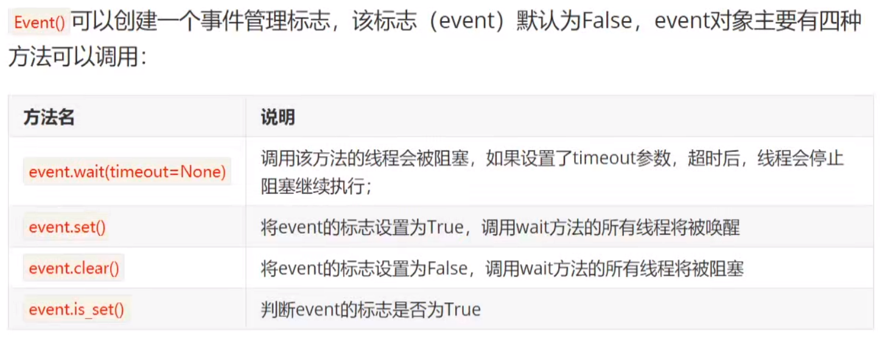
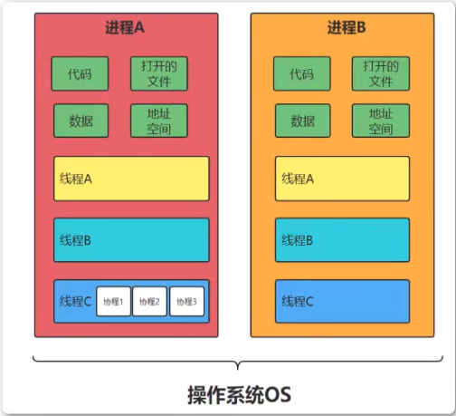

## 并发编程介绍

### 串行、并行、并发的区别



1. 串行（serial）：一个cpu上，按顺序完成多个任务
2. 并行（parallelism）：指的是任务数小于等于cpu核心数，即任务真的是一起执行
3. 并发（concurrency）：一个cpu采用时间片管理方式，交替的处理多个任务。一般是任务数多于cpu核心数，通过操作系统的各种任务调度算法，实现用多个任务一起执行（实际上总有一些任务在等待分配时间片，因为切换任务的速度很快，看上去是一起执行而已。）

## 进程、线程、协程的区别






1. 线程是程序执行的最小单位，进程是操作系统分配资源的最小单位
2. 一个进程由一个或多个线程组成，线程是一个进程中代码的不同执行路线
3. 进程之间相互独立，但同一个进程下的各个线程共享程序的内存空间（包括代码段、数据集、堆等）以及一些进程级的资源（如打开文件和信号），某进程内的线程在其它进程不可见
4. 调度和切换：线程上下文切换比进程上下文切换要快的多



### 进程是什么？

​	进程（Process）是一个具有一定独立功能的程序关于某个数据集合的一次运行活动

### 线程是什么？

​	线程（Thread）是操作系统能够进行运算调度的最小单位。它被包含在进程之中，是进程中的实际运作单位。

### 并发编程解决方案

多任务的实现有三种方法

1. 多进程模式
2. 多线程模式
3. 多进程+多线程模式



### 协程是什么？

协程（Coroutines），也叫做纤程（Fiber），是一种在线程中，比线程更加轻量级的存在，由程序员自己写程序管理。

## 同步和异步

同步和异步强调的是消息通信机制（synchronous communication /asynchronous communication ）

​	同步（synchronous communication ）：A调用B，等待B返回结果后，A继续执行。

​	异步（asynchronous communication ）：A调用B，A继续执行，不等待B返回结果；B处理完毕后，通知A，A再做处理。

## 线程（Thread）

1. **线程（Thread）**是操作系统能够进行运算调度的最小单位，它被包含在进程之中，是进程中的实际运作单位。
2. 线程是程序执行的最小单位，而进程是操作系统分配资源的最小单位。
3. 一个进程由一个或多个线程组成，线程是一个进程中代码的不同执行路线。
4. 线程拥有自己独立的栈和共享的堆，标准线程由操作系统调度。
5. 线程上下文切换比进程上下文切换要快的多。

### 创建线程

​	Python的标准库提供了两个模块：`_thread`和`threading`,`_thread`是低级模块，`threading`是高级模块，对`_thread`进行了封装。

线程的创建可以通过两种方式：

1. 方法包装
2. 类包装

线程的执行统一通过`start()`方法

### 线程的创建方式（方法包装）

```python
from threading import Thread
from time import sleep

def func1(name):
    print("线程{},start".format(name))
    for i in range(3):
        print("线程:{0},{1}".format(name,i))
        sleep(3)
    print("线程{},end".format(name))


if __name__ == '__main__':
    print("主线程,start")
    # 创建线程
    t1 = Thread(target=func1,args=("t1",))
    t2 = Thread(target=func1,args=("t2",))
    # 启动线程
    t1.start()
    t2.start()

    print("主线程,end")
```

### 线程的创建方式（类包装）

```python
from threading import Thread
from time import sleep

class MyThread(Thread):
    def __init__(self,name):
        Thread.__init__(self)
        self.name = name

    # 重写run函数
    def run(self):
        name = self.name
        print("线程:{},start".format(name))
        for i in range(3):
            print("线程:{0},{1}".format(name, i))
            sleep(3)
        print("线程:{},end".format(name))

if __name__ == '__main__':
    print("主线程,start")
    # 创建线程
    t1 = MyThread("t1")
    t2 = MyThread("t2")
    # 手动启动线程 后自动调用run()函数
    t1.start()
    t2.start()

    print("主线程,end")
```

## join()

​	如果需要等待子线程结束后，再结束主线程，可以使用join()方法

```python
from threading import Thread
from time import sleep

def func1(name):
    print("线程{},start".format(name))
    for i in range(3):
        print("线程:{0},{1}".format(name,i))
        sleep(3)
    print("线程{},end".format(name))
    

if __name__ == '__main__':
    print("主线程,start")
    # 创建线程
    t1 = Thread(target=func1,args=("t1",))
    t2 = Thread(target=func1,args=("t2",))
    # 启动线程
    t1.start()
    t2.start()
    # 主线程会等待t1,t2结束后,再往下执行
    t1.join()
    t2.join()

    print("主线程,end")
```

## 守护线程

​	在行为上还有一种叫守护线程，主要的特征是它的生命周期。主线程死亡，它也就随之死亡。在Python中，线程通过`setDaemon(True|False)`来设置是否为守护线程。

守护线程的作用：

​	守护线程的作用是为其它线程提供便利的服务，守护线程最典型的应用就是GC（垃圾收集器）。

```python
from threading import Thread
from time import sleep

class MyThread(Thread):
    def __init__(self,name):
        # 自动查找并调用父类Thread的初始化方法
        super().__init__()
        self.name = name
    def run(self):
        for i in range(3):
            print("thread:{0},{1}".format(self.name,i))
            sleep(3)


if __name__ == '__main__':
    print("主线程,start")
    # 类方式创建线程
    t1 = MyThread("t1")
    # 将t1设置为守护线程
    t1.daemon = True
    #t1.setDaemon(True)
    # 启动线程
    t1.start()
    print("主线程,end")
```

## 全局锁GIL问题

### Python GIL(Global Interpreter Lock)

​	Python代码的执行由Python虚拟机(也叫解释器主循环,CPython版本)来控制，Python在任意时刻只有一个线程在解释器中运行，对虚拟机的访问由全局解释器锁（GIL）控制。



## 线程同步和互斥锁

### 线程同步

​	**处理多线程问题时，多个线程访问同一个对象，并且某些线程还想修改这个对象。这时候，我们就需要用到“线程同步”。线程同步其实就是一种等待机制，多个需要同时访问此对象的线程进入这个对象的等待池形成队列，等待前面的线程使用完成后，下一个线程再使用。**

### 锁机制实现线程同步

锁机制注意事项：

1. 必须使用同一个锁对象
2. 互斥锁的作用就是保证同一时刻只能有一个线程去操作共享的数据，保证共享的数据不会出现错误
3. 使用互斥锁能确保**某段关键代码可以由一个线程从头到尾完整执行**	
4. 使用互斥锁会影响代码的执行效率
5. 同时拥有多把锁，容易出现死锁

### 互斥锁

​	互斥锁：对共享数据进行锁定，保证同一时刻只能有一个线程去操作。

**互斥锁是多个线程一起抢夺，得到锁的线程先执行，没有抢到锁的进程需要等待，互斥锁使用完毕释放后，其它的线程再去抢这个锁**

```
# 互斥锁
from threading import Thread,Lock
from time import sleep


class Account:
    def __init__(self,name,money):
        self.name = name
        self.money = money

# 模拟提款操作
class Drawing(Thread):
    def __init__(self,drawingNum,account):
        # 调用父类初始化函数
        super().__init__()
        self.drawingNum = drawingNum
        self.account = account
        self.expenseTotal = 0
    def run(self):
        global lock
        # 获取锁
        #lock.acquire()
        with lock:
            if self.account.money<self.drawingNum:
                print("账户余额不足")
                return
            #sleep(1) # 测试冲突问题
            self.account.money -= self.drawingNum
            self.expenseTotal += self.drawingNum

            print("账户名:{},余额:{}".format(self.account.name,self.account.money))
            print("账户名:{},总共取出金额为:{}".format(self.account.name,self.expenseTotal))
        #lock.release()
if __name__ == '__main__':
    a1 = Account("Jack",100)
    # 互斥锁
    lock = Lock()
    draw1 = Drawing(80,a1) # 第一个取钱的线程
    draw2 = Drawing(100,a1)
    # 启动线程
    draw1.start()
    draw2.start()

```

### 死锁

在多线程程序中，死锁问题很大一部分是由一个线程同时获取多个锁造成的

## 信号量(Semaphore)

​	信号量控制同时访问资源的数量。信号量和锁类似，锁同一时间只允许一个对象（进程）通过，信号量同一时间允许多个对象（进程）通过。

**应用场景**

1. 在读写文件时，一般只能有一个线程在写，而读可以有多个线程同时进行，如果需要限制同时读文件的线程个数，就可以使用信号量。（如果使用互斥锁，就是限制同一时刻只能有一个线程读取文件）
2. 爬虫抓取数据

**原理**

​	信号量底层实现就是一个内置的计数器。每当资源获取时（调用acquire）计数器-1，资源释放时（调用release）计数器+1。

## 事件(Event)

事件Event主要用于唤醒正在阻塞的进程。

**原理**

​	Event对象包含一个可由线程设置的信号标志，它允许线程等待某些事件的发生。在初始情况下，event对象中的信号标志被设置为假。**如果有线程等待一个event对象，而这个event对象的标志为假，那么这个线程将会被一直阻塞直到该标志为真。**一个线程如果将一个event对象的信号标志设置为真，那么它将唤醒所有等待这个event对象的线程。<u>如果一个线程等待一个已经被设置为真的event对象，那么它将忽略这个事件，继续执行。</u>



```
import threading
import time


def chihuoguo(name):
    # 等待事件，进入等待阻塞状态
    print(name+"已经启动")
    print(name+"已经进入就餐状态")
    time.sleep(1)
    event.wait()
    # 收到事件通知后进入运行状态
    print(name+"收到通知")
    print("开始干饭")

if __name__ == '__main__':
    event = threading.Event()
    t1 = threading.Thread(target=chihuoguo,args=("Tom",))
    t2 = threading.Thread(target=chihuoguo,args=("Jack",))
    # 开启线程
    t1.start()
    t2.start()

    time.sleep(5)
    # 发送事件通知
    print("主线程通知：开始干饭")
    event.set()
```

## 生产者消费者模式

### 缓冲区

缓冲区是实现并发的核心，缓冲区的设置有3个好处。

1. 实现线程的并发协作

    ​	有缓冲区以后，生产者线程只需要往缓冲区里面放置数据，而不需要管理消费者消费；同样，消费者只需要从缓冲区拿数据即可。这样就实现了"生产者线程"和"消费者线程"的分离

2. 解耦了生产者和消费者

    生产者不需要和消费者交互

3. 解决忙闲不均，提高效率

    生产者/消费者进程受阻时，消费者/生产者仍然可以从缓冲区内拿取/存放数据。

### 缓冲区和queue对象

​	从一个线程向另一个线程发送数据最安全的方式是使用queue库里的队列。创建一个被多个线程共享的Queue对象，这些线程通过使用put()和get()操作向队列里添加或删除元素。Queue对象已经包含了必要的锁，所以可以通过它在多个线程间安全的共享数据。

```
from queue import Queue
from threading import Thread
from time import sleep


def producer():
    while True:
        global num
        num += 1
        if queue.qsize() < 8:
            print("正在生产{}号馒头".format(num))
            queue.put("馒头{}号".format(num))
        else:
            print("馒头框已满，等待消费中")
        sleep(1)

def consumer():
    while True:
        print("消费{}".format(queue.get()))
        sleep(1)

if __name__ == '__main__':
    num = 0
    queue = Queue()
    # 创建生产者消费者线程
    p1 = Thread(target=producer)
    c1 = Thread(target=consumer)
    # 指定为守护线程
    p1.daemon = True
    c1.daemon = True
    # 启动线程
    p1.start()
    c1.start()
    #
    sleep(10)
    print("主线程结束，守护线程将随之终止，不再生产消费馒头")
```

## 进程Process

​	

​	进程(Process)：拥有自己独立的堆和栈，既不共享堆，也不共享栈，进程由操作系统调度；进程切换时耗费的资源很多，效率低。

### 进程的优缺点

进程的优点：

1. 可以使用计算机多核，进行任务的并行执行，提高执行效率
2. 运行不受其它进程影响，创建方便
3. 空间独立，数据安全

进程的缺点：

- 进程的创建和销毁消耗的系统资源较多

### 进程的创建方式

Python的标准库提供了：`multiprocessing`

进程的创建可以通过两种方式：

1. 方法包装
2. 类包装

创建进程后，使用start()启动进程。

