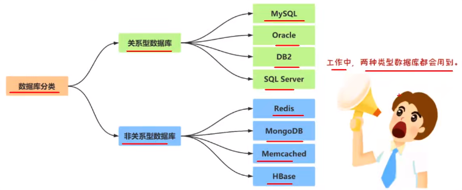
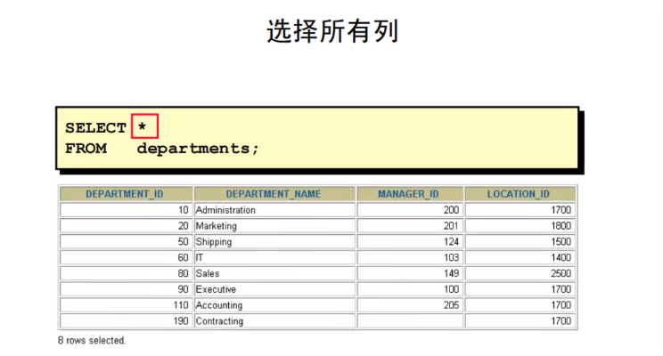
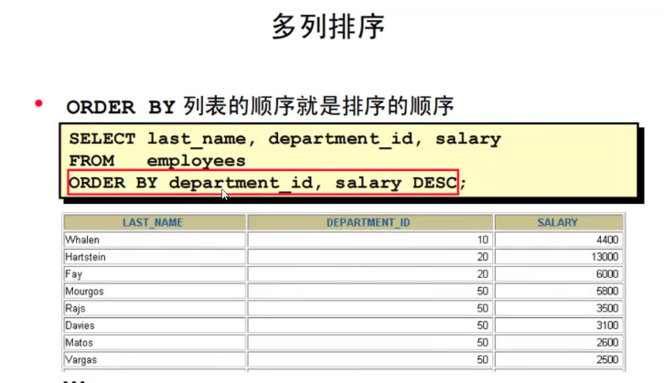
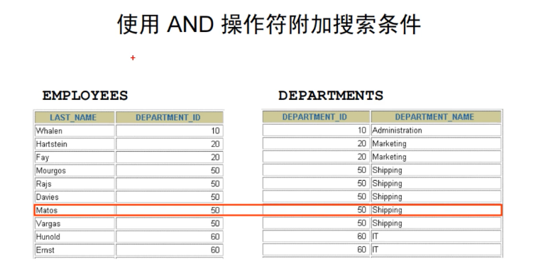
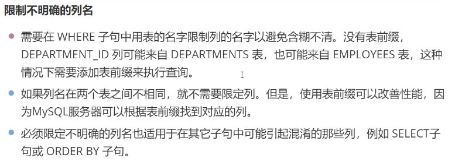
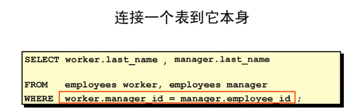
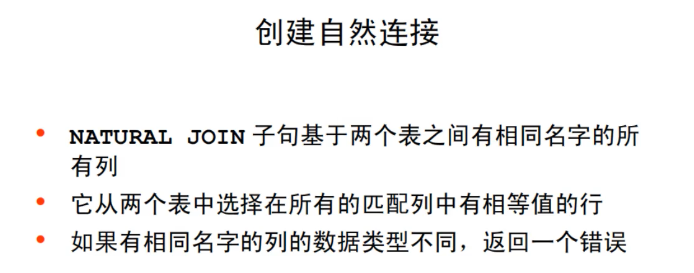

# Mysql数据库


## 数据库基本概念


## 数据库分类



### 关系型数据库

​	关系型数据库最典型的数据结构是表，由二维表及其之间的联系所组成的一个数据组织。可以采用结构化查询语言（SQL）对数据库进行操作。

优点：

1. 易于维护：都是使用表结构，格式一致
2. 使用方便：SQL语言通用，可用于复杂查询
3. 支持复杂操作：可用于一个表以及多个表之间复杂的查询

缺点：

1. 读写性能较差，尤其是海量数据的高效率读写
2. 表结构固定，缺少灵活性
3. 高并发读写需求，硬盘I/O是很大的瓶颈

### 非关系型数据库

​	非关系型数据库也称之为NoSQL数据库，是一种数据结构花存储方法的集合，可以是文档、键值对等。

优点：

1. 格式灵活：存储数据的格式可以是键值对、文档、图片等，使用灵活，应用场景广泛，而关系型数据库只支持基础类型
2. 速度快：NoSQL可以使用硬盘或者随机存储器作为载体，而关系型数据库只支持硬盘。
3. 高扩展性
4. 成本低：NoSQL数据库部署简单，基本都是开源软件

缺点：

1. 不提供SQL支持，学习和使用成本高
2. 无事务处理
3. 数据结构相对复杂，复杂查询方面欠佳

# MySQL基础知识

## MySQL简介

​	MySQL是一个关系型数据库管理系统，它将数据存放到不同的表中，而不是将所有数据放在一个大仓库内，这样可以增加速度并提高灵活性

## MySQL特点

​	MySQL是开源的，MySQL支持大型系统的数据库，可以处理上千万条记录的大型数据库，它使用标准的SQL数据语言格式。可运行于多种系统上，支持多种语言。MySQL存储数据量较大，32位系统表文件最大可支持4GB，64位系统支持最大的表文件为8TB。

# SQL语言


## SQL语言

​	结构化查询语言（Structured Query Language）简称SQL，是一种数据库查询和程序设计语言，主要用于存取数据以及查询、更新和管理关系数据库系统。

**SQL能做什么**

- SQL面向数据库执行查询
- SQL可在数据库中插入新的记录
- SQL可更新数据库中的数据
- SQL可从数据库删除数据
- SQL可创建新的数据库
- SQL可在数据库中创建新表、存储过程、视图
- SQL可以设置表、存储过程和视图的权限

## SQL语言分类

1. 数据查询语言（DQL：Data Query Language），其语句也称为“数据检索语言”，用以从表中获取数据。
    - SELECT
    - FROM
    - WHERE
    - ORDER BY
    - HAVING
2. 数据操作语言（DML：Data Manipulation Language ）
    - INSERT：添加数据
    - UPDATE：更新数据
    - DELETE：删除数据
3. 数据定义语言（DDL：Data Definition Language ）定义数据库对象语言
    - CREATE：创建数据库对象
    - ALTER：修改数据库对象
    - DROP：删除数据库对象
4. 数据控制语言（DCL：Data Control Language ）确定用户对数据库的访问权限
    - GRANT：授予用户某种权限
    - REVOKE：回收授予的某种权限
5. 事务控制语言（TCL：Transaction Control Language ）它的语句能确保被DML语句影响的表内容及时更新
    - COMMIT：提交事务
    - ROLLBACK：回滚事务
    - SAVEPOINT：设置回滚点


## SQL语言语法

1. SQL语句不区分大小写，关键字建议大写。
2. SQL语句可以单行或多行书写，以分号结尾。

# 创建与删除数据库

## 创建数据库

使用DDL语句创建数据库

```sql
create database 数据库名 default character set 字符编码;
```

创建数据库

```sql
create database test default character set utf8;
```

查看数据库

```sql
show databases;
```

查看数据库编码

```sql
select schema_name,default_character_set_name from information_schema.schemata
where schema_name = 'test';
```

## 删除数据库

使用DDL语句删除数据库

```sql
drop database 数据库名;
```

## 选择数据库

在创建表时，需要先选择数据库

```sql
USE 数据库名;
```

# MySQL中的数据类型


# 创建表与删除表

## 创建表

使用DDL语句创建表

```sql
create table 表名(列名1 类型, 列名2 类型, 列名3 类型......);
```

创建一个employees表包含雇员ID，名字，薪水。

```sql
create table employees(employee_id int, employee_name varchar(10), 
salary float(8,2));
```

查看已经创建的表

```sql
show tables;
```

## 删除表

```sql
drop table 表名;
```

删除employees表

```sql
drop table employees;
```

## 修改表

语法

```sql
alter table 旧表名 rename 新表名;
```

创建一个employees表

```sql
create table employees(employee_id int, employee_name varchar(10), 
salary float(8,2));
```

修改表名

```sql
alter table employees rename emp;
```

## 修改列名

语法

```sql
alter table 表名 change column 旧列名 新列名 类型;
```

将employees表中的employee_name修改为name

```sql
alter table employees change column employee_name name varchar(10);
```

## 修改列的类型

语法

```sql
alter table 表名 modify 列名 新类型;
```

将employees表中的name的长度修改为20

```sql
alter table employees modify name varchar(20);
```

## 添加新的列

语法

```sql
alter table 表名 add column 新列名 类型;
```

在employees表中添加佣金列，列名为commission_pct

```sql
alter table employees add column commission_pct float(8,2);
```

## 删除指定列

语法

```sql
alter table 表名 drop column 列名;
```

删除employees表中的commission_pct

```sql
alter table employees drop column commission_pct;
```

# MySQL中的约束


## 约束概述

​	数据库约束是对表中的数据进行进一步的限制，以保证数据的正确性、有限性和完整性。

1. 主键约束（Primary Key）PK

    ​	主键约束是使用最多的约束，在设计数据表时，都会要求表中设置一个主键。**主键是表的一个特殊字段，该字段能够唯一标识该表中的每条信息。**例如，学生信息表中的学号是唯一的。

2. 外键约束（Foreign Key）FK

    ​	外键约束经常和主键约束一起使用，用来确保数据的一致性。

3. 唯一性约束（Unique）

    ​	唯一约束与主键约束都能确保列的唯一性，与主键约束不同的是，唯一约束在表中可以有多个，并且设置唯一约束的列是允许有空值。

4. 非空约束（Not Null）

    ​	非空约束用来约束表中的字段不能为空。

5. 检查约束（Check）

    ​	检查约束也叫做用户自定义约束，是用来检查数据表中，字段值是否有效的一个手段，但目前MySQL数据库不支持检查约束。

## 添加主键约束（Primary Key）

1. 单一主键

    使用一个列作为主键列，当该列的值有重复时，则违反唯一约束。

2. 联合主键

    使用多个列作为主键列，当多个列的值都相同时，则违反唯一约束。

**修改表添加主键约束**

```sql
alter table 表名 add primary key (列名)
```

将employees表中的employee_id修改为主键

```sql
alter table employees add primary key (employee_id);
```

**主键自增长**

MySQL中的自动增长类型要求：

- 一个表中只能有一个列为自动增长。
- 自动增长的列的类型必须为整数类型。
- 自动增长只能添加到具备主键约束和唯一性约束的列上。
- 想要删除主键约束和唯一性约束，如果该列具备自动增长能力，则需要先去掉自动增长，再删除约束。

```sql
alter table 表名 modify 主键 类型 auto_increment;
```

将employees表中的employee_id主键修改为自增

```sql
alter table employees modify employee_id int auto_increment;
```

## 删除主键

```sql
alter table 表名 drop primary key;
```

**删除主键时，如果逐渐具备自动增长能力，需要先去掉自动增长，然后再删除主键。**

1. 删除employees表中的employee_id主键约束

    ```sql
    alter table employees modify employee_id int;
    ```

2. 删除主键

    ```sql
    alter table employees drop primary key;
    ```

## 添加外键约束（Foreign Key）


**修改表添加外键约束**

语法

```sql
alter table 表名 add constraint 约束名 foreign key (列名) references 参照的表名（参照的列名）;
```

**1.创建departments表包含department_id , department_name , location_id**

```sql
create table departments(department_id int, department_name varchar(30), location_id int);
```

**2.修改departments表，向department_id列添加主键约束和自动递增**

```sql
alter table departments add primary key (department_id);
alter table departments modify department_id int auto_increment;
```

**3.修改employees表，添加dep_id列**

```sql
alter table employees add column dep_id int;
```

**4.向employees表中的dep_id列添加外键约束**

```sql
alter table employees add constraint emp_fk foreign key(dep_id)
references departments(department_id);
```

## 删除外键约束

语法

```sql
alter table 表名 drop foreign key 约束名;
```

删除dep_id的外键约束

```sql
alter table employees drop foreign key emp_fk;
```

## 添加唯一性约束（Unique）

语法

```sql
alter table 表名 add constraint 约束名 unique(列名);
```

向employees表中的name添加唯一约束

```sql
alter table employees add constraint emp_uk unique(name);
```

## 删除唯一性约束

语法

```sql
alter table 表名 drop key 约束名;
```

删除name的唯一约束

```sql
alter table employees drop key emp_uk;
```

## 添加非空约束

语法

```sql
alter table 表名 modify 列名 类型 not null;
```

向employees表中的salary添加非空约束

```sql
alter table employees modify salary float(8,2) not null;
```

## 删除非空约束

语法

```sql
alter table 表名 modify 列名 类型 null;
```

删除employees表中 salary的非空约束

```sql
alter table employees modify salary float(8,2) null;
```

## 创建表时添加约束

查询表中的约束信息

```sql
show keys from 表名;
```

创建depts表，包含department_id该列为主键且自动增长，department_name列不允许重复，location_id列不允许有空值。

```sql
create table depts(department_id int primary key auto_increment, 
department_name varchar(30) unique, location_id int not null);
```

# MySQL中的DML操作


## 添加数据（Insert）

### 选择插入（根据需求向指定的列中添加数据）

语法

```sql
insert into 表名(列名1 , 列名2 , 列名3......)values(值1 , 值2 , 值3......);
```

向departments表中添加一条数据，部门名称为market，工作地点ID为1.

```sql
insert into departments(department_name,location_id) values("market",1)
```

### 完全插入

```sql
insert into 表名 values(值1 , 值2 , 值3......);
```

**如果主键是自动增长，需要使用default或者null或者0占位**

向departments表中添加一条数据，部门名称为development，工作地点为2，department_id使用default占位。

```sql
insert into departments values(default,"development",2);
```

向departments表中添加一条数据，部门名称为human，工作地点ID为3，使用null占位

```sql
insert into departments values(null,"human",3);
```

向departments表中添加一条数据，部门名称为teaching，工作地点为4，使用0占位。

```sql
insert into departments values(0,"teaching",4);
```

## 默认值处理

### 创建表时指定列的默认值

```sql
create table 表名(列名 类型 default 默认值, ......);
```

创建emp3表，该表包含emp_id主键且自动增长，包含name，包含address该列默认值为unknown。

```sql
create table emp3(emp_id int primary key auto_increment, name varchar(10), address varchar(50) default "unknown");
```

### 修改表添加新列并制定默认值

```sql
alter table 表名 add column 列名 类型 default 默认值;
```

修改emp3表，添加job_id该列默认值为0

```sql
alter table emp3 add column job_id int default 0;
```

### 插入数据时的默认值处理

向emp3表中添加数据，要求address列与job_id列使用默认值作为该列的值

```sql
insert into emp3(name) values("admin");
insert into emp3 values(default,"olu",default,default);
```

## 更新数据

```sql
update 表名 set 列名=值 , 列名=值 where 条件;
```

**更新语句一定要给更新条件，否则表中的所有数据都会被更新**

更新emp3表中id=1的数据，添加address为beijing

```sql
update emp3 set address = "beijing" where emp_id=1;
```

## 删除数据

```sql
delete from 表名 where 条件;
```

**在delete语句中，如果没有给定删除条件则会删除表中所有的数据**

删除emp3表中emp_id=1的员工信息

```sql
delete from emp3 where emp_id=1;
```

## truncate清空表

```sql
truncate table 表名;
```

删除emp3表中的所有数据

```sql
delete from emp3;
truncate table emp3;
```

**清空表时delete和truncate的区别**

- truncate是整体删除（速度较快），delete是逐条删除（速度较慢）
- truncate不写入服务器log，delete写入log，因此truncate效率高
- truncate会重置自增值，而delete不会重置自增值。

# MySQL查询数据

## select基本查询

### select语句的功能


select语句从数据库中查询信息，可以实现如下功能：

- **列选择：获取表中某些列的数据**
- **行选择：获取表中某些行的数据**
- **连接：使用select语句的连接功能来集合数据，这些数据被存储在不同的表中，它们之间可以创建连接，查询出我们所关心的数据**

### select基本语法


### 基本select语句

​	在最简单的形式中，select语句必须包含下面的内容：

- 一个select子句，指定被显示的列
- 一个from子句，指定表，该表包含select字句中的字段列表

语法：


## 查询中的列选择

**选择所有列**



使用select关键字后面的星号（*），能显示表中数据所有的列。


查询departments表中的所有数据

```sql
select * from departments;
```

**选择指定的列**


用select语句显示表的指定列，指定列名之间用逗号分隔。


查询departments表中所有部门的名称

```sql
SELECT department_name from departments;
```

## 查询中的算数表达式


使用算术运算符


查询雇员的年薪，并显示它们的雇员ID，名字。

```sql
select employee_id , last_name , 12*salary from employees;
```

运算符的优先级


计算employees表中的员工全年薪水加100以后的薪水是多少，并显示他们的员工ID和名字

```sql
SELECT EMPLOYEE_ID,LAST_NAME,12*SALARY+100 FROM employees;
```

计算employees表中的员工薪水加100后的全年薪水是多少，并显示他们的员工ID和名字

```sql
SELECT EMPLOYEE_ID,LAST_NAME,12*(SALARY+100) FROM employees;
```


## MySQL中定义空值


**算术表达式中的空值**


## MySQL中的别名

**使用列别名**


语法

```sql
select 列名 as 列别名 from 表名 where 条件;
```

查询employees表将雇员last_name列定义别名为name

```sql
SELECT LAST_NAME as name FROM employees;
SELECT LAST_NAME  name FROM employees;
```

**使用表别名**

语法

```sql
select 表别名.列名 from 表名 as 表别名 where 条件;
```

查询employees表，定义表别名为emp，将雇员last_name列定义为name

```sql
SELECT LAST_NAME name from employees emp;
SELECT emp.LAST_NAME name from employees emp;
```

## MySQL去重


 **去除相同的行**


查询employees表，显示唯一的部门ID

```sql
SELECT DISTINCT DEPARTMENT_ID from employees;
```

## 查询中的行选择


**where子句限制查询的行**

```sql
select *|列 from 表名 where 选择条件;
```

查询departments表中部门ID为90的部门名称与工作地点ID

```sql
SELECT DEPARTMENT_NAME,LOCATION_ID FROM departments WHERE DEPARTMENT_ID=90;
```

## MySQL中的比较条件


**符号!=也能表示不等于条件**

示例一：

查询employees表中员工薪水大于等于3000的员工的姓名和薪水

```sql
SELECT LAST_NAME,SALARY from employees WHERE SALARY >= 3000;
```


示例二：

查询employees表中员工薪水不等于5000的员工姓名和薪水

```sql
SELECT LAST_NAME,SALARY from employees where SALARY != 5000;
```


## 其它比较条件


### 使用between条件

 

示例一：

查询employees表，薪水在3000-8000之间的雇员ID、名字和薪水

```sql
SELECT EMPLOYEE_ID,LAST_NAME,SALARY FROM employees WHERE SALARY BETWEEN 3000 and 8000;
```

### 使用IN(set)条件

 

示例一：

查询employees表，找出薪水是5000，6000，8000的雇员ID、名字和薪水

```sql
SELECT EMPLOYEE_ID,LAST_NAME,SALARY FROM employees where SALARY IN(5000,6000,8000);
```

### 使用LIKE条件


示例一：

查询employees中雇员名字第二个字母是e的雇员名字

```sql
SELECT LAST_NAME from employees WHERE LAST_NAME LIKE "_e%";
```

### 使用NULL条件


**NULL条件包括IS NULL条件和 IS NOT NULL条件**

示例一：

找出employees表中没有佣金的雇员的雇员ID、名字和佣金

```sql
SELECT EMPLOYEE_ID,LAST_NAME,COMMISSION_PCT from employees WHERE COMMISSION_PCT IS NULL;
```

示例二：

找出employees表中有佣金的雇员的雇员ID、名字和佣金

```sql
SELECT EMPLOYEE_ID,LAST_NAME,COMMISSION_PCT from employees WHERE COMMISSION_PCT IS NOT NULL;
```

## 逻辑条件


示例一：

查询employees表中雇员薪水是8000并且名字中包含e的雇员的名字和薪水

```sql
SELECT LAST_NAME,SALARY FROM employees WHERE SALARY=8000 AND LAST_NAME LIKE "%e%";
```

示例二：

查询employees表中雇员薪水是8000或者名字中包含e的雇员的名字和薪水

```sql
SELECT LAST_NAME,SALARY FROM employees WHERE SALARY = 8000 OR LAST_NAME LIKE "%e%";
```

示例三：

查询employees表中雇员名字中不包含u的雇员的名字

```sql
SELECT LAST_NAME from employees WHERE LAST_NAME NOT LIKE "%u%";
```

## 优先规则


上面的例子，有两个条件：

1. job_id是AD_PRES并且薪水高于15000
2. job_id是SA_REP


上面的例子，有两个条件：

1. job_id是AD_PRES或者SA_REP
2. 薪水高于15000

## 使用order by排序


**order by子句用于排序，如果使用了order by子句，它就必须位于SQL语句的最后**

**SELECT语句的执行顺序如下：**

- FROM子句
- WHERE子句
- SELECT子句
- ORDER BY子句

### order by排序

示例一：

查询employees表中的所有雇员，显示他们的ID、名字和薪水，并按薪水升序排列

```sql
SELECT EMPLOYEE_ID,LAST_NAME,SALARY FROM employees ORDER BY SALARY;
SELECT EMPLOYEE_ID,LAST_NAME,SALARY FROM employees ORDER BY SALARY ASC;
```

示例二：

查询employees表中的所有雇员，显示他们的ID和名字，并按照雇员名字降序排序

```sql
SELECT EMPLOYEE_ID,LAST_NAME FROM employees ORDER BY LAST_NAME DESC;
```

### 使用别名排序


示例：

显示雇员ID、名字，计算雇员的年薪，年薪列别名为annsal，并对该列进行升序排序

```sql
SELECT EMPLOYEE_ID,LAST_NAME ,12*SALARY as annsal FROM employees ORDER BY annsal ASC;
```

### 多列排序



示例：

以升序排序显示department_id列，同时以降序排序显示salary列

```sql
SELECT DEPARTMENT_ID,SALARY from employees ORDER BY DEPARTMENT_ID ASC , SALARY DESC;
```

# SQL查询练习

1.显示收入超过12000的雇员的名字和薪水

```sql
SELECT LAST_NAME,SALARY from employees where SALARY > 12000;
```

2.显示雇员号为176的雇员的名字和部门号

```sql
SELECT LAST_NAME,DEPARTMENT_ID FROM employees WHERE EMPLOYEE_ID = 176;
```

3.显示所有薪水不在5000-12000之间的雇员的名字和薪水

```sql
SELECT LAST_NAME,SALARY from employees WHERE SALARY NOT BETWEEN 5000 and 12000;
```

4.显示所有在部门20和部门50中的雇员的名字和部门号，并以名字按字母顺序排序

```sql
SELECT LAST_NAME,DEPARTMENT_ID from employees WHERE DEPARTMENT_ID=20 or DEPARTMENT_ID=50 ORDER BY LAST_NAME ASC;
```

5.列出收入在5000-12000之间，并且在部门20或者部门50工作的雇员的名字和薪水，将列标题改为Employee和Monthly Salary

```sql
SELECT LAST_NAME as Employee,SALARY as "Monthly Salary"
FROM employees 
WHERE DEPARTMENT_ID in (20,50) AND SALARY BETWEEN 5000 and 12000;
```

6.显示所有没有主管经理的雇员的名字和工作岗位

```sql
SELECT
LAST_NAME,JOB_ID
FROM employees
WHERE MANAGER_ID IS NULL;
```

7.显示所有有佣金的雇员的名字、薪水和佣金，以薪水和佣金的降序排序数据

```sql
SELECT
LAST_NAME,SALARY,COMMISSION_PCT
FROM employees
WHERE COMMISSION_PCT IS NOT NULL
ORDER BY SALARY DESC,COMMISSION_PCT DESC;
```

8.显示所有名字中有一个a和一个e的雇员的名字

```sql
SELECT
LAST_NAME
FROM employees
WHERE LAST_NAME LIKE "%a%"or LAST_NAME LIKE "%e%";
```

9.显示所有工作岗位是销售代表（SA_REP）或者普通职员（ST_CLERK）并且薪水不等于2500、3500、7000的雇员的名字、工作岗位和薪水

```sql
SELECT
LAST_NAME,JOB_ID,SALARY
FROM employees
WHERE (JOB_ID="ST_CLERK" OR JOB_ID="SA_REP") 
AND SALARY NOT IN (2500,3500,7000);
```

```sql
SELECT
LAST_NAME,JOB_ID,SALARY
FROM employees
WHERE JOB_ID IN("ST_CLERK","SA_REP") AND SALARY NOT IN (2500,3500,7000);
```

# SQL函数

## 函数介绍


**SQL函数可以实现下面的功能**

- 执行数据计算
- 修改单个数据项
- 操纵输出进行行分组
- 格式化显示的日期和数字
- 转换列数据类型

**SQL函数有输入参数，并且总有一个返回值**

## 函数分类


1. 单行函数

    单行函数仅对单个行进行运算，并且每行返回一个结果

    常见的函数类型：

    - 字符
    - 数字
    - 日期
    - 转换

2. 多行函数

    多行函数能够操纵成组的行，每个行组给出一个结果，这些函数也被称为组函数。

## 单行函数


### 单行函数分类

#### 字符函数


##### 大小写处理函数

| 函数                 | 描述              | 实例                                          |
| -------------------- | ----------------- | --------------------------------------------- |
| LOWER(s) \| LCASE(s) | 将字符串s转为小写 | 将字符串ABC转换为小写：`select lower("ABC");` |
| UPPER(s) \| UCASE(s) | 将字符串s转为大写 | 将字符串abc转换为大写：`select upper("abc");` |

示例：

显示雇员Davies的雇员号、姓名和部门号，将姓名转换为大写

```sql
SELECT EMPLOYEE_ID,upper(LAST_NAME),DEPARTMENT_ID 
FROM employees 
WHERE LAST_NAME = "Davies";
```

##### 字符处理函数


示例：

显示所有工作岗位的名称，从第四个字符开始，包含字符串REP的雇员的ID信息，将雇员的姓和名连接显示在一起，显示雇员名的长度，以及名字中字符a的位置。

```sql
SELECT employee_id,JOB_ID,CONCAT(LAST_NAME,"  ",FIRST_NAME) as name,
LENGTH(LAST_NAME),INSTR(LAST_NAME,"a") as "Contains 'a'?"
FROM employees
WHERE SUBSTR(JOB_ID,4) = "REP";
```

#### 数字函数


**Round(column|expression,n)函数**

Round函数四舍五入列、表达式或者n位小数的值。如果第二个参数是0或者缺少，值被四舍五入为整数；如果第二个参数是2，值四舍五入为两位小数；如果第二个参数是-2，值被四舍五入到小数点左边两位。

```sql
select round(45.923,2), round(45.923),round(55.923,-2);
```

**TRUNCATE(column|expression,n)函数**

功能与round函数相同，但不会四舍五入

```sql
select truncate (45.925,2);
```

**MOD(m,n)函数**

MOD函数找出m除以n的余数

示例：

找出所有job_id是SA_REP的雇员的名字，薪水以及薪水被5000除后的余数。

```sql
SELECT
LAST_NAME,SALARY,MOD(SALARY,5000)
FROM employees
WHERE JOB_ID = "SA_REP";
```

#### 日期函数

在MySQL中允许直接诶使用字符串表示日期，字符串的格式必须为："YYYY-MM-DD HH:MI:SS"或者"YYYY/MM/DD HH:MI:SS"。


示例一：

向employees表添加一条数据，雇员ID：300，名字：kevin，email：Kevin@gmail.com，入职时间：2021-5-1 8:30:00，工作部门："IT_PROG"。

```sql
INSERT INTO 
employees(EMPLOYEE_ID,LAST_NAME,EMAIL,HIRE_DATE,JOB_ID)
values(300,"Kevin","Kevin@gmail.com","2021-5-1 8:30:00","IT_PROG");
```

示例二：

显示所有在部门90中雇员的名字和从业的周数，雇员的总工作时间以周计算，用当前日期(SYSDATE)减去雇员的入职时间，再除以7。

```sql
SELECT
LAST_NAME,TRUNCATE(DATEDIFF(DATE(SYSDATE()),DATE(HIRE_DATE))/7,0) as "Working time by Week"
FROM employees
WHERE DEPARTMENT_ID = 90;
```


#### 转换函数


##### 隐式数据类型转换

隐式数据类型转换指的是**MySQL能够自动地进行类型转换**。如：将标准格式的字符串日期自动转换为日期格式

##### 显式数据类型转换

**使用类型转换函数完成类型的转换**

如：

- DATE_FORMAT(data,format) 将日期转换成字符串
- STR_TO_DATE(str,format) 将字符串转换成日期

   

   

示例一：

向employees表中添加一条数据，雇员ID：300，名字：oldlu，email：oldlu@sxt.cn，入职时间：2025年5月5日，工作部门："IT_PROG"。

```sql
INSERT INTO employees(EMPLOYEE_ID,LAST_NAME,EMAIL,HIRE_DATE,JOB_ID)
VALUES(400,"oldlu","oldlu@sxt.cn",STR_TO_DATE("2025年5月5日","%Y年%m月%d日"),"IT_PROG");

SELECT * 
FROM employees
WHERE EMPLOYEE_ID = 400;
```

示例二：

查询employees表中雇员名字为King的雇员的入职日期，要求显示格式为yyyy年MM月dd日。

```sql
SELECT DATE_FORMAT(HIRE_DATE,"%Y年%m月%d日")
FROM employees
WHERE LAST_NAME = "King";
```


#### 通用函数

##### 

示例一：

查询部门编号是50或者80的员工信息，包含他们的名字、薪水、佣金。在income列中，如果有佣金则显示SAL+COMM，无佣金则显示SAL。

```sql
SELECT
LAST_NAME,SALARY,COMMISSION_PCT,IF(ISNULL(COMMISSION_PCT),"SAL","SAL+COMM") as income
FROM employees
WHERE DEPARTMENT_ID in (50,80)
```

示例二：

计算雇员的年报酬，月薪x12，再加上佣金（年薪乘以佣金百分比）

```sql
SELECT LAST_NAME,SALARY,IFNULL(COMMISSION_PCT,0) ,(12*SALARY)+(12*SALARY*IFNULL(COMMISSION_PCT,0)) as AN_SAL
FROM employees;
```

示例三：

查询员工表，显示他们的名字、名字长度（列名为expr1），姓氏、姓氏长度（列名为expr2），在result列中，如果名字和姓氏的长度相同则显示为空，如果不相同则显示名字长度。

```sql
SELECT FIRST_NAME,LENGTH(FIRST_NAME) AS expr1,
			 LAST_NAME,LENGTH(LAST_NAME) AS expr2,
NULLIF(LENGTH(FIRST_NAME),LENGTH(LAST_NAME)) AS result
FROM employees;
```

示例四：

查询员工表，显示他们的名字，如果COMMISSION_PCT值非空，则显示；如果COMMISSION_PCT值为空，则显示SALARY。如果COMMISSION_PCT和SALARY都是空，那么显示10，在结果中对佣金列升序排序。

```sql
SELECT LAST_NAME,
COALESCE(COMMISSION_PCT,SALARY,10) comm
FROM employees ORDER BY COMMISSION_PCT;
```

示例五：

查询员工表，如果JOB_ID是IT_PROG，薪水增加10%；如果JOB_ID是ST_CLERK，薪水增加15%；如果JOB_ID是SA_REP，薪水增加20%；对于其他岗位则不增加薪水。

```sql
SELECT LAST_NAME,JOB_ID,SALARY,
CASE JOB_ID WHEN "IT_PROG" THEN  SALARY*1.10
						WHEN "ST_CLERK" THEN SALARY*1.15
						WHEN "SA_REP" THEN   SALARY*1.20
ELSE SALARY END "revised_salary"
FROM employees;
```

## 单行函数练习

1.显示受雇时间在1998年2月20日到2005年5月1日之间的雇员的名字，岗位和受雇日期。按照受雇日期顺序排序查询结果

```sql
SELECT FIRST_NAME,LAST_NAME,JOB_ID,HIRE_DATE
FROM employees 
WHERE HIRE_DATE BETWEEN "1998-2-20"AND "2005-5-1" 
ORDER BY HIRE_DATE;
```

2.显示所有在2002年受雇的雇员的名字和受雇日期

```sql
SELECT LAST_NAME,HIRE_DATE
FROM employees 
WHERE HIRE_DATE BETWEEN "2002-1-1"AND "2002-12-31" 
ORDER BY HIRE_DATE;


SELECT LAST_NAME,HIRE_DATE
FROM employees
WHERE HIRE_DATE LIKE "2002%"
```

3.对每个雇员，显示employee number、last_name、salary和salary增加15%，并且表示为整数，列标签显示为New Salary

```sql
SELECT 
EMPLOYEE_ID AS "employee number",LAST_NAME,
SALARY,TRUNCATE((SALARY*1.15),0) AS "New Salary"
FROM employees
```

4.显示名字的长度，对所有名字开始字母是J、A和M的雇员，用雇员的last_name排序

```sql
SELECT LAST_NAME,LENGTH(LAST_NAME)
FROM employees
WHERE LAST_NAME LIKE "J%" or LAST_NAME LIKE "A%" or LAST_NAME LIKE "M%"
ORDER BY LAST_NAME;
```

5.显示所有雇员的last_name和salary，将薪水格式化为15个字符长度，用$左填充。

```sql
SELECT LAST_NAME,LPAD(SALARY,15,"$")
FROM employees;
```

6.显示雇员的last_name和commission_pct，如果雇员没有佣金，则显示"No Commission"，列标签COOM

```sql
SELECT
LAST_NAME,IFNULL(COMMISSION_PCT,"No Commission") as COOM
FROM employees;
```

7.写一个查询，按下面的表格显示所有雇员的级别


```sql
SELECT LAST_NAME,JOB_ID,
CASE JOB_ID WHEN "AD_PRES" THEN "A"
						WHEN "ST_MAN" THEN "B"
						WHEN "IT_PROG" THEN "C"
						WHEN "SA_REP" THEN "D"
						WHEN "ST_CLERK" THEN "E"

else 0 END "Job Level"

FROM employees
```

# 多表查询

## 多表查询简介


## 笛卡尔乘积


 **笛卡尔乘积：**

​	当一个连接条件无效或者被遗漏时，其结果是一个笛卡尔乘积(*Cartesian product*)，其中所有行的组合都会被显示。

**多表查询分类：**

- sql92标准：内连接（等值连接、非等值连接、自连接）
- sql99标准：内连接、外连接（左外、右外、全外（MySQL不支持全外连接））、交叉连接

## SQL92标准中的查询

### 等值连接

​	为了确定一个雇员的部门名，需要比较employees表中的DEPARTMENT_ID列与departments表中的DEPARTMENT_ID列的值。在两个表之间DEPARTMENT_ID列是相等(*equijoin*)关系，即，两个表中DEPARTMENT_ID列的值必须相等。


**等值连接特点：**

1. 多表等值连接的结果为多表的交集部分
2. n表连接，至少需要n-1个连接条件
3. 多表不分主次，没有顺序要求
4. 一般为表起别名，以提高阅读性和性能
5. 可以搭配排序、分组、筛选...等子句使用

==等值连接也被称为简单连接(*simple joins*)或内连接(inner joins)。==

**等值连接**

示例：

```sql
SELECT employees.EMPLOYEE_ID,employees.LAST_NAME,employees.DEPARTMENT_ID,
			 departments.DEPARTMENT_ID,departments.LOCATION_ID
FROM employees,departments
WHERE employees.DEPARTMENT_ID = departments.DEPARTMENT_ID;
```


####  增加搜索条件



#### 添加查询条件

除连接之外，可能需要用WHERE子句在连接中限制一个或者多个表中的行。

#### 限制不明确的列




#### 使用表别名


**表别名定义原则**

- 表别名不易过长
- 表别名应该是有意义的
- 表别名只对当前的SELECT语句有效


#### 多表连接

 

示例一：
查询雇员King所在的部门ID和名称

```sql
SELECT e.last_name,e.DEPARTMENT_ID,d.DEPARTMENT_NAME
FROM employees e ,departments d
WHERE e.LAST_NAME = "King" and e.DEPARTMENT_ID = d.DEPARTMENT_ID;
```

示例二：

显示每个雇员的last name、departmentname和city

```sql
SELECT e.LAST_NAME,d.DEPARTMENT_NAME,loc.CITY
FROM employees e,departments d,locations loc
WHERE e.DEPARTMENT_ID = d.DEPARTMENT_ID AND d.LOCATION_ID = loc.LOCATION_ID;
```

### 非等值连接


创建job_grades表，包含lowest_sal，highest_sal，grade_level

```sql
create table job_grades(lowest_sal int ,highest_sal int,grade_level varchar(30));
```

插入数据

```sql
INSERT INTO job_grades VALUES(1000,2999,"A");
INSERT INTO job_grades VALUES(2000,4999,"B");
INSERT INTO job_grades VALUES(5000,7999,"C");
INSERT INTO job_grades VALUES(8000,12000,"D");
```

示例三：

查询所有雇员的薪水级别

```sql
SELECT e.LAST_NAME,grades.grade_level
FROM employees e, job_grades grades
WHERE e.SALARY BETWEEN grades.lowest_sal AND grades.highest_sal

```

### 自连接


**自连接就是连接一个表到它自己，例如，为了找到每个雇员的经理的名字，就需要连接employees表它自己，即执行一个自连接**



示例一：

查询每个雇员的经理的名字以及雇员的名字，雇员名字列别名为W，经理列别名为M

```sql
SELECT worker.LAST_NAME W,manager.LAST_NAME M
FROM employees worker,employees manager
WHERE worker.MANAGER_ID = manager.EMPLOYEE_ID;
```

示例二：

查询Fox的经理，显示经理名字

```sql
SELECT worker.LAST_NAME W,manager.LAST_NAME M
FROM employees worker,employees manager
WHERE worker.MANAGER_ID = manager.EMPLOYEE_ID AND worker.LAST_NAME = "Fox";
```

## SQL99标准的连接

MySQL5.7支持部分的SQL99

### 交叉连接(*Cross Join*)


示例：

使用交叉连接查询employees表和departments表

```sql
SELECT * 
FROM employees CROSS JOIN departments;
```

### 自然连接(*Natural Join*)



**自然连接只能创建在两个表中有相同名字和数据类型的列上，即便是列的名字相同，但数据类型不同，仍然不能创建自然连接**

**自然连接查询**


locations表被用LOCATION_ID列连接到DEPAREMENT表，自然连接会使用等值连接的方式连接同名同类型的列，连接条件的关系为and

示例：

使用自然连接查询所有部门的雇员的名字和部门名称

```sql
SELECT e.LAST_NAME,d.DEPARTMENT_NAME 
FROM employees e 
NATURAL JOIN departments d;
```

### 内连接(*Inner Join*)


**语法：**

```sql
select 查询列表
from 表1 别名
inner join 连接表(inner关键字可以省略)
on 连接条件;
```

**使用ON子句指定连接条件** 


**使用ON子句指定更多的连接条件**


示例：

查询雇员名字为Fox的雇员ID、薪水和部门名称

```sql
SELECT e.LAST_NAME,e.EMPLOYEE_ID,e.SALARY,d.DEPARTMENT_NAME
FROM employees e  INNER JOIN departments d
ON e.DEPARTMENT_ID = d.DEPARTMENT_ID
WHERE e.LAST_NAME = "Fox"
```

### 外连接*(Outer Join)*


#### 孤儿数据(*Orphan Data*)

孤儿数据是指被连接的列的值为空的数据(不匹配的数据)。

#### 左外连接(*Left Outer Join*)


**左外连接**

Employes表中的行，即使没有与Departments表匹配，也会被取出

示例：

查询所有雇员的名字、部门名称，包含哪些没有部门的雇员

```sql
SELECT e.LAST_NAME ,d.DEPARTMENT_NAME
FROM employees e left outer join departments d
on e.DEPARTMENT_ID = d.DEPARTMENT_ID;

```

**右外连接**


右边的表(Departments)中即使没有与Employees表中匹配的行，该查询也会取回Departments表中所有的行

示例：

 查询所有雇员的名字以及他们的部门名称，包含那些没有雇员的部门

```sql
SELECT e.LAST_NAME,d.DEPARTMENT_NAME
FROM employees e 
RIGHT OUTER JOIN departments d
ON e.DEPARTMENT_ID = d.DEPARTMENT_ID;
```

#### 全外连接(*Full Outer Join*)


**MySQL中不支持全外连接，但可以使用Union实现**

- Union:可以将两个查询结果集合进行合并，并且自动剔除重复的数据
- Union All:简单的将两个结果集合合并，可能存在重复的数据

**语法结构**

```sql
(select 投影列 from 表名 left outer join 表名 on 连接条件)
union
(select 投影列 from 表名 right outer join 表名 on 连接条件)
```

示例：

查询出所有雇员的名字以及他们的部门的名称，包含那些没有雇员的部门以及没有部门的雇员。

```sql
(SELECT e.LAST_NAME,d.DEPARTMENT_NAME 
FROM employees e left outer join departments d 
on e.DEPARTMENT_ID = d.DEPARTMENT_ID)
UNION
(SELECT e1.LAST_NAME,d1.DEPARTMENT_NAME 
FROM employees e1 right outer join departments d1 
on e1.DEPARTMENT_ID = d1.DEPARTMENT_ID)
```

# 多表连接查询练习

1.写一个查询显示所有雇员的last name 、department id和department name。

```sql
SELECT e.LAST_NAME,e.DEPARTMENT_ID,d.DEPARTMENT_NAME
FROM employees e , departments d
WHERE e.DEPARTMENT_ID = d.DEPARTMENT_ID;
```

2.创建一个在部门80中的所有工作岗位的唯一列表，以及部门的地点ID

```sql
SELECT DISTINCT
e.JOB_ID,d.LOCATION_ID
FROM employees e,departments d
WHERE e.DEPARTMENT_ID = d.DEPARTMENT_ID
and e.DEPARTMENT_ID = 80;
```

3.显示所有有佣金的雇员的last name、department name、location ID和城市

```sql
SELECT e.LAST_NAME,e.COMMISSION_PCT,d.DEPARTMENT_NAME,d.LOCATION_ID,l.CITY
FROM employees e ,departments d,locations l
WHERE e.COMMISSION_PCT IS NOT NULL 
AND e.DEPARTMENT_ID = d.DEPARTMENT_ID 
AND d.LOCATION_ID = l.LOCATION_ID;
```

4.显示所有在其last name中有一个小写a的雇员的last name和department name

```sql
SELECT e.LAST_NAME,d.DEPARTMENT_NAME
FROM employees e ,departments d
WHERE e.LAST_NAME LIKE "%a%"
AND e.DEPARTMENT_ID = d.DEPARTMENT_ID;
```

5.用内连接写一个查询显示那些工作在Toronto的所有雇员的last name、job、department ID 和department name。

```sql
SELECT e.LAST_NAME,e.JOB_ID,d.DEPARTMENT_ID,d.DEPARTMENT_NAME,l.CITY
FROM employees e  
INNER JOIN departments d
ON e.DEPARTMENT_ID = d.DEPARTMENT_ID 
INNER JOIN locations l
ON d.LOCATION_ID = l.LOCATION_ID
WHERE l.CITY = "Toronto";
```

6.显示雇员的last name 和employee ID连同他们经理的last name和manager ID。列标签分别为Employee、Emp#、Manager和Mgr#

```sql
SELECT worker.LAST_NAME as "Employee",
			 worker.EMPLOYEE_ID AS "Emp#",
			 manager.LAST_NAME as "Manager",
			 manager.MANAGER_ID as "Mgr#"
FROM employees worker inner join employees manager
on worker.MANAGER_ID = manager.EMPLOYEE_ID;

SELECT worker.LAST_NAME as "Employee",
			 worker.EMPLOYEE_ID AS "Emp#",
			 manager.LAST_NAME as "Manager",
			 manager.MANAGER_ID as "Mgr#"
FROM employees worker,employees manager
WHERE worker.MANAGER_ID = manager.EMPLOYEE_ID;
```

# 聚合函数

## 聚合函数介绍


**聚合函数**

​	***==聚合函数也称为多行函数，组函数或者分组函数。==*聚合函数对组进行操作，对于每一组给出结果，如果没有指定分组，那么聚合函数会将查询的数据视为一组**

##  聚合函数类型


## 聚合函数使用方式


**==聚合函数使用时注意的问题==**

- Distinct可以使得聚合函数剔除重复值
- 聚合函数默认自动忽略空值，可以用IFNULL、COALESCE函数处理空值。


## Min和Max函数

Min(arg)函数

求分组中最小的函数

arg:参数类型可以是字符、数字、日期

------

Max(arg)函数

求分组中最大的函数

arg:参数类型可以是字符、数字、日期

------

示例：

查询员工表中入职时间最长和最短的员工，显示他们的入职时间

```sql
SELECT MIN(HIRE_DATE),MAX(HIRE_DATE)
FROM employees;
```

## Count函数

**返回分组中满足条件的总行数**

Count函数的三种格式：

- Count(*)：==返回表中满足select语句的所有列的行数，包括重复行、有空值的行==
- Count(expr)：==返回列中的由expr指定的非空值的数量==
- Count(Distinct expr)：==返回列中的由expr指定的唯一的非空值的数量==

------

示例一：

显示员工表中部门编号是80且有佣金的雇员人数

```sql
SELECT COUNT(e.COMMISSION_PCT)
FROM employees e
WHERE DEPARTMENT_ID = 80;
```

示例二：

显示员工表中的部门个数

```sql
SELECT COUNT(distinct e.DEPARTMENT_ID)
FROM employees e;
```

## 创建数据分组

### 创建数据组(Group By)


**Group By子句语法**


**使用原则**

- 如果有where子句，那么group by子句必须在where子句后面
- group by子句后不能为空

示例：

计算每个部门的员工总数

```sql
SELECT count(e.EMPLOYEE_ID),e.DEPARTMENT_ID
FROM employees e
GROUP BY e.DEPARTMENT_ID;
```

## 在多列上使用分组


示例：

计算每个部门不同岗位的员工总数

```sql
SELECT DEPARTMENT_ID,JOB_ID,count(*)
FROM employees
GROUP BY DEPARTMENT_ID ,JOB_ID;
```

## 约束分组结果(Having)


**Having子句**

==Having子句会对分组后的结果进行过滤==

**==Where子句约束行，Having子句约束组==**

------

**Having语法：**


示例：

显示那些合计薪水超过13000的每个工作岗位的合计薪水，排除那些job_id含有REP的工作岗位，并用合计月薪排序。

```sql
SELECT e.JOB_ID,sum(e.SALARY)
FROM employees e 
WHERE e.JOB_ID NOT LIKE "%REP%"
GROUP BY e.JOB_ID
HAVING SUM(e.SALARY)>13000
ORDER BY(SUM(e.SALARY));
```


# 聚合函数与数据分组练习

1.显示所有雇员的最高、最低、合计和平均薪水，列标签分别为：Max、Min、Sum和Avg，结果四舍五入为整数。

```sql
SELECT round(MAX(SALARY)) as "Max",
			 round(MIN(SALARY)) as "Min",
			 round(SUM(SALARY)) as "Sum",
			 round(AVG(SALARY)) as "Avg"
FROM employees;
```

2.显示每一个工作岗位的人数

```sql
SELECT JOB_ID,count(*)
FROM employees
GROUP BY JOB_ID;
```

3.确定经理的人数，列标签是Number of Managers。

```sql
SELECT count(DISTINCT MANAGER_ID)
FROM employees ;
```

4.显示最高和最低薪水之间的差值

```sql
SELECT MAX(SALARY),MIN(SALARY),MAX(SALARY)-MIN(SALARY) as "max-min"
FROM employees;
```

5.显示经理号和经理付给雇员的最低薪水，排除那些经理未知的人，排除最低薪水小于等于6000的组，按照薪水降序排序输出

```sql
SELECT MANAGER_ID,MIN(SALARY)
FROM employees e
WHERE e.MANAGER_ID is not NULL
GROUP BY MANAGER_ID
HAVING MIN(SALARY)>6000
ORDER BY min(SALARY) DESC;
```

6.显示每个部门的名字、地点、人数和部门中所有雇员的平均薪水，薪水四舍五入并保留两位小数

```sql
SELECT e.DEPARTMENT_ID,d.DEPARTMENT_NAME,l.CITY,count(*) as "employees number" ,round(avg(SALARY),2)
FROM employees e JOIN departments d
ON e.DEPARTMENT_ID = d.DEPARTMENT_ID
JOIN locations l 
ON d.LOCATION_ID = l.LOCATION_ID
GROUP BY e.DEPARTMENT_ID
```

# 子查询

## 子查询介绍


------

**语法：**


**子查询是一个嵌套在另一个select语句中的select语句**

**使用：**


**==注意事项==**

- 子查询放在圆括号内
- 将子查询放在比较运算的右边

**子查询类型**


示例：

查询与Fox同一部门的同事，并显示他们的名字和部门ID

```sql
SELECT e.LAST_NAME,e.DEPARTMENT_ID
FROM employees e
WHERE e.DEPARTMENT_ID = (
select e1.DEPARTMENT_ID
FROM employees e1
where e1.LAST_NAME = "Fox")
```

## 单行子查询


**从内查询返回一行的查询，在该子查询类型中用一个单行操作符**

示例：

查询Fox的同事

```sql
SELECT e.LAST_NAME,e.DEPARTMENT_ID
FROM employees e
WHERE e.DEPARTMENT_ID = 
(SELECT e1.DEPARTMENT_ID
FROM employees e1
where e1.LAST_NAME = "Fox") AND e.LAST_NAME <> "Fox";


SELECT e.LAST_NAME,e.DEPARTMENT_ID
FROM employees e
WHERE  e.LAST_NAME <> "Fox" AND e.DEPARTMENT_ID = 
(SELECT e1.DEPARTMENT_ID
FROM employees e1
where e1.LAST_NAME = "Fox") ;
```

## 多行子查询


**多行子查询要使用多行运算符**

### Any运算符


==Any运算符比较一个值与一个子查询返回的每一个值==

- **<Any即小于最大值**
- **>Any即大于最小值**

------

### All运算符


==All运算符比较一个值与子查询返回的每个值==

- **<All即小于最小值**
- **>All即大于最大值**

### In运算符

**Not运算符可以与In运算符一起使用**

 

### 子查询中的空值


示例：

查找各部门收入最低的雇员，显示他们的名字、薪水和部门ID

```sql
SELECT e1.SALARY,e1.LAST_NAME,e1.DEPARTMENT_ID
FROM employees e1
WHERE e1.SALARY in
(SELECT MIN(e.SALARY)
FROM employees e
GROUP BY e.DEPARTMENT_ID);
```

## 子查询练习

1.显示与Zlotkey在同一部门的雇员的last name和hire date，不包括Zlotkey

```sql
SELECT e1.LAST_NAME,e1.HIRE_DATE
FROM employees e1
WHERE e1.LAST_NAME <> "Zlotkey" 
AND e1.DEPARTMENT_ID = 
(SELECT e.DEPARTMENT_ID
FROM employees e
WHERE e.LAST_NAME = "Zlotkey");
```

2.显示所有其薪水高于平均薪水的雇员的雇员号和名字，按照薪水的升序排序。

```sql
SELECT e1.HIRE_DATE,e1.LAST_NAME,e1.SALARY
FROM employees e1
WHERE e1.SALARY >
(SELECT AVG(SALARY)
FROM employees e)
ORDER BY e1.SALARY;
```

3.显示那些雇员名字中含有*u*的部门中所有雇员的雇员号和名字

```sql
SELECT e1.EMPLOYEE_ID,e1.LAST_NAME,e1.DEPARTMENT_ID
FROM employees e1
where e1.DEPARTMENT_ID IN(
SELECT distinct e.DEPARTMENT_ID
FROM employees e
WHERE e.LAST_NAME LIKE "%u%");
```

4.显示所有部门地点号(department location ID)是1700的雇员的last name、department ID和job ID

```sql
SELECT e.LAST_NAME,e.DEPARTMENT_ID,e.JOB_ID
FROM employees e
WHERE e.DEPARTMENT_ID IN
(SELECT d.DEPARTMENT_ID
FROM departments d
WHERE d.LOCATION_ID = 1700);
```

5.显示King管理的雇员的名字和薪水

```sql
SELECT e1.SALARY,e1.LAST_NAME
FROM employees e1
WHERE e1.MANAGER_ID IN
(SELECT e.EMPLOYEE_ID
FROM employees e
WHERE e.LAST_NAME = "King");
```

6.显示在Executive部门的每个雇员的department ID、last name和job_ID

```sql
SELECT e.DEPARTMENT_ID,e.LAST_NAME,e.JOB_ID
FROM employees e
WHERE e.DEPARTMENT_ID = 
(SELECT d.DEPARTMENT_ID
FROM departments d
WHERE d.DEPARTMENT_NAME = "Executive")
```

# MySQL中的索引

## 索引介绍

​	索引是对数据库表中的一列或者多列进行排序的一种结构，使用索引可以快速访问数据库表中的特定信息。索引是一种特殊的文件，它们包含着对数据表里所有记录的位置信息性，更通俗地说，数据库索引就像是一本书前面的目录，它能够加快数据库的查询速度。

**优点：**

1. 通过创建唯一性索引，可以保证数据库表中每一行数据的唯一性
2. 可以加快数据的检索速度
3. 可以加速表与表之间的连接
4. 在使用分组和排序进行检索的时候，可以减少查询中分组和排序的时间

**缺点：**

1. 创建索引和维护索引需要耗费时间
2. 索引占用物理空间，占用的空间会随着数据量的增大而增大
3. 索引会降低表增删改的效率，因为每次增删改索引，都需要对索引进行动态维护。

**什么时候需要创建索引**

1. 频繁查询的字段应该建立索引
2. 查询中作为排序的字段创建索引可以提高排序的速度
3. 查询中作为统计或者分组的字段

**什么时候不需要创建索引**

1. 频繁更新的字段不适合创建索引
2. where条件中不使用的字段
3. 表记录太少
4. 经常进行增删改操作的表
5. 数据重复且分布平均的字段

## MySQL中索引的类型

- 普通索引：

    最基本的索引，没有任何限制

- 唯一索引：

    索引值的列必须唯一，但允许有空值，如果是组合索引，则列值的组合必须唯一

- 主键索引：

    特殊的索引，唯一的标识一条记录，不能为空，一般用primary key来约束

- 联合索引：

    在多个字段上建立索引，能够加速查询速度

## 普通索引

​	是最基本的索引，没有任何限制，在创建索引时，可以指定索引长度，长度(*length*)为可选参数，只有字符串类型的字段才能指定索引长度，如果是BLOB和TEXT类型，则必须指定长度。

> 创建索引时需要注意：
>
> ==如果指定某列的索引长度，length必须小于这个字段所允许的最大字符个数==

**查询索引**

```sql
show index from table_name;
```

**直接创建索引**

```sql
create index index_name on table (column(length));
```

示例：

为emp3表中的name创建一个索引，索引名为emp3_name_index

```sql
create index emp3_name_index on emp3(name);
```

**修改表添加索引**

```sql
alter table table_name add index index_name (column(length));
```

示例：

修改emp3表，为address列添加索引，索引名为emp3_address_index

```sql
alter table emp3 add index emp3_address_index(address);
```

**创建表时指定索引列**

```sql
create table 'table'(
column type,
primary key('id'),
index index_name (column(length))
);
```

示例：

创建emp4表，包含emp_id,name,address 列，同时为name列创建索引，索引名为emp4_name_index

```sql
create table emp4(emp_id int primary key auto_increment,
name varchar(30),address varchar(50),
index emp_name_index(name)
);
```

**删除索引**

```sql
drop index index_name on table;
```

示例：

删除emp3表中索引名为emp3_address_index的索引

```sql
drop index emp3_address_index on emp3;
```


## 唯一索引

唯一索引与普通索引类似，区别在于：索引列的值必须唯一，但允许有空值

**创建唯一索引**

```sql
create unique index indexName on table (column(length));
```

示例：

为emp表中的name创建一个唯一索引，索引名为emp_name_index

```sql
create unique index emp_name_index on table emp(column(name));
```

**修改表添加唯一索引**

```sql
alter table tableName add unique index indexName(column(length));
```

示例：

修改emp表，为salary列添加唯一索引，索引名为emp_salary_index

```sql
alter table emp add unique index emp_salary_index(salary);
```

**创建表时指定唯一索引**

```sql
create table 'table'(
column type,
primary key('id'),
unique index index_name(column(length))
);
```

示例：

创建emp5表，包含emp_id,name,addtess列,同时为name列创建唯一索引，索引名为emp5_name_index

```sql
create table emp5(emp_id int primary key,
name varchar(30),
address varchar(30),                  
unique index emp5_name_index(name)                 
);
```


## 主键索引

主键索引是一种特殊的唯一索引，一个表只能有一个主键，不允许有空值。

**修改表添加主键索引**

```sql
alter table 表名 add primary key(列名);
```

示例：

修改emp表为employee_id添加主键索引

```sql
alter table emp add primary key(employee_id);
```

**创建表时指定主键索引**

```sql
create table 'table'(
column type,
primary key(column)
);
```

示例：

创建emp6表，包含emp_id,name,address列，同时为amp_id列创建主键索引

```sql
create table emp6(employee_id int primary key auto_increment,
                  name varchar(30),
                  address varchar(50)
                 );
```


## 组合索引

组合索引是指使用多个字段创建的索引，只有在查询条件中使用了创建索引时的第一个字段，索引才会被使用(最左前缀原则)

**最左前缀原则**

​	即最左优先


------

**添加组合索引**

```sql
alter table tableName add index index_name
(column(length),column(length));
```

示例：

修改emp6表，为name，address创建组合索引

```sql
alter table emp6 add index emp6_index_n_a(name,address);
```

**创建表时创建组合索引**

```sql
create table 'table'(
column type,
index indexName(column(length),column(length))
);
```

示例：

创建emp7表，包含emp_id,name,address列，同时为name,address列创建组合索引

```sql
create table emp7(emp_id int primary key auto_increment,
                  name varchar(30),
                  address varchar(30),
                  index emp7_index_n_a(name,address)
);
```


# MySQL中的事务

## 事务简介

​	==事务是指作为单个逻辑工作单元执行的一系列操作，要么完全地执行，要么完全地不执行==

**事务定义(Transaction)**

- 事务是一个最小的不可再分的工作单元，通常情况下，一个事务对应一个完整的业务（例如银行账户转账业务，该业务就是一个最小的工作单元）
- 一个完整的业务需要批量的DML(*insert ,update ,delete*)语句共同联合完成
- 事务只和DML语句有关，或者说DML语句才有事务

**事务的四大特征（ACID）**

- 原子性（Atomicity）

    事务中的操作要么都不做，要么就全做

- 一致性（Consistency）

    事务必须使数据库从一个一致性状态变换到另外一个一致性状态

- 隔离性（Isolation）

    事务的隔离性是多个用户并发访问数据库时，数据库为每一个用户开启的事务，不能被其他事务的操作数据所干扰，多个并发事务之间要相互隔离。

- 持久性（Durability）

    持久性是指一个事务一旦被提交，它对数据库中数据的改变就是永久性的，接下来即使数据库发生故障也不应该对其有任何影响。

**事务类型**

- 显示事务

    需要手动的提交或者回滚

- 隐式事务

    数据库自动提交不需要我们做任何处理，同时也不具备会滚行。DDL、DCL语言都是隐式事务操作。

## 使用事务

| TCL语句           | 描述     |
| ----------------- | -------- |
| start transaction | 事务开启 |
| commit            | 事务提交 |
| rollback          | 事务回滚 |

示例一：

创建account账户表，包含id、卡号、用户名、余额。

```sql
create table account(
id int primary key auto_increment,
cardnum varchar(20) not null,
username varchar(20) not null,
balance double(10,2)
);
```

示例二：

向account表添加两条数据

```sql
INSERT INTO account(cardnum,username,balance) VALUES ('123456789',"张三",2000);
INSERT INTO account(cardnum,username,balance) VALUES ('111111111',"李四",3000);
```

示例三：

在一个事务中完成添加信息

```sql
START TRANSACTION
INSERT INTO account(cardnum,username,balance) VALUES ('1',"张",4000);
INSERT INTO account(cardnum,username,balance) VALUES ('2',"李",5000);

SELECT * FROM account;

COMMIT
```

## 事务的并发问题

### 脏读（读取未提交数据）

指一个事务读取了另外一个事务未提交的数据。


 

### 不可重复读（前后多次读取，数据内容不一致）


### 幻读（前后多次读取，数据总量不一致）


## 事务的隔离级别

事务的隔离级别用于决定如何控制并发用户读写数据的操作。MySQL提供了四种隔离级别来解决事务的并发问题

事务的隔离级别从低到高依次为：

- Read Uncommitted
- Read Committed
- Repeatable Read
- Serializable

==隔离级别越低，越能支持高并发的数据库操作==

 


**查看MySQL默认事务隔离级别**

```sql
SELECT @@transaction_isolation
```

**设置事务隔离级别**

==仅对当前session有效==

```sql
SET SESSION TRANSACTION ISOLATION LEVEL READ UNCOMMITTED;
```

# MySQL的用户管理

 **创建用户**

```sql
create user username identified by 'password';
```

**查看用户**

```sql
SELECT user,host FROM mysql.user;
```

示例：

创建一个u_stx用户，并查看是否创建成功

```sql
create USER u_stx IDENTIFIED by 'sxt';

SELECT user,host FROM mysql.user;
```

## 权限管理

> grant 权限 on 数据库.表 to 用户名@登陆主机 identified by '密码'

**登陆主机**


**权限列表**


**刷新权限**

```sql
flush privileges;
```

**删除用户**

```sql
drop user username@localhost;
```


# MySQL分页查询

**分页查询原则**

- MySQL数据库中使用limit子句进行分页查询
- MySQL分页中开始位置为0
- 分页子句在查询语句的最后

------

**Limit子句**

```sql
select 投影列 from 表名 where 条件 order by limit 开始位置,查询数量;
```

示例：

查询雇员表中所有的数据，按照ID排序，实现分页查询，每次返回两条结果

```sql
SELECT * 
FROM employees 
ORDER BY EMPLOYEE_ID
LIMIT 0,2
```


