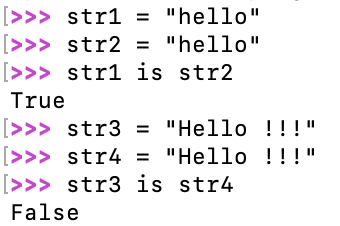

# 内存管理

## 元类

```
'''
元类：
    什么是元类？
    动态创建类
    元类->类

    类->对象

    用途？
        可以动态创建类
    type()
        1.查看目标对象的数据类型
        2.动态创建类
        语法:类 = type(类名,(父类...),{属性、方法})
'''

# 创建一个默认父类，不包含任何属性方法的类
Person = type('Person',(),{})
p1 = Person()
# print(p1)
# # mro() 查找父类
# print(Person.mro())
class Animal:
    def __init__(self,color):
        self.color = color
    def eat(self):
        print("eating")
def sleep(self):
    print("sleeping")

# 使用type动态创建一个类，继承Animal
Dog = type('Dog',(Animal,),{"age":1,"sleep":sleep})
dog1 = Dog("Black")
dog1.sleep()
dog1.eat()
print(dog1.color)


```

## 装饰器

```
'''
类装饰器:
    在不修改源代码的前提下，增加新的功能
'''
class AAA():
    def __init__(self,func):
        print("我是AAA.__init__()")
        self.func = func
    def __call__(self, *args, **kwargs):
        print("调用传入的函数")
        self.func(*args,**kwargs)

@AAA     # test1 = AAA(test1)
def test1():
    print("功能1")

test1()
```

## 对象池

1. 数值类型

    - 小整数池

        - 小整数：[-5,256]  程序开始时，小整数池的数据会一次性加载到内存中，如果LEGB变量（局部变量，闭包中的变量，全局变量，内建变量）使用的变量范围在[-5,256]，那么全局都是同一个变量，并且这些数据不会随着变量生命周期的结束而释放，它们在内存常驻。
        - id()
        - is

        

    - 大整数池

        - 每创建一个不是小整数范围内的变量，都会被自动存储到大整数池中。

2. 字符串

    - intern机制

        每个单词（字符串），不夹杂空格或者其它符号，默认开启intern机制，共享内存，靠引用计数决定是否销毁。

        

## 垃圾回收机制

### 引用计数机制

​	如何获取一个对象的引用计数

​		sys.getrefcount(a)

​		刚创建对象的引用计数为2

​	a.增加引用计数的操作

​			1.有新的变量使用该对象

​			2.装进列表

​			3.作为函数的参数

​	b.减少引用计数的操作

​			1.变量释放

​			2.从列表中移除

​			3.函数调用结束

​			4.del 显式销毁

**引用计数的优点：**

1. **简单**
2. **对象一旦没有引用，内存就直接释放，不需要等待特定时机，将处理回收内存的时间分摊。**

**引用计数的缺点：**

1. **维护引用计数消耗资源**
2. **循环引用的问题无法解决**


```
import sys
class AA:
    def __new__(cls, *args, **kwargs):
        print("创建内存空间")
        return super(AA,cls).__new__(cls)

    def __init__(self):
        print(f"{hex(id(self))}")
    def __del__(self):
        print("bye")
a = AA()
print(f"a的引用计数为:{sys.getrefcount(a)}")
b = a
print(f"a的引用计数为:{sys.getrefcount(a)}")
b = 100
print(f"a的引用计数为:{sys.getrefcount(a)}")
print("程序结束")
```


### 隔代回收

​	随着时间的推进，程序冗余对象逐渐增多达到一定的数量，系统进行回收。

（0代，1代，2代）

```
import gc
# 返回当前状态链上的对象数量
a = gc.get_count()
print(a)
# 返回阈值
a = gc.get_threshold()
print(a)
```

```
import time
import gc
class AA():
    def __new__(cls, *args, **kwargs):
        print("new")
        return super(AA,cls).__new__(cls)
    def __init__(self):
        print(f"object born at {hex(id(self))}")
    def __del__(self):
        print(f"{hex(id(self))} 被系统回收")
def start():
    while True:
        a = AA()
        b = AA()
        a.v = b
        b.v = a
        del a
        del b
        print(gc.get_threshold())
        print(gc.get_count())
        time.sleep(0.2)
# 手动关闭垃圾回收机制
#gc.disable()
start()
```


